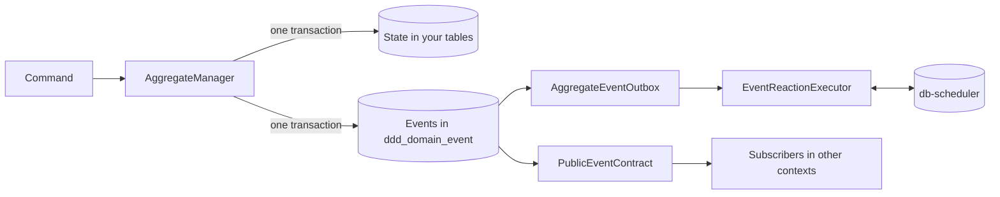

# kotmod

kotmod is a Kotlin library for building domain-driven design (DDD) aggregates on Postgres. It gives
you **domain events without event sourcing** — aggregates keep plain state in your own tables, and
kotmod records the events they raise in the same transaction — and a **transactional outbox built
in**, so those events reliably drive follow-up work in your own service and in others.

## Contents

- [Why kotmod](#why-kotmod)
- [Installation](#installation)
- [Quickstart](#quickstart)
- [Core concepts](#core-concepts)
- [Guides](#guides)
  - [Aggregates and commands](#aggregates-and-commands)
  - [Event-only aggregates](#event-only-aggregates)
  - [Event serialization and schema migrations](#event-serialization-and-schema-migrations)
  - [Postgres setup](#postgres-setup)
  - [The outbox and event reactions](#the-outbox-and-event-reactions)
  - [Durable reactions with db-scheduler](#durable-reactions-with-db-scheduler)
  - [Ordered reactions](#ordered-reactions)
  - [Publishing events to other contexts](#publishing-events-to-other-contexts)
- [Running in production](#running-in-production)
- [Known limitations](#known-limitations)
- [Status and contributing](#status-and-contributing)

## Why kotmod

Most services want two things from their domain model: state they can query like any other table,
and events that tell the rest of the system what happened. Event sourcing gives you events but makes
state something you rebuild. Saving state and then publishing a message gives you both, but not
atomically: if the message fails after the commit (or the commit fails after the message), the two
disagree. This is the *dual-write problem*.

kotmod writes an aggregate's new state, its events and the command that caused them in **one database
transaction**. An outbox then reads those events in order and turns them into *event reactions* — durable,
retried units of work — or publishes them to other bounded contexts.

kotmod is not an event store, not a message broker and not a framework: it is a library you wire into
your own application, on the Postgres database you already have.

## Installation

<!-- not-compiled -->
```kotlin
plugins {
    kotlin("jvm") version "2.4.20"
    kotlin("plugin.serialization") version "2.4.20" // for @Serializable events and triggers
}

dependencies {
    implementation("io.github.dreweaster:kotmod:0.1.0")
    implementation("io.github.dreweaster:kotmod-db-scheduler:0.1.0") // durable event reactions on db-scheduler
    // implementation("io.github.dreweaster:kotmod-sqldelight:0.1.0") // only if your app uses SQLDelight

    // Used directly by the code in this README:
    implementation("org.jetbrains.kotlinx:kotlinx-coroutines-core:1.11.0")
    implementation("org.postgresql:postgresql:42.7.13")
}
```

You also need a `javax.sql.DataSource` for your database, for example from HikariCP.

Requirements:

- A JVM 25 toolchain (kotmod is currently built and tested on it) and Kotlin.
- PostgreSQL 13 or later.
- [db-scheduler](https://github.com/kagkarlsson/db-scheduler) 16.12.0 for durable event reactions. It
  comes in with `kotmod-db-scheduler`.

kotmod is split into modules: `kotmod` (aggregates, events, the outbox and Postgres support — plain JDBC,
no other database library), `kotmod-db-scheduler` (durable event reactions) and `kotmod-sqldelight`
(sharing transactions with SQLDelight).

## Quickstart

This walks through a tiny orders domain: you place an order, ship it, and send a confirmation email
whenever an order is placed. It uses kotmod's Postgres backends and runs event reactions on
db-scheduler.

Snippets leave out imports. The complete, compiled code is in
[`Quickstart.kt`](examples/src/integrationTest/kotlin/io/kotmod/readme/Quickstart.kt) and
[`QuickstartTest.kt`](examples/src/integrationTest/kotlin/io/kotmod/readme/QuickstartTest.kt). Two names to
watch: `Duration` is `kotlin.time.Duration`, and `EventReactionFailed` and `EventReactionCancelled` exist
in both `EventReactionExecutionResult` and `EventReactionCompletionResult`, so use the qualified forms
shown.

### 1. Create the tables

Your application owns the table that stores order state:

```sql
CREATE TABLE IF NOT EXISTS orders (
    id     TEXT PRIMARY KEY,
    status TEXT NOT NULL,
    item   TEXT NOT NULL,
    reason TEXT
)
```

kotmod needs its own tables too. Copy the statements in `DddSchema.ddl` (in `io.kotmod.postgres`) into
your migrations; they create the event log, aggregate bookkeeping, handled-command history and consumer
offsets. Event reactions run on db-scheduler, which needs its `scheduled_tasks` table: create it from
db-scheduler's
[`postgresql_tables.sql`](https://github.com/kagkarlsson/db-scheduler/blob/v16.12.0/db-scheduler/src/test/resources/postgresql_tables.sql).

### 2. Define state, events and commands

An aggregate's **state** is whatever your application needs to make decisions — here, an order is
pending, shipped or cancelled:

```kotlin
sealed interface Order

data class PendingOrder(
    val item: String,
) : Order

data class ShippedOrder(
    val item: String,
) : Order

data class CancelledOrder(
    val item: String,
    val reason: String,
) : Order
```

Its **events** record what happened. They are stored as JSON, so they are `@Serializable`:

```kotlin
@Serializable
sealed interface OrderEvent : DomainEvent

@Serializable
data class OrderPlaced(
    val item: String,
) : OrderEvent

@Serializable
data class OrderShipped(
    val item: String,
) : OrderEvent

@Serializable
data class OrderCancelled(
    val item: String,
    val reason: String,
) : OrderEvent
```

Write each **command** as a plain function: it takes the current state and returns the new state plus the
events it raised. Extension functions on the state types read naturally and keep your domain decisions in
pure code you can unit-test without a database; kotmod only runs them:

```kotlin
fun placeOrder(item: String): Pair<PendingOrder, List<OrderEvent>> =
    PendingOrder(item) to listOf(OrderPlaced(item))

fun PendingOrder.ship(): Pair<ShippedOrder, List<OrderEvent>> =
    ShippedOrder(item) to listOf(OrderShipped(item))

fun PendingOrder.cancel(reason: String): Pair<CancelledOrder, List<OrderEvent>> =
    CancelledOrder(item, reason) to listOf(OrderCancelled(item, reason))
```

### 3. Wire up persistence

Given a `javax.sql.DataSource` for your database (for example from HikariCP), create a `JdbcContext` — how
kotmod reaches the database and runs transactions — tell kotmod how to serialize your events, and create an
`AggregateManager` for orders:

```kotlin
val jdbc = DataSourceJdbcContext(dataSource)

val serialization =
    jsonDataSerializationContext<OrderEvent> {
        +OrderPlaced.serializer().toEventSerializer()
        +OrderShipped.serializer().toEventSerializer()
        +OrderCancelled.serializer().toEventSerializer()
    }

val orderType = AggregateType("Order")

val orders =
    AggregateManager(
        aggregateType = orderType,
        repository = OrderRepository(jdbc),
        backend = PostgresDomainPersistenceBackend(jdbc, serialization),
    )
```

The `Repository` is yours: it loads and saves order state in the `orders` table. It borrows its connection
through `jdbc.withConnection`, so its writes join the same transaction as kotmod's:

```kotlin
class OrderRepository(
    private val jdbc: JdbcContext,
) : Repository<Order> {
    override fun get(id: AggregateId): Order? =
        jdbc.withConnection { conn ->
            conn.prepareStatement("SELECT status, item, reason FROM orders WHERE id = ?").use { ps ->
                ps.setString(1, id.value)
                ps.executeQuery().use { rs ->
                    if (!rs.next()) {
                        null
                    } else {
                        val item = rs.getString("item")
                        when (rs.getString("status")) {
                            "PENDING" -> PendingOrder(item)
                            "SHIPPED" -> ShippedOrder(item)
                            else -> CancelledOrder(item, rs.getString("reason"))
                        }
                    }
                }
            }
        }

    override fun save(
        id: AggregateId,
        state: Order,
    ) {
        val (status, item, reason) =
            when (state) {
                is PendingOrder -> Triple("PENDING", state.item, null)
                is ShippedOrder -> Triple("SHIPPED", state.item, null)
                is CancelledOrder -> Triple("CANCELLED", state.item, state.reason)
            }
        jdbc.withConnection { conn ->
            conn
                .prepareStatement(
                    "INSERT INTO orders (id, status, item, reason) VALUES (?, ?, ?, ?) " +
                        "ON CONFLICT (id) DO UPDATE SET status = EXCLUDED.status, item = EXCLUDED.item, reason = EXCLUDED.reason",
                ).use { ps ->
                    ps.setString(1, id.value)
                    ps.setString(2, status)
                    ps.setString(3, item)
                    ps.setString(4, reason)
                    ps.executeUpdate()
                }
        }
    }
}
```

### 4. Run commands

Run the commands from step 2 through the aggregate manager. `create` starts a new aggregate;
`execute<PendingOrder>` loads the order and only runs the command if it is still pending, so `ship()` can
only ever be called on a `PendingOrder`. Both are `suspend` functions:

```kotlin
val orderId = AggregateId("order-1")

orders.create(orderId) { placeOrder("book") }

val shipped = orders.execute<PendingOrder>(orderId) { it.ship() }
```

Each call saves the order's state, appends its events to the event log and records the command, all in
one transaction.

### 5. React to events

An **event reaction** is follow-up work triggered by an event, such as sending an email. Its input is a
**trigger**, which is stored until the reaction runs, so it must be serializable too:

```kotlin
@Serializable
sealed interface OrderNotification : EventReactionTrigger

@Serializable
data class SendOrderConfirmation(
    val orderId: String,
    override val timeout: Duration? = null,
) : OrderNotification

object OrderNotificationSerializer : EventReactionTriggerSerializer<OrderNotification> {
    override suspend fun serialize(trigger: OrderNotification): String = Json.encodeToString(OrderNotification.serializer(), trigger)

    override suspend fun deserialize(serializedTrigger: String): OrderNotification =
        Json.decodeFromString(OrderNotification.serializer(), serializedTrigger)
}

fun sendConfirmation(orderId: String) {
    println("Sending confirmation for order $orderId")
}
```

Reactions are stored and scheduled by db-scheduler. Create a `DbSchedulerEventReactions` for this kind of
reaction and register its task with your db-scheduler `Scheduler`. db-scheduler polls for due work every
10 seconds by default; `enableImmediateExecution()` runs newly dispatched reactions straight away:

```kotlin
val notifications = DbSchedulerEventReactions("order-notifications", OrderNotificationSerializer)

val scheduler =
    Scheduler
        .create(dataSource, notifications.task)
        .threads(4)
        .enableImmediateExecution()
        .build()
```

An `EventReactionExecutor` runs each reaction and decides what happens when it fails, times out or
completes:

```kotlin
val executor =
    EventReactionExecutor<OrderNotification, Unit>(
        sink = notifications.sink(scheduler),
        source = notifications.source,
        createExecutionContext = { _, _ -> },
        execute = { _, _, trigger, _, _ ->
            when (trigger) {
                is SendOrderConfirmation -> sendConfirmation(trigger.orderId)
            }
            EventReactionExecutionResult.EventReactionExecutionCompleted
        },
        failureRetryHandler = { _, _, _, retryCount, _, ex ->
            if (retryCount < 5) {
                RetrySignal.Retry(BackoffStrategy().calculateBackoff(retryCount))
            } else {
                RetrySignal.DoNotRetry(
                    EventReactionCompletionResult.EventReactionFailed(ex.message ?: "failed", allowManualRetry = true),
                )
            }
        },
        timeoutRetryHandler = { _, _, _, retryCount, _ ->
            RetrySignal.Retry(BackoffStrategy().calculateBackoff(retryCount))
        },
        onCompletion = { id, _, _, _, _, result ->
            println("Reaction ${id.value} finished: $result")
        },
    )
```

Finally, the `AggregateEventOutbox` reads the event log and turns each `OrderPlaced` into a confirmation
reaction. The event log holds the events of *every* aggregate type, so the outbox skips anything that
isn't an order before deserializing — an event it can't deserialize would stop it in its tracks. The
reaction id is built from the event id, so if the same event is dispatched again while its reaction is
still pending, it is recognised as the same reaction. `PostgresOffsetManager` remembers how far the
outbox has read:

```kotlin
val offsets = PostgresOffsetManager(jdbc)

val outbox =
    AggregateEventOutbox<OrderNotification>(
        backend = PostgresDomainPollingBackend(jdbc),
        executor = executor,
        eventToReactions = { event ->
            if (event.metadata.aggregateType != orderType) {
                // The event log holds every aggregate type's events; only order events can be read here.
                emptyList()
            } else {
                when (serialization.deserialize(event.serialized)) {
                    is OrderPlaced ->
                        listOf(
                            EventReaction(
                                id = EventReactionId("confirmation-${event.metadata.eventId.value}"),
                                trigger = SendOrderConfirmation(orderId = event.metadata.aggregateId.value),
                            ),
                        )
                    else -> emptyList()
                }
            }
        },
        getPosition = { offsets.getPosition("order-notifications") },
        savePosition = { offsets.savePosition("order-notifications", it) },
        isLeader = { true },
    )
```

Start the executor before the scheduler, then the outbox:

```kotlin
executor.start()
scheduler.start()
outbox.start()
```

Within a moment you'll see `Sending confirmation for order order-1`. Only the `OrderPlaced` event
produced a reaction; `OrderShipped` was read and skipped. To shut down, stop in the reverse order:
`outbox.stop()`, then `scheduler.stop()`, then `executor.stop()`. The quickstart passes `isLeader = { true }` because it runs on one node; see
[Running in production](#running-in-production) for leader election across several.

## Core concepts



- **Aggregate** — a cluster of domain state changed only through commands, identified by an
  `AggregateType` and `AggregateId`.
- **Command** — a request to change an aggregate. It returns the new state and the events it raised, and
  is idempotent when given a `CommandId`.
- **Domain event** — a fact recorded in the event log in the same transaction as the state change.
- **Event reaction** — durable, retried follow-up work triggered by a domain event.
- **Trigger** — the stored input of an event reaction.
- **Public event** — a stable event published to other bounded contexts, mapped from internal domain
  events.

## Guides

Each guide builds on the quickstart's orders domain.

### Aggregates and commands

Use `AggregateManager` for anything whose state you store and change through commands.

Every command runs in three phases:

1. **Read** — if the command's id has already been handled, the stored state is returned and nothing
   else happens. Otherwise the aggregate's version and state are loaded.
2. **Command** — your block runs and returns the new state and the events it raised. kotmod does no
   database work while it runs, so keep side effects out of it; put them in event reactions instead.
3. **Write** — in one transaction, the aggregate's version is advanced, your repository saves the new
   state, the events are appended and the command is recorded as handled.

`create` starts a new aggregate and throws `AggregateAlreadyExistsException` if it exists. `execute`
changes an existing one and throws `AggregateNotFoundException` if it doesn't. The narrowed form,
`execute<PendingOrder>`, only runs when the current state is that subtype and throws
`UnexpectedAggregateStateException` otherwise, which makes state machines easy to express:

```kotlin
suspend fun cancelOrder(
    orders: AggregateManager<Order, OrderEvent>,
    orderId: AggregateId,
    reason: String,
    requestId: String,
): Order =
    try {
        orders.execute<PendingOrder>(orderId, commandId = CommandId(requestId)) { it.cancel(reason) }
    } catch (e: UnexpectedAggregateStateException) {
        throw IllegalStateException("Only pending orders can be cancelled", e)
    }
```

**Event sequence numbers.** Every event carries `event.metadata.sequence`: its number within its
aggregate, counting 1, 2, 3… with no gaps. Reactions and public contracts can use it to tell which of an
aggregate's events came first.

**Idempotency.** Pass a `CommandId` you control — a request id, a message id — and a retried command
returns the aggregate's current state without running again. Without one, kotmod generates a random
id and the call is not idempotent. Pass a `CorrelationId` to tie together all the events of one wider
flow; it is stored with every event.

**Concurrency.** Each aggregate has a version. If someone else changes the aggregate between your read
and your write, the write fails with `OptimisticConcurrencyException`; run the command again and it will
see the latest state:

```kotlin
suspend fun <T> retryOnConflict(
    attempts: Int = 3,
    command: suspend () -> T,
): T {
    repeat(attempts - 1) {
        try {
            return command()
        } catch (e: OptimisticConcurrencyException) {
            // Someone else changed the aggregate first: run the command again against the latest state.
        }
    }
    return command()
}
```

**Your repository joins the transaction.** `Repository.save` is called inside kotmod's transaction, so it
must borrow its connection from the same `JdbcContext` as the backend — as `OrderRepository` does with
`jdbc.withConnection` — rather than opening its own. A repository with its own connection would commit
state independently of the events.

#### Several aggregates in one transaction

kotmod deliberately lets one transaction span commands on several aggregates. Wrap them in
`jdbc.transaction { }` and their state, events and command records commit together — or not at all:

```kotlin
suspend fun shipAndInvoice(
    jdbc: JdbcContext,
    orders: AggregateManager<Order, OrderEvent>,
    invoices: AggregateManager<Order, OrderEvent>,
    orderId: AggregateId,
) {
    jdbc.transaction {
        orders.execute<PendingOrder>(orderId) { it.ship() }
        invoices.create(AggregateId("invoice-${orderId.value}")) { placeOrder("invoice") }
    }
}
```

- If any command fails — including an `OptimisticConcurrencyException` on one aggregate — everything rolls
  back, including the other aggregates' events. Let the exception propagate: if you catch it and carry on,
  the transaction is still rolled back and kotmod throws `TransactionRolledBackException` rather than commit
  a partial result.
- Commands inside the block see each other's uncommitted writes.
- Run commands one after another, never in parallel, and don't switch threads inside the block (for
  example with `withContext`) — for kotmod commands or your own SQL; kotmod throws `IllegalStateException`
  if you do. The block keeps your coroutine context (name, tracing, MDC).
- Every kotmod class inside the block must use the same `JdbcContext`.
- Keep the block short: it holds a database transaction open.

### Event-only aggregates

Use `EventProducer` when something needs an event log and idempotent commands but has no state worth
storing — an audit trail, for example:

```kotlin
@Serializable
sealed interface AuditEvent : DomainEvent

@Serializable
data class OrderViewed(
    val viewer: String,
) : AuditEvent

fun auditLog(jdbc: JdbcContext): EventProducer<AuditEvent> =
    EventProducer(
        aggregateType = AggregateType("OrderAuditLog"),
        backend =
            PostgresDomainPersistenceBackend(
                jdbc,
                jsonDataSerializationContext<AuditEvent> { +OrderViewed.serializer().toEventSerializer() },
            ),
    )

suspend fun recordView(
    auditLog: EventProducer<AuditEvent>,
    orderId: AggregateId,
    viewer: String,
    requestId: String,
) {
    auditLog.emit(orderId, listOf(OrderViewed(viewer)), commandId = CommandId(requestId))
}
```

`emit` creates the aggregate's bookkeeping the first time it is called for an id. Command ids and
optimistic concurrency work exactly as they do for `AggregateManager`. Its events go into the same event
log as everything else, so an outbox that deserializes with your order serialization must skip them by
aggregate type, as the quickstart's outbox does.

### Event serialization and schema migrations

Events live in the event log for a long time, so their classes will change. Each event is stored with
its class name and a schema version, and `jsonDataSerializationContext` knows how to bring old versions
up to date:

```kotlin
val orderEventSerialization =
    jsonDataSerializationContext<OrderEvent> {
        +OrderPlaced.serializer().toEventSerializer()
        // OrderShipped used to be called OrderDispatched, in another package.
        +OrderShipped.serializer().toEventSerializer(initialClassName = "com.example.orders.OrderDispatched") {
            migrateClassName(OrderShipped::class.qualifiedName!!)
        }
        // OrderCancelled gained a `reason` field; older events get a default.
        +OrderCancelled.serializer().toEventSerializer {
            migrateFormat { json -> JsonObject(json + ("reason" to JsonPrimitive("not recorded"))) }
        }
    }
```

- Every event type starts at version 1. Each `migrateFormat` or `migrateClassName` adds a version, in the
  order the changes were made.
- `migrateFormat` transforms the previous version's JSON into the new shape.
- `migrateClassName` records a rename or move. Pass the event's *original* class name as
  `initialClassName`, and the current one to `migrateClassName`.
- Old events are migrated when they are read; new events are always written at the latest version.

If you don't want JSON, implement `DataSerializationContext` yourself.

### Postgres setup

kotmod's Postgres classes use plain JDBC through a `JdbcContext`. For a plain `DataSource`, use
`DataSourceJdbcContext(dataSource)`; SQLDelight users have an adapter (below).

**Schema.** `DddSchema.ddl` creates four tables; copy it into your Flyway or Liquibase migrations:

| Table | Holds |
|---|---|
| `ddd_aggregate_root` | Each aggregate's version, sequence counter and timestamps, and whether it has events out of order in the log |
| `ddd_domain_event` | The event log, ordered by `(transaction_id, global_offset)`, with each event's `aggregate_sequence` |
| `ddd_command_history` | Which commands each aggregate has handled |
| `ddd_consumer_offset` | How far each outbox or contract has read (a transaction id and offset) |

db-scheduler's `scheduled_tasks` table belongs to your application; create it from db-scheduler's
[`postgresql_tables.sql`](https://github.com/kagkarlsson/db-scheduler/blob/v16.12.0/db-scheduler/src/test/resources/postgresql_tables.sql).

**Transactions.** Pass the same `JdbcContext` to every kotmod class and to your repositories. Each command
runs in a transaction opened by its backend's `JdbcContext`; `jdbc.inTransaction { }` and
`jdbc.withConnection { }` let your own code join it, and `jdbc.transaction { }` spans several commands.

**Reading events.** `PostgresDomainPollingBackend` reads the event log for the outbox and public
contracts. `PostgresOffsetManager` stores how far each of them has read; give every poller its own
consumer name.

#### Using SQLDelight

Add `io.kotmod:kotmod-sqldelight` and build a `SqlDelightJdbcContext` from the same `JdbcDriver` as your
generated database. kotmod then runs its transactions through SQLDelight's, so your SQLDelight queries and
kotmod's writes share one transaction whichever side opens it:

- Inside `jdbc.transaction { }`, call your SQLDelight queries as usual — they join kotmod's transaction.
- Inside your own `database.transaction { }`, call kotmod from blocking code (SQLDelight's block can't
  suspend), e.g. `runBlocking { orders.create(…) }`; commands join your transaction. Wrap several in
  `runBlocking { jdbc.transaction { … } }` to get kotmod's thread checks too. In a transaction SQLDelight
  opened, SQLDelight's rules apply: if a kotmod call fails and you catch it, SQLDelight rolls your
  transaction back when it ends.

Repositories implemented with SQLDelight queries need no changes: they already run inside the transaction.

### The outbox and event reactions

`AggregateEventOutbox` is the outbox: while running it reads events after its saved position, maps each
one to event reactions with `eventToReactions`, dispatches them to an `EventReactionExecutor`, and saves
the position after each event. If dispatching fails, the batch stops and the next poll starts again from
the last saved position, so no event is skipped — including events committed late by slower, concurrent
transactions.

`EventReactionExecutor` runs each reaction:

- `execute` does the work and reports an `EventReactionExecutionResult`.
- `failureRetryHandler` and `timeoutRetryHandler` decide what happens after a failure or a timeout.
- `onCompletion` is told how the reaction finally ended.
- `createExecutionContext` builds per-attempt context for your handlers (use `Unit` if you need none).
- `defaultTimeout` (60 seconds) applies when a trigger has no `timeout` of its own.
- `defaultBackoffStrategy` sets the delay when one of your handlers throws.

| `execute` reports | What happens next | `onCompletion` receives |
|---|---|---|
| `EventReactionExecutionCompleted` | Done | `EventReactionCompleted` |
| `EventReactionCancelled` | Done, not retried | `EventReactionCancelled` |
| `EventReactionFailed` (or throws) | `failureRetryHandler` returns `Retry(delay)` or `DoNotRetry(result)` | `result`, if not retried |
| `EventReactionTimedOut` | `timeoutRetryHandler` returns `Retry(delay)` or `DoNotRetry(result)` | `result`, if not retried |

`BackoffStrategy` gives exponential delays — 1s, 2s, 4s… up to a cap (10 minutes by default) — and is
handy in your retry handlers, as the quickstart shows.

The executor works with any queue: it dispatches through an `EventReactionTriggerSink` and receives
reactions from an `EventReactionTriggerSource`. kotmod ships a durable implementation on db-scheduler;
you can implement the two interfaces yourself to use something else.

### Durable reactions with db-scheduler

`DbSchedulerEventReactions` stores reactions in db-scheduler's `scheduled_tasks` table and runs them on
your db-scheduler `Scheduler`. Your application owns the `Scheduler` — its threads, polling and
lifecycle — and kotmod provides the task, sink and source.

Create one `DbSchedulerEventReactions` per executor; each becomes one db-scheduler task, and each
reaction is an instance of that task, identified by its reaction id. Several executors can share one
scheduler:

```kotlin
@Serializable
sealed interface BillingTrigger : EventReactionTrigger

@Serializable
data class ChargeCustomer(
    val orderId: String,
    override val timeout: Duration? = null,
) : BillingTrigger

object BillingTriggerSerializer : EventReactionTriggerSerializer<BillingTrigger> {
    override suspend fun serialize(trigger: BillingTrigger): String = Json.encodeToString(BillingTrigger.serializer(), trigger)

    override suspend fun deserialize(serializedTrigger: String): BillingTrigger =
        Json.decodeFromString(BillingTrigger.serializer(), serializedTrigger)
}

fun sharedScheduler(
    dataSource: DataSource,
    billing: DbSchedulerEventReactions<BillingTrigger>,
    notifications: DbSchedulerEventReactions<OrderNotification>,
): Scheduler =
    Scheduler
        .create(dataSource, billing.task, notifications.task)
        .threads(10)
        .enableImmediateExecution()
        .build()
```

How it behaves:

- **Duplicates.** Dispatching a reaction id that is already pending does nothing.
- **Retries.** A `Retry(delay)` from your handlers reschedules the reaction with its retry count
  incremented, so backoff keeps growing across restarts. Every attempt gets a fresh
  `EventReactionExecutionId`.
- **Startup order.** If the scheduler runs a reaction before its executor has started, the reaction is
  pushed back a few seconds (without using up a retry) and a warning is logged.
- **Unreadable data.** If a reaction's stored data can't be decoded — say a trigger class was renamed —
  db-scheduler retries it with backoff from 10 seconds up to 1 hour until a fix is deployed.
- **Removing a reaction.** To stop a pending unordered reaction for good, cancel its task instance (for
  ordered reactions, see [Ordered reactions](#ordered-reactions)):

```kotlin
fun cancelPendingConfirmation(
    scheduler: Scheduler,
    notifications: DbSchedulerEventReactions<OrderNotification>,
    eventId: EventId,
) {
    scheduler.cancel(notifications.task.instanceId("confirmation-${eventId.value}"))
}
```

### Ordered reactions

By default reactions are unordered: two reactions from the same aggregate can run at the same time, or
finish in a different order from the events. That is fine for sending emails, but not for projections or
anything else that must apply an aggregate's changes in order. For those, ask for ordering:

- `ReactionOrdering.Unordered` is the default.
- `ReactionOrdering.PerAggregate(onGiveUp = …)` runs an aggregate's reactions one at a time, in event
  order.

Set it with `ordering = ReactionOrdering.PerAggregate(…)` on `AggregateEventOutbox`, or on
`PublicEventContract.subscribe(executor, ordering = …) { … }`. The outbox dispatches each aggregate's
events in sequence order (see `event.metadata.sequence`), even in the rare case where the order in the
log differs because a transaction changed several aggregates. To do this, every outbox and contract checks
each event it reads; for an aggregate that has never been written out of order this check is a single
primary-key lookup.

Ordering needs support from the queue. With db-scheduler, pass `jdbc` to `DbSchedulerEventReactions`; an
ordered outbox or subscription whose sink does not support ordering fails with an
`IllegalArgumentException` as soon as it is created, rather than running unordered:

```kotlin
fun orderedNotifications(jdbc: JdbcContext): DbSchedulerEventReactions<OrderNotification> =
    DbSchedulerEventReactions("order-notifications", OrderNotificationSerializer, jdbc = jdbc)

fun orderedOutbox(
    jdbc: JdbcContext,
    serialization: DataSerializationContext<OrderEvent>,
    offsets: PostgresOffsetManager,
    executor: EventReactionExecutor<OrderNotification, *>,
): AggregateEventOutbox<OrderNotification> =
    AggregateEventOutbox(
        backend = PostgresDomainPollingBackend(jdbc),
        executor = executor,
        eventToReactions = { event ->
            when (serialization.deserialize(event.serialized)) {
                is OrderPlaced -> listOf(EventReaction(EventReactionId("confirmation-${event.metadata.eventId.value}"), SendOrderConfirmation(event.metadata.aggregateId.value)))
                else -> emptyList()
            }
        },
        getPosition = { offsets.getPosition("order-notifications") },
        savePosition = { offsets.savePosition("order-notifications", it) },
        isLeader = { true },
        ordering = ReactionOrdering.PerAggregate(onGiveUp = OnGiveUp.BlockAggregate),
    )
```

Register the reactions' tasks with your `Scheduler` as before; `tasks` gives the list to pass (`task` is
still there for the single-task case).

**When a reaction gives up.** A reaction gives up when your retry handler returns `DoNotRetry` with a failed
result. The
`OnGiveUp` policy says what happens to the aggregate's later reactions:

| Policy | Behaviour |
|---|---|
| `OnGiveUp.ContinueWithNext` (default) | The failed reaction is completed as failed and the next one runs |
| `OnGiveUp.BlockAggregate` | The aggregate's later reactions wait until an operator retries or skips the failed one |

Use `BlockAggregate` when running later reactions after a missed one would leave wrong data, such as a
projection that skipped an event. Other aggregates are not affected. To find and clear blocked reactions,
use the helpers on `DbSchedulerEventReactions`, passing your `Scheduler` (or any `SchedulerClient`):

- `blockedReactions(client)` lists each blocked reaction with its aggregate key, reaction id and
  sequence number.
- `retryBlocked(client, id)` runs it again now, with its retry count reset.
- `skipBlocked(client, id)` drops it without running it, so the aggregate's next reaction can run.

An ordered reaction's db-scheduler instance id is built from its aggregate, sequence number and reaction
id, so `task.instanceId(reactionId)` does not find it; use these helpers instead.

**How waiting works.** An ordered reaction only runs when no earlier reaction of the same aggregate is
still pending. Otherwise it waits and checks again, starting after the `orderedRecheckDelay` constructor
parameter (2 seconds by default) and doubling each time up to 1 minute. When a reaction finishes, kotmod nudges the aggregate's
next reaction to run immediately, so a backlog normally runs back to back. The cost of ordering is
therefore a little extra database work for waiting reactions, and one aggregate's reactions run on at most
one thread at a time; different aggregates still run in parallel.

**Recommended index.** The pending check looks reactions up by task and instance id, so add this to your
own `scheduled_tasks` migration (it is optional, but worth having once many reactions can be waiting; use
your table name if you pass a custom `tableName`):

```sql
CREATE INDEX scheduled_tasks_ordered_idx ON scheduled_tasks (task_name, task_instance COLLATE "C");
```

**Scope.**

- Ordering applies per executor (per db-scheduler task name) and aggregate. Two executors that handle
  the same aggregate do not wait on each other.
- Ordered subscriptions of one contract that share an executor share ordering for an aggregate: each
  event's reactions run one at a time, in subscription order. Give each of them distinct reaction ids.
- An ordered executor can be fed by only one outbox or contract; a second one fails when it is constructed
  or subscribes. Executors that share one `DbSchedulerEventReactions` task name would share ordering across
  sources, which is not supported: give each ordered outbox or contract its own task name.
- Delivery is still at-least-once, so reactions must still be idempotent. In one rare case, ordering can
  briefly be broken: if the outbox crashes after dispatching several reactions from the same event but
  before saving its position, an earlier one of those that had already completed can run again at the same
  time as a later one.

### Publishing events to other contexts

Internal domain events change as your model changes, so other services shouldn't depend on them
directly. Instead, publish **public events** — a deliberately stable contract — with a
`PublicEventContract`:

```kotlin
@Serializable
sealed interface OrderPublicEvent : PublicDomainEvent

@Serializable
data class OrderPlacedV1(
    val item: String,
) : OrderPublicEvent

fun orderContract(
    jdbc: JdbcContext,
    serialization: DataSerializationContext<OrderEvent>,
    offsets: PostgresOffsetManager,
    billingExecutor: EventReactionExecutor<BillingTrigger, *>,
): PublicEventContract<OrderEvent, OrderPublicEvent> {
    val contract =
        PublicEventContract<OrderEvent, OrderPublicEvent>(
            backend = PostgresDomainPollingBackend(jdbc),
            serialization = serialization,
            internalToPublic = { event ->
                when (event) {
                    is OrderPlaced -> OrderPlacedV1(event.item)
                    else -> null
                }
            },
            getPosition = { offsets.getPosition("order-contract") },
            savePosition = { offsets.savePosition("order-contract", it) },
            isLeader = { true },
        )

    contract.subscribe(billingExecutor) { envelope ->
        when (envelope.event) {
            is OrderPlacedV1 ->
                listOf(
                    EventReaction<BillingTrigger>(
                        id = EventReactionId("charge-${envelope.metadata.eventId.value}"),
                        trigger = ChargeCustomer(orderId = envelope.metadata.aggregateId.value),
                    ),
                )
        }
    }
    return contract
}
```

- `internalToPublic` maps each internal event to a public one; returning `null` keeps it private.
- Subscribers receive a `PublicEventEnvelope`: the public event plus the original event's metadata
  (event id, aggregate id, correlation id and so on).
- A contract can have several subscribers, each with its own executor. Subscribe before calling
  `start()`.
- A contract reads the event log independently of the outbox, so give it its own consumer name.
- A contract deserializes **every** event in the log before mapping it, so its `serialization` must be
  able to read every event type your application writes. If you have several event families (orders and
  audit events, say), register them all in one `jsonDataSerializationContext<DomainEvent>` and use
  `DomainEvent` as the contract's internal type.

## Running in production

**Delivery is at-least-once.** Events are committed with the state change that produced them, and the
outbox only moves past an event once all of its reactions are dispatched, so no event is ever skipped. A
reaction can run more than once — for example if the process dies after dispatching but before saving the
position, or if a shutdown interrupts a running reaction. Make `execute` and `onCompletion` idempotent.

**Open transactions hold delivery back.** An outbox only reads past transactions that have finished, so it
never skips an event that a slower transaction commits late. The flip side: while any transaction that has
written something is still open on the same Postgres server — even in another database — later events wait
for it, and if it never finishes, **delivery stops for every outbox and contract** with no error. Common
culprits are connections left "idle in transaction", orphaned prepared transactions (`pg_prepared_xacts`)
and long batch jobs. Keep transactions short, set `idle_in_transaction_session_timeout`, and monitor
`pg_stat_activity` for old transactions with a `backend_xid`.

**Moving the database to a new server.** Event positions include Postgres transaction ids, which only make
sense on the server that issued them. `pg_upgrade` keeps them, so in-place upgrades are fine. After a
`pg_dump`/restore or a logical-replication migration, the new server's transaction ids start lower, and
outboxes stop with an error saying their saved position is "ahead of this Postgres server's transaction
counter" rather than silently skipping events. To resume after the move, with nothing writing yet, set every
row's `ddd_domain_event.transaction_id` to `'0'` and every `ddd_consumer_offset.last_transaction_id` to `0`
(keep `last_offset`). Each consumer then resumes exactly where it left off, and new events sort after the
migrated ones.

**Ordered reactions are still at-least-once.** If the outbox crashes after dispatching several reactions
from the same event but before saving its position, an earlier one that already completed can run again at
the same time as a later one. Keep ordered reactions idempotent too. See
[Ordered reactions](#ordered-reactions).

**Use deterministic reaction ids.** Build each reaction id from the event id plus a label, as in
`"confirmation-${event.metadata.eventId.value}"`. Then a re-dispatched event is recognised as a
reaction that is already pending. A random id creates a duplicate.

**Start and stop in order.** Start executors, then the db-scheduler `Scheduler`, then the leader election,
then the outbox and any public contracts; stop in the reverse order. Getting it wrong doesn't lose anything — reactions that
arrive before their executor is running are rescheduled with a warning — but it adds noise and delay.

**Run one active poller per consumer.** The outbox and public contracts only poll while `isLeader()`
returns `true`. Run your application on as many nodes as you like, but make sure only one of them polls
for each consumer. db-scheduler needs no such care: it is safe to run on every node, and each reaction
runs on one node at a time.

**Leader election.** `PostgresLeaderElection` picks the polling node with a Postgres advisory lock. Each
node creates one with the same name; whichever takes the lock leads until its connection ends, and another
node takes over within a few seconds:

```kotlin
fun leaderElection(
    url: String,
    user: String,
    password: String,
): PostgresLeaderElection {
    val election = PostgresLeaderElection({ DriverManager.getConnection(url, user, password) }, "order-service")
    election.start()
    return election
}
```

Pass `isLeader = election::isLeader` to each outbox and contract:

```kotlin
    AggregateEventOutbox(
        backend = PostgresDomainPollingBackend(jdbc),
        executor = executor,
        eventToReactions = { emptyList() },
        getPosition = { offsets.getPosition("order-notifications") },
        savePosition = { offsets.savePosition("order-notifications", it) },
        isLeader = election::isLeader,
    )
```

- **One election per application** is the simple default: one node polls for every consumer. To spread
  consumers across nodes, give each consumer its own election (its own name); each holds one connection.
- **Give it its own connection.** The election holds one connection for as long as it runs, so open it
  directly rather than from your pool. It does not work through PgBouncer in transaction mode.
- **How fast it reacts.** Every `checkInterval` (5 seconds by default) a follower tries to take the lock and
  the leader checks its connection. A leader whose checks fail or stall for two intervals stops polling.
  The election also sets TCP keepalives on its session, so if the leader's host vanishes Postgres notices
  within a few intervals and releases the lock.
- **Brief overlap.** If Postgres ends the leader's session first (a failover, `pg_terminate_backend`), another
  node can take over before the old leader notices. Pollers check `isLeader()` only at the start of each
  poll, so two nodes may poll for up to about two `checkInterval`s plus one poll batch. That only causes
  duplicate dispatches, which deterministic reaction ids absorb.
- **Shutdown.** Stop outboxes and contracts first, then `election.stop()`, which releases the lock so another
  node takes over straight away.

**Know what happens when things fail:**

| Situation | Behaviour |
|---|---|
| A reaction fails or throws | Your `failureRetryHandler` decides: retry after a delay, or complete it as failed |
| A reaction times out | Your `timeoutRetryHandler` decides |
| A reaction's stored data can't be read | Retried with backoff from 10 seconds up to 1 hour |
| A node crashes mid-reaction | db-scheduler notices the missing heartbeat and runs it again |
| The database is down while dispatching | The outbox batch stops and resumes from the last saved position on the next poll |
| The outbox can't deserialize an event (e.g. another aggregate type's) | The batch stops and is retried every poll, so later events wait — filter by aggregate type as the quickstart does |
| A command loses a concurrent update | `OptimisticConcurrencyException` — run the command again |

**Tune throughput.** The outbox and contracts poll every 500ms (`pollInterval`) and read up to 100
events per poll (`batchSize`). `Scheduler.threads(n)` caps how many reactions run at once.

## Known limitations

These are known gaps in the current release. None of them loses events; most need an unusual setup or a
failure in a specific spot to show up.

**Leader election**

- **`stop()` must not be cancelled.** If the coroutine calling `election.stop()` is cancelled part-way, the
  lock may stay held, with its connection open, until the process exits, and no other node can lead.
  Call it from a shutdown path that isn't cancelled, or use the blocking `election.close()`.
- **Don't call `start()` and `stop()` at the same time from different threads.** Doing so can leave two
  background loops sharing one connection. Starting again after `stop()` has returned is fine.
- **A JVM `Error` stops the election silently.** An `Error` such as `OutOfMemoryError` thrown inside the
  election's background loop ends the loop without a log line. If it happened while leading, the node keeps
  the lock (and reports itself as leader until the lease runs out) until the process exits. Restart the
  process.
- **Some transitions aren't logged.** When a hung check lets the lease run out, nothing is logged until the
  check finally fails. If a check takes the lock while `stop()` is running, the "Stepped down" line is
  skipped.

**Ordered reactions**

- **An executor stays tied to its first ordered source.** Once an ordered outbox or contract has been built
  on an executor, building another one on the same executor instance fails, even if the first has been
  stopped. If you rebuild outboxes in-process (for example on an application context refresh), create new
  executors as well.
- **Subscriptions sharing an executor must be deterministic.** Within one contract, reactions from all
  ordered subscriptions on an executor are numbered together. A re-dispatch after a crash is only
  recognised as a duplicate if every one of those subscriptions returns the same reactions, in the same
  order, for the same event.
- **At most 9,999 reactions per event on one ordered executor.** Beyond that, reactions sort in the wrong
  order. This is not checked.
- **Aggregate types containing `/` can share ordering keys.** The ordering key is
  `"<aggregate type>/<aggregate id>"`, so type `a/b` with id `c` and type `a` with id `b/c` share one key.
  Their reactions then wait on each other unnecessarily; nothing runs out of order.
- **Unreadable reaction data affects the blocked-reaction helpers.** If any pending reaction of the task has
  stored data that can't be decoded, `blockedReactions`, `retryBlocked` and `skipBlocked` fail. A reaction
  whose trigger can't be decoded holds back its aggregate's later reactions without being listed by
  `blockedReactions`.
- **Prompt hand-over needs immediate execution.** When a reaction finishes, the aggregate's next reaction is
  rescheduled to run now. It only starts straight away if the `Scheduler` uses
  `enableImmediateExecution()`; otherwise it starts on db-scheduler's next poll.
- **Replaying an aggregate that was once written out of order is slow.** For such an aggregate, every event
  pays a full check whose cost grows with the aggregate's history. This only applies to aggregates written by
  an outer transaction that changed several aggregates in a racing order, and only matters for very long
  histories.

## Status and contributing

kotmod is pre-1.0: the API may still change between releases. Issues and pull requests are welcome.

The repository is a multi-module Gradle build: `kotmod`, `kotmod-db-scheduler`, `kotmod-sqldelight` and
`examples` (the compiled code behind this README).

- `./gradlew test` runs the unit tests.
- `./gradlew integrationTest` runs the integration tests against Postgres in Docker (via Testcontainers),
  including the quickstart above.

kotmod is licensed under the [Apache License 2.0](LICENSE).
