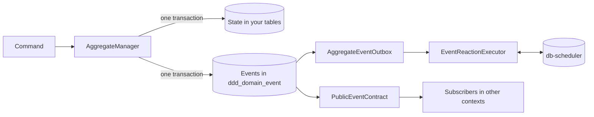

# kotmod

kotmod is a Kotlin library for building domain-driven design (DDD) aggregates on Postgres. It gives
you **domain events without event sourcing** — aggregates keep plain state in your own tables, and
kotmod records the events they raise in the same transaction — and a **transactional outbox built
in**, so those events reliably drive follow-up work in your own service and in others.

## Contents

## Why kotmod

Most services want two things from their domain model: state they can query like any other table,
and events that tell the rest of the system what happened. Event sourcing gives you events but makes
state something you rebuild. Saving state and then publishing a message gives you both, but not
atomically: if the message fails after the commit (or the commit fails after the message), the two
disagree. This is the *dual-write problem*.

kotmod writes an aggregate's new state, its events and the command that caused them in **one database
transaction**. An outbox then reads those events in order and turns them into *event reactions* — durable,
retried units of work — or publishes them to other bounded contexts.

kotmod is not an event store, not a message broker and not a framework: it is a library you wire into
your own application, on the Postgres database you already have.

## Installation

<!-- not-compiled -->
```kotlin
dependencies {
    implementation("io.kotmod:kotmod:<version>")
}
```

> kotmod is not yet published to Maven Central — publishing is coming soon.

Requirements:

- A JVM 25 toolchain (kotmod is currently built and tested on it) and Kotlin.
- PostgreSQL.
- [db-scheduler](https://github.com/kagkarlsson/db-scheduler) 16.12.0 for durable event reactions. It
  comes in as an API dependency of kotmod.

## Quickstart

This walks through a tiny orders domain: you place an order, ship it, and send a confirmation email
whenever an order is placed. It uses kotmod's Postgres backends and runs event reactions on
db-scheduler.

### 1. Create the tables

Your application owns the table that stores order state:

```sql
CREATE TABLE IF NOT EXISTS orders (
    id     TEXT PRIMARY KEY,
    status TEXT NOT NULL,
    item   TEXT NOT NULL,
    reason TEXT
)
```

kotmod needs its own tables too. Copy the statements in `DddSchema.ddl` (in `io.kotmod.postgres`) into
your migrations; they create the event log, aggregate bookkeeping, handled-command history and consumer
offsets. Event reactions run on db-scheduler, which needs its `scheduled_tasks` table: create it from
db-scheduler's
[`postgresql_tables.sql`](https://github.com/kagkarlsson/db-scheduler/blob/v16.12.0/db-scheduler/src/test/resources/postgresql_tables.sql).

### 2. Define state and events

An aggregate's **state** is whatever your application needs to make decisions — here, an order is
pending, shipped or cancelled:

```kotlin
sealed interface Order

data class PendingOrder(
    val item: String,
) : Order

data class ShippedOrder(
    val item: String,
) : Order

data class CancelledOrder(
    val item: String,
    val reason: String,
) : Order
```

Its **events** record what happened. They are stored as JSON, so they are `@Serializable`:

```kotlin
@Serializable
sealed interface OrderEvent : DomainEvent

@Serializable
data class OrderPlaced(
    val item: String,
) : OrderEvent

@Serializable
data class OrderShipped(
    val item: String,
) : OrderEvent

@Serializable
data class OrderCancelled(
    val item: String,
    val reason: String,
) : OrderEvent
```

### 3. Wire up persistence

Given a `javax.sql.DataSource` for your database (for example from HikariCP), create a JDBC driver, tell
kotmod how to serialize your events, and create an `AggregateManager` for orders:

```kotlin
val driver = dataSource.asJdbcDriver()

val serialization =
    jsonDataSerializationContext<OrderEvent> {
        +OrderPlaced.serializer().toEventSerializer()
        +OrderShipped.serializer().toEventSerializer()
        +OrderCancelled.serializer().toEventSerializer()
    }

val orders =
    AggregateManager(
        aggregateType = AggregateType("Order"),
        repository = OrderRepository(driver),
        backend = PostgresDomainPersistenceBackend(driver, serialization),
        transacter = object : TransacterImpl(driver) {},
    )
```

The `Repository` is yours: it loads and saves order state in the `orders` table. It borrows the driver's
connection through a small `withConnection` helper, so its writes join the same transaction as kotmod's:

```kotlin
class OrderRepository(
    private val driver: JdbcDriver,
) : Repository<Order> {
    override fun get(id: AggregateId): Order? =
        driver.withConnection { conn ->
            conn.prepareStatement("SELECT status, item, reason FROM orders WHERE id = ?").use { ps ->
                ps.setString(1, id.value)
                ps.executeQuery().use { rs ->
                    if (!rs.next()) {
                        null
                    } else {
                        val item = rs.getString("item")
                        when (rs.getString("status")) {
                            "PENDING" -> PendingOrder(item)
                            "SHIPPED" -> ShippedOrder(item)
                            else -> CancelledOrder(item, rs.getString("reason"))
                        }
                    }
                }
            }
        }

    override fun save(
        id: AggregateId,
        state: Order,
    ) {
        val (status, item, reason) =
            when (state) {
                is PendingOrder -> Triple("PENDING", state.item, null)
                is ShippedOrder -> Triple("SHIPPED", state.item, null)
                is CancelledOrder -> Triple("CANCELLED", state.item, state.reason)
            }
        driver.withConnection { conn ->
            conn
                .prepareStatement(
                    "INSERT INTO orders (id, status, item, reason) VALUES (?, ?, ?, ?) " +
                        "ON CONFLICT (id) DO UPDATE SET status = EXCLUDED.status, item = EXCLUDED.item, reason = EXCLUDED.reason",
                ).use { ps ->
                    ps.setString(1, id.value)
                    ps.setString(2, status)
                    ps.setString(3, item)
                    ps.setString(4, reason)
                    ps.executeUpdate()
                }
        }
    }
}

// Borrows the driver's connection, which is the transaction's connection inside AggregateManager.
fun <R> JdbcDriver.withConnection(block: (Connection) -> R): R {
    val (connection, close) = connectionAndClose()
    try {
        return block(connection)
    } finally {
        close()
    }
}
```

### 4. Run commands

A command takes the current state and returns the new state plus the events it raised. `create` starts
a new aggregate; `execute<PendingOrder>` only runs if the order is still pending. Both are `suspend`
functions:

```kotlin
val orderId = AggregateId("order-1")

orders.create(orderId) {
    PendingOrder("book") to listOf(OrderPlaced("book"))
}

val shipped =
    orders.execute<PendingOrder>(orderId) { order ->
        ShippedOrder(order.item) to listOf(OrderShipped(order.item))
    }
```

Each call saves the order's state, appends its events to the event log and records the command, all in
one transaction.

### 5. React to events

An **event reaction** is follow-up work triggered by an event, such as sending an email. Its input is a
**trigger**, which is stored until the reaction runs, so it must be serializable too:

```kotlin
@Serializable
sealed interface OrderNotification : EventReactionTrigger

@Serializable
data class SendOrderConfirmation(
    val orderId: String,
    override val timeout: Duration? = null,
) : OrderNotification

object OrderNotificationSerializer : EventReactionTriggerSerializer<OrderNotification> {
    override suspend fun serialize(trigger: OrderNotification): String = Json.encodeToString(OrderNotification.serializer(), trigger)

    override suspend fun deserialize(serializedTrigger: String): OrderNotification =
        Json.decodeFromString(OrderNotification.serializer(), serializedTrigger)
}

fun sendConfirmation(orderId: String) {
    println("Sending confirmation for order $orderId")
}
```

Reactions are stored and scheduled by db-scheduler. Create a `DbSchedulerEventReactions` for this kind of
reaction and register its task with your db-scheduler `Scheduler`. db-scheduler polls for due work every
10 seconds by default; `enableImmediateExecution()` runs newly dispatched reactions straight away:

```kotlin
val notifications = DbSchedulerEventReactions("order-notifications", OrderNotificationSerializer)

val scheduler =
    Scheduler
        .create(dataSource, notifications.task)
        .threads(4)
        .enableImmediateExecution()
        .build()
```

An `EventReactionExecutor` runs each reaction and decides what happens when it fails, times out or
completes:

```kotlin
val executor =
    EventReactionExecutor<OrderNotification, Unit>(
        sink = notifications.sink(scheduler),
        source = notifications.source,
        createExecutionContext = { _, _ -> },
        execute = { _, _, trigger, _, _ ->
            when (trigger) {
                is SendOrderConfirmation -> sendConfirmation(trigger.orderId)
            }
            EventReactionExecutionResult.EventReactionExecutionCompleted
        },
        failureRetryHandler = { _, _, _, retryCount, _, ex ->
            if (retryCount < 5) {
                RetrySignal.Retry(BackoffStrategy().calculateBackoff(retryCount))
            } else {
                RetrySignal.DoNotRetry(
                    EventReactionCompletionResult.EventReactionFailed(ex.message ?: "failed", allowManualRetry = true),
                )
            }
        },
        timeoutRetryHandler = { _, _, _, retryCount, _ ->
            RetrySignal.Retry(BackoffStrategy().calculateBackoff(retryCount))
        },
        onCompletion = { id, _, _, _, _, result ->
            println("Reaction ${id.value} finished: $result")
        },
    )
```

Finally, the `AggregateEventOutbox` reads the event log and turns each `OrderPlaced` into a confirmation
reaction. The reaction id is built from the event id, so if the same event is ever dispatched twice it is
recognised as the same reaction. `PostgresOffsetManager` remembers how far the outbox has read:

```kotlin
val offsets = PostgresOffsetManager(driver)

val outbox =
    AggregateEventOutbox<OrderNotification>(
        backend = PostgresDomainPollingBackend(driver),
        executor = executor,
        eventToReactions = { event ->
            when (serialization.deserialize(event.serialized)) {
                is OrderPlaced ->
                    listOf(
                        EventReaction(
                            id = EventReactionId("confirmation-${event.metadata.eventId.value}"),
                            trigger = SendOrderConfirmation(orderId = event.metadata.aggregateId.value),
                        ),
                    )
                else -> emptyList()
            }
        },
        getOffset = { offsets.getOffset("order-notifications") },
        saveOffset = { offsets.saveOffset("order-notifications", it) },
        isLeader = { true },
    )
```

Start the executor before the scheduler, then the outbox:

```kotlin
executor.start()
scheduler.start()
outbox.start()
```

Within a moment you'll see `Sending confirmation for order order-1`. Only the `OrderPlaced` event
produced a reaction; `OrderShipped` was read and skipped. To shut down, stop in the reverse order:
`outbox.stop()`, then `scheduler.stop()`, then `executor.stop()`.

## Core concepts



- **Aggregate** — a cluster of domain state changed only through commands, identified by an
  `AggregateType` and `AggregateId`.
- **Command** — a request to change an aggregate. It returns the new state and the events it raised, and
  is idempotent when given a `CommandId`.
- **Domain event** — a fact recorded in the event log in the same transaction as the state change.
- **Event reaction** — durable, retried follow-up work triggered by a domain event.
- **Trigger** — the stored input of an event reaction.
- **Public event** — a stable event published to other bounded contexts, mapped from internal domain
  events.
