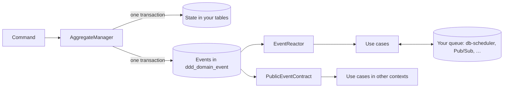

# kotmod

kotmod is a Kotlin library for building domain-driven design (DDD) aggregates on Postgres. It gives
you **domain events without event sourcing** — aggregates keep plain state in your own tables, and
kotmod records the events they raise in the same transaction — and a **transactional outbox built
in**, so those events reliably drive follow-up work in your own service and in others.

## Contents

- [Why kotmod](#why-kotmod)
- [Installation](#installation)
- [Quickstart](#quickstart)
- [Core concepts](#core-concepts)
- [Guides](#guides)
  - [Aggregates and commands](#aggregates-and-commands)
  - [Event-only aggregates](#event-only-aggregates)
  - [Event serialization and schema migrations](#event-serialization-and-schema-migrations)
  - [Postgres setup](#postgres-setup)
  - [Use cases](#use-cases)
  - [Running use cases on db-scheduler](#running-use-cases-on-db-scheduler)
  - [Ordered use cases](#ordered-use-cases)
  - [Using another queue (e.g. Google Pub/Sub)](#using-another-queue-eg-google-pubsub)
  - [Publishing events to other contexts](#publishing-events-to-other-contexts)
  - [Consuming another context's events](#consuming-another-contexts-events)
  - [Process managers](#process-managers)
- [Running in production](#running-in-production)
- [Known limitations](#known-limitations)
- [Upgrading from 0.2.0](#upgrading-from-020)
- [Upgrading from 0.1.0](#upgrading-from-010)
- [Status and contributing](#status-and-contributing)

## Why kotmod

Most services want two things from their domain model: state they can query like any other table,
and events that tell the rest of the system what happened. Event sourcing gives you events but makes
state something you rebuild. Saving state and then publishing a message gives you both, but not
atomically: if the message fails after the commit (or the commit fails after the message), the two
disagree. This is the *dual-write problem*.

kotmod writes an aggregate's new state, its events and the command that caused them in **one database
transaction**. A reactor then reads those events in order and runs your *use cases* on them — durable, retried
follow-up work, written as plain application code — and contracts publish them to other bounded contexts.

Use cases run on whatever queue you choose. kotmod ships one built on
[db-scheduler](https://github.com/kagkarlsson/db-scheduler), which needs nothing but the Postgres database
you already have, and you can plug in another, such as Google Pub/Sub, by implementing one small factory and
two small interfaces (see [Using another queue](#using-another-queue-eg-google-pubsub)).

kotmod is not an event store, not a message broker and not a framework: it is a library you wire into
your own application, on the Postgres database you already have.

## Installation

<!-- not-compiled -->
```kotlin
plugins {
    kotlin("jvm") version "2.4.20"
    kotlin("plugin.serialization") version "2.4.20" // for @Serializable events and triggers
}

dependencies {
    implementation("io.github.dreweaster:kotmod:0.3.0")
    implementation("io.github.dreweaster:kotmod-db-scheduler:0.3.0") // optional: the ready-made reaction queue
    // implementation("io.github.dreweaster:kotmod-sqldelight:0.3.0") // only if your app uses SQLDelight

    // Used directly by the code in this README:
    implementation("org.jetbrains.kotlinx:kotlinx-coroutines-core:1.11.0")
    implementation("org.postgresql:postgresql:42.7.13")
}
```

You also need a `javax.sql.DataSource` for your database, for example from HikariCP.

Requirements:

- A JVM 25 toolchain (kotmod is currently built and tested on it) and Kotlin.
- PostgreSQL 13 or later.

kotmod is split into modules:

- `kotmod` — aggregates, events, use cases, process managers and Postgres support, on plain JDBC with no other
  database library. This is the only module you need.
- `kotmod-db-scheduler` — optional. A ready-made queue for use cases and process managers on
  [db-scheduler](https://github.com/kagkarlsson/db-scheduler) 16.12.0, which it brings in. Leave it out if
  you run them on another queue, such as Google Pub/Sub
  (see [Using another queue](#using-another-queue-eg-google-pubsub)).
- `kotmod-sqldelight` — optional. Shares kotmod's transactions with SQLDelight.

## Quickstart

This walks through a tiny orders domain: you place an order, ship it, and send a confirmation email
whenever an order is placed. It uses kotmod's Postgres backends and runs follow-up work on db-scheduler,
kotmod's ready-made queue; you could swap in another queue without changing the rest.

Snippets leave out imports. The complete, compiled code is in
[`Quickstart.kt`](examples/src/integrationTest/kotlin/io/kotmod/readme/Quickstart.kt) and
[`QuickstartTest.kt`](examples/src/integrationTest/kotlin/io/kotmod/readme/QuickstartTest.kt). `Retry` and
`GiveUp` come from `io.kotmod.reaction`.

### 1. Create the tables

Your application owns the table that stores order state:

```sql
CREATE TABLE IF NOT EXISTS orders (
    id     TEXT PRIMARY KEY,
    status TEXT NOT NULL,
    item   TEXT NOT NULL,
    reason TEXT
)
```

kotmod needs its own tables too. Copy the statements in `DddSchema.ddl` (in `io.kotmod.postgres`) into
your migrations; they create the event log, aggregate bookkeeping, handled-command history and consumer
offsets. Use cases run on db-scheduler, which needs its `scheduled_tasks` table: create it from
db-scheduler's
[`postgresql_tables.sql`](https://github.com/kagkarlsson/db-scheduler/blob/v16.12.0/db-scheduler/src/test/resources/postgresql_tables.sql).

### 2. Define state, events, commands and rejections

An aggregate's **state** is whatever your application needs to make decisions. Here, an order is pending,
shipped or cancelled. Its **events** record what happened. They are stored as JSON, so they are
`@Serializable`:

```kotlin
@Serializable
sealed interface OrderEvent : DomainEvent

@Serializable
data class OrderPlaced(
    val item: String,
) : OrderEvent

@Serializable
data class OrderShipped(
    val item: String,
) : OrderEvent

@Serializable
data class OrderCancelled(
    val item: String,
    val reason: String,
) : OrderEvent
```

A **command** asks the order to change. Commands are data, so they are `@Serializable`, and so is the
aggregate's **rejection** type: every way a command can be refused, in your domain's own words.

```kotlin
@Serializable
sealed interface OrderCommand

@Serializable
data class PlaceOrder(
    val item: String,
) : OrderCommand

@Serializable
data object ShipOrder : OrderCommand

@Serializable
data class CancelOrder(
    val reason: String,
) : OrderCommand

@Serializable
sealed interface OrderRejection

@Serializable
data object OrderAlreadyPlaced : OrderRejection

@Serializable
data object OrderNotFound : OrderRejection

@Serializable
data object OrderAlreadyShipped : OrderRejection

@Serializable
data object OrderAlreadyCancelled : OrderRejection

@Serializable
data object CancellationReasonMissing : OrderRejection
```

Each state owns its behaviour. It implements `handle` and decides every command it might receive:
`accept(newState, events…)` or `reject(rejection)`. `NoOrder` is the order before it exists: placing it is
accepted there, and everything else is rejected. Each `when` lists every command and has no `else`, so adding
a command doesn't compile until every state has decided what to do with it. Decisions are plain code that
you can unit-test without a database.

```kotlin
typealias OrderOutcome = Outcome<Order, OrderEvent, OrderRejection>

sealed interface Order : AggregateState<Order, OrderCommand, OrderEvent, OrderRejection>

object NoOrder : InitialState<Order, OrderCommand, OrderEvent, OrderRejection> {
    override suspend fun handle(command: OrderCommand): OrderOutcome =
        when (command) {
            is PlaceOrder -> accept(PendingOrder(command.item), OrderPlaced(command.item))
            ShipOrder, is CancelOrder -> reject(OrderNotFound)
        }
}

data class PendingOrder(
    val item: String,
) : Order {
    override suspend fun handle(command: OrderCommand): OrderOutcome =
        when (command) {
            is PlaceOrder -> reject(OrderAlreadyPlaced)
            ShipOrder -> accept(ShippedOrder(item), OrderShipped(item))
            is CancelOrder -> cancel(command.reason)
        }

    private fun cancel(reason: String): OrderOutcome =
        if (reason.isBlank()) {
            reject(CancellationReasonMissing)
        } else {
            accept(CancelledOrder(item, reason), OrderCancelled(item, reason))
        }
}

data class ShippedOrder(
    val item: String,
) : Order {
    override suspend fun handle(command: OrderCommand): OrderOutcome =
        when (command) {
            is PlaceOrder -> reject(OrderAlreadyPlaced)
            ShipOrder, is CancelOrder -> reject(OrderAlreadyShipped)
        }
}

data class CancelledOrder(
    val item: String,
    val reason: String,
) : Order {
    override suspend fun handle(command: OrderCommand): OrderOutcome =
        when (command) {
            is PlaceOrder -> reject(OrderAlreadyPlaced)
            ShipOrder, is CancelOrder -> reject(OrderAlreadyCancelled)
        }
}
```

### 3. Wire up persistence

First name the aggregate. An `AggregateKind` names the aggregate type and says how its commands, events and
rejections are serialized:

```kotlin
object Orders : AggregateKind<OrderCommand, OrderEvent, OrderRejection>(
    type = AggregateType("Order"),
    commandSerializer = OrderCommand.serializer(),
    eventSerialization =
        jsonDataSerializationContext<OrderEvent> {
            +OrderPlaced.serializer().toEventSerializer()
            +OrderShipped.serializer().toEventSerializer()
            +OrderCancelled.serializer().toEventSerializer()
        },
    rejectionSerializer = OrderRejection.serializer(),
)
```

Then, given a `javax.sql.DataSource` for your database (for example from HikariCP), create a `JdbcContext` —
how kotmod reaches the database and runs transactions — and an `AggregateManager` for orders from the kind. Its
backend writes events with the kind's serialization:

```kotlin
val jdbc = DataSourceJdbcContext(dataSource)

val orders =
    AggregateManager(
        kind = Orders,
        repository = OrderRepository(jdbc),
        backend = PostgresDomainPersistenceBackend(jdbc, Orders.eventSerialization),
        initial = NoOrder,
    )
```

The `Repository` is yours: it loads and saves order state in the `orders` table. It borrows its connection
through `jdbc.withConnection`, so its writes join the same transaction as kotmod's:

```kotlin
class OrderRepository(
    private val jdbc: JdbcContext,
) : Repository<Order> {
    override fun get(id: AggregateId): Order? =
        jdbc.withConnection { conn ->
            conn.prepareStatement("SELECT status, item, reason FROM orders WHERE id = ?").use { ps ->
                ps.setString(1, id.value)
                ps.executeQuery().use { rs ->
                    if (!rs.next()) {
                        null
                    } else {
                        val item = rs.getString("item")
                        when (rs.getString("status")) {
                            "PENDING" -> PendingOrder(item)
                            "SHIPPED" -> ShippedOrder(item)
                            else -> CancelledOrder(item, rs.getString("reason"))
                        }
                    }
                }
            }
        }

    override fun save(
        id: AggregateId,
        state: Order,
    ) {
        val (status, item, reason) =
            when (state) {
                is PendingOrder -> Triple("PENDING", state.item, null)
                is ShippedOrder -> Triple("SHIPPED", state.item, null)
                is CancelledOrder -> Triple("CANCELLED", state.item, state.reason)
            }
        jdbc.withConnection { conn ->
            conn
                .prepareStatement(
                    "INSERT INTO orders (id, status, item, reason) VALUES (?, ?, ?, ?) " +
                        "ON CONFLICT (id) DO UPDATE SET status = EXCLUDED.status, item = EXCLUDED.item, reason = EXCLUDED.reason",
                ).use { ps ->
                    ps.setString(1, id.value)
                    ps.setString(2, status)
                    ps.setString(3, item)
                    ps.setString(4, reason)
                    ps.executeUpdate()
                }
        }
    }
}
```

### 4. React to events

Follow-up work, such as sending an email when an order is placed, is a **use case**. It says which events it
reacts to, what work they trigger, and how that work is done. A **trigger** is stored until its work runs, so it
must be serializable:

```kotlin
// This use case does one kind of work. One that does several makes its trigger type a sealed interface, with one
// class per kind of work (see "Use cases" in the guides).
@Serializable
data class SendOrderConfirmation(
    val orderId: String,
)

class OrderNotifications(
    private val confirm: (orderId: String) -> Unit,
) : Reactions<SendOrderConfirmation>(
        name = "order-notifications",
        triggers = SendOrderConfirmation.serializer(),
    ) {
    init {
        on(Orders) { event, metadata ->
            when (event) {
                is OrderPlaced -> trigger(SendOrderConfirmation(metadata.aggregateId.value))
                is OrderShipped, is OrderCancelled -> Unit
            }
        }
    }

    override suspend fun handle(
        trigger: SendOrderConfirmation,
        context: ReactionContext,
    ) = confirm(trigger.orderId)

    override fun onFailure(
        trigger: SendOrderConfirmation,
        attempt: Int,
        error: Throwable,
    ): FailureDecision = if (attempt < 5) Retry(backoff(attempt)) else GiveUp

    override suspend fun onCompletion(
        trigger: SendOrderConfirmation,
        result: ReactionResult,
    ) {
        println("$trigger finished: $result")
    }
}

fun sendConfirmation(orderId: String) {
    println("Sending confirmation for order $orderId")
}
```

- `on(Orders) { event, metadata -> … }` reacts to order events, typed: `Orders` carries their serialization. The
  event log holds every aggregate type's events; this use case only sees orders.
- `trigger(...)` queues work. kotmod builds its id from the use case, the event and the trigger's position, so
  if the same event is read again while its work is pending, it is recognised as the same work.
- `handle` does the work. Returning means done. Throwing, or running past the use case's `timeout` (60 seconds
  by default), is a failure, and `onFailure` decides: `Retry(delay)` or `GiveUp`. By default it retries with
  `backoff(attempt)` (1s, 2s, 4s… up to 10 minutes) and never gives up.
- `onCompletion` is told how the work ended: `ReactionResult.Completed` or `ReactionResult.GaveUp(error)`.

The **reactor** runs a context's use cases. It reads the event log once, hands each event to every use case
that listens to it, and queues their triggers. They run on db-scheduler: `DbSchedulerQueues` gives each use case
its own db-scheduler task, which you register with your `Scheduler`. db-scheduler polls for due work every 10
seconds by default; `enableImmediateExecution()` runs new work straight away:

```kotlin
val queues = DbSchedulerQueues(jdbc)

val reactor = EventReactor(jdbc, queues, isLeader = { true })
reactor.register(OrderNotifications(::sendConfirmation))

val scheduler =
    Scheduler
        .create(dataSource, *queues.tasks.toTypedArray())
        .threads(4)
        .enableImmediateExecution()
        .build()
queues.bind(scheduler)
```

Register every use case before reading `queues.tasks`, and call `queues.bind(scheduler)` before starting the
reactor: queueing work needs it. Then start the reactor, then the scheduler:

```kotlin
reactor.start()
scheduler.start()
```

A new reactor starts at the head of the event log: it sees events written after it first starts, not history.
Start it when your application starts, before it handles commands. To shut down, stop the scheduler, then the
reactor: `scheduler.stop()`, then `reactor.stop()` (the reactor also handles its use cases' queues, so it stops
after the scheduler that delivers their work). The quickstart passes `isLeader = { true }` because it runs on one
node; see [Running in production](#running-in-production) for leader election and the full shutdown order.
The reactor saves its position under its name, `reactor` by default, so a second reactor on the same database
needs its own `name = "..."` (see **Reading events** in [Postgres setup](#postgres-setup)).

### 5. Run commands

Send the commands from step 2 through the aggregate manager. `handle` is a `suspend` function, and it
returns either `CommandResult.Accepted` with the new state or `CommandResult.Rejected` with one of your
rejections:

```kotlin
val orderId = AggregateId("order-1")

orders.handle(orderId, PlaceOrder("book"))

val result = orders.handle(orderId, ShipOrder)
```

An accepted command saves the order's state, appends its events to the event log and records the command,
all in one transaction. A rejected command changes nothing, but its rejection is recorded too.

Within a moment you'll see `Sending confirmation for order order-1`. Only `OrderPlaced` triggered work;
`OrderShipped` was read and ignored.

## Core concepts



- **Aggregate** — a cluster of domain state changed only through commands, identified by an
  `AggregateType` and `AggregateId`.
- **Command** — a request to change an aggregate, as serializable data. The aggregate's current state
  decides it: accept it (new state and events) or reject it. It is idempotent when given a `CommandId`.
- **Rejection** — why an aggregate refused a command, as one of your own types. Rejections are recorded,
  so a repeated command id gets the same answer.
- **Domain event** — a fact recorded in the event log in the same transaction as the state change.
- **Use case** — follow-up work written as application code: which events it reacts to, the triggers they
  produce, and how each trigger is handled, with its own retries, timeout and ordering.
- **Trigger** — the stored input of one piece of a use case's work, as serializable data.
- **Reactor** — reads a context's event log once and queues every use case's triggers, each use case on its
  own queue.
- **Queue** — where triggers wait until they run. kotmod ships one on db-scheduler; anything that implements
  `ReactionQueues` works.
- **Public event** — a stable event published to other bounded contexts, mapped from internal domain
  events.
- **Process manager** — a long-running workflow that reacts to events, keeps its own state, and asks for
  commands to be run and inputs to be delivered to it later.

## Guides

Each guide builds on the quickstart's orders domain.

### Aggregates and commands

Use `AggregateManager` for anything whose state you store and change through commands.

Every command runs in three phases:

1. **Read** — if the command's id has already been handled, the recorded answer is returned and nothing
   else happens. Otherwise the aggregate's version and state are loaded.
2. **Decide** — the aggregate's current state (or the initial state, if the aggregate doesn't exist yet)
   decides the command. kotmod does no database work while it runs, so keep side effects out of it; put
   them in a [use case](#use-cases) instead.
3. **Write** — in one transaction, the aggregate's version is advanced, your repository saves the new
   state, the events are appended and the command is recorded as handled. A rejected command writes only
   the rejection record.

**States own their commands.** Each state implements `AggregateState` and decides every command in
`handle`, returning `accept(newState, events…)` or `reject(rejection)`. An `InitialState` object (`NoOrder`)
decides commands for an aggregate that doesn't exist yet, and accepting there creates it. Write each `when`
without an `else`: then adding a command doesn't compile until every state, and the initial state, has
decided what to do with it.

Decisions are plain code, so you can unit-test them without a database:
`PendingOrder("book").handle(ShipOrder)` and `NoOrder.handle(PlaceOrder("book"))` return the `Outcome`. `handle` is a `suspend` function, so call it from a coroutine such as `runTest`.

Callers match on the result; a rejection is a value, never an exception:

```kotlin
suspend fun cancelOrder(
    orders: AggregateManager<Order, OrderCommand, OrderEvent, OrderRejection>,
    orderId: AggregateId,
    reason: String,
    requestId: String,
): String =
    when (val result = orders.handle(orderId, CancelOrder(reason), commandId = CommandId(requestId))) {
        is CommandResult.Accepted -> "Cancelled"
        is CommandResult.Rejected ->
            when (result.rejection) {
                OrderAlreadyShipped -> "Too late: the order has shipped"
                CancellationReasonMissing -> "Please give a reason"
                else -> "Can't cancel: ${result.rejection}"
            }
    }
```

**Why commands are data.** Every caller, whether an HTTP handler, a use case or, later, a process
manager, runs a command the same way: through `AggregateManager.handle`. The rules for which state accepts a
command and how it is refused live in the states themselves, not in each caller.

**Event sequence numbers.** Every event carries `event.metadata.sequence`: its number within its
aggregate, counting 1, 2, 3… with no gaps. Use cases and public contracts can use it to tell which of an
aggregate's events came first.

**Idempotency.** Pass a `CommandId` you control — a request id, a message id. A repeated id returns the
recorded answer: an accepted command returns the aggregate's *current* state without running again, and a
rejected one returns the same rejection, even if the state would now allow the command. Without a command
id, kotmod generates a random one and the call is not idempotent. Pass a `CorrelationId` to tie together all
the events of one wider flow; it is stored with every event.

**Concurrency.** Each aggregate has a version. If someone else changes the aggregate between your read and
your write, `handle` reads again and decides again, up to `maxConflictRetries` times (5 by default), and
then throws `OptimisticConcurrencyException`. Deciding again is safe when decisions are pure. A state's
`handle` may suspend, but anything it calls out to is called once per attempt.

**Your repository joins the transaction.** `Repository.save` is called inside kotmod's transaction, so it
must borrow its connection from the same `JdbcContext` as the backend — as `OrderRepository` does with
`jdbc.withConnection` — rather than opening its own. A repository with its own connection would commit
state independently of the events.

#### Several aggregates in one transaction

**This is permitted, but not recommended.** In domain-driven design an aggregate is the boundary of
consistency: each command changes one aggregate in its own transaction. When a change to one aggregate
should lead to a change in another, the usual design is to react to the first aggregate's event and run
the second command asynchronously, with a [use case](#use-cases). That keeps
aggregates independent, keeps transactions short and small, and lets each aggregate be changed without
locking the others.

kotmod still allows it, for pragmatism. Some teams have good reasons to change several aggregates
atomically — a migration, a legacy design, or an invariant they have chosen not to model as a single
aggregate — and kotmod would rather support that clearly than forbid it. If you do, wrap the commands in
`jdbc.transaction { }` and their state, events and command records commit together — or not at all:

```kotlin
suspend fun shipAndInvoice(
    jdbc: JdbcContext,
    orders: AggregateManager<Order, OrderCommand, OrderEvent, OrderRejection>,
    invoices: AggregateManager<Order, OrderCommand, OrderEvent, OrderRejection>,
    orderId: AggregateId,
) {
    jdbc.transaction {
        // A rejection is a value: throw to roll the whole transaction back.
        val shipped = orders.handle(orderId, ShipOrder)
        if (shipped is CommandResult.Rejected) throw IllegalStateException("Can't ship: ${shipped.rejection}")
        val invoiced = invoices.handle(AggregateId("invoice-${orderId.value}"), PlaceOrder("invoice"))
        if (invoiced is CommandResult.Rejected) throw IllegalStateException("Can't invoice: ${invoiced.rejection}")
    }
}
```

- If any command fails — including a conflict — everything rolls back, including the other aggregates'
  events. Let the exception propagate: if you catch it and carry on, the transaction is still rolled back
  and kotmod throws `TransactionRolledBackException` rather than commit a partial result. Inside the block,
  `handle` does not retry conflicts; the exception propagates and the whole transaction rolls back.
- A rejection is a value. If you carry on, its record commits with everything else; to undo the other
  commands, throw, as `shipAndInvoice` does.
- Commands inside the block see each other's uncommitted writes.
- Run commands one after another, never in parallel, and don't switch threads inside the block (for
  example with `withContext`) — for kotmod commands or your own SQL; kotmod throws `IllegalStateException`
  if you do. The block keeps your coroutine context (name, tracing, MDC).
- Every kotmod class inside the block must use the same `JdbcContext`.
- Keep the block short: it holds a database transaction open.
- This is the only way an aggregate's events can reach the event log out of order. kotmod still delivers
  them in order, but such aggregates pay a slower check when replayed (see
  [Known limitations](#known-limitations)).

A conflict in a transaction is not retried for you. To retry, run the whole transaction again, for example
with this helper:

```kotlin
suspend fun <T> retryTransaction(
    jdbc: JdbcContext,
    attempts: Int = 3,
    block: suspend () -> T,
): T {
    repeat(attempts - 1) {
        try {
            return jdbc.transaction { block() }
        } catch (e: OptimisticConcurrencyException) {
            // Another writer got there first: run the whole transaction again.
        } catch (e: AggregateAlreadyExistsException) {
        } catch (e: CommandAlreadyRecordedException) {
        }
    }
    return jdbc.transaction { block() }
}
```

### Event-only aggregates

Use `EventProducer` when something needs an event log and idempotent commands but has no state worth
storing — an audit trail, for example:

```kotlin
@Serializable
sealed interface AuditEvent : DomainEvent

@Serializable
data class OrderViewed(
    val viewer: String,
) : AuditEvent

fun auditLog(jdbc: JdbcContext): EventProducer<AuditEvent> =
    EventProducer(
        aggregateType = AggregateType("OrderAuditLog"),
        backend =
            PostgresDomainPersistenceBackend(
                jdbc,
                jsonDataSerializationContext<AuditEvent> { +OrderViewed.serializer().toEventSerializer() },
            ),
    )

suspend fun recordView(
    auditLog: EventProducer<AuditEvent>,
    orderId: AggregateId,
    viewer: String,
    requestId: String,
) {
    auditLog.emit(orderId, listOf(OrderViewed(viewer)), commandId = CommandId(requestId))
}
```

`emit` creates the aggregate's bookkeeping the first time it is called for an id. Command ids and
optimistic concurrency work exactly as they do for `AggregateManager`. Its events go into the same event
log as everything else; a use case only receives the aggregate types it listens to with `on(...)`, so they
never reach one that doesn't ask for them.

### Event serialization and schema migrations

Events live in the event log for a long time, so their classes will change. Each event is stored with
its class name and a schema version, and `jsonDataSerializationContext` knows how to bring old versions
up to date:

```kotlin
val orderEventSerialization =
    jsonDataSerializationContext<OrderEvent> {
        +OrderPlaced.serializer().toEventSerializer()
        // OrderShipped used to be called OrderDispatched, in another package.
        +OrderShipped.serializer().toEventSerializer(initialClassName = "com.example.orders.OrderDispatched") {
            migrateClassName(OrderShipped::class.qualifiedName!!)
        }
        // OrderCancelled gained a `reason` field; older events get a default.
        +OrderCancelled.serializer().toEventSerializer {
            migrateFormat { json -> JsonObject(json + ("reason" to JsonPrimitive("not recorded"))) }
        }
    }
```

- Every event type starts at version 1. Each `migrateFormat` or `migrateClassName` adds a version, in the
  order the changes were made.
- `migrateFormat` transforms the previous version's JSON into the new shape.
- `migrateClassName` records a rename or move. Pass the event's *original* class name as
  `initialClassName`, and the current one to `migrateClassName`.
- Old events are migrated when they are read; new events are always written at the latest version.

If you don't want JSON, implement `DataSerializationContext` yourself.

### Postgres setup

kotmod's Postgres classes use plain JDBC through a `JdbcContext`. For a plain `DataSource`, use
`DataSourceJdbcContext(dataSource)`; SQLDelight users have an adapter (below).

**Schema.** `DddSchema.ddl` creates four tables; copy it into your Flyway or Liquibase migrations:

| Table | Holds |
|---|---|
| `ddd_aggregate_root` | Each aggregate's version, sequence counter and timestamps, and whether it has events out of order in the log |
| `ddd_domain_event` | The event log, ordered by `(transaction_id, global_offset)`, with each event's `aggregate_sequence` |
| `ddd_command_history` | Which commands each aggregate has handled |
| `ddd_consumer_offset` | How far the reactor, each contract and each process manager has read (a transaction id and offset) |

db-scheduler's `scheduled_tasks` table belongs to your application; create it from db-scheduler's
[`postgresql_tables.sql`](https://github.com/kagkarlsson/db-scheduler/blob/v16.12.0/db-scheduler/src/test/resources/postgresql_tables.sql).

**Transactions.** Pass the same `JdbcContext` to every kotmod class and to your repositories. Each command
runs in a transaction opened by its backend's `JdbcContext`; `jdbc.inTransaction { }` and
`jdbc.withConnection { }` let your own code join it, and `jdbc.transaction { }` spans several commands.

**Reading events.** `PostgresDomainPollingBackend` reads the event log for the reactor, public contracts and
process managers. `PostgresOffsetManager` stores how far each has read. The reactor saves its position under its
`name` (`reactor` by default); give every other poller its own consumer name. Two reactors on the same database
must have different names: with the same name they would share one saved position and skip each other's events.

**Starting positions.** A consumer with no saved position starts from the head of the event log, so deploying a
new reactor, contract or process manager does not replay history. The reactor fixes its starting position when
it starts, so a new one sees every event committed after `start()` returns. A contract or process manager fixes
it on its first read of its position (its first poll as leader), not when it is constructed. Either may also see
a few events committed just before, while an older transaction was still open, but never history from before
that. Pass `startFrom = StartFrom.Beginning` to `getPosition` for a contract or process manager that must see
history. An existing consumer keeps its saved position; to reset one deliberately, save a position yourself with
`savePosition`.

#### Using SQLDelight

Add `io.kotmod:kotmod-sqldelight` and build a `SqlDelightJdbcContext` from the same `JdbcDriver` as your
generated database. kotmod then runs its transactions through SQLDelight's, so your SQLDelight queries and
kotmod's writes share one transaction whichever side opens it:

- Inside `jdbc.transaction { }`, call your SQLDelight queries as usual — they join kotmod's transaction.
- Inside your own `database.transaction { }`, call kotmod from blocking code (SQLDelight's block can't
  suspend), e.g. `runBlocking { orders.handle(id, command) }`; commands join your transaction. Wrap
  several in `runBlocking { jdbc.transaction { … } }` to get kotmod's thread checks too. In a transaction
  SQLDelight opened, SQLDelight's rules apply: if a kotmod call fails and you catch it, SQLDelight rolls
  your transaction back when it ends.

Repositories implemented with SQLDelight queries need no changes: they already run inside the transaction.

### Use cases

A use case is a class that extends `Reactions<T>`, where `T` is its trigger type (plain `@Serializable` data).
It owns the whole reaction, like `OrderNotifications` in [the quickstart](#4-react-to-events):

- **Sources.** In its `init` block, `on(kind) { event, metadata -> … }` reacts to one of this context's
  aggregate kinds, with the events typed (`AggregateKind` carries their serialization).
  `on(contract) { event, metadata -> … }` reacts to another context's public events (see
  [Consuming another context's events](#consuming-another-contexts-events)). One source is the common case;
  several are allowed, as long as each aggregate type reaches the use case through only one of them. A use case
  never sees events of types it doesn't listen to.
- **Triggers.** Inside the block, `trigger(t)` queues work and `trigger(t, notBefore = instant)` delays it. The
  block only decides what to do. Keep it free of I/O and deterministic: the same event must always produce the
  same triggers, in the same order, because their ids are numbered by position.
- **Handling.** `handle(trigger, context)` does the work. `context.reactionId` is the same on every retry and
  redelivery (`<useCase>/<eventId>/<n>`), so pass it as the idempotency key of external calls; `context.attempt`
  counts retries from 0.
- **Failures.** `onFailure(trigger, attempt, error)` returns `Retry(delay)` or `GiveUp`. By default it retries
  with `backoff(attempt)` (1s, 2s, 4s… up to 10 minutes) and never gives up. Running past `timeout` (60 seconds
  by default) is a failure too, passed as a `ReactionTimeoutException`. If `onFailure` throws, the work is
  retried after a backoff.
- **Completion.** `onCompletion(trigger, result)` hears `ReactionResult.Completed` or
  `ReactionResult.GaveUp(error)`; it does nothing by default. If it throws, the work is retried after a backoff,
  so `handle` may run again.
- **Name.** `name` names the use case's queue, so keep it stable across releases. With db-scheduler it is the
  task name, so it must be unique across everything that shares the `scheduled_tasks` table, including other
  contexts' use cases and process manager channels.

Each use case has its own queue, so its ordering, timeout and failure policy are its own, and a slow or failing
use case never holds up another. Delivery is at least once: make `handle` idempotent.

#### Several sources and kinds of work

A use case can listen to several aggregates, and do several kinds of work. Make its trigger type a sealed
interface, with one class per kind of work, and call `on(...)` once per source. This one posts to a sales channel
when a customer registers and when an order is placed (`Customers` is the customer aggregate's kind, defined like
`Orders`):

```kotlin
@Serializable
sealed interface SalesFeedPost

@Serializable
data class NewCustomer(
    val customerId: String,
    val email: String,
) : SalesFeedPost

@Serializable
data class NewOrder(
    val orderId: String,
    val item: String,
) : SalesFeedPost

class SalesFeed(
    private val post: suspend (message: String) -> Unit,
) : Reactions<SalesFeedPost>(
        name = "sales-feed",
        triggers = SalesFeedPost.serializer(),
    ) {
    init {
        on(Customers) { event, metadata ->
            when (event) {
                is CustomerRegistered -> trigger(NewCustomer(metadata.aggregateId.value, event.email))
            }
        }
        on(Orders) { event, metadata ->
            if (event is OrderPlaced) trigger(NewOrder(metadata.aggregateId.value, event.item))
        }
    }

    override suspend fun handle(
        trigger: SalesFeedPost,
        context: ReactionContext,
    ) = when (trigger) {
        is NewCustomer -> post("New customer: ${trigger.email}")
        is NewOrder -> post("New order ${trigger.orderId}: ${trigger.item}")
    }
}
```

- Each `on(...)` block gets its own aggregate's events, typed, so `when (event)` covers that aggregate's events
  only.
- `handle` gets every trigger, from either source, and `when (trigger)` covers each kind of work.
- With [ordering](#ordered-use-cases), each aggregate instance's work runs in order: a customer's and an order's
  work are ordered separately, and never wait for each other.

#### Delayed triggers

Give a trigger a `notBefore` and it doesn't run before that time. For example, ask for a review a week after an
order ships:

```kotlin
@Serializable
data class SendReviewReminder(
    val orderId: String,
)

class ReviewReminders :
    Reactions<SendReviewReminder>(
        name = "review-reminders",
        triggers = SendReviewReminder.serializer(),
    ) {
    init {
        on(Orders) { event, metadata ->
            if (event is OrderShipped) {
                trigger(SendReviewReminder(metadata.aggregateId.value), notBefore = metadata.timestamp + 7.days)
            }
        }
    }

    override suspend fun handle(
        trigger: SendReviewReminder,
        context: ReactionContext,
    ) {
        println("Asking for a review of order ${trigger.orderId}")
    }
}
```

- With db-scheduler, delayed work waits in `scheduled_tasks` until it is due, at no extra cost.
- If a queue delivers work early, kotmod puts it back until it is due. It doesn't run, and it doesn't count as
  a retry.
- [Ordered use cases](#ordered-use-cases) can't produce delayed triggers: one would hold back every later
  reaction of its aggregate. If one does, its event is parked (below), so the mistake shows up loudly without
  stopping anything else.

#### When a mapping fails

Sometimes a use case can't turn an event into triggers: its `on(...)` block throws, the event can't be
deserialized, or an ordered use case produces a delayed trigger. The reactor doesn't stop. It **parks** the
event in that use case's own queue, as an item with id `<useCase>/<eventId>/mapping`, logs the error, and moves
on. Other use cases still get their triggers for the event.

A parked event is retried with capped backoff (1s, 2s, 4s… up to 10 minutes), forever, logging each failure; it
is never dropped while the use case still listens to its aggregate type. Each retry reads the event again and
runs the use case's current code, so deploying a fix is enough. The event's triggers are then queued with the
ids they would have had, and run. With ordering, the aggregate's later work in that use case waits behind the
parked event; other aggregates and other use cases are unaffected. On db-scheduler the event's triggers then
still run in order, before that later work, because ordered work runs in sequence order whenever it was queued.
A queue that orders by publish time, such as Pub/Sub, runs them after the later work instead (see
[Using another queue](#using-another-queue-eg-google-pubsub)). If the fixed code no longer listens to the
event's aggregate type, the parked event is dropped with a warning.

If an event will never map — say its payload is beyond repair — an operator can drop its parked mapping. On
db-scheduler, `queues.parkedMappings(scheduler, useCase)` lists a use case's parked events (event id, reaction id
and retry count), and `queues.skipParked(scheduler, useCase, eventId)` drops one without retrying it: that
event's work in the use case never runs, and with ordering the aggregate's later work can then run. On another
queue, delete the item with id `<useCase>/<eventId>/mapping` with that queue's own tools.

### Running use cases on db-scheduler

This is kotmod's ready-made queue, in the optional `kotmod-db-scheduler` module. It needs nothing but your
Postgres database; to use a different queue instead, see
[Using another queue](#using-another-queue-eg-google-pubsub).

`DbSchedulerQueues` stores work in db-scheduler's `scheduled_tasks` table and runs it on your db-scheduler
`Scheduler`. Your application owns the `Scheduler` — its threads, polling and lifecycle. One `DbSchedulerQueues`
serves a whole context: each use case, and each [process manager](#process-managers) channel, becomes one
db-scheduler task named after it, and each piece of work is an instance of that task. Register every use case
before reading `queues.tasks`:

```kotlin
fun startReactions(
    dataSource: DataSource,
    jdbc: JdbcContext,
    election: PostgresLeaderElection,
): Pair<EventReactor, Scheduler> {
    val queues = DbSchedulerQueues(jdbc)
    val reactor = EventReactor(jdbc, queues, isLeader = election::isLeader)
    reactor.register(OrderNotifications(::sendConfirmation))
    reactor.register(ReviewReminders())
    reactor.register(OrderStatusProjection(jdbc))
    val scheduler =
        Scheduler
            .create(dataSource, *queues.tasks.toTypedArray())
            .threads(10)
            .enableImmediateExecution()
            .build()
    queues.bind(scheduler)
    reactor.start()
    scheduler.start()
    return reactor to scheduler
}
```

How it behaves:

- **Duplicates.** Queuing an id that is already pending does nothing.
- **Retries.** A `Retry(delay)` reschedules the work with its attempt count incremented, so backoff keeps
  growing across restarts.
- **Startup order.** If the scheduler runs work before the reactor has started, the work is pushed back a few
  seconds (without counting an attempt) and a warning is logged.
- **Unreadable data.** If stored work can't be decoded — say a trigger class was renamed — db-scheduler retries
  it with backoff from 10 seconds up to 1 hour until a fix is deployed. Keep old names readable with
  `@SerialName`.
- **Removing pending work.** To stop pending unordered work for good, cancel its task instance; its id is the
  reaction id, `<useCase>/<eventId>/<n>` (for ordered work, see [Ordered use cases](#ordered-use-cases)):

```kotlin
fun cancelPendingConfirmation(
    scheduler: Scheduler,
    eventId: EventId,
) {
    scheduler.cancel(TaskInstanceId.of("order-notifications", "order-notifications/${eventId.value}/0"))
}
```

### Ordered use cases

By default a use case's work is unordered: two pieces of work from the same aggregate can run at the same time,
or finish in a different order from the events. That is fine for sending emails, but not for projections or
anything else that must apply an aggregate's changes in order. For those, override `ordering`:

- `ReactionOrdering.Unordered` is the default.
- `ReactionOrdering.PerAggregate(onGiveUp = …)` runs an aggregate's work in this use case one at a time, in event
  order.

```kotlin
@Serializable
sealed interface OrderStatusChange

@Serializable
data class StatusChanged(
    val orderId: String,
    val status: String,
) : OrderStatusChange

class OrderStatusProjection(
    private val jdbc: JdbcContext,
) : Reactions<OrderStatusChange>(
        name = "order-status-projection",
        triggers = OrderStatusChange.serializer(),
    ) {
    init {
        on(Orders) { event, metadata ->
            val status =
                when (event) {
                    is OrderPlaced -> "placed"
                    is OrderShipped -> "shipped"
                    is OrderCancelled -> "cancelled"
                }
            trigger(StatusChanged(metadata.aggregateId.value, status))
        }
    }

    override val ordering = ReactionOrdering.PerAggregate(onGiveUp = OnGiveUp.BlockAggregate)

    override suspend fun handle(
        trigger: OrderStatusChange,
        context: ReactionContext,
    ) = when (trigger) {
        is StatusChanged -> saveStatus(trigger.orderId, trigger.status)
    }

    private fun saveStatus(
        orderId: String,
        status: String,
    ) {
        jdbc.withConnection { conn ->
            conn
                .prepareStatement(
                    "INSERT INTO order_status (id, status) VALUES (?, ?) " +
                        "ON CONFLICT (id) DO UPDATE SET status = EXCLUDED.status",
                ).use { ps ->
                    ps.setString(1, orderId)
                    ps.setString(2, status)
                    ps.executeUpdate()
                }
        }
    }
}
```

The reactor reads each aggregate's events in sequence order (see `metadata.sequence`), even in the rare case
where the order in the log differs because a transaction changed several aggregates. For an aggregate that has
never been written out of order, checking this is a single primary-key lookup per event. Ordering is per
aggregate instance and per use case: different aggregates never wait on each other, and neither do different
use cases. A use case with several sources gets ordering per aggregate of each; since an aggregate type reaches a
use case through only one source, their orders never mix.

Ordering needs support from the queue. `DbSchedulerQueues` has it (for Pub/Sub, see
[Using another queue](#using-another-queue-eg-google-pubsub)); a queue without it fails when the use case is
registered, rather than running unordered.

**When work gives up.** Work gives up when `onFailure` returns `GiveUp`. The `OnGiveUp` policy says what happens
to the aggregate's later work in this use case:

| Policy | Behaviour |
|---|---|
| `OnGiveUp.ContinueWithNext` (default) | The failed work is completed as given up and the next one runs |
| `OnGiveUp.BlockAggregate` | The aggregate's later work waits until an operator retries or skips the failed one |

Use `BlockAggregate` when running later work after a missed one would leave wrong data, such as a projection that
skipped an event. Other aggregates are not affected. To find and clear blocked work, use the helpers on
`DbSchedulerQueues`, passing your `Scheduler` (or any `SchedulerClient`) and the use case's name:

- `blockedReactions(client, useCase)` lists each blocked reaction with its aggregate key, reaction id and
  sequence number.
- `retryBlocked(client, useCase, id)` runs it again now, with its attempt count reset.
- `skipBlocked(client, useCase, id)` drops it without running it, so the aggregate's next work can run.

```kotlin
fun retryBlockedProjection(
    scheduler: Scheduler,
    queues: DbSchedulerQueues,
) {
    for (blocked in queues.blockedReactions(scheduler, "order-status-projection")) {
        println("${blocked.key} is held back by ${blocked.reactionId.value} at sequence ${blocked.sequence}")
        queues.retryBlocked(scheduler, "order-status-projection", blocked.reactionId)
    }
}
```

Ordered work's db-scheduler instance id is built from its aggregate, sequence number and reaction id, so
`TaskInstanceId.of(useCase, reactionId)` does not find it; use these helpers instead.

**How waiting works.** Ordered work only runs when no earlier work of the same aggregate is still pending in its
use case's queue. Otherwise it waits and checks again, starting after `DbSchedulerQueues`'
`orderedRecheckDelay` (2 seconds by default) and doubling each time up to 1 minute. When work finishes, kotmod
nudges the aggregate's next work to run immediately, so a backlog normally runs back to back. The cost of
ordering is therefore a little extra database work for waiting work, and one aggregate's work in a use case runs
on at most one thread at a time; different aggregates still run in parallel.

**Recommended index.** The pending check looks work up by task and instance id, so add this to your own
`scheduled_tasks` migration (it is optional, but worth having once much work can be waiting; use your table name
if you pass a custom `tableName`):

```sql
CREATE INDEX scheduled_tasks_ordered_idx ON scheduled_tasks (task_name, task_instance COLLATE "C");
```

**Delivery is still at least once.** In one rare case, ordering can briefly be broken: if the reactor crashes
after queueing several triggers from the same event but before saving its position, an earlier one that had
already completed can run again at the same time as a later one. Keep ordered work idempotent too.

### Using another queue (e.g. Google Pub/Sub)

db-scheduler is a convenient default, not a requirement. The reactor and process managers only need a
`ReactionQueues`: given a queue name, whether it must be ordered and how to store its items, it returns a
`ReactionChannel` made of two interfaces from the core `kotmod` module:

- **`EventReactionTriggerSink`** — `publish(id, trigger, ordering, notBefore)` queues an item. Publishing an id
  that is already queued should not queue it twice; if your queue can't guarantee that, rely on `handle` being
  idempotent (it must be anyway, since delivery is at least once). Carry `notBefore` with the message, and if
  your queue can delay delivery, don't deliver before it.
- **`EventReactionTriggerSource`** — `subscribe(block)` starts delivering queued items. For each delivery, call
  `block` with the reaction id, a fresh execution id, the item, the retry count and its `notBefore`, and act on
  what it returns:
  - `ReactionOutcome.Finished` — it is done (succeeded or gave up): remove it from the queue.
  - `ReactionOutcome.Retry(delay)` — deliver it again after about `delay`, counting a retry.
  - `ReactionOutcome.Wait(delay)` — it isn't due yet: deliver it again after about `delay` without counting a
    retry.
  - An exception — deliver it again later.

kotmod asks for one queue per use case (named after it) and one per process manager channel
(`<process type>-<channel>`). It stores its own items in them — your triggers, wrapped with what kotmod needs to
run them, and [parked mappings](#when-a-mapping-fails) — so your queue only moves them between publish and
delivery. Timeouts, `onFailure`, `onCompletion` and parked mappings work the same whichever queue you use, with
one difference for ordered use cases: on a queue that orders by publish time, a parked mapping's triggers run
after its aggregate's later work (see the Pub/Sub notes below). Leave out the `kotmod-db-scheduler` dependency if
you don't use it.

Here is a sketch for Google Pub/Sub, using the official Java client (`com.google.cloud:google-cloud-pubsub`).
It is not part of kotmod and is not compiled or tested here; a ready-made Pub/Sub module is planned.

<!-- not-compiled -->
```kotlin
class PubSubQueues(
    // One topic for every queue: each message carries its queue's name, and each queue has its own subscription,
    // filtered on it (attributes.queue = "<name>"). Enable message ordering on the subscriptions of ordered queues.
    private val topic: TopicName,
    private val subscriptionFor: (queue: String) -> ProjectSubscriptionName,
) : ReactionQueues {
    override fun <T : EventReactionTrigger> channel(
        name: String,
        triggerSerializer: EventReactionTriggerSerializer<T>,
        ordered: Boolean,
    ): ReactionChannel<T> {
        val publisher = Publisher.newBuilder(topic).setEnableMessageOrdering(ordered).build()
        val queue = PubSubQueue(name, publisher, subscriptionFor(name), triggerSerializer, supportsOrdering = ordered)
        return ReactionChannel(queue, queue)
    }
}

class PubSubQueue<T : EventReactionTrigger>(
    private val name: String,
    private val publisher: Publisher,
    private val subscription: ProjectSubscriptionName,
    private val serializer: EventReactionTriggerSerializer<T>,
    override val supportsOrdering: Boolean,
) : EventReactionTriggerSink<T>, EventReactionTriggerSource<T> {
    override suspend fun publish(
        id: EventReactionId,
        trigger: T,
        ordering: DispatchOrdering?,
        notBefore: Instant?,
    ) {
        val message =
            PubsubMessage.newBuilder()
                .setData(ByteString.copyFromUtf8(serializer.serialize(trigger)))
                .putAttributes("queue", name)
                .putAttributes("reactionId", id.value)
                .apply { if (ordering != null) setOrderingKey(ordering.key) }
                // Carry notBefore with the message; Pub/Sub can't hold it back (see "Delays on Google Cloud").
                .apply { if (notBefore != null) putAttributes("notBefore", notBefore.toString()) }
                .build()
        // Wait for Pub/Sub to accept it: the reactor only moves on once publish returns.
        withContext(Dispatchers.IO) { publisher.publish(message).get() }
    }

    override fun subscribe(
        block: suspend (EventReactionId, EventReactionExecutionId, T, RetryCount, Instant?) -> ReactionOutcome,
    ): Cancellable {
        val receiver =
            MessageReceiver { message, reply ->
                // Pub/Sub calls this on its own threads; run the attempt to completion before replying.
                val outcome =
                    runBlocking {
                        try {
                            block(
                                EventReactionId(message.getAttributesOrThrow("reactionId")),
                                EventReactionExecutionId(UUID.randomUUID().toString()),
                                serializer.deserialize(message.data.toStringUtf8()),
                                // Delivery attempts are only counted when the subscription has a dead-letter policy.
                                (Subscriber.getDeliveryAttempt(message) ?: 1) - 1,
                                message.attributesMap["notBefore"]?.let { Instant.parse(it) },
                            )
                        } catch (e: Exception) {
                            ReactionOutcome.Retry(Duration.ZERO)
                        }
                    }
                when (outcome) {
                    is ReactionOutcome.Finished -> reply.ack()
                    is ReactionOutcome.Retry -> reply.nack()
                    // A nack ignores the delay, so this only suits waits of a few minutes. For longer ones, hand
                    // the message back to Cloud Tasks for `outcome.delay` and ack this one instead (see
                    // "Delays on Google Cloud"). Pub/Sub counts a nack as a delivery attempt, which a
                    // dead-letter policy would treat as a failure.
                    is ReactionOutcome.Wait -> reply.nack()
                }
            }
        val subscriber = Subscriber.newBuilder(subscription, receiver).build()
        subscriber.startAsync().awaitRunning()
        return object : Cancellable {
            override fun cancel() {
                subscriber.stopAsync().awaitTerminated()
            }
        }
    }
}
```

Pass a `PubSubQueues` to `EventReactor` (and to your process managers) where the quickstart passes
`DbSchedulerQueues`.

How Pub/Sub differs from db-scheduler:

- **One subscription per queue.** Each use case's queue, and each process manager channel, maps to one
  subscription: a topic per queue, or, as in the sketch, one topic with a `queue` attribute and a filtered
  subscription per queue.
- **Retry delays are approximate.** Pub/Sub can't redeliver a message after a chosen delay; a `nack()` is
  redelivered according to the subscription's retry policy. Set its minimum and maximum backoff to suit your
  use cases, or treat `onFailure`'s delays only as a guide.
- **No deduplication by reaction id.** Pub/Sub may deliver a message more than once, and the reactor may publish
  a trigger again after a restart. Keep `handle` and `onCompletion` idempotent, and pass `context.reactionId` as
  the idempotency key of external calls.
- **Retry counts need a dead-letter policy.** Pub/Sub only counts delivery attempts when the subscription has
  one; without it, `context.attempt` is always 0. A dead-letter topic is also where messages go after too many
  failed deliveries.
- **Ordering uses ordering keys.** `DispatchOrdering.key` is `<aggregateType>/<aggregateId>`, so publishing with
  `setOrderingKey(ordering.key)` makes Pub/Sub deliver each aggregate's work in order, one at a time, and a
  `nack()` holds back that aggregate's later messages until it is redelivered. If a publish fails, the client
  pauses that ordering key until you call `publisher.resumePublish(key)`.
- **A parked mapping breaks order for its aggregate.** A parked mapping is a message with its event's ordering
  key, so while it fails it holds back that aggregate's later work, and only that aggregate's. But Pub/Sub
  orders by publish time: when it finally succeeds, the event's triggers are published behind the later work
  that was already queued, so they run after it. In an ordered use case on Pub/Sub, treat a parked mapping as
  breaking order for that aggregate, and keep `on(...)` blocks from throwing. db-scheduler doesn't have this
  problem: it runs ordered work in sequence order.
- **Parked mappings read your database.** A parked mapping reads its event again from the event log, so the
  subscriber must run in your application, with access to its database.
- **`OnGiveUp.BlockAggregate` has no direct equivalent.** In this sketch, work that gives up is acknowledged and
  the aggregate's next work runs, as with `ContinueWithNext`. Record failures in `onCompletion` (or route them to
  a dead-letter topic) to deal with them. A stuck ordering key shows up as redelivery or dead-lettering, not as a
  row you can list.
- **`ReactionOutcome.Wait` only suits short waits.** A `nack()` ignores the delay: the message comes back
  according to the subscription's retry policy (at most 10 minutes later), and each redelivery counts towards the
  dead-letter limit (at most 100 attempts). Work that must wait longer than a few minutes would be redelivered
  many times, or dead-lettered before it is due. For longer waits, hand the message to a scheduler such as Cloud
  Tasks and ack the original (see below).
- **Long work is fine.** The client keeps extending a message's acknowledgement deadline while `block` runs, up
  to its maximum extension period (one hour by default).
- **No leader election is needed for the queue.** As with db-scheduler, every node can run subscribers; only the
  reactor, contracts and process managers need [one active poller](#running-in-production).

**Delays on Google Cloud.** Pub/Sub can't hold a message back until a time. A sink can instead hand delayed work
to **Cloud Tasks** with a schedule time, and have the task publish it to Pub/Sub when it's due. Cloud Tasks can
only schedule about 30 days ahead, so for a longer delay the work is scheduled for the furthest time allowed and
arrives before its `notBefore`. kotmod then returns `Wait` without running it, and the source should hand the
message to Cloud Tasks again for the remaining time and ack the original.

### Publishing events to other contexts

Internal domain events change as your model changes, so other contexts shouldn't depend on them directly.
Instead, publish **public events** — a deliberately stable contract — with a `PublicEventContract`:

```kotlin
@Serializable
sealed interface OrderPublicEvent : PublicDomainEvent

@Serializable
data class OrderPlacedV1(
    val item: String,
) : OrderPublicEvent

fun orderContract(
    jdbc: JdbcContext,
    offsets: PostgresOffsetManager,
): PublicEventContract<OrderEvent, OrderPublicEvent> =
    PublicEventContract(
        backend = PostgresDomainPollingBackend(jdbc),
        serialization = Orders.eventSerialization,
        internalToPublic = { event ->
            when (event) {
                is OrderPlaced -> OrderPlacedV1(event.item)
                else -> null
            }
        },
        getPosition = { offsets.getPosition("order-contract") },
        savePosition = { offsets.savePosition("order-contract", it) },
        isLeader = { true },
        aggregateTypes = setOf(Orders.type),
    )
```

- `internalToPublic` maps each internal event to a public one; returning `null` keeps it private.
- Use cases in other contexts react to the public events with `on(contract)`, each event with the original
  event's metadata (event id, aggregate id, sequence and so on); see
  [Consuming another context's events](#consuming-another-contexts-events).
- The publishing context builds and starts the contract. Register the use cases that listen to it before it
  starts.
- A contract reads the event log independently of the reactor, so give it its own consumer name.
- `aggregateTypes` lists the aggregate types the contract publishes; events of other types are skipped
  without being deserialized. The event log holds every aggregate's events, so with a filter, adding an
  aggregate or a [process manager](#process-managers) to the context never stalls this contract on an event
  type its `serialization` can't read. A use case can combine a contract with other sources only when the
  contract has this filter.
- Without `aggregateTypes`, a contract deserializes **every** event in the log before mapping it, so its
  `serialization` must be able to read every event type your application writes, including the facts a
  process manager records. If you have several event families (orders and audit events, say), register them
  all in one `jsonDataSerializationContext<DomainEvent>` and use `DomainEvent` as the contract's internal type.

### Consuming another context's events

A use case reacts to another context's public events with `on(contract)`, typed like any other source:

```kotlin
@Serializable
sealed interface BillingTrigger

@Serializable
data class ChargeCustomer(
    val orderId: String,
) : BillingTrigger

interface PaymentGateway {
    suspend fun charge(
        orderId: String,
        idempotencyKey: String,
    )
}

class CustomerBilling(
    orderEvents: PublicEventContract<*, OrderPublicEvent>,
    private val gateway: PaymentGateway,
) : Reactions<BillingTrigger>(
        name = "customer-billing",
        triggers = BillingTrigger.serializer(),
    ) {
    init {
        on(orderEvents) { event, metadata ->
            when (event) {
                is OrderPlacedV1 -> trigger(ChargeCustomer(metadata.aggregateId.value))
            }
        }
    }

    override suspend fun handle(
        trigger: BillingTrigger,
        context: ReactionContext,
    ) = when (trigger) {
        is ChargeCustomer -> gateway.charge(trigger.orderId, idempotencyKey = context.reactionId)
    }
}

fun startBilling(
    dataSource: DataSource,
    jdbc: JdbcContext,
    orderEvents: PublicEventContract<*, OrderPublicEvent>,
    gateway: PaymentGateway,
): Scheduler {
    val queues = DbSchedulerQueues(jdbc)
    val reactor = EventReactor(jdbc, queues, isLeader = { true }, name = "billing-reactor")
    reactor.register(CustomerBilling(orderEvents, gateway))
    val scheduler = Scheduler.create(dataSource, *queues.tasks.toTypedArray()).enableImmediateExecution().build()
    queues.bind(scheduler)
    reactor.start()
    scheduler.start()
    return scheduler
}
```

- `startBilling` builds the billing context's own reactor, named `billing-reactor`. Every reactor on the same
  database needs its own name, because the name is where it saves its position; two reactors sharing `reactor`
  would share one position and skip events.
- Registering the use case subscribes it to the contract's own reader, which queues its triggers in the use
  case's queue. Register it before the publishing context starts the contract.
- Reaction ids and ordering work as for local sources: ids are `<useCase>/<eventId>/<n>` with the original
  event's id, and ordering is per original aggregate.
- If the use case's block throws, the event is parked in its queue, as for a local source, and the contract's
  reader moves on. If the contract itself can't read an event (its `serialization` or `internalToPublic` throws),
  the contract stops at that event, for everyone listening, until the publishing context fixes it.
- Both contexts share the database. Consuming a context that lives in another service or database is not
  supported.

### Process managers

An aggregate receives commands and emits events. A **process manager** is the mirror image: it receives events,
keeps its own state, and emits commands. Use one for a long-running workflow that spans several aggregates or
needs to wait ("if the order hasn't shipped within two days, cancel it"). A process manager never does anything
synchronously: it asks for commands to be run and for inputs to be delivered to it later. (kotmod says process
manager, not saga.)

The example below is a dispatch deadline: when an order is placed, wait two days; if it still hasn't shipped,
cancel it and record that the deadline was missed. If the customer cancels first, the deadline is abandoned.
A new process manager starts from the head of the event log as of its first poll as leader, so it sees events
written from then on (plus any committed just before by a transaction that was still open), not earlier ones;
to cover orders already in flight, pass `startFrom = StartFrom.Beginning` when it asks `PostgresOffsetManager`
for its position.

#### Inputs: the anti-corruption layer

A process manager only ever sees its own input type. Everything else is translated into it. `translate` turns
an event from this context into a `(processId, input)` pair, or `null` to ignore it, and
`subscribeTo(name, contract) { envelope -> … }` does the same for the public events of another context.
Inputs are facts, so they can't be rejected.

```kotlin
@Serializable
sealed interface DispatchDeadlineInput

@Serializable
data class OrderWasPlaced(
    val orderId: String,
    val placedAt: Instant,
) : DispatchDeadlineInput

@Serializable
data object OrderWasShipped : DispatchDeadlineInput

@Serializable
data object OrderWasCancelled : DispatchDeadlineInput

@Serializable
data object DeadlinePassed : DispatchDeadlineInput

@Serializable
data class CancellationRefused(
    val rejection: OrderRejection,
) : DispatchDeadlineInput
```

```kotlin
fun translateOrderEvent(
    event: PersistedEvent,
    serialization: DataSerializationContext<OrderEvent>,
): Pair<AggregateId, DispatchDeadlineInput>? {
    if (event.metadata.aggregateType != Orders.type) return null
    val deadline = AggregateId("deadline-${event.metadata.aggregateId.value}")
    return when (serialization.deserialize(event.serialized)) {
        is OrderPlaced -> deadline to OrderWasPlaced(event.metadata.aggregateId.value, event.metadata.timestamp)
        is OrderShipped -> deadline to OrderWasShipped
        is OrderCancelled -> deadline to OrderWasCancelled
    }
}
```

The process id (`deadline-<orderId>`) names an instance of the process manager's own aggregate type, not the
order.

`translate` receives every event in this context's log except this process manager's own. Facts recorded by
other process managers do reach it. Filter by aggregate type before deserializing, as `translateOrderEvent` does.

#### States own their inputs

A process is an aggregate whose commands are its inputs: each state decides what an input means. `handle`
returns `transition(newState, events, commands, schedule)` or `ignore()`. An input that is ignored for a process
that doesn't exist yet creates nothing.

```kotlin
@Serializable
sealed interface DispatchDeadlineEvent : DomainEvent

@Serializable
data class DispatchDeadlineMissed(
    val orderId: String,
) : DispatchDeadlineEvent

typealias DispatchDeadlineOutcome = ProcessOutcome<DispatchDeadline, DispatchDeadlineEvent, DispatchDeadlineInput>

sealed interface DispatchDeadline : ProcessState<DispatchDeadline, DispatchDeadlineInput, DispatchDeadlineEvent>

object NoDispatchDeadline : ProcessInitialState<DispatchDeadline, DispatchDeadlineInput, DispatchDeadlineEvent> {
    override suspend fun handle(input: DispatchDeadlineInput): DispatchDeadlineOutcome =
        when (input) {
            is OrderWasPlaced ->
                transition(
                    AwaitingDispatch(input.orderId),
                    schedule = listOf(schedule(DeadlinePassed, at = input.placedAt + 2.days)),
                )
            OrderWasShipped, OrderWasCancelled, DeadlinePassed, is CancellationRefused -> ignore()
        }
}

data class AwaitingDispatch(
    val orderId: String,
) : DispatchDeadline {
    override suspend fun handle(input: DispatchDeadlineInput): DispatchDeadlineOutcome =
        when (input) {
            OrderWasShipped -> transition(Dispatched)
            OrderWasCancelled -> transition(Abandoned)
            DeadlinePassed ->
                transition(
                    Missed,
                    events = listOf(DispatchDeadlineMissed(orderId)),
                    commands = listOf(Orders.command(AggregateId(orderId), CancelOrder("not shipped within 2 days"))),
                )
            is OrderWasPlaced, is CancellationRefused -> ignore()
        }
}

data object Dispatched : DispatchDeadline {
    override suspend fun handle(input: DispatchDeadlineInput): DispatchDeadlineOutcome = ignore()
}

data object Abandoned : DispatchDeadline {
    override suspend fun handle(input: DispatchDeadlineInput): DispatchDeadlineOutcome = ignore()
}

data object Missed : DispatchDeadline {
    // A cancellation refused because the order has shipped: it shipped before the process heard about it.
    override suspend fun handle(input: DispatchDeadlineInput): DispatchDeadlineOutcome =
        when (input) {
            is CancellationRefused ->
                when (input.rejection) {
                    OrderAlreadyShipped -> transition(Dispatched)
                    else -> ignore()
                }
            OrderWasShipped, OrderWasCancelled, DeadlinePassed, is OrderWasPlaced -> ignore()
        }
}
```

#### Timeouts

`schedule(input, at)` delivers an input to the same process instance at the given time. There is no way to
cancel one: a state that has moved on simply ignores it, as `Dispatched` does with `DeadlinePassed` above. A
timeout delivered early waits until it is due.

#### When timeouts go stale

A timeout is never cancelled, so when one arrives the state decides whether it still means anything.

Usually the state has moved on. A state that no longer waits for the timeout ignores it, as `Dispatched` and
`Abandoned` ignore `DeadlinePassed` above. There is nothing to do beyond writing each state's `when`.

The harder case is a state that armed another timeout. Say an invoice's due date can be moved: the process
schedules `PaymentOverdue` for the new date, but the one for the old date is still queued. Both arrive while the
process is in `AwaitingPayment`, and the state can't tell them apart unless they say what they are about. So a
timeout carries what it is about, and the state remembers which one it is waiting for. A timeout that doesn't
match is stale and is ignored. This is cancellation without cancelling.

```kotlin
@Serializable
sealed interface PaymentReminderInput

@Serializable
data class InvoiceIssued(
    val invoiceId: String,
    val dueAt: Instant,
) : PaymentReminderInput

@Serializable
data class DueDateMoved(
    val until: Instant,
) : PaymentReminderInput

@Serializable
data object InvoicePaid : PaymentReminderInput

@Serializable
data class PaymentOverdue(
    val dueAt: Instant,
) : PaymentReminderInput
```

```kotlin
data class AwaitingPayment(
    val invoiceId: String,
    val dueAt: Instant,
) : PaymentReminder {
    override suspend fun handle(input: PaymentReminderInput): PaymentReminderOutcome =
        when (input) {
            is DueDateMoved ->
                transition(
                    copy(dueAt = input.until),
                    schedule = listOf(schedule(PaymentOverdue(input.until), at = input.until)),
                )
            is PaymentOverdue ->
                if (input.dueAt != dueAt) {
                    ignore()
                } else {
                    transition(Overdue, events = listOf(InvoiceWentOverdue(invoiceId)))
                }
            InvoicePaid -> transition(Paid)
            is InvoiceIssued -> ignore()
        }
}
```

If the due date moves from the 10th to the 20th, the timeout for the 10th arrives with `dueAt` of the 10th, which
is not the state's `dueAt`, and is ignored. The one for the 20th matches and moves the invoice to `Overdue`.

kotmod doesn't generate timeout ids for you. A decision can run again on a conflict retry, and a generated id
would be different each time, so the retry would schedule a different timeout. Take the value that identifies a
timeout from the domain instead: a due time, or a sequence number you keep in state.

#### Commands to other aggregates

`Orders.command(id, command)` only accepts commands of that aggregate kind, so a wrong command doesn't compile.
kotmod runs it through the target's `AggregateManager.handle` with a command id derived from the request, so a
redelivery gets the same answer instead of running twice. `target(orders) { command, rejection -> input }` says
how to turn a typed rejection back into an input for the process, like `CancellationRefused` above.

#### Facts the process owns

`transition(events = …)` records events in the process's own stream (here `DispatchDeadlineMissed`, which says
the deadline passed before the process saw a shipment; a cancellation refused because the order has shipped is
how the process learns otherwise). They are internal, like any domain events, and they sit in the log with
everything else, so a contract's `serialization` must be able to read them, unless the contract lists the
aggregate types it publishes (`aggregateTypes`) and leaves the process manager's out. To tell other contexts
about them, publish them through a `PublicEventContract`, as in
[Publishing events to other contexts](#publishing-events-to-other-contexts).

#### Wiring with db-scheduler

```kotlin
fun dispatchDeadlines(
    jdbc: JdbcContext,
    serialization: DataSerializationContext<OrderEvent>,
    orders: AggregateManager<Order, OrderCommand, OrderEvent, OrderRejection>,
    deadlines: Repository<DispatchDeadline>,
    deadlineEvents: DataSerializationContext<DispatchDeadlineEvent>,
    queues: DbSchedulerQueues,
): ProcessManager<DispatchDeadline, DispatchDeadlineInput, DispatchDeadlineEvent> {
    val offsets = PostgresOffsetManager(jdbc)
    return ProcessManager(
        type = AggregateType("DispatchDeadline"),
        repository = deadlines,
        jdbc = jdbc,
        initial = NoDispatchDeadline,
        inputSerializer = DispatchDeadlineInput.serializer(),
        inputOrdering = ReactionOrdering.PerAggregate(),
        eventSerialization = deadlineEvents,
        translate = { event -> translateOrderEvent(event, serialization) },
        targets = listOf(target(orders) { _, rejection -> CancellationRefused(rejection) }),
        queues = queues,
        getPosition = { offsets.getPosition("dispatch-deadlines") },
        savePosition = { offsets.savePosition("dispatch-deadlines", it) },
        isLeader = { true },
    )
}

fun startDispatchDeadlines(
    dataSource: DataSource,
    jdbc: JdbcContext,
    serialization: DataSerializationContext<OrderEvent>,
    orders: AggregateManager<Order, OrderCommand, OrderEvent, OrderRejection>,
    deadlines: Repository<DispatchDeadline>,
    deadlineEvents: DataSerializationContext<DispatchDeadlineEvent>,
): Scheduler {
    val queues = DbSchedulerQueues(jdbc)
    val process = dispatchDeadlines(jdbc, serialization, orders, deadlines, deadlineEvents, queues)
    val scheduler = Scheduler.create(dataSource, *queues.tasks.toTypedArray()).enableImmediateExecution().build()
    queues.bind(scheduler)
    process.start()
    scheduler.start()
    return scheduler
}
```

- Start the process manager before the scheduler, and stop it after.
- Read `queues.tasks` only after the process manager and all its `subscribeTo` calls are built. A channel
  created later wouldn't be registered with the scheduler.
- Per-aggregate ordering (`inputOrdering`) delivers an order's events in order, which this process relies on:
  an input the initial state ignores is gone, so out-of-order delivery could lose "shipped".
- There is one channel per kind of work, each a db-scheduler task named after the process type: inputs (ordered
  per source aggregate here, `DispatchDeadline-inputs`), internal (timeouts and rejection feedback,
  `DispatchDeadline-internal`), commands (`DispatchDeadline-commands`), and `DispatchDeadline-contract-<name>` for each
  `subscribeTo`. One `DbSchedulerQueues` serves every process manager and use case of the context.
- Inputs are stored as JSON with the input class's name. Renaming an input class breaks inputs that are already
  scheduled or in flight, so keep the old name with `@SerialName`.

#### When things fail

Input delivery and commands are retried with capped backoff and never given up on. A command for an aggregate
type that isn't one of the process manager's `targets` fails loudly when the process decides on it: nothing is
recorded, and it is retried until you fix the wiring.

- A `translate` that throws stops the poller at that event: its batch is retried on every poll, and nothing
  after it reaches the process manager. The poller also hands out the commands and timeouts the process asks
  for, so those wait too.
- With ordered inputs, an input that keeps failing holds back the later inputs from the same source aggregate
  until it succeeds.
- The internal channel must be able to hold a reaction until its `notBefore` for as long as your timeouts are.
  db-scheduler does; a plain Pub/Sub subscription doesn't (see
  [Using another queue](#using-another-queue-eg-google-pubsub)).

## Running in production

**Delivery is at-least-once.** Events are committed with the state change that produced them, and the
reactor only moves past an event once every use case's triggers for it are queued, so no event is ever skipped.
Work can run more than once — for example if the process dies after queueing but before saving the reactor's
position, or if a shutdown interrupts running work. Make `handle` and `onCompletion` idempotent, and pass
`context.reactionId` as the idempotency key of external calls.

**Open transactions hold delivery back.** The reactor only reads past transactions that have finished, so it
never skips an event that a slower transaction commits late. The flip side: while any transaction that has
written something is still open on the same Postgres server — even in another database — later events wait
for it, and if it never finishes, **delivery stops for the reactor, every contract and every process manager**
with no error. Common culprits are connections left "idle in transaction", orphaned prepared transactions
(`pg_prepared_xacts`) and long batch jobs. Keep transactions short, set `idle_in_transaction_session_timeout`,
and monitor `pg_stat_activity` for old transactions with a `backend_xid`.

**Moving the database to a new server.** Event positions include Postgres transaction ids, which only make
sense on the server that issued them. `pg_upgrade` keeps them, so in-place upgrades are fine. After a
`pg_dump`/restore or a logical-replication migration, the new server's transaction ids start lower, and the
reactor, contracts and process managers stop with an error saying their saved position is "ahead of this
Postgres server's transaction counter" rather than silently skipping events. To resume after the move, with
nothing writing yet, set every row's `ddd_domain_event.transaction_id` to `'0'` and every
`ddd_consumer_offset.last_transaction_id` to `0` (keep `last_offset`). Each consumer then resumes exactly where
it left off, and new events sort after the migrated ones.

**Reaction ids are deterministic.** kotmod builds each reaction id from the use case, the event and the
trigger's position in the block's output (`<useCase>/<eventId>/<n>`), so an event read again while its work is
pending is recognised. Keep each `on(...)` block deterministic: the same event must produce the same triggers, in
the same order. A queue forgets an id once its work has run, so moving the reactor's position back runs finished
work again.

**Start and stop in order.** Register every use case and build every process manager, then read
`queues.tasks`, build the `Scheduler` and call `queues.bind(scheduler)`. Start the reactor and process managers,
then the `Scheduler`, then the leader election, then any public contracts. To stop:

1. Stop the public contracts.
2. Stop the `Scheduler`, so no more work runs on this node.
3. Stop the reactor and process managers. They stop reading, then stop handling their queues; anything they
   queued in between waits in `scheduled_tasks` for the next node.
4. Stop the leader election, which hands the lock to another node.

Getting it wrong doesn't lose anything — work that arrives before its use case is running is rescheduled with a
warning — but it adds noise and delay.

**Run one active poller per consumer.** The reactor, public contracts and process managers only poll while
`isLeader()` returns `true`. Run your application on as many nodes as you like, but make sure only one of them
polls for each. db-scheduler needs no such care: it is safe to run on every node, and each piece of work runs on
one node at a time.

**Leader election.** `PostgresLeaderElection` picks the polling node with a Postgres advisory lock. Each
node creates one with the same name; whichever takes the lock leads until its connection ends, and another
node takes over within a few seconds:

```kotlin
fun leaderElection(
    url: String,
    user: String,
    password: String,
): PostgresLeaderElection {
    val election = PostgresLeaderElection({ DriverManager.getConnection(url, user, password) }, "order-service")
    election.start()
    return election
}
```

Pass `isLeader = election::isLeader` to the reactor, and to each contract and process manager:

```kotlin
fun reactorWithLeaderElection(
    jdbc: JdbcContext,
    queues: DbSchedulerQueues,
    election: PostgresLeaderElection,
): EventReactor = EventReactor(jdbc, queues, isLeader = election::isLeader)
```

- **One election per application** is the simple default: one node polls for every consumer. To spread
  consumers across nodes, give each consumer its own election (its own name); each holds one connection.
- **Give it its own connection.** The election holds one connection for as long as it runs, so open it
  directly rather than from your pool. It does not work through PgBouncer in transaction mode.
- **How fast it reacts.** Every `checkInterval` (5 seconds by default) a follower tries to take the lock and
  the leader checks its connection. A leader whose checks fail or stall for two intervals stops polling.
  The election also sets TCP keepalives on its session, so if the leader's host vanishes Postgres notices
  within a few intervals and releases the lock.
- **Brief overlap.** If Postgres ends the leader's session first (a failover, `pg_terminate_backend`), another
  node can take over before the old leader notices. Pollers check `isLeader()` only at the start of each
  poll, so two nodes may poll for up to about two `checkInterval`s plus one poll batch. That can queue the same
  work twice; deterministic reaction ids absorb it while the work is still pending, and an idempotent `handle`
  covers the rest.
- **Shutdown.** Stop the contracts, then the `Scheduler`, then the reactor and process managers, as described
  above, and call `election.stop()` last. It releases the lock, so another node takes over straight away.

**Know what happens when things fail:**

| Situation | Behaviour |
|---|---|
| `handle` throws or times out | `onFailure` decides: `Retry(delay)` or `GiveUp` (by default it retries with capped backoff, forever). With ordering, only that aggregate's later work in that use case waits |
| A use case's `on(...)` block throws, or its event can't be deserialized | The event is [parked](#when-a-mapping-fails) in that use case's queue and retried with capped backoff, forever, logging each failure; other use cases and the reactor carry on |
| `onFailure` or `onCompletion` throws | The work is retried after a backoff, so `handle` may run again |
| Stored work can't be read (e.g. a trigger class was renamed) | Retried with backoff from 10 seconds up to 1 hour |
| A node crashes mid-work | db-scheduler notices the missing heartbeat and runs it again |
| The database or queue is down while the reactor queues work | The reactor stops the batch and resumes from its last saved position on the next poll |
| A contract can't read or map an event | The contract stops at that event and retries it every poll, for everyone listening to it |
| A use case fed by a contract can't queue its work (the queue is down, or `DbSchedulerQueues` isn't bound yet) | The contract's reader stops at that event and retries it every poll, for everyone listening to the contract |
| A command loses a concurrent update | `handle` reads and decides again, up to `maxConflictRetries` times (5 by default). `OptimisticConcurrencyException` only surfaces when those run out: reduce contention on that aggregate or raise `maxConflictRetries`. Inside an outer `jdbc.transaction { }` there are no retries: retry the whole transaction (see [Several aggregates in one transaction](#several-aggregates-in-one-transaction)) |

**Tune throughput.** The reactor, contracts and process managers poll every 500ms (`pollInterval`) and read up
to 100 events per poll (`batchSize`). `Scheduler.threads(n)` caps how much work runs at once.

## Known limitations

These are known gaps in the current release. None of them loses events; most need an unusual setup or a
failure in a specific spot to show up.

**Commands**

- **Renaming a rejection class breaks reading back old rejections.** Recorded rejections are plain JSON,
  without the versioned migrations events have. If a duplicate of a command rejected under the old name
  arrives, `handle` throws `RejectionDeserializationException`. Keep old names readable with `@SerialName`.
  Duplicates normally arrive within minutes of the original, so this rarely matters.

**Leader election**

- **`stop()` must not be cancelled.** If the coroutine calling `election.stop()` is cancelled part-way, the
  lock may stay held, with its connection open, until the process exits, and no other node can lead.
  Call it from a shutdown path that isn't cancelled, or use the blocking `election.close()`.
- **Don't call `start()` and `stop()` at the same time from different threads.** Doing so can leave two
  background loops sharing one connection. Starting again after `stop()` has returned is fine.
- **A JVM `Error` stops the election silently.** An `Error` such as `OutOfMemoryError` thrown inside the
  election's background loop ends the loop without a log line. If it happened while leading, the node keeps
  the lock (and reports itself as leader until the lease runs out) until the process exits. Restart the
  process.
- **Some transitions aren't logged.** When a hung check lets the lease run out, nothing is logged until the
  check finally fails. If a check takes the lock while `stop()` is running, the "Stepped down" line is
  skipped.

**Use cases**

- **Replays repeat finished work.** A queue recognises a reaction id only while its work is pending. Moving the
  reactor's position back, or a crash between queueing work and saving the position after the work has already
  run, runs it again. `handle` must be idempotent.
- **A use case's blocks must be deterministic.** Reaction ids number an event's triggers by their position in the
  block's output, so a re-read event is only recognised if the block returns the same triggers, in the same
  order.
- **A new use case doesn't see history.** It shares the reactor's position, so it sees events from when it is
  first deployed. Backfilling one use case is not supported.
- **Removing a use case abandons its queued work.** Its db-scheduler task is no longer registered, so its rows in
  `scheduled_tasks` never run. db-scheduler logs a warning when it finds them due, and once they have been due
  for longer than the `Scheduler`'s `deleteUnresolvedAfter` (14 days by default in db-scheduler 16.12.0) it
  deletes every row of that task: pending work and parked mappings alike. Let its work finish before removing
  it, or cancel its rows deliberately.
- **At most 9,999 triggers per event in an ordered use case.** Beyond that, they sort in the wrong order. This
  is not checked.
- **Aggregate types containing `/` can share ordering keys.** The ordering key is
  `"<aggregate type>/<aggregate id>"`, so type `a/b` with id `c` and type `a` with id `b/c` share one key.
  Their work then waits unnecessarily; nothing runs out of order.
- **Unreadable stored work affects the operator helpers.** If any pending work of the use case has stored data
  that can't be decoded, `blockedReactions`, `retryBlocked`, `skipBlocked`, `parkedMappings` and `skipParked`
  fail. Work whose trigger can't be decoded holds back its aggregate's later work without being listed by
  `blockedReactions`.
- **Prompt hand-over needs immediate execution.** When ordered work finishes, the aggregate's next work is
  rescheduled to run now. It only starts straight away if the `Scheduler` uses `enableImmediateExecution()`;
  otherwise it starts on db-scheduler's next poll.
- **Replaying an aggregate that was once written out of order is slow.** For such an aggregate, every event
  pays a full check whose cost grows with the aggregate's history. This only applies to aggregates written by
  an outer transaction that changed several aggregates in a racing order, and only matters for very long
  histories.

## Upgrading from 0.2.0

0.3.0 replaces event reactions built from an executor, an outbox and contract subscriptions with
[use cases](#use-cases) run by an `EventReactor`. Code blocks below marked as before/after are sketches, not
compiled; the [quickstart](#4-react-to-events) and the guides show compiled code. To upgrade:

1. **Drain in-flight work first.** Queue names change: each use case's queue is named after the use case, and
   process manager channels become `<process type>-<channel>`. Work queued under 0.2.0's task names would never
   run. Before deploying 0.3.0, stop writing commands and let pending reactions and process manager work finish
   (or cancel what you no longer need). Any rows left under the old task names are never run, and can be deleted
   from `scheduled_tasks`.
2. **`AggregateKind` gains the event type and its serialization.** It is now
   `AggregateKind<C, E, R>` (command, event, rejection), with an `eventSerialization` parameter between the
   command and rejection serializers; use the same serialization you gave your `AggregateManager`.

   <!-- not-compiled -->
   ```kotlin
   // 0.2.0
   object Orders : AggregateKind<OrderCommand, OrderRejection>(
       AggregateType("Order"), OrderCommand.serializer(), OrderRejection.serializer(),
   )

   // 0.3.0
   object Orders : AggregateKind<OrderCommand, OrderEvent, OrderRejection>(
       type = AggregateType("Order"),
       commandSerializer = OrderCommand.serializer(),
       eventSerialization = orderEventSerialization,
       rejectionSerializer = OrderRejection.serializer(),
   )
   ```

3. **An executor, an outbox and `eventToReactions` become a use case and the reactor.** Move `eventToReactions`
   into the use case's `on(kind)` block (no more filtering by aggregate type, deserializing, or building reaction
   ids: call `trigger(t)`), `execute` into `handle`, the retry handlers into `onFailure` (returning `Retry(delay)`
   or `GiveUp`; a timeout arrives as a `ReactionTimeoutException`) and `onCompletion` into `onCompletion`.
   Register every use case on one `EventReactor` per context. Its `name` (default `reactor`) names its saved
   position, and `isLeader` replaces the outbox's `isLeader`.

   <!-- not-compiled -->
   ```kotlin
   // 0.2.0
   val executor = EventReactionExecutor(sink, source, createExecutionContext, execute, failureRetryHandler, timeoutRetryHandler, onCompletion)
   val eventToReactions = { event: PersistedEvent ->
       if (event.metadata.aggregateType == Orders.type) {
           listOf(EventReaction(EventReactionId("confirm-${event.metadata.eventId.value}"), SendOrderConfirmation(event.metadata.aggregateId.value)))
       } else {
           emptyList()
       }
   }
   val outbox = AggregateEventOutbox(backend, executor, eventToReactions, getPosition, savePosition, isLeader)

   // 0.3.0
   class OrderNotifications : Reactions<SendOrderConfirmation>("order-notifications", SendOrderConfirmation.serializer()) {
       init {
           on(Orders) { event, metadata ->
               if (event is OrderPlaced) trigger(SendOrderConfirmation(metadata.aggregateId.value))
           }
       }

       override suspend fun handle(trigger: SendOrderConfirmation, context: ReactionContext) { /* … */ }
   }

   val reactor = EventReactor(jdbc, queues, isLeader = { election.isLeader() })
   reactor.register(OrderNotifications())
   reactor.start()
   ```

   `execute` could return `EventReactionCancelled` to finish without doing anything. A use case's `handle` does
   that by returning normally; `onCompletion` then sees `ReactionResult.Completed`, not a cancellation.

4. **Triggers are plain data.** In use cases, drop `: EventReactionTrigger`, the `timeout` field (override the use case's
   `timeout`, 60 seconds by default) and your `EventReactionTriggerSerializer` object (pass
   `triggers = X.serializer()`). A custom queue still uses `EventReactionTrigger` and
   `EventReactionTriggerSerializer`, as part of its sink and source interfaces. A trigger's `notBefore` moves to
   `trigger(t, notBefore = …)`. Ordering moves from
   the outbox's `ordering` to the use case's `ordering` property (see [Ordered use cases](#ordered-use-cases)).
5. **Contract subscriptions become `on(contract)`.** Replace `contract.subscribe(executor) { envelope -> … }` with
   a use case whose `init` block calls `on(contract) { event, metadata -> … }`. The event is typed, and `metadata`
   replaces the envelope's. The contract must read the same database as the reactor and must be started, and
   the use case must be registered before the contract starts. See
   [Consuming another context's events](#consuming-another-contexts-events).

   <!-- not-compiled -->
   ```kotlin
   // 0.2.0
   contract.subscribe(executor) { envelope ->
       listOf(EventReaction(EventReactionId("status-${envelope.metadata.eventId.value}"), UpdateStatus(envelope.event.orderId)))
   }

   // 0.3.0
   class StatusUpdates : Reactions<UpdateStatus>("status-updates", UpdateStatus.serializer()) {
       init {
           on(contract) { event, metadata -> trigger(UpdateStatus(event.orderId)) }
       }
       override suspend fun handle(trigger: UpdateStatus, context: ReactionContext) { /* … */ }
   }
   reactor.register(StatusUpdates())   // before contract.start()
   ```

6. **db-scheduler.** Replace every `DbSchedulerEventReactions` and `DbSchedulerProcessManagerQueues` with one
   `DbSchedulerQueues(jdbc)`. Read `queues.tasks` only after registering every use case and building every process
   manager, pass it to your `Scheduler`, and call `queues.bind(scheduler)` before starting the reactor or process
   managers. The operator helpers are keyed by queue name:
   `queues.blockedReactions(scheduler, "order-status-projection")`, `queues.retryBlocked(scheduler, name, id)` and
   `queues.skipBlocked(scheduler, name, id)`.

   <!-- not-compiled -->
   ```kotlin
   // 0.3.0
   val queues = DbSchedulerQueues(jdbc)
   val reactor = EventReactor(jdbc, queues, isLeader = { election.isLeader() })
   reactor.register(OrderNotifications())
   val scheduler = Scheduler.create(dataSource, *queues.tasks.toTypedArray()).enableImmediateExecution().build()
   queues.bind(scheduler)
   reactor.start()
   scheduler.start()
   ```

7. **Process managers** take a `ReactionQueues` (`DbSchedulerQueues`). `ProcessManagerQueues` and `ProcessChannel`
   are now `ReactionQueues` and `ReactionChannel`, in `io.kotmod.event.reaction`.
8. **Your own queue.** Implement `ReactionQueues` (one `channel(name, triggerSerializer, ordered)` per queue)
   instead of handing a sink and source to an executor. The sink and source interfaces are unchanged.
9. **Positions.** The reactor saves its position under its `name` (`reactor` by default); your 0.2.0 outbox
   consumer names are no longer read. A new reactor starts at the head of the event log when it first starts, so
   events written before the upgrade that were not yet reacted to are not replayed (another reason to drain
   first). If you can't stop writing commands to drain, stop just the 0.2.0 outboxes instead and let the work
   they already queued finish. Then, before the reactor's first start, give it the outboxes' position, so it
   reacts to every event written since:

   ```sql
   -- Fails if the reactor already has a position: do this before its first start.
   INSERT INTO ddd_consumer_offset (consumer_name, last_transaction_id, last_offset, updated_at)
   SELECT 'reactor', last_transaction_id, last_offset, now()
   FROM ddd_consumer_offset
   WHERE consumer_name IN ('order-outbox', 'payment-outbox')  -- your 0.2.0 outbox consumer names
   ORDER BY last_transaction_id, last_offset
   LIMIT 1;
   ```

   With several outboxes this takes the one furthest behind, so use cases that came from the others may see some
   events again (with new ids, so `handle` must be idempotent). Once the reactor is running, you can delete the
   old rows from `ddd_consumer_offset`.
10. **Deduplication only while queued.** A reaction's id is deduplicated only while it is still in the queue; once
    it has completed it is gone, so a redelivery after that can run it again. Use `context.reactionId` as the
    idempotency key of external calls.
11. **Removed from the public API:** `EventReactionExecutor`, `AggregateEventOutbox`, `EventReaction`,
    `PublicEventContract.subscribe`, `DbSchedulerEventReactions`, `DbSchedulerProcessManagerQueues`,
    `EventReactionExecutionResult`, `EventReactionCompletionResult`, `RetrySignal` and `BackoffStrategy`. Use a use
    case's `onFailure`, `onCompletion` and `backoff(attempt)` instead.

## Upgrading from 0.1.0

0.2.0 replaces `create` and `execute` with `handle`, and commands become data. To upgrade:

1. Add the rejection columns to the command history:

   ```sql
   ALTER TABLE ddd_command_history ADD COLUMN rejection_type    VARCHAR(255);
   ALTER TABLE ddd_command_history ADD COLUMN rejection_payload TEXT;
   ```

   Existing rows read as accepted commands.
2. For each aggregate, define a sealed command type and a sealed rejection type. Make your state type
   implement `AggregateState` and decide each command in `handle`, returning `accept(...)` or `reject(...)`.
   Then add an `InitialState` object for commands on an aggregate that doesn't exist yet, as in
   [the quickstart](#2-define-state-events-commands-and-rejections).
3. Declare an `AggregateKind` for the aggregate, as `Orders` in [the quickstart](#3-wire-up-persistence), and
   build `AggregateManager` from it and the `InitialState` object. Then replace `create { }` and
   `execute<T> { }` calls with `handle(id, command)`.
   `AggregateManager`'s type arguments are now `<S, C, E, R>` (state, command, event, rejection), e.g.
   `AggregateManager<Order, OrderCommand, OrderEvent, OrderRejection>` where 0.1.0 had
   `AggregateManager<Order, OrderEvent>`.
4. Replace `catch (e: UnexpectedAggregateStateException)` with a rejection decided by the state, and drop any
   retry loop around `OptimisticConcurrencyException`: `handle` retries itself.
5. If you implemented `DomainPersistenceBackend` yourself, replace `wasCommandHandled` with
   `findHandledCommand`, add `recordCommandRejected`, and throw `CommandAlreadyRecordedException` when a
   command id is recorded twice.
6. If you implemented your own queue, add the `notBefore` parameter to your sink's `publish` and carry it
   to delivery, pass it to `block` as the fifth argument, and handle `ReactionOutcome.Wait` by delivering
   again after the delay without counting a retry.
7. A consumer with no saved position (an outbox, public contract or process manager using
   `PostgresOffsetManager`) now starts at the head of the event log, not the beginning. Where you relied on
   replaying history, pass `startFrom = StartFrom.Beginning` to `getPosition`.

## Status and contributing

kotmod is pre-1.0: the API may still change between releases. Issues and pull requests are welcome.

The repository is a multi-module Gradle build: `kotmod`, `kotmod-db-scheduler`, `kotmod-sqldelight` and
`examples` (the compiled code behind this README).

- `./gradlew test` runs the unit tests.
- `./gradlew integrationTest` runs the integration tests against Postgres in Docker (via Testcontainers),
  including the quickstart above.

kotmod is licensed under the [Apache License 2.0](LICENSE).
