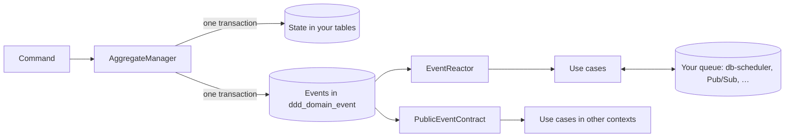

# Use-Case Reactions Implementation Plan

> **For agentic workers:** REQUIRED SUB-SKILL: Use superpowers:subagent-driven-development (recommended) or superpowers:executing-plans to implement this plan task-by-task. Steps use checkbox (`- [ ]`) syntax for tracking.

**Goal:** Replace app-built event reactions (executor + outbox + contract subscriptions) with use cases (`Reactions<T>`) that own their typed sources, triggers, handling and failure policy, run by one `EventReactor` per context on one shared queue factory, with failing mappings parked per use case instead of stalling the reader.

**Architecture:**
- **The use case.** `Reactions<T>` declares typed sources in `init` (`on(kind)`, `on(contract)`), buffers triggers through a `TriggerScope<T>`, and overrides `handle`, `ordering`, `timeout`, `onFailure` and `onCompletion`.
- **The runtime.** An internal `UseCaseRuntime<T>` per use case owns one queue (named after the use case) from a `ReactionQueues` factory. It maps events to triggers (ids `<useCase>/<eventId>/<n>`), parks failed mappings as queue items (`<useCase>/<eventId>/mapping`), re-runs parked mappings by re-reading the event by id, and runs triggers with the use case's timeout and failure policy.
- **The reactor.** `EventReactor` is one `DomainEventPoller` with one saved position. It routes each event to every use case with an `on(kind)` source for its aggregate type; `on(contract)` sources are fed by the contract's own reader.
- **Queues.** `ProcessManagerQueues`/`ProcessChannel` become `ReactionQueues`/`ReactionChannel` (queue SPI package). `kotmod-db-scheduler` gets one `DbSchedulerQueues(jdbc)` for all use cases and process managers, with blocked-reaction helpers keyed by use-case name.
- **Removal.** The old executor/outbox API is internalised or deleted last, after examples, README and tests have moved.

**Tech Stack:** Kotlin 2.4.20 (JVM toolchain 25), kotlinx.serialization 1.11.0, kotlinx.coroutines 1.11.0, db-scheduler 16.12.0, Postgres 17 via Testcontainers, JUnit 5 / kotlin.test, MockK, Gradle.

**Spec:** `docs/superpowers/specs/2026-10-06-use-case-reactions-design.md`

## Global Constraints

- New use-case API in package `io.kotmod.reaction`: `Reactions`, `TriggerScope`, `ReactionContext`, `FailureDecision`, `Retry`, `GiveUp`, `ReactionResult`, `ReactionTimeoutException`, `EventReactor`. The queue SPI stays in `io.kotmod.event.reaction`, which also gets `ReactionQueues` and `ReactionChannel`. db-scheduler classes stay in `io.kotmod.event.reaction.dbscheduler`.
- `abstract class Reactions<T : Any>(val name: String, val triggers: KSerializer<T>)`. `name` names the use case's queue.
- `on(kind: AggregateKind<*, E, *>) { event: E, metadata: EventMetadata -> … }` and `on(contract: PublicEventContract<*, P>) { event: P, metadata: EventMetadata -> … }`, called from `init`. Inside the block, `trigger(t)` and `trigger(t, notBefore = instant)`; the block's return value is ignored.
- Defaults: `open val ordering: ReactionOrdering = Unordered`, `open val timeout: Duration = 60.seconds`, `open fun onFailure(trigger, attempt, error): FailureDecision = Retry(backoff(attempt))`, `open suspend fun onCompletion(trigger, result: ReactionResult)` does nothing. `backoff(attempt)` is 1s, 2s, 4s… capped at 10 minutes.
- `ReactionContext(reactionId: String, attempt: Int)`; `attempt` starts at 0; `reactionId` is stable across retries and redeliveries.
- Reaction ids: `<useCase>/<sourceEventId>/<n>`, where `n` is the trigger's position in the block's output for that event. Parked mapping id: `<useCase>/<sourceEventId>/mapping`.
- Ordering key `<aggregateType>/<aggregateId>`. Trigger `n` is stamped `(key, event sequence, ordinal n)` and a parked mapping `(key, event sequence, 0)`, only when the use case's `ordering` is `PerAggregate`.
- A use case may not listen to the same aggregate type through two sources (a contract counts for its `aggregateTypes`; a contract without the filter counts for every type).
- `EventReactor(jdbc, queues, isLeader, name = "reactor", pollInterval = 500.milliseconds, batchSize = 100)`: one reader, one saved position (consumer name = `name`), starting at the log's head for a new reactor. `register(useCase)` before `start()`; duplicate use-case names are refused.
- `AggregateKind<C : Any, E : DomainEvent, R : Any>(type, commandSerializer, eventSerialization, rejectionSerializer)`.
- `DbSchedulerQueues(jdbc)`: one db-scheduler task per queue, named exactly after it. Process manager channels are named `<processType>-<channel>`.
- By the end, removed from the public API: `EventReactionExecutor`, `AggregateEventOutbox` (deleted), `PublicEventContract.subscribe`, `EventReaction`, `DbSchedulerEventReactions`, `DbSchedulerProcessManagerQueues` (deleted), `EventReactionExecutionResult`, `EventReactionCompletionResult`, `RetrySignal`, `BackoffStrategy`.
- Kept public and unchanged (the queue SPI): `EventReactionTriggerSink`, `EventReactionTriggerSource`, `EventReactionTriggerSerializer`, `EventReactionTrigger`, `EventReactionId`, `EventReactionExecutionId`, `RetryCount`, `Cancellable`, `DispatchOrdering`, `ReactionOutcome`.
- Version stays `0.2.0` until Task 14, which sets `0.3.0`.
- README Kotlin snippets must be byte-identical to the compiled example files (`examples/src/integrationTest/kotlin/io/kotmod/readme/*`), apart from indentation inside test functions. Uncompiled sketches are marked `<!-- not-compiled -->`.
- Every task leaves every module compiling and both `./gradlew test` and `./gradlew integrationTest` green (integration tests need Docker). No task leaves a module red.
- Commit messages follow the repo style (imperative sentence, no prefix) and end with `Co-Authored-By: Claude Opus 5.5 <noreply@anthropic.com>`. No new compiler warnings.

## Review Focus

1. **A block that calls `trigger` and then throws.** Expected: nothing it triggered is queued; the whole event is parked for that use case, so a fix produces each trigger once, with its normal id. Pinned in Task 5 (`a block that throws after triggering parks the event…`).
2. **The queue failing while the reactor publishes** (database or broker down). Expected: this is not a mapping failure. Nothing is parked, the position is not saved, and the event is re-read on the next poll. Pinned in Task 6 (`a queue that fails to publish stops the batch…`).
3. **`onFailure` or `onCompletion` throwing.** Expected: the reaction is retried after a backoff (so `handle` may run again), never lost and never crashing the worker. Pinned in Task 4.
4. **A stored trigger that no longer decodes** (a trigger class renamed between releases). Expected: the item goes back to the queue (db-scheduler's failure handler retries it), never reaching `handle`, `onFailure` or `GiveUp`. Pinned in Task 4.
5. **A shutdown cancelling a running `handle`.** Expected: the cancellation goes back to the queue, which redelivers it later. It is not a failure, so `onFailure`/`onCompletion` aren't called. Pinned in Task 4.

## Decisions made while planning

1. `Retry(delay)` and `GiveUp` are top-level types in `io.kotmod.reaction` implementing `sealed interface FailureDecision`, so they read unqualified as in the spec's example. `ReactionResult.Completed`/`ReactionResult.GaveUp(error)` are nested.
2. A timeout reaches `onFailure` as a public `ReactionTimeoutException(timeout)`.
3. If `onFailure` or `onCompletion` throws, the reaction is retried after `backoff(attempt)`, so `handle` may run again, as the old executor did.
4. The `on(...)` block is non-suspending, with receiver `TriggerScope<T>`. Its triggers are buffered and published only if the whole block, and serializing every trigger, succeeds; otherwise the event is parked.
5. Source rules are checked when `on(...)` is called, so constructing a bad use case throws `IllegalArgumentException`. Calling `on(...)` after registration throws `IllegalStateException`.
6. A parked mapping is the queue item `<useCase>/<eventId>/mapping`, stamped `(key, sequence, 0)`. It is visible as that db-scheduler row, whose retry count grows. There is no new operator helper.
7. A parked mapping finds its source by the event's aggregate type. If the fixed code no longer has one, it finishes with a warning and no triggers. If the event is missing from the log, it fails and keeps retrying.
8. A contract's own conversion failing (its `serialization` or `internalToPublic`) still stops that contract's reader, as today: it is the publishing context's bug, the same for every listener. Only a use case's own `on(contract)` block failures are parked.
9. `EventReactor.start()` reads (and so fixes) a new reactor's starting position before returning, so events committed after `start()` are always seen. This makes the quickstart reorder its steps: step 4 is "React to events" (reactor started) and step 5 is "Run commands".
10. `ReactionQueues`/`ReactionChannel` move to `io.kotmod.event.reaction`. `ReactionOrdering`/`OnGiveUp` stay in `io.kotmod.event.reaction`.
11. Process manager channels are named `<processType>-<channel>` (e.g. `DispatchDeadline-inputs`, `DispatchDeadline-contract-orders`), so one `DbSchedulerQueues` serves process managers and use cases.
12. `DbSchedulerQueues(jdbc, unsubscribedRetryDelay = 5.seconds, orderedRecheckDelay = 2.seconds, tableName = "scheduled_tasks")`. Its helpers take the use case's name: `blockedReactions(client, useCase: String)`, `retryBlocked(client, useCase, id)`, `skipBlocked(client, useCase, id)`. An unknown name is an `IllegalArgumentException`.
13. `AggregateManager`'s `kind` parameter becomes `AggregateKind<C, E, R>` (matching its event type). Its `backend` parameter is unchanged.
14. `AggregateEventOutbox` is deleted; its poller tests are retargeted to `DomainEventPoller`. The other removed types become `internal`, because process managers and `DbSchedulerQueues` still use them.
15. A use case's `on(contract)` must be registered before that contract starts (the contract refuses later listeners).
16. Test helper `ManualQueues` gains per-reaction retry counts and opt-in ordering enforcement, so unit tests can exercise `attempt` and per-aggregate waiting.

---

## File Structure

- **Modify** `kotmod/src/main/kotlin/io/kotmod/AggregateKind.kt`: `E` and `eventSerialization`.
- **Modify** `kotmod/src/main/kotlin/io/kotmod/AggregateManager.kt`, `process/ProcessInstances.kt`, `process/ProcessManager.kt`, `process/ProcessRuntime.kt`: new kind type, `ReactionQueues`, channel names.
- **Create** `kotmod/src/main/kotlin/io/kotmod/event/reaction/ReactionQueues.kt`: `ReactionQueues`, `ReactionChannel`.
- **Create** `kotmod/src/main/kotlin/io/kotmod/reaction/Reactions.kt`: `Reactions`, `TriggerScope`, `ProducedTrigger`.
- **Create** `kotmod/src/main/kotlin/io/kotmod/reaction/ReactionTypes.kt`: `ReactionContext`, `FailureDecision`, `Retry`, `GiveUp`, `ReactionResult`, `ReactionTimeoutException`.
- **Create** `kotmod/src/main/kotlin/io/kotmod/reaction/ReactionSource.kt`: internal `ReactionSource`, `KindSource`, `ContractSource`.
- **Create** `kotmod/src/main/kotlin/io/kotmod/reaction/UseCaseRuntime.kt`: internal queue items and per-use-case runtime.
- **Create** `kotmod/src/main/kotlin/io/kotmod/reaction/EventReactor.kt`.
- **Modify** `kotmod/src/main/kotlin/io/kotmod/contract/PublicEventContract.kt`: internal `aggregateTypes`, `toPublic`, `listen`; `subscribe` internal (Task 13).
- **Modify** `kotmod/src/main/kotlin/io/kotmod/postgres/PostgresDomainBackend.kt`: internal `readEvent`.
- **Create** `kotmod-db-scheduler/src/main/kotlin/io/kotmod/event/reaction/dbscheduler/DbSchedulerQueues.kt`; **delete** `DbSchedulerProcessManagerQueues.kt`; `DbSchedulerEventReactions` becomes internal (Task 13).
- **Delete** `kotmod/src/main/kotlin/io/kotmod/outbox/AggregateEventOutbox.kt` (Task 13); `EventReaction.kt` types internalised.
- **Tests:** `kotmod/src/test/kotlin/io/kotmod/reaction/*` (fixtures, `ReactionsTest`, `UseCaseRuntimeTest`, `UseCaseMappingTest`, `EventReactorTest`, `ContractSourceTest`), `kotmod/src/test/kotlin/io/kotmod/process/ManualQueues*.kt`, `kotmod/src/integrationTest/kotlin/io/kotmod/reaction/EventReactorIntegrationTest.kt`, `kotmod/src/integrationTest/kotlin/io/kotmod/postgres/ReadEventIntegrationTest.kt`, `kotmod-db-scheduler/src/{test,integrationTest}/…` (`DbSchedulerQueuesTest`, ported queue tests, `UseCaseTestSupport`, `UseCaseReactionsIntegrationTest`, `UseCaseFailuresIntegrationTest`).
- **Modify** `examples/src/integrationTest/kotlin/io/kotmod/readme/{Quickstart,QuickstartTest,ReadmeExamples}.kt`, `README.md`, `gradle.properties`.

---

### Task 1: `AggregateKind` carries its event serialization

**Files:**
- Modify: `kotmod/src/main/kotlin/io/kotmod/AggregateKind.kt`
- Modify: `kotmod/src/main/kotlin/io/kotmod/AggregateManager.kt:35`
- Modify: `kotmod/src/main/kotlin/io/kotmod/process/ProcessInstances.kt:134-150`, `kotmod/src/main/kotlin/io/kotmod/process/ProcessManager.kt:117-118`
- Modify: `kotmod/src/testFixtures/kotlin/io/kotmod/support/TestAggregate.kt:150-154`
- Modify: `kotmod/src/test/kotlin/io/kotmod/process/ProcessInstancesTest.kt:31-32`
- Modify: `examples/src/integrationTest/kotlin/io/kotmod/readme/Quickstart.kt`, `QuickstartTest.kt`, `README.md` (Quickstart step 3 and the step 5 outbox snippet)
- Test: `kotmod/src/test/kotlin/io/kotmod/AggregateKindTest.kt`

**Interfaces:**
- Consumes: `DataSerializationContext<E>`, `orderEventSerialization()` (testFixtures, `io.kotmod.postgres.support`).
- Produces:
  - `open class AggregateKind<C : Any, E : DomainEvent, R : Any>(val type: AggregateType, val commandSerializer: KSerializer<C>, val eventSerialization: DataSerializationContext<E>, val rejectionSerializer: KSerializer<R>)`;
  - `RequestedCommand.kind: AggregateKind<C, *, *>`;
  - `AggregateManager(internal val kind: AggregateKind<C, E, R>, …)`;
  - `ProcessInstances(type, repository, backend, eventSerialization: DataSerializationContext<DomainEvent>, initial, inputSerializer, targetTypes)`;
  - fixtures `testOrderKind(type): AggregateKind<OrderCommand, OrderEvent, OrderRejection>` and `testOrders` (both with `orderEventSerialization()`);
  - example `object Orders : AggregateKind<OrderCommand, OrderEvent, OrderRejection>` with `Orders.eventSerialization`.

- [ ] **Step 1: Write the failing test**

Create `kotmod/src/test/kotlin/io/kotmod/AggregateKindTest.kt`:

```kotlin
package io.kotmod

import io.kotmod.support.OrderPlaced
import io.kotmod.support.testOrders
import kotlin.test.Test
import kotlin.test.assertEquals

class AggregateKindTest {
    @Test
    fun `a kind carries its event serialization`() {
        val serialized = testOrders.eventSerialization.serialize(OrderPlaced("book"))

        assertEquals(OrderPlaced("book"), testOrders.eventSerialization.deserialize(serialized))
    }
}
```

- [ ] **Step 2: Run it to verify it fails**

Run: `./gradlew :kotmod:test --tests 'io.kotmod.AggregateKindTest'`
Expected: compilation FAILS with `Unresolved reference 'eventSerialization'`.

- [ ] **Step 3: Give the kind its event type and serialization**

Replace the class and the `RequestedCommand` declaration in `AggregateKind.kt` (keep the imports, and add `import io.kotmod.DataSerializationContext` only if your IDE asks — it is in the same package):

```kotlin
/**
 * Names one kind of aggregate, such as orders, together with how its commands, events and rejections are serialized.
 * Build an [AggregateManager] from it, and let use cases react to its events with `on(kind)`. Declare one per
 * aggregate type, usually as an `object`:
 *
 * ```
 * object Orders : AggregateKind<OrderCommand, OrderEvent, OrderRejection>(
 *     type = AggregateType("Order"),
 *     commandSerializer = OrderCommand.serializer(),
 *     eventSerialization = jsonDataSerializationContext<OrderEvent> { +OrderPlaced.serializer().toEventSerializer() },
 *     rejectionSerializer = OrderRejection.serializer(),
 * )
 * ```
 *
 * @param type the aggregate type its events and commands are recorded under.
 * @param commandSerializer serializes its commands, so other parts of the app can request them as data.
 * @param eventSerialization reads and writes its events; use cases listening to the kind get them typed.
 * @param rejectionSerializer serializes its rejections, which are recorded so a repeated command id gets the
 *   same answer.
 */
open class AggregateKind<C : Any, E : DomainEvent, R : Any>(
    val type: AggregateType,
    val commandSerializer: KSerializer<C>,
    val eventSerialization: DataSerializationContext<E>,
    val rejectionSerializer: KSerializer<R>,
) {
    /** Requests [command] for the aggregate [id] of this kind; a process manager runs it later, asynchronously. */
    fun command(
        id: AggregateId,
        command: C,
    ): RequestedCommand<C> = RequestedCommand(this, id, command)
}

/**
 * A command a process manager asks to be run against aggregate [targetId] of [kind]. Build it with [AggregateKind.command].
 *
 * Two requested commands are equal only if their kinds are the same instance (kinds compare by identity), so declare
 * each kind once, as an `object`, and request commands from it.
 */
data class RequestedCommand<C : Any>(
    val kind: AggregateKind<C, *, *>,
    val targetId: AggregateId,
    val command: C,
) {
    internal fun encodeCommand(): String = Json.encodeToString(kind.commandSerializer, command)
}
```

In `AggregateManager.kt`, change `internal val kind: AggregateKind<C, R>,` to `internal val kind: AggregateKind<C, E, R>,` and the KDoc line `@param kind names the aggregate type and how its commands and rejections are serialized.` to `@param kind names the aggregate type and how its commands, events and rejections are serialized.`

- [ ] **Step 4: Thread the stream serialization into process instances**

In `ProcessInstances.kt`, give `ProcessInstances` the stream serialization and pass it to its internal kind:

```kotlin
/** Persists process instances of one [type]: each instance is an aggregate whose commands are its inputs. */
internal class ProcessInstances<S : ProcessState<S, I, E>, I : Any, E : DomainEvent>(
    type: AggregateType,
    repository: Repository<S>,
    backend: DomainPersistenceBackend<DomainEvent>,
    eventSerialization: DataSerializationContext<DomainEvent>,
    initial: ProcessInitialState<S, I, E>,
    inputSerializer: KSerializer<I>,
    targetTypes: Set<AggregateType>,
) {
    private val decider = ProcessDecider<S, I, E>(inputSerializer, targetTypes)
    private val manager =
        AggregateManager(
            AggregateKind(type, inputSerializer, eventSerialization, Ignored.serializer()),
            HeldRepository(repository, decider),
            backend,
            HeldInitial(initial, decider),
        )
```

(the rest of the class is unchanged). In `ProcessManager.kt`, move `private val streamSerialization = ProcessEventSerialization(eventSerialization)` above `instances`, and pass it:

```kotlin
    private val streamSerialization = ProcessEventSerialization(eventSerialization)
    private val instances = ProcessInstances(type, repository, persistence, streamSerialization, initial, inputSerializer, targetsByType.keys)
```

In `ProcessInstancesTest.kt`, change the helper to:

```kotlin
    private fun instances(targetTypes: Set<AggregateType> = setOf(AggregateType("Order"))) =
        ProcessInstances(type, repository, backend, ProcessEventSerialization(windowEventSerialization()), NoWindow, WindowInput.serializer(), targetTypes)
```

- [ ] **Step 5: Update the test fixtures**

In `TestAggregate.kt`, add `import io.kotmod.postgres.support.orderEventSerialization` and replace the two declarations at the end:

```kotlin
fun testOrderKind(type: String = "Order"): AggregateKind<OrderCommand, OrderEvent, OrderRejection> =
    AggregateKind(AggregateType(type), TestOrderCommandSerializer, orderEventSerialization(), OrderRejection.serializer())

/** The test order kind, shared so requested commands compare equal. */
val testOrders: AggregateKind<OrderCommand, OrderEvent, OrderRejection> = testOrderKind()
```

- [ ] **Step 6: Update the quickstart and README step 3**

In `examples/.../Quickstart.kt`, add `import io.kotmod.serialization.jsonDataSerializationContext` and `import io.kotmod.serialization.toEventSerializer`, and replace `object Orders`:

```kotlin
object Orders : AggregateKind<OrderCommand, OrderEvent, OrderRejection>(
    type = AggregateType("Order"),
    commandSerializer = OrderCommand.serializer(),
    eventSerialization =
        jsonDataSerializationContext<OrderEvent> {
            +OrderPlaced.serializer().toEventSerializer()
            +OrderShipped.serializer().toEventSerializer()
            +OrderCancelled.serializer().toEventSerializer()
        },
    rejectionSerializer = OrderRejection.serializer(),
)
```

In `QuickstartTest.kt`, delete the `val serialization = jsonDataSerializationContext<OrderEvent> { … }` block and its two imports (`jsonDataSerializationContext`, `toEventSerializer`). Change the backend line to `backend = PostgresDomainPersistenceBackend(jdbc, Orders.eventSerialization),`, and in the outbox change `when (serialization.deserialize(event.serialized)) {` to `when (Orders.eventSerialization.deserialize(event.serialized)) {`.

In `README.md`, section `### 3. Wire up persistence`, replace from `First name the aggregate.` up to (not including) `The \`Repository\` is yours` with:

````markdown
First name the aggregate. An `AggregateKind` names the aggregate type and says how its commands, events and
rejections are serialized:

```kotlin
object Orders : AggregateKind<OrderCommand, OrderEvent, OrderRejection>(
    type = AggregateType("Order"),
    commandSerializer = OrderCommand.serializer(),
    eventSerialization =
        jsonDataSerializationContext<OrderEvent> {
            +OrderPlaced.serializer().toEventSerializer()
            +OrderShipped.serializer().toEventSerializer()
            +OrderCancelled.serializer().toEventSerializer()
        },
    rejectionSerializer = OrderRejection.serializer(),
)
```

Then, given a `javax.sql.DataSource` for your database (for example from HikariCP), create a `JdbcContext` —
how kotmod reaches the database and runs transactions — and an `AggregateManager` for orders from the kind. Its
backend writes events with the kind's serialization:

```kotlin
val jdbc = DataSourceJdbcContext(dataSource)

val orders =
    AggregateManager(
        kind = Orders,
        repository = OrderRepository(jdbc),
        backend = PostgresDomainPersistenceBackend(jdbc, Orders.eventSerialization),
        initial = NoOrder,
    )
```

````

In the step 5 outbox snippet in `README.md`, change `when (serialization.deserialize(event.serialized)) {` to `when (Orders.eventSerialization.deserialize(event.serialized)) {` so it matches `QuickstartTest.kt`.

- [ ] **Step 7: Run everything**

Run: `./gradlew test integrationTest`
Expected: PASS (including `AggregateKindTest`, `QuickstartTest`, `ProcessInstancesTest`, `JdbcContextContract` users and `SqlDelightJdbcContextIntegrationTest`).

- [ ] **Step 8: Commit**

```bash
git add kotmod/src/main/kotlin/io/kotmod/AggregateKind.kt kotmod/src/main/kotlin/io/kotmod/AggregateManager.kt \
  kotmod/src/main/kotlin/io/kotmod/process/ProcessInstances.kt kotmod/src/main/kotlin/io/kotmod/process/ProcessManager.kt \
  kotmod/src/testFixtures/kotlin/io/kotmod/support/TestAggregate.kt kotmod/src/test/kotlin/io/kotmod/process/ProcessInstancesTest.kt \
  kotmod/src/test/kotlin/io/kotmod/AggregateKindTest.kt examples/src/integrationTest/kotlin/io/kotmod/readme/Quickstart.kt \
  examples/src/integrationTest/kotlin/io/kotmod/readme/QuickstartTest.kt README.md
git commit -m "Give AggregateKind its event type and serialization" -m "Co-Authored-By: Claude Opus 5.5 <noreply@anthropic.com>"
```

---

### Task 2: `ReactionQueues` replaces `ProcessManagerQueues`; `ManualQueues` counts retries and can enforce ordering

**Files:**
- Create: `kotmod/src/main/kotlin/io/kotmod/event/reaction/ReactionQueues.kt`
- Modify: `kotmod/src/main/kotlin/io/kotmod/process/ProcessRuntime.kt:25-43,103-106`, `kotmod/src/main/kotlin/io/kotmod/process/ProcessManager.kt` (imports, both constructors' `queues` type, KDoc)
- Modify: `kotmod-db-scheduler/src/main/kotlin/io/kotmod/event/reaction/dbscheduler/DbSchedulerProcessManagerQueues.kt`
- Modify (rewrite): `kotmod/src/test/kotlin/io/kotmod/process/ManualQueues.kt`
- Test: `kotmod/src/test/kotlin/io/kotmod/process/ManualQueuesTest.kt`

**Interfaces:**
- Consumes: the queue SPI (`EventReactionTriggerSink`, `EventReactionTriggerSource`, `EventReactionTriggerSerializer`).
- Produces:
  - `interface ReactionQueues { fun <T : EventReactionTrigger> channel(name: String, triggerSerializer: EventReactionTriggerSerializer<T>, ordered: Boolean): ReactionChannel<T> }`;
  - `class ReactionChannel<T : EventReactionTrigger>(val sink: EventReactionTriggerSink<T>, val source: EventReactionTriggerSource<T>)`;
  - `ManualQueues(supportsOrdering: Boolean = true, enforceOrdering: Boolean = false) : ReactionQueues` with `published`, `channels`, `subscriptions`, `pending(channel)`, `retries(channel, id): Int`, `suspend deliver(channel): List<ReactionOutcome>`, `redeliver(entry)`, and `data class Published(channel, id, trigger, ordering, notBefore)`.

- [ ] **Step 1: Write the failing test**

Create `kotmod/src/test/kotlin/io/kotmod/process/ManualQueuesTest.kt`:

```kotlin
package io.kotmod.process

import io.kotmod.event.reaction.DispatchOrdering
import io.kotmod.event.reaction.EventReactionId
import io.kotmod.event.reaction.EventReactionTrigger
import io.kotmod.event.reaction.EventReactionTriggerSerializer
import io.kotmod.event.reaction.OnGiveUp
import io.kotmod.event.reaction.ReactionOutcome
import kotlinx.coroutines.runBlocking
import kotlin.test.Test
import kotlin.test.assertEquals
import kotlin.test.assertTrue
import kotlin.time.Duration
import kotlin.time.Duration.Companion.seconds

class ManualQueuesTest {
    private data class Item(
        val name: String,
        override val timeout: Duration? = null,
    ) : EventReactionTrigger

    private object ItemSerializer : EventReactionTriggerSerializer<Item> {
        override suspend fun serialize(trigger: Item) = trigger.name

        override suspend fun deserialize(serializedTrigger: String) = Item(serializedTrigger)
    }

    private fun stamp(
        key: String,
        sequence: Long,
    ) = DispatchOrdering(key, sequence, 0, OnGiveUp.ContinueWithNext)

    @Test
    fun `retries are counted per reaction and forgotten when it finishes`() =
        runBlocking {
            val queues = ManualQueues()
            val channel = queues.channel("q", ItemSerializer, ordered = false)
            val seen = mutableListOf<Int>()
            var outcome: ReactionOutcome = ReactionOutcome.Retry(1.seconds)
            channel.source.subscribe { _, _, _, retryCount, _ ->
                seen += retryCount
                outcome
            }
            channel.sink.publish(EventReactionId("r"), Item("r"), null, null)

            queues.deliver("q")
            queues.deliver("q")
            outcome = ReactionOutcome.Finished(gaveUp = false)
            queues.deliver("q")

            assertEquals(listOf(0, 1, 2), seen)
            assertEquals(0, queues.retries("q", EventReactionId("r")))
            assertTrue(queues.pending("q").isEmpty())
        }

    @Test
    fun `with ordering enforced, a reaction waits while an earlier one of its key is pending`() =
        runBlocking {
            val queues = ManualQueues(enforceOrdering = true)
            val channel = queues.channel("q", ItemSerializer, ordered = true)
            val ran = mutableListOf<String>()
            channel.source.subscribe { _, _, item, _, _ ->
                ran += item.name
                if (item.name == "a1") ReactionOutcome.Retry(1.seconds) else ReactionOutcome.Finished(gaveUp = false)
            }
            channel.sink.publish(EventReactionId("a2"), Item("a2"), stamp("Order/a", 2), null)
            channel.sink.publish(EventReactionId("a1"), Item("a1"), stamp("Order/a", 1), null)
            channel.sink.publish(EventReactionId("b1"), Item("b1"), stamp("Order/b", 1), null)

            queues.deliver("q")

            assertEquals(listOf("a1", "b1"), ran)
            assertEquals(listOf(EventReactionId("a2"), EventReactionId("a1")), queues.pending("q").map { it.id })
        }
}
```

- [ ] **Step 2: Run it to verify it fails**

Run: `./gradlew :kotmod:test --tests 'io.kotmod.process.ManualQueuesTest'`
Expected: compilation FAILS (`No parameter with name 'enforceOrdering'`, `Unresolved reference 'retries'`).

- [ ] **Step 3: Add the queue factory to the SPI**

Create `kotmod/src/main/kotlin/io/kotmod/event/reaction/ReactionQueues.kt`:

```kotlin
package io.kotmod.event.reaction

/**
 * Provides the queues kotmod runs reactions on: one per use case (named after it) and one per process manager channel.
 * Names are stable across restarts. `kotmod-db-scheduler` provides `DbSchedulerQueues`; any queue that implements an
 * [EventReactionTriggerSink] and an [EventReactionTriggerSource] works.
 */
interface ReactionQueues {
    /**
     * Returns the queue named [name], whose items are stored with [triggerSerializer]. An [ordered] queue's sink must
     * support ordering. kotmod asks for each name once.
     */
    fun <T : EventReactionTrigger> channel(
        name: String,
        triggerSerializer: EventReactionTriggerSerializer<T>,
        ordered: Boolean,
    ): ReactionChannel<T>
}

/** One queue: where reactions are published ([sink]), and where they are delivered from ([source]). */
class ReactionChannel<T : EventReactionTrigger>(
    val sink: EventReactionTriggerSink<T>,
    val source: EventReactionTriggerSource<T>,
)
```

In `ProcessRuntime.kt`, delete `interface ProcessManagerQueues` and `class ProcessChannel` (with their KDoc), add `import io.kotmod.event.reaction.ReactionChannel`, and change `processExecutor`'s first parameter to `channel: ReactionChannel<T>,`.

In `ProcessManager.kt`, add `import io.kotmod.event.reaction.ReactionQueues`, and change both constructors' `queues: ProcessManagerQueues,` to `queues: ReactionQueues,`.

In `DbSchedulerProcessManagerQueues.kt`, replace the imports `io.kotmod.process.ProcessChannel` / `io.kotmod.process.ProcessManagerQueues` with `io.kotmod.event.reaction.ReactionChannel` / `io.kotmod.event.reaction.ReactionQueues`. Change `) : ProcessManagerQueues {` to `) : ReactionQueues {`, change `): ProcessChannel<T> {` to `): ReactionChannel<T> {`, and change `return ProcessChannel(sink, channelReactions.source)` to `return ReactionChannel(sink, channelReactions.source)`.

- [ ] **Step 4: Rewrite `ManualQueues`**

Replace `kotmod/src/test/kotlin/io/kotmod/process/ManualQueues.kt` with:

```kotlin
package io.kotmod.process

import io.kotmod.event.reaction.Cancellable
import io.kotmod.event.reaction.DispatchOrdering
import io.kotmod.event.reaction.EventReactionExecutionId
import io.kotmod.event.reaction.EventReactionId
import io.kotmod.event.reaction.EventReactionTrigger
import io.kotmod.event.reaction.EventReactionTriggerSerializer
import io.kotmod.event.reaction.EventReactionTriggerSink
import io.kotmod.event.reaction.EventReactionTriggerSource
import io.kotmod.event.reaction.ReactionChannel
import io.kotmod.event.reaction.ReactionOutcome
import io.kotmod.event.reaction.ReactionQueues
import io.kotmod.event.reaction.RetryCount
import kotlin.time.Instant

/**
 * In-memory queues for tests: a publish of an id that is still pending is ignored, as real queues do. [deliver] runs
 * every pending reaction of a channel once and removes the ones that finish.
 *
 * As in a real queue, a reaction's retry count goes up by one per [ReactionOutcome.Retry], and starts again at 0 when
 * it is redelivered after finishing. Unlike a real queue: a [ReactionOutcome.Wait] or retry delay is ignored (the
 * reaction just stays pending for the next [deliver]); ordering stamps are enforced only with [enforceOrdering] (a
 * stamped reaction is then skipped while an earlier one of its key is pending in its channel); and [deliver] works on a
 * snapshot, so reactions published while it runs wait for the next call.
 */
class ManualQueues(
    private val supportsOrdering: Boolean = true,
    private val enforceOrdering: Boolean = false,
) : ReactionQueues {
    data class Published(
        val channel: String,
        val id: EventReactionId,
        val trigger: EventReactionTrigger,
        val ordering: DispatchOrdering?,
        val notBefore: Instant?,
    )

    val published = mutableListOf<Published>()
    private val pending = linkedMapOf<Pair<String, EventReactionId>, Published>()
    private val retries = mutableMapOf<Pair<String, EventReactionId>, Int>()
    private val handlers =
        mutableMapOf<String, suspend (EventReactionId, EventReactionExecutionId, EventReactionTrigger, RetryCount, Instant?) -> ReactionOutcome>()
    val channels = mutableListOf<Pair<String, Boolean>>()

    /** How many times an executor subscribed to any channel. */
    var subscriptions = 0
        private set

    override fun <T : EventReactionTrigger> channel(
        name: String,
        triggerSerializer: EventReactionTriggerSerializer<T>,
        ordered: Boolean,
    ): ReactionChannel<T> {
        channels += name to ordered
        val sink =
            object : EventReactionTriggerSink<T> {
                override val supportsOrdering = this@ManualQueues.supportsOrdering

                override suspend fun publish(
                    id: EventReactionId,
                    trigger: T,
                    ordering: DispatchOrdering?,
                    notBefore: Instant?,
                ) {
                    val entry = Published(name, id, trigger, ordering, notBefore)
                    published += entry
                    pending.putIfAbsent(name to id, entry)
                }
            }
        val source =
            object : EventReactionTriggerSource<T> {
                override fun subscribe(
                    block: suspend (EventReactionId, EventReactionExecutionId, T, RetryCount, Instant?) -> ReactionOutcome,
                ): Cancellable {
                    subscriptions++
                    handlers[name] = { id, executionId, trigger, retryCount, notBefore ->
                        @Suppress("UNCHECKED_CAST")
                        block(id, executionId, trigger as T, retryCount, notBefore)
                    }
                    return object : Cancellable {
                        override fun cancel() {
                            handlers.remove(name)
                        }
                    }
                }
            }
        return ReactionChannel(sink, source)
    }

    fun pending(channel: String): List<Published> = pending.values.filter { it.channel == channel }

    /** How many times reaction [id] of [channel] has been retried since it was published or redelivered. */
    fun retries(
        channel: String,
        id: EventReactionId,
    ): Int = retries[channel to id] ?: 0

    /**
     * Delivers every pending reaction of [channel] once, in publish order, skipping any that must wait for an earlier one
     * of its key (with [enforceOrdering]); finished ones are removed.
     */
    suspend fun deliver(channel: String): List<ReactionOutcome> =
        pending(channel).mapNotNull { entry ->
            if (enforceOrdering && waitsForEarlier(entry)) return@mapNotNull null
            val key = channel to entry.id
            val handler = checkNotNull(handlers[channel]) { "no executor subscribed to $channel" }
            val outcome = handler(entry.id, EventReactionExecutionId("x-${entry.id.value}"), entry.trigger, retries[key] ?: 0, entry.notBefore)
            when (outcome) {
                is ReactionOutcome.Finished -> {
                    pending.remove(key)
                    retries.remove(key)
                }
                is ReactionOutcome.Retry -> retries[key] = (retries[key] ?: 0) + 1
                is ReactionOutcome.Wait -> Unit
            }
            outcome
        }

    /** Puts a finished reaction back, as a queue redelivering it after a crash would. */
    fun redeliver(entry: Published) {
        pending[entry.channel to entry.id] = entry
    }

    private fun waitsForEarlier(entry: Published): Boolean {
        val stamp = entry.ordering ?: return false
        return pending.values.any { other ->
            val otherStamp = other.ordering
            other.channel == entry.channel &&
                other.id != entry.id &&
                otherStamp != null &&
                otherStamp.key == stamp.key &&
                compareValuesBy(other, entry, { it.ordering!!.sequence }, { it.ordering!!.ordinal }, { it.id.value }) < 0
        }
    }
}
```

- [ ] **Step 5: Run everything**

Run: `./gradlew test integrationTest`
Expected: PASS (`ManualQueuesTest` plus the unchanged process manager tests).

- [ ] **Step 6: Commit**

```bash
git add kotmod/src/main/kotlin/io/kotmod/event/reaction/ReactionQueues.kt kotmod/src/main/kotlin/io/kotmod/process/ProcessRuntime.kt \
  kotmod/src/main/kotlin/io/kotmod/process/ProcessManager.kt \
  kotmod-db-scheduler/src/main/kotlin/io/kotmod/event/reaction/dbscheduler/DbSchedulerProcessManagerQueues.kt \
  kotmod/src/test/kotlin/io/kotmod/process/ManualQueues.kt kotmod/src/test/kotlin/io/kotmod/process/ManualQueuesTest.kt
git commit -m "Rename the process manager queue factory to ReactionQueues" -m "Co-Authored-By: Claude Opus 5.5 <noreply@anthropic.com>"
```

---
### Task 3: The use-case API: `Reactions`, typed sources and their rules

**Files:**
- Create: `kotmod/src/main/kotlin/io/kotmod/reaction/Reactions.kt`
- Create: `kotmod/src/main/kotlin/io/kotmod/reaction/ReactionTypes.kt`
- Create: `kotmod/src/main/kotlin/io/kotmod/reaction/ReactionSource.kt`
- Modify: `kotmod/src/main/kotlin/io/kotmod/contract/PublicEventContract.kt` (`aggregateTypes` becomes `internal val`; new `internal fun toPublic`; `handleEvent` uses it)
- Create: `kotmod/src/test/kotlin/io/kotmod/reaction/UseCaseFixtures.kt`
- Test: `kotmod/src/test/kotlin/io/kotmod/reaction/ReactionsTest.kt`

**Interfaces:**
- Consumes: `AggregateKind<C, E, R>.eventSerialization` (Task 1), `PublicEventContract`, `BackoffStrategy`, `ReactionOrdering`.
- Produces (package `io.kotmod.reaction`):
  - `abstract class Reactions<T : Any>(val name: String, val triggers: KSerializer<T>)`, with:
    - `protected fun <E : DomainEvent> on(kind: AggregateKind<*, E, *>, block: TriggerScope<T>.(event: E, metadata: EventMetadata) -> Unit)` and `protected fun <P : PublicDomainEvent> on(contract: PublicEventContract<*, P>, block: TriggerScope<T>.(event: P, metadata: EventMetadata) -> Unit)`;
    - `open val ordering`, `open val timeout`, `abstract suspend fun handle(trigger: T, context: ReactionContext)`, `open fun onFailure(trigger: T, attempt: Int, error: Throwable): FailureDecision`, `open suspend fun onCompletion(trigger: T, result: ReactionResult)`, `protected fun backoff(attempt: Int): Duration`;
    - internal: `registered: Boolean` (var), `sources: List<ReactionSource<T>>`, `sourceFor(type: AggregateType): ReactionSource<T>?`, `kindSourceFor(type: AggregateType): ReactionSource<T>?`.
  - `class TriggerScope<T : Any> internal constructor()` with `fun trigger(trigger: T, notBefore: Instant? = null)`.
  - `internal data class ProducedTrigger<out T : Any>(val trigger: T, val notBefore: Instant?)`.
  - `data class ReactionContext(val reactionId: String, val attempt: Int)`; `sealed interface FailureDecision`; `data class Retry(val delay: Duration) : FailureDecision`; `data object GiveUp : FailureDecision`; `sealed interface ReactionResult { data object Completed; data class GaveUp(val error: Throwable) }`; `class ReactionTimeoutException(val timeout: Duration) : RuntimeException`.
  - Internal sources:
    - `sealed class ReactionSource<T>` with `aggregateTypes: Set<AggregateType>?`, `description: String`, `covers(type)`, `overlaps(other)`, `map(event: PersistedEvent): List<ProducedTrigger<T>>`;
    - `KindSource<T, E>(kind, block)` (description `aggregate kind <type>`);
    - `ContractSource<T, P>(contract, block)` (description `contract on <types>`, or `contract on every aggregate type`) with `mapPublic(envelope: PublicEventEnvelope<P>)`.
  - `PublicEventContract`: `internal val aggregateTypes: Set<AggregateType>?`, `internal fun toPublic(event: PersistedEvent): PublicEventEnvelope<E>?`.
  - Test fixtures (package `io.kotmod.reaction`, test source set):
    - `Notice` (`Confirm(orderId)`, `Flag(customerId)`);
    - `orderEvent(event, eventId = "e-1", orderId = "o-1", sequence = 1, offset = 1)`, `PaymentRecorded`, `PaymentDeclined`, `paymentEvent(customerId, declined = true, eventId = "p-1", sequence = 1)`, `paymentContract(backend, aggregateTypes = setOf(Payment))`;
    - `InMemoryLog` (`add`, `readEventsAfter`, `readEvent`, `events`);
    - `RecordingUseCase(name = "confirmations", ordering, timeout, kind = testOrders, mapping)` with `handled`, `completions`, `failures`, `failWith`, `decide`, `work`, `onCompleted`, `listenTo(contract, block)`.

- [ ] **Step 1: Write the test fixtures**

Create `kotmod/src/test/kotlin/io/kotmod/reaction/UseCaseFixtures.kt`:

```kotlin
package io.kotmod.reaction

import io.kotmod.AggregateKind
import io.kotmod.AggregateType
import io.kotmod.DataSerializationContext
import io.kotmod.DomainEvent
import io.kotmod.DomainEventPollingBackend
import io.kotmod.EventId
import io.kotmod.EventLogPosition
import io.kotmod.EventMetadata
import io.kotmod.PersistedEvent
import io.kotmod.PublicDomainEvent
import io.kotmod.SerializedEvent
import io.kotmod.contract.PublicEventContract
import io.kotmod.event.reaction.ReactionOrdering
import io.kotmod.postgres.support.orderEventSerialization
import io.kotmod.support.OrderEvent
import io.kotmod.support.OrderPlaced
import io.kotmod.support.persistedEvent
import io.kotmod.support.testOrders
import kotlinx.serialization.Serializable
import kotlin.time.Duration
import kotlin.time.Duration.Companion.seconds

@Serializable
sealed interface Notice

@Serializable
data class Confirm(
    val orderId: String,
) : Notice

@Serializable
data class Flag(
    val customerId: String,
) : Notice

/** An order event as the event log holds it. */
internal fun orderEvent(
    event: OrderEvent,
    eventId: String = "e-1",
    orderId: String = "o-1",
    sequence: Long = 1,
    offset: Long = 1,
): PersistedEvent =
    persistedEvent(globalOffset = offset, eventId = eventId, aggregateId = orderId, sequence = sequence)
        .copy(serialized = orderEventSerialization().serialize(event))

/** Another context's internal payment event, and the public event its contract publishes for a declined payment. */
internal data class PaymentRecorded(
    val customerId: String,
    val declined: Boolean,
) : DomainEvent

internal data class PaymentDeclined(
    val customerId: String,
) : PublicDomainEvent

internal fun paymentEvent(
    customerId: String,
    declined: Boolean = true,
    eventId: String = "p-1",
    sequence: Long = 1,
): PersistedEvent =
    persistedEvent(
        globalOffset = 1,
        eventId = eventId,
        aggregateType = "Payment",
        aggregateId = customerId,
        eventType = "PaymentRecorded",
        eventPayload = "$customerId:$declined",
        sequence = sequence,
    )

/** The payments context's contract over [backend]: declined payments become [PaymentDeclined]. */
internal fun paymentContract(
    backend: DomainEventPollingBackend,
    aggregateTypes: Set<AggregateType>? = setOf(AggregateType("Payment")),
): PublicEventContract<PaymentRecorded, PaymentDeclined> {
    var position = EventLogPosition.START
    return PublicEventContract(
        backend = backend,
        serialization =
            object : DataSerializationContext<PaymentRecorded> {
                override fun serialize(event: PaymentRecorded) = SerializedEvent("PaymentRecorded", 1, "${event.customerId}:${event.declined}")

                override fun deserialize(serialized: SerializedEvent): PaymentRecorded {
                    val (customerId, declined) = serialized.payload.split(":")
                    return PaymentRecorded(customerId, declined.toBooleanStrict())
                }
            },
        internalToPublic = { if (it.declined) PaymentDeclined(it.customerId) else null },
        getPosition = { position },
        savePosition = { position = it },
        isLeader = { true },
        aggregateTypes = aggregateTypes,
    )
}

/** An event log in memory: the reactor's and contracts' polling backend, and the parked mappings' read by id. */
internal class InMemoryLog : DomainEventPollingBackend {
    val events = mutableListOf<PersistedEvent>()

    /** Appends [event] at the next position and returns it as stored. */
    fun add(event: PersistedEvent): PersistedEvent {
        val offset = events.size + 1L
        val stored = event.copy(position = EventLogPosition(offset, offset))
        events += stored
        return stored
    }

    override fun readEventsAfter(
        position: EventLogPosition,
        limit: Int,
    ): List<PersistedEvent> = events.filter { it.position > position }.take(limit)

    fun readEvent(id: EventId): PersistedEvent? = events.firstOrNull { it.metadata.eventId == id }
}

/**
 * A use case over test orders that records what happens to it. [mapping] is its `on(kind)` block (by default a
 * [Confirm] for each placed order); [failWith], [decide], [work] and [onCompleted] script `handle`, `onFailure` and
 * `onCompletion`.
 */
internal class RecordingUseCase(
    name: String = "confirmations",
    override val ordering: ReactionOrdering = ReactionOrdering.Unordered,
    override val timeout: Duration = 60.seconds,
    kind: AggregateKind<*, OrderEvent, *>? = testOrders,
    private val mapping: TriggerScope<Notice>.(OrderEvent, EventMetadata) -> Unit = { event, metadata ->
        if (event is OrderPlaced) trigger(Confirm(metadata.aggregateId.value))
    },
) : Reactions<Notice>(name, Notice.serializer()) {
    val handled = mutableListOf<Pair<Notice, ReactionContext>>()
    val completions = mutableListOf<Pair<Notice, ReactionResult>>()
    val failures = mutableListOf<Pair<Int, Throwable>>()

    /** The exception `handle` throws for a trigger and context, or `null` to succeed. */
    var failWith: (Notice, ReactionContext) -> Throwable? = { _, _ -> null }

    /** The failure policy. */
    var decide: (Notice, Int, Throwable) -> FailureDecision = { _, attempt, _ -> Retry(backoff(attempt)) }

    /** Runs inside `handle`, before [failWith]. */
    var work: suspend (Notice) -> Unit = {}

    /** Runs inside `onCompletion`, after recording. */
    var onCompleted: (ReactionResult) -> Unit = {}

    init {
        if (kind != null) on(kind) { event, metadata -> mapping(this, event, metadata) }
    }

    /** Declares a contract source from outside, as only an `init` block normally would. */
    fun <P : PublicDomainEvent> listenTo(
        contract: PublicEventContract<*, P>,
        block: TriggerScope<Notice>.(P, EventMetadata) -> Unit,
    ) = on(contract, block)

    override suspend fun handle(
        trigger: Notice,
        context: ReactionContext,
    ) {
        handled += trigger to context
        work(trigger)
        failWith(trigger, context)?.let { throw it }
    }

    override fun onFailure(
        trigger: Notice,
        attempt: Int,
        error: Throwable,
    ): FailureDecision {
        failures += attempt to error
        return decide(trigger, attempt, error)
    }

    override suspend fun onCompletion(
        trigger: Notice,
        result: ReactionResult,
    ) {
        completions += trigger to result
        onCompleted(result)
    }
}
```

- [ ] **Step 2: Write the failing tests**

Create `kotmod/src/test/kotlin/io/kotmod/reaction/ReactionsTest.kt`:

```kotlin
package io.kotmod.reaction

import io.kotmod.AggregateType
import io.kotmod.EventMetadata
import io.kotmod.event.reaction.ReactionOrdering
import io.kotmod.support.OrderEvent
import io.kotmod.support.OrderPlaced
import io.kotmod.support.testOrderKind
import io.kotmod.support.testOrders
import kotlinx.coroutines.runBlocking
import kotlin.test.Test
import kotlin.test.assertEquals
import kotlin.test.assertFailsWith
import kotlin.test.assertIs
import kotlin.test.assertNull
import kotlin.time.Duration.Companion.seconds
import kotlin.time.Instant

class ReactionsTest {
    private val payments = paymentContract(InMemoryLog())

    private class TwoKinds : Reactions<Notice>("two-kinds", Notice.serializer()) {
        init {
            on(testOrders) { _, _ -> }
            on(testOrderKind("Order")) { _, _ -> }
        }

        override suspend fun handle(
            trigger: Notice,
            context: ReactionContext,
        ) = Unit
    }

    private class Defaults : Reactions<Notice>("defaults", Notice.serializer()) {
        override suspend fun handle(
            trigger: Notice,
            context: ReactionContext,
        ) = Unit
    }

    @Test
    fun `an aggregate kind source delivers its typed events and their metadata to the block`() {
        val seen = mutableListOf<Pair<OrderEvent, EventMetadata>>()
        val useCase =
            RecordingUseCase(mapping = { event, metadata ->
                seen += event to metadata
                trigger(Confirm(metadata.aggregateId.value))
            })
        val event = orderEvent(OrderPlaced("book"), eventId = "e-7", orderId = "o-7")

        val produced = checkNotNull(useCase.sourceFor(AggregateType("Order"))).map(event)

        assertEquals(listOf<Pair<OrderEvent, EventMetadata>>(OrderPlaced("book") to event.metadata), seen)
        assertEquals(listOf(ProducedTrigger<Notice>(Confirm("o-7"), null)), produced)
    }

    @Test
    fun `a trigger can be delayed with notBefore`() {
        val at = Instant.parse("2026-10-13T10:00:00Z")
        val useCase = RecordingUseCase(mapping = { _, metadata -> trigger(Confirm(metadata.aggregateId.value), notBefore = at) })

        val produced = checkNotNull(useCase.sourceFor(AggregateType("Order"))).map(orderEvent(OrderPlaced("book")))

        assertEquals(listOf(ProducedTrigger<Notice>(Confirm("o-1"), at)), produced)
    }

    @Test
    fun `a block that throws produces nothing, even after triggering`() {
        val useCase =
            RecordingUseCase(mapping = { _, metadata ->
                trigger(Confirm(metadata.aggregateId.value))
                error("broken mapping")
            })

        assertFailsWith<IllegalStateException> {
            checkNotNull(useCase.sourceFor(AggregateType("Order"))).map(orderEvent(OrderPlaced("book")))
        }
    }

    @Test
    fun `a contract source delivers typed public events, and nothing for events the contract keeps private`() {
        val useCase = RecordingUseCase(kind = null)
        useCase.listenTo(payments) { event, metadata -> trigger(Flag("${event.customerId}@${metadata.aggregateId.value}")) }
        val source = checkNotNull(useCase.sourceFor(AggregateType("Payment")))

        assertEquals(listOf(ProducedTrigger<Notice>(Flag("c-1@c-1"), null)), source.map(paymentEvent("c-1", declined = true)))
        assertEquals(emptyList(), source.map(paymentEvent("c-2", declined = false)))
    }

    @Test
    fun `local routing only uses aggregate kind sources`() {
        val useCase = RecordingUseCase()
        useCase.listenTo(payments) { _, _ -> }

        assertIs<KindSource<*, *>>(useCase.kindSourceFor(AggregateType("Order")))
        assertNull(useCase.kindSourceFor(AggregateType("Payment")))
        assertIs<ContractSource<*, *>>(useCase.sourceFor(AggregateType("Payment")))
    }

    @Test
    fun `the same aggregate type through two aggregate kinds is refused`() {
        val error = assertFailsWith<IllegalArgumentException> { TwoKinds() }

        assertEquals(
            "Use case two-kinds listens to the same aggregate type through aggregate kind Order and aggregate kind Order; " +
                "an aggregate type can reach a use case through only one source",
            error.message,
        )
    }

    @Test
    fun `a contract over an aggregate type a kind already covers is refused`() {
        val useCase = RecordingUseCase()
        val orderContract = paymentContract(InMemoryLog(), aggregateTypes = setOf(AggregateType("Order")))

        assertFailsWith<IllegalArgumentException> { useCase.listenTo(orderContract) { _, _ -> } }
    }

    @Test
    fun `a contract without an aggregate type filter covers every type, so it can't be combined with another source`() {
        val useCase = RecordingUseCase()

        assertFailsWith<IllegalArgumentException> { useCase.listenTo(paymentContract(InMemoryLog(), aggregateTypes = null)) { _, _ -> } }
    }

    @Test
    fun `a source declared after registration is refused`() {
        val useCase = RecordingUseCase()
        useCase.registered = true

        assertFailsWith<IllegalStateException> { useCase.listenTo(payments) { _, _ -> } }
    }

    @Test
    fun `a blank name is refused`() {
        assertFailsWith<IllegalArgumentException> { RecordingUseCase(name = " ") }
    }

    @Test
    fun `defaults are unordered, a 60 second timeout, capped exponential retries that never give up, and a no-op completion`() =
        runBlocking {
            val useCase = Defaults()

            assertEquals(ReactionOrdering.Unordered, useCase.ordering)
            assertEquals(60.seconds, useCase.timeout)
            assertEquals(Retry(1.seconds), useCase.onFailure(Confirm("o-1"), 0, RuntimeException()))
            assertEquals(Retry(8.seconds), useCase.onFailure(Confirm("o-1"), 3, RuntimeException()))
            assertEquals(Retry(600.seconds), useCase.onFailure(Confirm("o-1"), 40, RuntimeException()))
            useCase.onCompletion(Confirm("o-1"), ReactionResult.Completed)
        }
}
```

- [ ] **Step 3: Run them to verify they fail**

Run: `./gradlew :kotmod:test --tests 'io.kotmod.reaction.ReactionsTest'`
Expected: compilation FAILS (`Unresolved reference 'Reactions'`, `'TriggerScope'`, …).

- [ ] **Step 4: Add the reaction types**

Create `kotmod/src/main/kotlin/io/kotmod/reaction/ReactionTypes.kt`:

```kotlin
package io.kotmod.reaction

import kotlin.time.Duration

/**
 * What [Reactions.handle] knows about the reaction it runs. [reactionId] is deterministic and the same on every retry and
 * redelivery, so pass it as the idempotency key of external calls; [attempt] counts retries, starting at 0.
 */
data class ReactionContext(
    val reactionId: String,
    val attempt: Int,
)

/** What [Reactions.onFailure] decides after a failed attempt: [Retry] or [GiveUp]. */
sealed interface FailureDecision

/** Run the reaction again after [delay]. */
data class Retry(
    val delay: Duration,
) : FailureDecision

/** Stop retrying; [Reactions.onCompletion] is told with [ReactionResult.GaveUp]. */
data object GiveUp : FailureDecision

/** How a reaction finally ended, passed to [Reactions.onCompletion]. */
sealed interface ReactionResult {
    /** [Reactions.handle] returned normally. */
    data object Completed : ReactionResult

    /** [Reactions.onFailure] gave up after [error]. */
    data class GaveUp(
        val error: Throwable,
    ) : ReactionResult
}

/** The failure passed to [Reactions.onFailure] when [Reactions.handle] runs longer than the use case's [timeout]. */
class ReactionTimeoutException(
    val timeout: Duration,
) : RuntimeException("The reaction did not finish within $timeout")
```

- [ ] **Step 5: Add the use case base class and trigger scope**

Create `kotmod/src/main/kotlin/io/kotmod/reaction/Reactions.kt`:

```kotlin
package io.kotmod.reaction

import io.kotmod.AggregateKind
import io.kotmod.AggregateType
import io.kotmod.DomainEvent
import io.kotmod.EventMetadata
import io.kotmod.PublicDomainEvent
import io.kotmod.contract.PublicEventContract
import io.kotmod.event.reaction.BackoffStrategy
import io.kotmod.event.reaction.ReactionOrdering
import kotlinx.serialization.KSerializer
import kotlin.time.Duration
import kotlin.time.Duration.Companion.seconds
import kotlin.time.Instant

/**
 * A use case: follow-up work in your application, reacting to events. It owns the whole reaction — which events it
 * reacts to, the triggers they produce, and how each trigger is handled — and runs on an [EventReactor].
 *
 * Declare its sources in `init`: `on(kind) { event, metadata -> … }` for one of this context's aggregate kinds and
 * `on(contract) { event, metadata -> … }` for another context's public events. Inside the block, `trigger(t)` queues a
 * trigger (`trigger(t, notBefore = instant)` delays it). Keep the block deterministic: the same event must produce the
 * same triggers in the same order, because kotmod numbers them to recognise a re-read event. An aggregate type can
 * reach a use case through only one source.
 *
 * [handle] does the work: returning means done; throwing, or running longer than [timeout], is a failure that
 * [onFailure] decides on. [onCompletion] is told how the work ended. Delivery is at least once, so [handle] must be
 * idempotent; [ReactionContext.reactionId] is a stable idempotency key.
 *
 * @param T the trigger type: plain `@Serializable` data.
 * @param name names the use case's queue, so keep it stable across releases. Unique within a reactor.
 * @param triggers serializes the triggers while they wait in the queue.
 */
abstract class Reactions<T : Any>(
    val name: String,
    val triggers: KSerializer<T>,
) {
    init {
        require(name.isNotBlank()) { "A use case's name must not be blank" }
    }

    private val declared = mutableListOf<ReactionSource<T>>()

    /** Set when the use case is registered with a reactor; its sources can't change after that. */
    @Volatile
    internal var registered: Boolean = false

    internal val sources: List<ReactionSource<T>> get() = declared

    /** Whether an aggregate's work runs one at a time in event order ([ReactionOrdering.PerAggregate]); unordered by default. */
    open val ordering: ReactionOrdering = ReactionOrdering.Unordered

    /** How long one attempt at [handle] may run; longer is a failure. */
    open val timeout: Duration = 60.seconds

    /** Reacts to [kind]'s events, typed with its event serialization. Call it from `init`. */
    protected fun <E : DomainEvent> on(
        kind: AggregateKind<*, E, *>,
        block: TriggerScope<T>.(event: E, metadata: EventMetadata) -> Unit,
    ) {
        declare(KindSource(kind, block))
    }

    /** Reacts to another context's public events, published by [contract]. Call it from `init`. */
    protected fun <P : PublicDomainEvent> on(
        contract: PublicEventContract<*, P>,
        block: TriggerScope<T>.(event: P, metadata: EventMetadata) -> Unit,
    ) {
        declare(ContractSource(contract, block))
    }

    /** Does the work for [trigger]. Returning normally means done; throwing is a failure. */
    abstract suspend fun handle(
        trigger: T,
        context: ReactionContext,
    )

    /** Decides what happens after attempt [attempt] failed with [error]: by default, retry with [backoff], forever. */
    open fun onFailure(
        trigger: T,
        attempt: Int,
        error: Throwable,
    ): FailureDecision = Retry(backoff(attempt))

    /** Told how the work for [trigger] ended. Does nothing by default. */
    open suspend fun onCompletion(
        trigger: T,
        result: ReactionResult,
    ) {}

    /** Capped exponential backoff for retry [attempt]: 1s, 2s, 4s… up to 10 minutes. */
    protected fun backoff(attempt: Int): Duration = BackoffStrategy().calculateBackoff(attempt)

    /** The source that delivers events of [type], if any. */
    internal fun sourceFor(type: AggregateType): ReactionSource<T>? = declared.firstOrNull { it.covers(type) }

    /** The aggregate kind source that delivers events of [type], if any: the reactor's own reader feeds only these. */
    internal fun kindSourceFor(type: AggregateType): ReactionSource<T>? = declared.firstOrNull { it is KindSource<*, *> && it.covers(type) }

    private fun declare(source: ReactionSource<T>) {
        check(!registered) { "Use case $name is already registered with a reactor: declare its sources in its init block" }
        val clash = declared.firstOrNull { it.overlaps(source) }
        require(clash == null) {
            "Use case $name listens to the same aggregate type through ${clash?.description} and ${source.description}; " +
                "an aggregate type can reach a use case through only one source"
        }
        declared += source
    }
}

/** The receiver of a use case's `on(...)` block: [trigger] queues work for the event being read. */
class TriggerScope<T : Any> internal constructor() {
    internal val produced = mutableListOf<ProducedTrigger<T>>()

    /** Queues [trigger] for this event; with [notBefore] it doesn't run before that time (not allowed when ordered). */
    fun trigger(
        trigger: T,
        notBefore: Instant? = null,
    ) {
        produced += ProducedTrigger(trigger, notBefore)
    }
}

/** A trigger a use case's block produced, before it is queued. */
internal data class ProducedTrigger<out T : Any>(
    val trigger: T,
    val notBefore: Instant?,
)
```

- [ ] **Step 6: Add the sources, and let a contract convert one event**

Create `kotmod/src/main/kotlin/io/kotmod/reaction/ReactionSource.kt`:

```kotlin
package io.kotmod.reaction

import io.kotmod.AggregateKind
import io.kotmod.AggregateType
import io.kotmod.DomainEvent
import io.kotmod.EventMetadata
import io.kotmod.PersistedEvent
import io.kotmod.PublicDomainEvent
import io.kotmod.PublicEventEnvelope
import io.kotmod.contract.PublicEventContract

/** Where a use case's events come from: one of this context's aggregate kinds, or another context's contract. */
internal sealed class ReactionSource<T : Any> {
    /** The aggregate types whose events this source delivers; `null` means every type. */
    abstract val aggregateTypes: Set<AggregateType>?

    /** Names the source in logs and error messages. */
    abstract val description: String

    fun covers(type: AggregateType): Boolean = aggregateTypes?.contains(type) ?: true

    fun overlaps(other: ReactionSource<T>): Boolean {
        val mine = aggregateTypes ?: return true
        val theirs = other.aggregateTypes ?: return true
        return mine.any { it in theirs }
    }

    /** Reads [event] as this source delivers it and runs the use case's block for it; throws if either fails. */
    abstract fun map(event: PersistedEvent): List<ProducedTrigger<T>>
}

/** One of this context's aggregate kinds: its events are deserialized with the kind's event serialization. */
internal class KindSource<T : Any, E : DomainEvent>(
    private val kind: AggregateKind<*, E, *>,
    private val block: TriggerScope<T>.(E, EventMetadata) -> Unit,
) : ReactionSource<T>() {
    override val aggregateTypes: Set<AggregateType> = setOf(kind.type)
    override val description: String = "aggregate kind ${kind.type.value}"

    override fun map(event: PersistedEvent): List<ProducedTrigger<T>> {
        val typed = kind.eventSerialization.deserialize(event.serialized)
        val scope = TriggerScope<T>()
        scope.block(typed, event.metadata)
        return scope.produced
    }
}

/** Another context's contract: its public events, each with the metadata of the event it came from. */
internal class ContractSource<T : Any, P : PublicDomainEvent>(
    private val contract: PublicEventContract<*, P>,
    private val block: TriggerScope<T>.(P, EventMetadata) -> Unit,
) : ReactionSource<T>() {
    override val aggregateTypes: Set<AggregateType>? = contract.aggregateTypes
    override val description: String = "contract on ${aggregateTypes?.joinToString { it.value } ?: "every aggregate type"}"

    override fun map(event: PersistedEvent): List<ProducedTrigger<T>> = contract.toPublic(event)?.let(::mapPublic) ?: emptyList()

    fun mapPublic(envelope: PublicEventEnvelope<P>): List<ProducedTrigger<T>> {
        val scope = TriggerScope<T>()
        scope.block(envelope.event, envelope.metadata)
        return scope.produced
    }
}
```

In `PublicEventContract.kt`, change the constructor parameter `private val aggregateTypes: Set<AggregateType>? = null,` to `internal val aggregateTypes: Set<AggregateType>? = null,`. Then replace `handleEvent` with these two functions:

```kotlin
    /**
     * Converts [event] to the public event this contract publishes for it, or `null` if it publishes none (kotmod's
     * internal events, aggregate types outside [aggregateTypes], and events [internalToPublic] keeps private). Throws if
     * [serialization] or [internalToPublic] does.
     */
    internal fun toPublic(event: PersistedEvent): PublicEventEnvelope<E>? {
        // A process manager's internal envelopes are only for that process manager; no app serialization can read them.
        if (ProcessEventSerialization.isEnvelope(event.serialized.type)) return null
        if (aggregateTypes != null && event.metadata.aggregateType !in aggregateTypes) return null
        val internal: I = serialization.deserialize(event.serialized)
        val public: E = internalToPublic(internal) ?: return null
        return PublicEventEnvelope(event.metadata, public)
    }

    private suspend fun handleEvent(envelope: PersistedEvent) {
        val publicEnvelope = toPublic(envelope) ?: return
        // One ordinal counter across all subscriptions: ordered subscriptions sharing an executor share ordering
        // for an aggregate, so anything dispatched later for this event must sort later.
        var ordinal = 0
        for (subscription in subscriptions) {
            ordinal = subscription.fanOut(publicEnvelope, envelope.position, ordinal, log)
        }
    }
```

- [ ] **Step 7: Run the tests**

Run: `./gradlew :kotmod:test`
Expected: PASS (`ReactionsTest` and the existing `PublicEventContractTest`, which pins the refactored `handleEvent`).

- [ ] **Step 8: Commit**

```bash
git add kotmod/src/main/kotlin/io/kotmod/reaction kotmod/src/main/kotlin/io/kotmod/contract/PublicEventContract.kt \
  kotmod/src/test/kotlin/io/kotmod/reaction/UseCaseFixtures.kt kotmod/src/test/kotlin/io/kotmod/reaction/ReactionsTest.kt
git commit -m "Add use cases with typed aggregate and contract sources" -m "Co-Authored-By: Claude Opus 5.5 <noreply@anthropic.com>"
```

---

### Task 4: The use-case runtime handles triggers

**Files:**
- Create: `kotmod/src/main/kotlin/io/kotmod/reaction/UseCaseRuntime.kt`
- Modify: `kotmod/src/test/kotlin/io/kotmod/reaction/UseCaseFixtures.kt` (add `notice()`)
- Test: `kotmod/src/test/kotlin/io/kotmod/reaction/UseCaseRuntimeTest.kt`

**Interfaces:**
- Consumes: `Reactions<T>` and the reaction types (Task 3); `ReactionQueues`, `ManualQueues` (Task 2); `JsonTriggerSerializer` (`io.kotmod.process`, internal); `BackoffStrategy`.
- Produces:
  - `@Serializable internal sealed interface UseCaseItem : EventReactionTrigger`;
  - `@SerialName("trigger") internal data class TriggerItem(val trigger: String)`, where `trigger` is the JSON written with the use case's `triggers` serializer;
  - `internal class UseCaseRuntime<T : Any>(val useCase: Reactions<T>, queues: ReactionQueues, clock: () -> Instant = { Clock.System.now() })` with:
    - `start()`, `stop()`;
    - `suspend fun publish(id: EventReactionId, trigger: T, ordering: DispatchOrdering?, notBefore: Instant?)`;
    - one queue named `useCase.name`, ordered iff `useCase.ordering is PerAggregate`.
  - Test helper `internal fun ManualQueues.Published.notice(): Notice`.

- [ ] **Step 1: Write the failing tests**

Append to `kotmod/src/test/kotlin/io/kotmod/reaction/UseCaseFixtures.kt` (adding the imports `io.kotmod.process.ManualQueues` and `kotlinx.serialization.json.Json`):

```kotlin
/** The trigger a queued item carries, read back as a [Notice]. */
internal fun ManualQueues.Published.notice(): Notice = Json.decodeFromString(Notice.serializer(), (trigger as TriggerItem).trigger)
```

Create `kotmod/src/test/kotlin/io/kotmod/reaction/UseCaseRuntimeTest.kt`:

```kotlin
package io.kotmod.reaction

import io.kotmod.event.reaction.DispatchOrdering
import io.kotmod.event.reaction.EventReactionId
import io.kotmod.event.reaction.OnGiveUp
import io.kotmod.event.reaction.ReactionOrdering
import io.kotmod.event.reaction.ReactionOutcome
import io.kotmod.process.ManualQueues
import kotlinx.coroutines.CancellationException
import kotlinx.coroutines.delay
import kotlinx.coroutines.runBlocking
import kotlinx.serialization.SerializationException
import kotlin.test.Test
import kotlin.test.assertEquals
import kotlin.test.assertFailsWith
import kotlin.test.assertIs
import kotlin.test.assertTrue
import kotlin.time.Duration.Companion.hours
import kotlin.time.Duration.Companion.milliseconds
import kotlin.time.Duration.Companion.seconds
import kotlin.time.Instant

class UseCaseRuntimeTest {
    private var now = Instant.parse("2026-10-06T10:00:00Z")
    private val queues = ManualQueues(enforceOrdering = true)

    private fun runtime(useCase: Reactions<Notice>) = UseCaseRuntime(useCase, queues, clock = { now }).also { it.start() }

    private suspend fun UseCaseRuntime<Notice>.send(
        id: String,
        notice: Notice,
        key: String? = null,
        sequence: Long = 1,
        notBefore: Instant? = null,
    ) = publish(EventReactionId(id), notice, key?.let { DispatchOrdering(it, sequence, 0, OnGiveUp.ContinueWithNext) }, notBefore)

    @Test
    fun `the queue is named after the use case and ordered with it`() {
        runtime(RecordingUseCase(name = "a"))
        runtime(RecordingUseCase(name = "b", ordering = ReactionOrdering.PerAggregate()))

        assertEquals(listOf("a" to false, "b" to true), queues.channels)
    }

    @Test
    fun `an ordered use case needs a queue that supports ordering`() {
        assertFailsWith<IllegalArgumentException> {
            UseCaseRuntime(RecordingUseCase(ordering = ReactionOrdering.PerAggregate()), ManualQueues(supportsOrdering = false), clock = { now })
        }
    }

    @Test
    fun `a handled trigger finishes and onCompletion sees Completed`() =
        runBlocking {
            val useCase = RecordingUseCase()
            runtime(useCase).send("r-1", Confirm("o-1"))

            assertEquals(listOf<ReactionOutcome>(ReactionOutcome.Finished(gaveUp = false)), queues.deliver("confirmations"))
            assertEquals(listOf<Pair<Notice, ReactionContext>>(Confirm("o-1") to ReactionContext("r-1", 0)), useCase.handled)
            assertEquals(listOf<Pair<Notice, ReactionResult>>(Confirm("o-1") to ReactionResult.Completed), useCase.completions)
        }

    @Test
    fun `a failure is retried with capped backoff by default, and attempt counts the retries`() =
        runBlocking {
            val useCase = RecordingUseCase().apply { failWith = { _, context -> if (context.attempt < 2) RuntimeException("down") else null } }
            runtime(useCase).send("r-1", Confirm("o-1"))

            val outcomes = (1..3).flatMap { queues.deliver("confirmations") }

            assertEquals(
                listOf<ReactionOutcome>(ReactionOutcome.Retry(1.seconds), ReactionOutcome.Retry(2.seconds), ReactionOutcome.Finished(gaveUp = false)),
                outcomes,
            )
            assertEquals(listOf(0, 1, 2), useCase.handled.map { it.second.attempt })
            assertEquals(listOf(0, 1), useCase.failures.map { it.first })
        }

    @Test
    fun `the reaction id is stable across retries and redeliveries`() =
        runBlocking {
            val useCase = RecordingUseCase().apply { failWith = { _, context -> if (context.attempt == 0) RuntimeException("flaky") else null } }
            runtime(useCase).send("confirmations/e-1/0", Confirm("o-1"))

            queues.deliver("confirmations")
            queues.deliver("confirmations")
            queues.redeliver(queues.published.single())
            queues.deliver("confirmations")

            assertEquals(3, useCase.handled.size)
            assertEquals(listOf("confirmations/e-1/0"), useCase.handled.map { it.second.reactionId }.distinct())
        }

    @Test
    fun `onFailure returning GiveUp finishes the reaction as given up, and onCompletion sees the error`() =
        runBlocking {
            val boom = RuntimeException("card declined")
            val useCase =
                RecordingUseCase().apply {
                    failWith = { _, _ -> boom }
                    decide = { _, attempt, _ -> if (attempt < 1) Retry(1.seconds) else GiveUp }
                }
            runtime(useCase).send("r-1", Confirm("o-1"))

            val outcomes = queues.deliver("confirmations") + queues.deliver("confirmations")

            assertEquals(listOf<ReactionOutcome>(ReactionOutcome.Retry(1.seconds), ReactionOutcome.Finished(gaveUp = true)), outcomes)
            assertEquals(listOf<Pair<Notice, ReactionResult>>(Confirm("o-1") to ReactionResult.GaveUp(boom)), useCase.completions)
            assertTrue(queues.pending("confirmations").isEmpty())
        }

    @Test
    fun `running past the timeout is a failure passed to onFailure as ReactionTimeoutException`() =
        runBlocking {
            val useCase =
                RecordingUseCase(timeout = 50.milliseconds).apply {
                    work = { delay(5.seconds) }
                    decide = { _, _, _ -> GiveUp }
                }
            runtime(useCase).send("r-1", Confirm("o-1"))

            assertEquals(listOf<ReactionOutcome>(ReactionOutcome.Finished(gaveUp = true)), queues.deliver("confirmations"))
            assertEquals(50.milliseconds, assertIs<ReactionTimeoutException>(useCase.failures.single().second).timeout)
            assertIs<ReactionResult.GaveUp>(useCase.completions.single().second)
        }

    @Test
    fun `a failing reaction doesn't hold back another`() =
        runBlocking {
            val useCase = RecordingUseCase().apply { failWith = { notice, _ -> if (notice == Confirm("o-1")) RuntimeException("down") else null } }
            val runtime = runtime(useCase)
            runtime.send("r-1", Confirm("o-1"))
            runtime.send("r-2", Confirm("o-2"))

            assertEquals(
                listOf<ReactionOutcome>(ReactionOutcome.Retry(1.seconds), ReactionOutcome.Finished(gaveUp = false)),
                queues.deliver("confirmations"),
            )
        }

    @Test
    fun `with ordering, a failing reaction holds back only its own aggregate's later reactions, in its own use case`() =
        runBlocking {
            val ordered =
                RecordingUseCase(name = "ordered", ordering = ReactionOrdering.PerAggregate()).apply {
                    failWith = { notice, _ -> if (notice == Confirm("a1")) RuntimeException("down") else null }
                }
            val other = RecordingUseCase(name = "other", ordering = ReactionOrdering.PerAggregate())
            val orderedRuntime = runtime(ordered)
            val otherRuntime = runtime(other)
            orderedRuntime.send("a1", Confirm("a1"), key = "Order/a", sequence = 1)
            orderedRuntime.send("a2", Confirm("a2"), key = "Order/a", sequence = 2)
            orderedRuntime.send("b1", Confirm("b1"), key = "Order/b", sequence = 1)
            otherRuntime.send("a1", Confirm("a1"), key = "Order/a", sequence = 1)

            queues.deliver("ordered")
            queues.deliver("ordered")
            queues.deliver("other")

            assertEquals(listOf<Notice>(Confirm("a1"), Confirm("b1"), Confirm("a1")), ordered.handled.map { it.first })
            assertEquals(listOf<Notice>(Confirm("a1")), other.handled.map { it.first })
        }

    @Test
    fun `a trigger delivered before notBefore waits without running, then runs once due`() =
        runBlocking {
            val useCase = RecordingUseCase()
            runtime(useCase).send("r-1", Confirm("o-1"), notBefore = now + 1.hours)

            assertEquals(listOf<ReactionOutcome>(ReactionOutcome.Wait(1.hours)), queues.deliver("confirmations"))
            assertTrue(useCase.handled.isEmpty())
            now += 1.hours
            assertEquals(listOf<ReactionOutcome>(ReactionOutcome.Finished(gaveUp = false)), queues.deliver("confirmations"))
            assertEquals(0, useCase.handled.single().second.attempt)
        }

    @Test
    fun `onFailure throwing retries the reaction after a backoff`() =
        runBlocking {
            val useCase =
                RecordingUseCase().apply {
                    failWith = { _, _ -> RuntimeException("down") }
                    decide = { _, _, _ -> error("broken policy") }
                }
            runtime(useCase).send("r-1", Confirm("o-1"))

            assertEquals(listOf<ReactionOutcome>(ReactionOutcome.Retry(1.seconds)), queues.deliver("confirmations"))
            assertEquals(1, queues.pending("confirmations").size)
        }

    @Test
    fun `onCompletion throwing retries the reaction after a backoff`() =
        runBlocking {
            val useCase = RecordingUseCase().apply { onCompleted = { error("audit log down") } }
            runtime(useCase).send("r-1", Confirm("o-1"))

            assertEquals(listOf<ReactionOutcome>(ReactionOutcome.Retry(1.seconds)), queues.deliver("confirmations"))
            assertEquals(1, queues.pending("confirmations").size)
        }

    @Test
    fun `a stored trigger that can't be decoded goes back to the queue and never reaches handle or onFailure`() =
        runBlocking {
            val useCase = RecordingUseCase()
            runtime(useCase)
            queues.redeliver(
                ManualQueues.Published("confirmations", EventReactionId("r-1"), TriggerItem("""{"type":"io.kotmod.reaction.Renamed"}"""), null, null),
            )

            assertFailsWith<SerializationException> { queues.deliver("confirmations") }
            assertTrue(useCase.handled.isEmpty())
            assertTrue(useCase.failures.isEmpty())
        }

    @Test
    fun `a reaction cancelled by a shutdown goes back to the queue and is not reported as a failure`() =
        runBlocking {
            val useCase = RecordingUseCase().apply { work = { throw CancellationException("scheduler stopping") } }
            runtime(useCase).send("r-1", Confirm("o-1"))

            assertFailsWith<CancellationException> { queues.deliver("confirmations") }
            assertTrue(useCase.failures.isEmpty())
            assertTrue(useCase.completions.isEmpty())
        }
}
```

- [ ] **Step 2: Run them to verify they fail**

Run: `./gradlew :kotmod:test --tests 'io.kotmod.reaction.UseCaseRuntimeTest'`
Expected: compilation FAILS (`Unresolved reference 'UseCaseRuntime'`, `'TriggerItem'`).

- [ ] **Step 3: Write the runtime**

Create `kotmod/src/main/kotlin/io/kotmod/reaction/UseCaseRuntime.kt`:

```kotlin
package io.kotmod.reaction

import io.kotmod.event.reaction.BackoffStrategy
import io.kotmod.event.reaction.Cancellable
import io.kotmod.event.reaction.DispatchOrdering
import io.kotmod.event.reaction.EventReactionId
import io.kotmod.event.reaction.EventReactionTrigger
import io.kotmod.event.reaction.ReactionOrdering
import io.kotmod.event.reaction.ReactionOutcome
import io.kotmod.event.reaction.ReactionQueues
import io.kotmod.process.JsonTriggerSerializer
import kotlinx.coroutines.CancellationException
import kotlinx.coroutines.TimeoutCancellationException
import kotlinx.coroutines.withTimeout
import kotlinx.serialization.SerialName
import kotlinx.serialization.Serializable
import kotlinx.serialization.Transient
import kotlinx.serialization.json.Json
import org.slf4j.LoggerFactory
import kotlin.time.Clock
import kotlin.time.Duration
import kotlin.time.Instant

/** What a use case's queue holds. kotmod's own envelope around the app's triggers; the queue only stores it. */
@Serializable
internal sealed interface UseCaseItem : EventReactionTrigger

/** One of the use case's triggers, as JSON written with its `triggers` serializer. */
@Serializable
@SerialName("trigger")
internal data class TriggerItem(
    val trigger: String,
    @Transient override val timeout: Duration? = null,
) : UseCaseItem

private val log = LoggerFactory.getLogger("io.kotmod.reaction.UseCaseRuntime")

/**
 * Runs one use case on its own queue, named after it and ordered when the use case is: publishes its triggers, and
 * handles each delivered trigger with the use case's timeout and failure policy.
 */
internal class UseCaseRuntime<T : Any>(
    val useCase: Reactions<T>,
    queues: ReactionQueues,
    private val clock: () -> Instant = { Clock.System.now() },
) {
    private val ordered = useCase.ordering is ReactionOrdering.PerAggregate
    private val channel = queues.channel(useCase.name, JsonTriggerSerializer(UseCaseItem.serializer()), ordered)
    private val backoff = BackoffStrategy()

    @Volatile
    private var subscription: Cancellable? = null

    init {
        require(!ordered || channel.sink.supportsOrdering) { "Use case ${useCase.name} is ordered, so its queue must support ordering" }
    }

    /** Starts handling the queue's deliveries. Does nothing if already started. */
    fun start() {
        if (subscription != null) return
        subscription = channel.source.subscribe { id, _, item, attempt, notBefore -> deliver(id, item, attempt, notBefore) }
    }

    /** Stops handling deliveries. */
    fun stop() {
        subscription?.cancel()
        subscription = null
    }

    /** Queues [trigger] as reaction [id]. */
    suspend fun publish(
        id: EventReactionId,
        trigger: T,
        ordering: DispatchOrdering?,
        notBefore: Instant?,
    ) = channel.sink.publish(id, TriggerItem(encode(trigger)), ordering, notBefore)

    private fun encode(trigger: T): String = Json.encodeToString(useCase.triggers, trigger)

    private suspend fun deliver(
        id: EventReactionId,
        item: UseCaseItem,
        attempt: Int,
        notBefore: Instant?,
    ): ReactionOutcome {
        val now = clock()
        if (notBefore != null && now < notBefore) return ReactionOutcome.Wait(notBefore - now)
        return when (item) {
            // A trigger that can't be decoded throws here, back to the queue, which retries it until a fix is deployed.
            is TriggerItem -> runTrigger(id, Json.decodeFromString(useCase.triggers, item.trigger), attempt)
        }
    }

    private suspend fun runTrigger(
        id: EventReactionId,
        trigger: T,
        attempt: Int,
    ): ReactionOutcome {
        val error: Throwable? =
            try {
                withTimeout(useCase.timeout) { useCase.handle(trigger, ReactionContext(id.value, attempt)) }
                null
            } catch (e: TimeoutCancellationException) {
                ReactionTimeoutException(useCase.timeout)
            } catch (e: CancellationException) {
                // Not a failure: the attempt was interrupted (e.g. the scheduler is stopping); the queue redelivers it.
                throw e
            } catch (e: Throwable) {
                e
            }
        if (error == null) return finish(id, trigger, ReactionResult.Completed, attempt)
        log.error("Reaction {} of use case {} failed [attempt={}]", id.value, useCase.name, attempt, error)
        val decision =
            try {
                useCase.onFailure(trigger, attempt, error)
            } catch (e: CancellationException) {
                throw e
            } catch (e: Throwable) {
                log.error("onFailure of use case {} threw for reaction {}; retrying the reaction", useCase.name, id.value, e)
                return ReactionOutcome.Retry(backoff.calculateBackoff(attempt))
            }
        return when (decision) {
            is Retry -> ReactionOutcome.Retry(decision.delay)
            GiveUp -> {
                log.warn("Use case {} gave up on reaction {} [attempt={}]", useCase.name, id.value, attempt)
                finish(id, trigger, ReactionResult.GaveUp(error), attempt)
            }
        }
    }

    private suspend fun finish(
        id: EventReactionId,
        trigger: T,
        result: ReactionResult,
        attempt: Int,
    ): ReactionOutcome =
        try {
            useCase.onCompletion(trigger, result)
            ReactionOutcome.Finished(gaveUp = result is ReactionResult.GaveUp)
        } catch (e: CancellationException) {
            throw e
        } catch (e: Throwable) {
            log.error("onCompletion of use case {} threw for reaction {}; retrying the reaction", useCase.name, id.value, e)
            ReactionOutcome.Retry(backoff.calculateBackoff(attempt))
        }
}
```

- [ ] **Step 4: Run the tests**

Run: `./gradlew :kotmod:test --tests 'io.kotmod.reaction.*'`
Expected: PASS.

- [ ] **Step 5: Run everything and commit**

Run: `./gradlew test`
Expected: PASS.

```bash
git add kotmod/src/main/kotlin/io/kotmod/reaction/UseCaseRuntime.kt kotmod/src/test/kotlin/io/kotmod/reaction/UseCaseFixtures.kt \
  kotmod/src/test/kotlin/io/kotmod/reaction/UseCaseRuntimeTest.kt
git commit -m "Run a use case's triggers with its timeout and failure policy" -m "Co-Authored-By: Claude Opus 5.5 <noreply@anthropic.com>"
```

---
### Task 5: Mapping events to triggers, with deterministic ids and parked mappings

**Files:**
- Modify (replace): `kotmod/src/main/kotlin/io/kotmod/reaction/UseCaseRuntime.kt`
- Modify: `kotmod/src/test/kotlin/io/kotmod/reaction/UseCaseRuntimeTest.kt` (the `runtime` helper and the "needs a queue that supports ordering" test pass `readEvent`)
- Test: `kotmod/src/test/kotlin/io/kotmod/reaction/UseCaseMappingTest.kt`

**Interfaces:**
- Consumes: `ReactionSource.map`, `Reactions.kindSourceFor`/`sourceFor` (Task 3); `ReactionOrdering.stampFor(metadata, ordinal)` (internal, `io.kotmod.event.reaction`); `InMemoryLog` (Task 3 fixtures).
- Produces:
  - `@SerialName("parked") internal data class ParkedMapping(val eventId: String, val aggregateType: String, val aggregateId: String, val source: String) : UseCaseItem`;
  - `UseCaseRuntime(useCase, queues, readEvent: (EventId) -> PersistedEvent?, clock)`, with:
    - `suspend fun routeLocal(event: PersistedEvent)` (the reactor's entry point);
    - `suspend fun mapAndPublish(metadata: EventMetadata, source: ReactionSource<T>, map: () -> List<ProducedTrigger<T>>)` (also used for contract sources in Task 7).
  - Rules:
    - trigger ids `<useCase>/<eventId>/<n>`, stamped `stampFor(metadata, n)`;
    - a failed mapping publishes `ParkedMapping` as `<useCase>/<eventId>/mapping`, stamped `stampFor(metadata, 0)`, with no `notBefore`;
    - a delivered `ParkedMapping` re-reads the event, maps it with the source covering its aggregate type and publishes the triggers; on failure it is `Retry(backoff(attempt))`, forever.

- [ ] **Step 1: Write the failing tests**

Create `kotmod/src/test/kotlin/io/kotmod/reaction/UseCaseMappingTest.kt`:

```kotlin
package io.kotmod.reaction

import io.kotmod.PersistedEvent
import io.kotmod.event.reaction.DispatchOrdering
import io.kotmod.event.reaction.EventReactionId
import io.kotmod.event.reaction.OnGiveUp
import io.kotmod.event.reaction.ReactionOrdering
import io.kotmod.event.reaction.ReactionOutcome
import io.kotmod.process.ManualQueues
import io.kotmod.support.OrderPlaced
import io.kotmod.support.OrderShipped
import io.kotmod.support.persistedEvent
import kotlinx.coroutines.runBlocking
import kotlin.test.Test
import kotlin.test.assertEquals
import kotlin.test.assertNull
import kotlin.test.assertTrue
import kotlin.time.Duration.Companion.hours
import kotlin.time.Duration.Companion.seconds
import kotlin.time.Instant

class UseCaseMappingTest {
    private var now = Instant.parse("2026-10-06T10:00:00Z")
    private val log = InMemoryLog()
    private val queues = ManualQueues(enforceOrdering = true)

    private fun runtime(useCase: Reactions<Notice>) = UseCaseRuntime(useCase, queues, log::readEvent, clock = { now }).also { it.start() }

    /** Appends [event] to the log and routes it to this use case, as the reactor does. */
    private suspend fun UseCaseRuntime<Notice>.read(event: PersistedEvent) = routeLocal(log.add(event))

    private suspend fun deliverAll(channel: String) {
        repeat(6) { queues.deliver(channel) }
    }

    private fun ids(channel: String) = queues.pending(channel).map { it.id.value }

    @Test
    fun `each trigger gets a deterministic id, and an ordered use case stamps it with its aggregate, sequence and position`() =
        runBlocking {
            val useCase =
                RecordingUseCase(ordering = ReactionOrdering.PerAggregate(), mapping = { _, m ->
                    trigger(Confirm(m.aggregateId.value))
                    trigger(Confirm("${m.aggregateId.value}-again"))
                })

            runtime(useCase).read(orderEvent(OrderPlaced("book"), eventId = "e-1", orderId = "o-1", sequence = 3))

            val pending = queues.pending("confirmations")
            assertEquals(listOf("confirmations/e-1/0", "confirmations/e-1/1"), pending.map { it.id.value })
            assertEquals(
                listOf(DispatchOrdering("Order/o-1", 3, 0, OnGiveUp.ContinueWithNext), DispatchOrdering("Order/o-1", 3, 1, OnGiveUp.ContinueWithNext)),
                pending.map { it.ordering },
            )
            assertEquals(listOf<Notice>(Confirm("o-1"), Confirm("o-1-again")), pending.map { it.notice() })
        }

    @Test
    fun `an unordered use case queues delayed triggers with their notBefore and no stamp`() =
        runBlocking {
            val useCase = RecordingUseCase(mapping = { _, m -> trigger(Confirm(m.aggregateId.value), notBefore = now + 1.hours) })

            runtime(useCase).read(orderEvent(OrderPlaced("book")))

            val queued = queues.pending("confirmations").single()
            assertEquals(now + 1.hours, queued.notBefore)
            assertNull(queued.ordering)
        }

    @Test
    fun `events of aggregate types the use case doesn't listen to are skipped`() =
        runBlocking {
            val useCase = RecordingUseCase(mapping = { _, _ -> error("must not be called") })

            runtime(useCase).read(paymentEvent("c-1"))

            assertTrue(queues.published.isEmpty())
        }

    @Test
    fun `a block that throws after triggering parks the event in its own queue and queues nothing else`() =
        runBlocking {
            val useCase =
                RecordingUseCase(mapping = { _, m ->
                    trigger(Confirm(m.aggregateId.value))
                    error("broken mapping")
                })

            runtime(useCase).read(orderEvent(OrderPlaced("book")))

            val parked = queues.pending("confirmations").single()
            assertEquals("confirmations/e-1/mapping", parked.id.value)
            assertEquals(ParkedMapping("e-1", "Order", "o-1", "aggregate kind Order"), parked.trigger)
            assertNull(parked.ordering)
        }

    @Test
    fun `an event that can't be deserialized is parked`() =
        runBlocking {
            runtime(RecordingUseCase()).read(persistedEvent(globalOffset = 1, eventType = "OrderRefunded"))

            assertEquals(listOf("confirmations/e-1/mapping"), ids("confirmations"))
        }

    @Test
    fun `an ordered use case parks an event whose block produces a delayed trigger, stamped with the event's position`() =
        runBlocking {
            val useCase =
                RecordingUseCase(ordering = ReactionOrdering.PerAggregate(), mapping = { _, m ->
                    trigger(Confirm(m.aggregateId.value), notBefore = now + 1.hours)
                })

            runtime(useCase).read(orderEvent(OrderPlaced("book"), sequence = 2))

            val parked = queues.pending("confirmations").single()
            assertEquals("confirmations/e-1/mapping", parked.id.value)
            assertEquals(DispatchOrdering("Order/o-1", 2, 0, OnGiveUp.ContinueWithNext), parked.ordering)
            assertNull(parked.notBefore)
        }

    @Test
    fun `once the block is fixed, a parked mapping queues the event's triggers with their normal ids, exactly once`() =
        runBlocking {
            var brokenFor = 2
            val useCase =
                RecordingUseCase(mapping = { _, m ->
                    if (brokenFor-- > 0) error("fix not deployed yet")
                    trigger(Confirm(m.aggregateId.value))
                })
            runtime(useCase).read(orderEvent(OrderPlaced("book")))

            val outcomes = queues.deliver("confirmations") + queues.deliver("confirmations")

            assertEquals(listOf<ReactionOutcome>(ReactionOutcome.Retry(1.seconds), ReactionOutcome.Finished(gaveUp = false)), outcomes)
            assertEquals(listOf("confirmations/e-1/0"), ids("confirmations"))
            queues.deliver("confirmations")
            assertEquals(listOf<Notice>(Confirm("o-1")), useCase.handled.map { it.first })
            assertEquals(1, queues.published.count { it.id.value == "confirmations/e-1/0" })
        }

    @Test
    fun `with ordering, an aggregate's later events wait behind its parked mapping and run in sequence order after the fix`() =
        runBlocking {
            var brokenFor = 1
            val useCase =
                RecordingUseCase(ordering = ReactionOrdering.PerAggregate(), mapping = { _, m ->
                    if (m.aggregateId.value == "o-1" && m.sequence == 1L && brokenFor-- > 0) error("fix not deployed yet")
                    trigger(Confirm("${m.aggregateId.value}#${m.sequence}"))
                })
            val runtime = runtime(useCase)
            runtime.read(orderEvent(OrderPlaced("a"), eventId = "e-1", orderId = "o-1", sequence = 1))
            runtime.read(orderEvent(OrderShipped("a"), eventId = "e-2", orderId = "o-1", sequence = 2))
            runtime.read(orderEvent(OrderPlaced("b"), eventId = "e-3", orderId = "o-2", sequence = 1))

            queues.deliver("confirmations")

            assertEquals(listOf<Notice>(Confirm("o-2#1")), useCase.handled.map { it.first })
            deliverAll("confirmations")
            assertEquals(listOf<Notice>(Confirm("o-2#1"), Confirm("o-1#1"), Confirm("o-1#2")), useCase.handled.map { it.first })
        }

    @Test
    fun `a mapping that always throws stays parked, retrying with growing backoff, and is never dropped`() =
        runBlocking {
            runtime(RecordingUseCase(mapping = { _, _ -> error("always broken") })).read(orderEvent(OrderPlaced("book")))

            val outcomes = (1..5).flatMap { queues.deliver("confirmations") }

            assertEquals(listOf(1, 2, 4, 8, 16).map { ReactionOutcome.Retry(it.seconds) }, outcomes)
            assertEquals(listOf("confirmations/e-1/mapping"), ids("confirmations"))
            assertEquals(5, queues.retries("confirmations", EventReactionId("confirmations/e-1/mapping")))
        }

    @Test
    fun `a parked mapping redelivered after it succeeded adds no duplicate work while its triggers are pending`() =
        runBlocking {
            var brokenFor = 1
            val useCase =
                RecordingUseCase(mapping = { _, m ->
                    if (brokenFor-- > 0) error("fix not deployed yet")
                    trigger(Confirm(m.aggregateId.value))
                }).apply { failWith = { _, context -> if (context.attempt == 0) RuntimeException("first try fails") else null } }
            runtime(useCase).read(orderEvent(OrderPlaced("book")))
            val parked = queues.pending("confirmations").single()

            queues.deliver("confirmations") // the parked mapping succeeds and queues confirmations/e-1/0
            queues.redeliver(parked)
            deliverAll("confirmations")

            assertEquals(2, queues.published.count { it.id.value == "confirmations/e-1/0" })
            assertEquals(
                listOf(ReactionContext("confirmations/e-1/0", 0), ReactionContext("confirmations/e-1/0", 1)),
                useCase.handled.map { it.second },
            )
        }

    @Test
    fun `a delayed trigger from a parked mapping that succeeds later waits until notBefore, then runs`() =
        runBlocking {
            var brokenFor = 1
            val remindAt = now + 1.hours
            val useCase =
                RecordingUseCase(mapping = { _, m ->
                    if (brokenFor-- > 0) error("fix not deployed yet")
                    trigger(Confirm(m.aggregateId.value), notBefore = remindAt)
                })
            runtime(useCase).read(orderEvent(OrderPlaced("book")))

            queues.deliver("confirmations")
            assertEquals(remindAt, queues.pending("confirmations").single().notBefore)
            assertEquals(listOf<ReactionOutcome>(ReactionOutcome.Wait(1.hours)), queues.deliver("confirmations"))
            now = remindAt
            queues.deliver("confirmations")

            assertEquals(listOf<Notice>(Confirm("o-1")), useCase.handled.map { it.first })
        }

    @Test
    fun `a parked mapping whose use case no longer listens to the event's aggregate type finishes without triggers`() =
        runBlocking {
            runtime(RecordingUseCase(mapping = { _, _ -> error("broken") })).read(orderEvent(OrderPlaced("book")))
            runtime(RecordingUseCase(kind = null)) // the redeployed use case no longer listens to orders

            assertEquals(listOf<ReactionOutcome>(ReactionOutcome.Finished(gaveUp = false)), queues.deliver("confirmations"))
            assertTrue(queues.pending("confirmations").isEmpty())
        }

    @Test
    fun `a parked mapping whose event is missing from the log keeps retrying`() =
        runBlocking {
            runtime(RecordingUseCase(mapping = { _, _ -> error("broken") })).routeLocal(orderEvent(OrderPlaced("book")))

            assertEquals(listOf<ReactionOutcome>(ReactionOutcome.Retry(1.seconds)), queues.deliver("confirmations"))
            assertEquals(listOf("confirmations/e-1/mapping"), ids("confirmations"))
        }
}
```

In `UseCaseRuntimeTest.kt`, change the helper to `private fun runtime(useCase: Reactions<Notice>) = UseCaseRuntime(useCase, queues, readEvent = { null }, clock = { now }).also { it.start() }`. In the test `an ordered use case needs a queue that supports ordering`, construct with `UseCaseRuntime(RecordingUseCase(ordering = ReactionOrdering.PerAggregate()), ManualQueues(supportsOrdering = false), readEvent = { null }, clock = { now })`.

- [ ] **Step 2: Run them to verify they fail**

Run: `./gradlew :kotmod:test --tests 'io.kotmod.reaction.UseCaseMappingTest'`
Expected: compilation FAILS (`Unresolved reference 'routeLocal'`, `'ParkedMapping'`, `No parameter with name 'readEvent'`).

- [ ] **Step 3: Add mapping and parking to the runtime**

Replace `kotmod/src/main/kotlin/io/kotmod/reaction/UseCaseRuntime.kt` with:

```kotlin
package io.kotmod.reaction

import io.kotmod.EventId
import io.kotmod.EventMetadata
import io.kotmod.PersistedEvent
import io.kotmod.event.reaction.BackoffStrategy
import io.kotmod.event.reaction.Cancellable
import io.kotmod.event.reaction.DispatchOrdering
import io.kotmod.event.reaction.EventReactionId
import io.kotmod.event.reaction.EventReactionTrigger
import io.kotmod.event.reaction.ReactionOrdering
import io.kotmod.event.reaction.ReactionOutcome
import io.kotmod.event.reaction.ReactionQueues
import io.kotmod.event.reaction.stampFor
import io.kotmod.process.JsonTriggerSerializer
import kotlinx.coroutines.CancellationException
import kotlinx.coroutines.Dispatchers
import kotlinx.coroutines.TimeoutCancellationException
import kotlinx.coroutines.withContext
import kotlinx.coroutines.withTimeout
import kotlinx.serialization.SerialName
import kotlinx.serialization.Serializable
import kotlinx.serialization.Transient
import kotlinx.serialization.json.Json
import org.slf4j.LoggerFactory
import kotlin.time.Clock
import kotlin.time.Duration
import kotlin.time.Instant

/** What a use case's queue holds. kotmod's own envelope around the app's triggers; the queue only stores it. */
@Serializable
internal sealed interface UseCaseItem : EventReactionTrigger

/** One of the use case's triggers, as JSON written with its `triggers` serializer. */
@Serializable
@SerialName("trigger")
internal data class TriggerItem(
    val trigger: String,
    @Transient override val timeout: Duration? = null,
) : UseCaseItem

/**
 * An event the use case couldn't map to triggers (its block threw, the event couldn't be deserialized, or an ordered
 * use case produced a delayed trigger). Running it reads the event again and retries the mapping with the current code.
 */
@Serializable
@SerialName("parked")
internal data class ParkedMapping(
    val eventId: String,
    val aggregateType: String,
    val aggregateId: String,
    val source: String,
    @Transient override val timeout: Duration? = null,
) : UseCaseItem

private val log = LoggerFactory.getLogger("io.kotmod.reaction.UseCaseRuntime")

/**
 * Runs one use case on its own queue, named after it and ordered when the use case is.
 *
 * It maps events to triggers, numbering them `<useCase>/<eventId>/<n>` so a re-read event is recognised. A mapping that
 * fails is parked in the queue as `<useCase>/<eventId>/mapping` (stamped like the event's first trigger, so an ordered
 * aggregate's later work waits behind it) instead of stopping the reader. It handles each delivered item: a trigger
 * with the use case's timeout and failure policy, a parked mapping by reading its event again (with [readEvent]) and
 * retrying the mapping, with capped backoff, forever.
 */
internal class UseCaseRuntime<T : Any>(
    val useCase: Reactions<T>,
    queues: ReactionQueues,
    private val readEvent: (EventId) -> PersistedEvent?,
    private val clock: () -> Instant = { Clock.System.now() },
) {
    private val ordered = useCase.ordering is ReactionOrdering.PerAggregate
    private val channel = queues.channel(useCase.name, JsonTriggerSerializer(UseCaseItem.serializer()), ordered)
    private val backoff = BackoffStrategy()

    @Volatile
    private var subscription: Cancellable? = null

    init {
        require(!ordered || channel.sink.supportsOrdering) { "Use case ${useCase.name} is ordered, so its queue must support ordering" }
    }

    /** Starts handling the queue's deliveries. Does nothing if already started. */
    fun start() {
        if (subscription != null) return
        subscription = channel.source.subscribe { id, _, item, attempt, notBefore -> deliver(id, item, attempt, notBefore) }
    }

    /** Stops handling deliveries. */
    fun stop() {
        subscription?.cancel()
        subscription = null
    }

    /** Queues [trigger] as reaction [id]. */
    suspend fun publish(
        id: EventReactionId,
        trigger: T,
        ordering: DispatchOrdering?,
        notBefore: Instant?,
    ) = channel.sink.publish(id, TriggerItem(encode(trigger)), ordering, notBefore)

    /** Maps [event], read by the reactor, if one of this use case's aggregate kind sources covers its type. */
    suspend fun routeLocal(event: PersistedEvent) {
        val source = useCase.kindSourceFor(event.metadata.aggregateType) ?: return
        mapAndPublish(event.metadata, source) { source.map(event) }
    }

    /**
     * Runs [map] (this use case's block for the event described by [metadata], from [source]) and queues what it
     * triggered. If mapping fails — [map] throws, a trigger can't be serialized, or an ordered use case produced a
     * delayed trigger — the event is parked instead, and nothing it triggered is queued. A failure to queue propagates,
     * so the reader stops and reads the event again.
     */
    suspend fun mapAndPublish(
        metadata: EventMetadata,
        source: ReactionSource<T>,
        map: () -> List<ProducedTrigger<T>>,
    ) {
        val items =
            try {
                encodeAll(map())
            } catch (e: CancellationException) {
                throw e
            } catch (e: Throwable) {
                park(metadata, source, e)
                return
            }
        publishAll(metadata, items)
    }

    private fun encode(trigger: T): String = Json.encodeToString(useCase.triggers, trigger)

    private fun encodeAll(produced: List<ProducedTrigger<T>>): List<Pair<TriggerItem, Instant?>> {
        check(!ordered || produced.none { it.notBefore != null }) {
            "Use case ${useCase.name} is ordered, so it can't produce delayed triggers: a delayed trigger would hold back " +
                "every later reaction of its aggregate"
        }
        return produced.map { TriggerItem(encode(it.trigger)) to it.notBefore }
    }

    private suspend fun publishAll(
        metadata: EventMetadata,
        items: List<Pair<TriggerItem, Instant?>>,
    ) {
        items.forEachIndexed { n, (item, notBefore) ->
            val id = EventReactionId("${useCase.name}/${metadata.eventId.value}/$n")
            channel.sink.publish(id, item, useCase.ordering.stampFor(metadata, n), notBefore)
        }
    }

    private suspend fun park(
        metadata: EventMetadata,
        source: ReactionSource<T>,
        error: Throwable,
    ) {
        log.error(
            "Use case {} couldn't map event {} of {}/{} from {}; parking it in its queue and moving on",
            useCase.name,
            metadata.eventId.value,
            metadata.aggregateType.value,
            metadata.aggregateId.value,
            source.description,
            error,
        )
        channel.sink.publish(
            EventReactionId("${useCase.name}/${metadata.eventId.value}/mapping"),
            ParkedMapping(metadata.eventId.value, metadata.aggregateType.value, metadata.aggregateId.value, source.description),
            useCase.ordering.stampFor(metadata, 0),
            null,
        )
    }

    private suspend fun deliver(
        id: EventReactionId,
        item: UseCaseItem,
        attempt: Int,
        notBefore: Instant?,
    ): ReactionOutcome {
        val now = clock()
        if (notBefore != null && now < notBefore) return ReactionOutcome.Wait(notBefore - now)
        return when (item) {
            // A trigger that can't be decoded throws here, back to the queue, which retries it until a fix is deployed.
            is TriggerItem -> runTrigger(id, Json.decodeFromString(useCase.triggers, item.trigger), attempt)
            is ParkedMapping -> runParked(id, item, attempt)
        }
    }

    private suspend fun runParked(
        id: EventReactionId,
        item: ParkedMapping,
        attempt: Int,
    ): ReactionOutcome =
        try {
            remap(item)
            ReactionOutcome.Finished(gaveUp = false)
        } catch (e: CancellationException) {
            throw e
        } catch (e: Throwable) {
            val delay = backoff.calculateBackoff(attempt)
            log.error(
                "Parked mapping {} of use case {} (event {} of {}/{} from {}) failed again; retrying in {} [attempt={}]",
                id.value,
                useCase.name,
                item.eventId,
                item.aggregateType,
                item.aggregateId,
                item.source,
                delay,
                attempt,
                e,
            )
            ReactionOutcome.Retry(delay)
        }

    private suspend fun remap(item: ParkedMapping) {
        val event =
            withContext(Dispatchers.IO) { readEvent(EventId(item.eventId)) }
                ?: error("Event ${item.eventId} is not in the event log")
        val source = useCase.sourceFor(event.metadata.aggregateType)
        if (source == null) {
            log.warn(
                "Use case {} no longer listens to aggregate type {}; dropping its parked mapping of event {}",
                useCase.name,
                event.metadata.aggregateType.value,
                item.eventId,
            )
            return
        }
        publishAll(event.metadata, encodeAll(source.map(event)))
    }

    private suspend fun runTrigger(
        id: EventReactionId,
        trigger: T,
        attempt: Int,
    ): ReactionOutcome {
        val error: Throwable? =
            try {
                withTimeout(useCase.timeout) { useCase.handle(trigger, ReactionContext(id.value, attempt)) }
                null
            } catch (e: TimeoutCancellationException) {
                ReactionTimeoutException(useCase.timeout)
            } catch (e: CancellationException) {
                // Not a failure: the attempt was interrupted (e.g. the scheduler is stopping); the queue redelivers it.
                throw e
            } catch (e: Throwable) {
                e
            }
        if (error == null) return finish(id, trigger, ReactionResult.Completed, attempt)
        log.error("Reaction {} of use case {} failed [attempt={}]", id.value, useCase.name, attempt, error)
        val decision =
            try {
                useCase.onFailure(trigger, attempt, error)
            } catch (e: CancellationException) {
                throw e
            } catch (e: Throwable) {
                log.error("onFailure of use case {} threw for reaction {}; retrying the reaction", useCase.name, id.value, e)
                return ReactionOutcome.Retry(backoff.calculateBackoff(attempt))
            }
        return when (decision) {
            is Retry -> ReactionOutcome.Retry(decision.delay)
            GiveUp -> {
                log.warn("Use case {} gave up on reaction {} [attempt={}]", useCase.name, id.value, attempt)
                finish(id, trigger, ReactionResult.GaveUp(error), attempt)
            }
        }
    }

    private suspend fun finish(
        id: EventReactionId,
        trigger: T,
        result: ReactionResult,
        attempt: Int,
    ): ReactionOutcome =
        try {
            useCase.onCompletion(trigger, result)
            ReactionOutcome.Finished(gaveUp = result is ReactionResult.GaveUp)
        } catch (e: CancellationException) {
            throw e
        } catch (e: Throwable) {
            log.error("onCompletion of use case {} threw for reaction {}; retrying the reaction", useCase.name, id.value, e)
            ReactionOutcome.Retry(backoff.calculateBackoff(attempt))
        }
}
```

- [ ] **Step 4: Run the tests**

Run: `./gradlew :kotmod:test --tests 'io.kotmod.reaction.*'`
Expected: PASS (`UseCaseMappingTest` and `UseCaseRuntimeTest`).

- [ ] **Step 5: Commit**

```bash
git add kotmod/src/main/kotlin/io/kotmod/reaction/UseCaseRuntime.kt kotmod/src/test/kotlin/io/kotmod/reaction/UseCaseRuntimeTest.kt \
  kotmod/src/test/kotlin/io/kotmod/reaction/UseCaseMappingTest.kt
git commit -m "Map events to use-case triggers and park mappings that fail" -m "Co-Authored-By: Claude Opus 5.5 <noreply@anthropic.com>"
```

---
### Task 6: The reactor: one reader for every use case

**Files:**
- Create: `kotmod/src/main/kotlin/io/kotmod/reaction/EventReactor.kt`
- Modify: `kotmod/src/main/kotlin/io/kotmod/postgres/PostgresDomainBackend.kt` (add `internal fun readEvent` to `PostgresDomainPollingBackend`)
- Test: `kotmod/src/test/kotlin/io/kotmod/reaction/EventReactorTest.kt`
- Test: `kotmod/src/integrationTest/kotlin/io/kotmod/postgres/ReadEventIntegrationTest.kt`
- Test: `kotmod/src/integrationTest/kotlin/io/kotmod/reaction/EventReactorIntegrationTest.kt`

**Interfaces:**
- Consumes: `UseCaseRuntime(useCase, queues, readEvent, clock)`, `routeLocal` (Task 5); `DomainEventPoller` (internal, `io.kotmod.outbox`); `PostgresOffsetManager`; `ProcessEventSerialization.isEnvelope`.
- Produces:
  - `class EventReactor`:
    - public constructor `(jdbc: JdbcContext, queues: ReactionQueues, isLeader: () -> Boolean, name: String = "reactor", pollInterval: Duration = 500.milliseconds, batchSize: Int = 100)`;
    - internal constructor `(queues, polling: DomainEventPollingBackend, readEvent: (EventId) -> PersistedEvent?, getPosition: () -> EventLogPosition, savePosition: (EventLogPosition) -> Unit, isLeader, name, pollInterval, batchSize, clock: () -> Instant)`;
    - `val name`, `fun <T : Any> register(useCase: Reactions<T>)`, `fun start()`, `suspend fun stop()`;
    - internal `startUseCasesForTest()`, `suspend tickForTest()`; the runtimes are kept in `runtimes: MutableList<UseCaseRuntime<*>>`.
  - `PostgresDomainPollingBackend.readEvent(eventId: EventId): PersistedEvent?` (internal; hides kotmod's internal events unless built with `includeProcessEnvelopes`).

- [ ] **Step 1: Write the failing unit tests**

Create `kotmod/src/test/kotlin/io/kotmod/reaction/EventReactorTest.kt`:

```kotlin
package io.kotmod.reaction

import io.kotmod.EventLogPosition
import io.kotmod.event.reaction.DispatchOrdering
import io.kotmod.event.reaction.EventReactionId
import io.kotmod.event.reaction.EventReactionTrigger
import io.kotmod.event.reaction.EventReactionTriggerSerializer
import io.kotmod.event.reaction.EventReactionTriggerSink
import io.kotmod.event.reaction.ReactionChannel
import io.kotmod.event.reaction.ReactionOrdering
import io.kotmod.event.reaction.ReactionQueues
import io.kotmod.process.ManualQueues
import io.kotmod.process.ProcessEventSerialization
import io.kotmod.support.OrderPlaced
import io.kotmod.support.OrderShipped
import io.kotmod.support.persistedEvent
import io.kotmod.support.testOrderKind
import kotlinx.coroutines.runBlocking
import kotlin.test.Test
import kotlin.test.assertEquals
import kotlin.test.assertFailsWith
import kotlin.test.assertTrue
import kotlin.time.Duration.Companion.milliseconds
import kotlin.time.Instant

class EventReactorTest {
    private val log = InMemoryLog()
    private val queues = ManualQueues(enforceOrdering = true)
    private var position = EventLogPosition.START
    private val saves = mutableListOf<EventLogPosition>()
    private var leader = true
    private var positionReads = 0
    private var failSaves = 0

    private fun reactor(
        vararg useCases: Reactions<Notice>,
        queues: ReactionQueues = this.queues,
    ) = EventReactor(
        queues = queues,
        polling = log,
        readEvent = log::readEvent,
        getPosition = {
            positionReads++
            position
        },
        savePosition = {
            if (failSaves > 0) {
                failSaves--
                error("crashed before saving the position")
            }
            saves += it
            position = it
        },
        isLeader = { leader },
        name = "reactor",
        pollInterval = 50.milliseconds,
        batchSize = 100,
        clock = { Instant.parse("2026-10-06T10:00:00Z") },
    ).also { reactor -> useCases.forEach { reactor.register(it) } }

    /** Every trigger appends `<orderId>#<sequence>`. */
    private fun everyEvent(
        name: String,
        ordering: ReactionOrdering = ReactionOrdering.Unordered,
    ) = RecordingUseCase(name = name, ordering = ordering, mapping = { _, m -> trigger(Confirm("${m.aggregateId.value}#${m.sequence}")) })

    /** A queue factory whose sinks fail once when [failNext] is set, as a queue that is down would. */
    private class FlakyQueues(
        private val delegate: ManualQueues,
    ) : ReactionQueues {
        var failNext = false

        override fun <T : EventReactionTrigger> channel(
            name: String,
            triggerSerializer: EventReactionTriggerSerializer<T>,
            ordered: Boolean,
        ): ReactionChannel<T> {
            val channel = delegate.channel(name, triggerSerializer, ordered)
            val sink =
                object : EventReactionTriggerSink<T> {
                    override val supportsOrdering = channel.sink.supportsOrdering

                    override suspend fun publish(
                        id: EventReactionId,
                        trigger: T,
                        ordering: DispatchOrdering?,
                        notBefore: Instant?,
                    ) {
                        if (failNext) {
                            failNext = false
                            error("queue unavailable")
                        }
                        channel.sink.publish(id, trigger, ordering, notBefore)
                    }
                }
            return ReactionChannel(sink, channel.source)
        }
    }

    @Test
    fun `several use cases each get their own triggers for one event in their own queues, and one listening to other types gets nothing`() =
        runBlocking {
            val reactor =
                reactor(
                    RecordingUseCase(name = "confirmations"),
                    everyEvent("audits"),
                    RecordingUseCase(name = "invoices", kind = testOrderKind("Invoice"), mapping = { _, _ -> error("must not be called") }),
                )
            log.add(orderEvent(OrderPlaced("book")))

            reactor.tickForTest()

            assertEquals(listOf("confirmations/e-1/0"), queues.pending("confirmations").map { it.id.value })
            assertEquals(listOf<Notice>(Confirm("o-1#1")), queues.pending("audits").map { it.notice() })
            assertTrue(queues.pending("invoices").isEmpty())
            assertEquals(log.events.single().position, position)
        }

    @Test
    fun `when one use case's mapping throws, the others still get their triggers, only that use case parks the event, and the reader moves on`() =
        runBlocking {
            val reactor = reactor(RecordingUseCase(name = "confirmations"), RecordingUseCase(name = "broken", mapping = { _, _ -> error("broken mapping") }))
            log.add(orderEvent(OrderPlaced("a"), eventId = "e-1", orderId = "o-1"))
            log.add(orderEvent(OrderPlaced("b"), eventId = "e-2", orderId = "o-2"))

            reactor.tickForTest()

            assertEquals(listOf("confirmations/e-1/0", "confirmations/e-2/0"), queues.pending("confirmations").map { it.id.value })
            assertEquals(listOf("broken/e-1/mapping", "broken/e-2/mapping"), queues.pending("broken").map { it.id.value })
            assertEquals(log.events.last().position, position)
        }

    @Test
    fun `a crash between queueing triggers and saving the position loses nothing and duplicates nothing`() =
        runBlocking {
            val useCase = RecordingUseCase()
            val reactor = reactor(useCase).also { it.startUseCasesForTest() }
            log.add(orderEvent(OrderPlaced("book")))
            failSaves = 1

            assertFailsWith<IllegalStateException> { reactor.tickForTest() }
            assertEquals(EventLogPosition.START, position)
            reactor.tickForTest()
            queues.deliver("confirmations")

            assertEquals(2, queues.published.count { it.id.value == "confirmations/e-1/0" })
            assertEquals(listOf(ReactionContext("confirmations/e-1/0", 0)), useCase.handled.map { it.second })
            assertEquals(log.events.single().position, position)
        }

    @Test
    fun `replaying from an earlier position queues the same ids, which the queue absorbs while pending`() =
        runBlocking {
            val useCase = RecordingUseCase()
            val reactor = reactor(useCase).also { it.startUseCasesForTest() }
            log.add(orderEvent(OrderPlaced("book")))

            reactor.tickForTest()
            position = EventLogPosition.START
            reactor.tickForTest()
            queues.deliver("confirmations")

            assertEquals(listOf(ReactionContext("confirmations/e-1/0", 0)), useCase.handled.map { it.second })
        }

    @Test
    fun `an ordered and an unordered use case on the same aggregate have their own queues and don't block each other`() =
        runBlocking {
            val projection = everyEvent("projection", ReactionOrdering.PerAggregate()).apply { failWith = { _, _ -> RuntimeException("projection down") } }
            val emails = everyEvent("emails")
            val reactor = reactor(projection, emails).also { it.startUseCasesForTest() }
            log.add(orderEvent(OrderPlaced("a"), eventId = "e-1", sequence = 1))
            log.add(orderEvent(OrderShipped("a"), eventId = "e-2", sequence = 2))

            reactor.tickForTest()
            queues.deliver("projection")
            queues.deliver("emails")

            assertEquals(listOf("projection" to true, "emails" to false), queues.channels)
            assertEquals(listOf("Order/o-1", "Order/o-1"), queues.pending("projection").map { it.ordering?.key })
            assertEquals(listOf<Notice>(Confirm("o-1#1")), projection.handled.map { it.first })
            assertEquals(listOf<Notice>(Confirm("o-1#1"), Confirm("o-1#2")), emails.handled.map { it.first })
        }

    @Test
    fun `two use cases with the same name are refused`() {
        val reactor = reactor(RecordingUseCase())

        val error = assertFailsWith<IllegalArgumentException> { reactor.register(RecordingUseCase()) }
        assertEquals("Reactor reactor already has a use case named confirmations", error.message)
    }

    @Test
    fun `registering after start is refused`() =
        runBlocking {
            leader = false
            val reactor = reactor()
            reactor.start()
            try {
                assertFailsWith<IllegalStateException> { reactor.register(RecordingUseCase()) }
            } finally {
                reactor.stop()
            }
        }

    @Test
    fun `a use case can be registered with only one reactor`() {
        val useCase = RecordingUseCase()
        reactor(useCase)

        assertFailsWith<IllegalStateException> { reactor(useCase) }
    }

    @Test
    fun `a use case added to a running context sees only events from then on`() =
        runBlocking {
            reactor(RecordingUseCase()).run {
                log.add(orderEvent(OrderPlaced("a"), eventId = "e-1", orderId = "o-1"))
                tickForTest()
            }
            val restarted = reactor(RecordingUseCase(), RecordingUseCase(name = "newcomer"))
            log.add(orderEvent(OrderPlaced("b"), eventId = "e-2", orderId = "o-2"))

            restarted.tickForTest()

            assertEquals(listOf("newcomer/e-2/0"), queues.pending("newcomer").map { it.id.value })
        }

    @Test
    fun `the reader only reads while leader`() =
        runBlocking {
            leader = false
            val reactor = reactor(RecordingUseCase())
            log.add(orderEvent(OrderPlaced("a")))

            reactor.tickForTest()

            assertTrue(queues.published.isEmpty())
            assertEquals(EventLogPosition.START, position)
        }

    @Test
    fun `the position is saved after each event`() =
        runBlocking {
            val reactor = reactor(RecordingUseCase())
            log.add(orderEvent(OrderPlaced("a"), eventId = "e-1", orderId = "o-1"))
            log.add(orderEvent(OrderPlaced("b"), eventId = "e-2", orderId = "o-2"))

            reactor.tickForTest()

            assertEquals(log.events.map { it.position }, saves)
        }

    @Test
    fun `a queue that fails to publish stops the batch, parking nothing and saving no position`() =
        runBlocking {
            val flaky = FlakyQueues(queues)
            val reactor = reactor(RecordingUseCase(), queues = flaky)
            log.add(orderEvent(OrderPlaced("a")))
            flaky.failNext = true

            assertFailsWith<IllegalStateException> { reactor.tickForTest() }
            assertTrue(queues.published.isEmpty())
            assertEquals(EventLogPosition.START, position)
            reactor.tickForTest()
            assertEquals(listOf("confirmations/e-1/0"), queues.pending("confirmations").map { it.id.value })
        }

    @Test
    fun `kotmod's internal events never reach a use case`() =
        runBlocking {
            val reactor = reactor(RecordingUseCase(mapping = { _, _ -> error("must not be called") }))
            log.add(persistedEvent(globalOffset = 1, eventType = ProcessEventSerialization.COMMAND_REQUESTED))

            reactor.tickForTest()

            assertTrue(queues.published.isEmpty())
        }

    @Test
    fun `start fixes a new reactor's starting position before it returns`() =
        runBlocking {
            leader = false
            val reactor = reactor(RecordingUseCase())

            reactor.start()
            try {
                assertEquals(1, positionReads)
            } finally {
                reactor.stop()
            }
        }
}
```

- [ ] **Step 2: Write the failing integration tests**

Create `kotmod/src/integrationTest/kotlin/io/kotmod/postgres/ReadEventIntegrationTest.kt`:

```kotlin
package io.kotmod.postgres

import io.kotmod.AggregateId
import io.kotmod.AggregateType
import io.kotmod.CommandId
import io.kotmod.EventId
import io.kotmod.EventMetadata
import io.kotmod.PendingEvent
import io.kotmod.SerializedEvent
import io.kotmod.postgres.support.IntegrationTest
import io.kotmod.postgres.support.orderEventSerialization
import io.kotmod.process.ProcessEventSerialization
import io.kotmod.support.OrderPlaced
import kotlin.test.Test
import kotlin.test.assertEquals
import kotlin.test.assertNull
import kotlin.time.Instant

class ReadEventIntegrationTest : IntegrationTest() {
    private fun appendOrderPlaced(eventId: String) {
        PostgresDomainPersistenceBackend(jdbc, orderEventSerialization()).appendEvents(
            listOf(
                PendingEvent(
                    EventMetadata(EventId(eventId), AggregateType("Order"), AggregateId("o-1"), CommandId("cmd-$eventId"), null, Instant.parse("2026-10-06T10:00:00Z"), 1),
                    OrderPlaced("book"),
                ),
            ),
        )
    }

    private fun insertEnvelope(eventId: String) {
        dataSource.connection.use { conn ->
            conn
                .prepareStatement(
                    "INSERT INTO ddd_domain_event (aggregate_type, aggregate_id, aggregate_sequence, causation_id, event_id, " +
                        "event_type, event_version, event_payload, event_timestamp) VALUES ('Window', 'w-1', 1, 'cmd', ?, ?, 1, '{}', now())",
                ).use { ps ->
                    ps.setString(1, eventId)
                    ps.setString(2, ProcessEventSerialization.COMMAND_REQUESTED)
                    ps.executeUpdate()
                }
        }
    }

    @Test
    fun `an event is read back by its id`() {
        appendOrderPlaced("e-1")

        val event = checkNotNull(PostgresDomainPollingBackend(jdbc).readEvent(EventId("e-1")))

        assertEquals(AggregateId("o-1"), event.metadata.aggregateId)
        assertEquals(OrderPlaced("book"), orderEventSerialization().deserialize(event.serialized))
    }

    @Test
    fun `an unknown id reads as null`() {
        assertNull(PostgresDomainPollingBackend(jdbc).readEvent(EventId("missing")))
    }

    @Test
    fun `kotmod's internal events are only read by the process manager's backend`() {
        insertEnvelope("c-1")

        assertNull(PostgresDomainPollingBackend(jdbc).readEvent(EventId("c-1")))
        assertEquals(
            SerializedEvent(ProcessEventSerialization.COMMAND_REQUESTED, 1, "{}"),
            PostgresDomainPollingBackend(jdbc, includeProcessEnvelopes = true).readEvent(EventId("c-1"))?.serialized,
        )
    }
}
```

Create `kotmod/src/integrationTest/kotlin/io/kotmod/reaction/EventReactorIntegrationTest.kt`:

```kotlin
package io.kotmod.reaction

import io.kotmod.AggregateId
import io.kotmod.AggregateType
import io.kotmod.CommandId
import io.kotmod.EventId
import io.kotmod.EventMetadata
import io.kotmod.PendingEvent
import io.kotmod.postgres.PostgresDomainPersistenceBackend
import io.kotmod.postgres.PostgresOffsetManager
import io.kotmod.postgres.support.IntegrationTest
import io.kotmod.postgres.support.orderEventSerialization
import io.kotmod.process.ManualQueues
import io.kotmod.support.OrderPlaced
import io.kotmod.support.testOrders
import kotlinx.coroutines.runBlocking
import kotlinx.serialization.builtins.serializer
import kotlin.test.Test
import kotlin.test.assertEquals
import kotlin.time.Instant

class EventReactorIntegrationTest : IntegrationTest() {
    private class Confirmations : Reactions<String>("confirmations", String.serializer()) {
        init {
            on(testOrders) { event, metadata -> if (event is OrderPlaced) trigger(metadata.aggregateId.value) }
        }

        override suspend fun handle(
            trigger: String,
            context: ReactionContext,
        ) = Unit
    }

    private fun appendOrderPlaced(
        eventId: String,
        orderId: String,
    ) {
        PostgresDomainPersistenceBackend(jdbc, orderEventSerialization()).appendEvents(
            listOf(
                PendingEvent(
                    EventMetadata(EventId(eventId), AggregateType("Order"), AggregateId(orderId), CommandId("cmd-$eventId"), null, Instant.parse("2026-10-06T10:00:00Z"), 1),
                    OrderPlaced("book"),
                ),
            ),
        )
    }

    @Test
    fun `a new reactor starts at the head of the log as of start, and saves its position under its name`() =
        runBlocking {
            appendOrderPlaced("e-1", "o-1")
            val first = EventReactor(jdbc, ManualQueues(), isLeader = { false })
            first.register(Confirmations())
            first.start()
            first.stop()
            appendOrderPlaced("e-2", "o-2")

            val queues = ManualQueues()
            val reactor = EventReactor(jdbc, queues, isLeader = { true })
            reactor.register(Confirmations())
            reactor.tickForTest()

            assertEquals(listOf("confirmations/e-2/0"), queues.pending("confirmations").map { it.id.value })
            assertEquals(2L, PostgresOffsetManager(jdbc).getPosition("reactor").globalOffset)
        }
}
```

- [ ] **Step 3: Run them to verify they fail**

Run: `./gradlew :kotmod:test --tests 'io.kotmod.reaction.EventReactorTest'`
Expected: compilation FAILS (`Unresolved reference 'EventReactor'`).

- [ ] **Step 4: Add the read by id**

In `PostgresDomainBackend.kt`, add to `PostgresDomainPollingBackend`, after `readEventsAfter`:

```kotlin
    /**
     * Returns the event with [eventId], or `null` if there is none. A parked use-case mapping reads its event again with
     * it. kotmod's own internal events are never returned, unless this is a process manager's own backend.
     */
    internal fun readEvent(eventId: EventId): PersistedEvent? =
        jdbc.withConnection { conn ->
            conn
                .prepareStatement("SELECT $EVENT_COLUMNS FROM ddd_domain_event WHERE event_id = ? " + visible())
                .use { ps ->
                    ps.setString(1, eventId.value)
                    ps.executeQuery().use { rs -> if (rs.next()) rs.toPublishedEvent() else null }
                }
        }
```

- [ ] **Step 5: Write the reactor**

Create `kotmod/src/main/kotlin/io/kotmod/reaction/EventReactor.kt`:

```kotlin
package io.kotmod.reaction

import io.kotmod.DomainEventPollingBackend
import io.kotmod.EventId
import io.kotmod.EventLogPosition
import io.kotmod.PersistedEvent
import io.kotmod.event.reaction.ReactionQueues
import io.kotmod.jdbc.JdbcContext
import io.kotmod.outbox.DomainEventPoller
import io.kotmod.postgres.PostgresDomainPollingBackend
import io.kotmod.postgres.PostgresOffsetManager
import io.kotmod.process.ProcessEventSerialization
import kotlin.time.Clock
import kotlin.time.Duration
import kotlin.time.Duration.Companion.milliseconds
import kotlin.time.Instant

/**
 * Runs a context's use cases. It reads the event log once, after one saved position, and hands each event to every
 * registered use case that listens to its aggregate type with `on(kind)`. It queues each use case's triggers on that
 * use case's own queue from [queues] (named after the use case). Use cases listening to another context's contract with
 * `on(contract)` are fed by that contract's own reader instead.
 *
 * - If a use case can't map an event (its block throws, the event can't be deserialized, or an ordered use case produces
 *   a delayed trigger), the event is parked in that use case's queue and the reactor moves on. Other use cases still
 *   get their triggers for the event.
 * - The position is saved after each event, once every use case's triggers for it are queued. After a crash the event
 *   is read again and queued with the same ids, which a queue recognises while the work is pending.
 * - It reads only while [isLeader]; run one active reactor per context. kotmod's internal events never reach a use
 *   case.
 *
 * Register every use case, then start the reactor before the queue's scheduler, and stop it after. A new reactor
 * starts at the head of the event log as of its first [start]: it sees events written from then on, not history.
 *
 * @param name the consumer name its position is saved under.
 */
class EventReactor internal constructor(
    private val queues: ReactionQueues,
    polling: DomainEventPollingBackend,
    private val readEvent: (EventId) -> PersistedEvent?,
    private val getPosition: () -> EventLogPosition,
    savePosition: (EventLogPosition) -> Unit,
    isLeader: () -> Boolean,
    val name: String,
    pollInterval: Duration,
    batchSize: Int,
    private val clock: () -> Instant,
) {
    constructor(
        jdbc: JdbcContext,
        queues: ReactionQueues,
        isLeader: () -> Boolean,
        name: String = "reactor",
        pollInterval: Duration = 500.milliseconds,
        batchSize: Int = 100,
    ) : this(
        queues = queues,
        polling = PostgresDomainPollingBackend(jdbc),
        readEvent = PostgresDomainPollingBackend(jdbc)::readEvent,
        getPosition = { PostgresOffsetManager(jdbc).getPosition(name) },
        savePosition = { PostgresOffsetManager(jdbc).savePosition(name, it) },
        isLeader = isLeader,
        name = name,
        pollInterval = pollInterval,
        batchSize = batchSize,
        clock = { Clock.System.now() },
    )

    private val runtimes = mutableListOf<UseCaseRuntime<*>>()

    @Volatile
    private var started = false

    private val poller =
        DomainEventPoller(
            backend = polling,
            getPosition = getPosition,
            savePosition = savePosition,
            isLeader = isLeader,
            pollInterval = pollInterval,
            batchSize = batchSize,
            loggerName = "EventReactor($name)",
            handleEvent = ::route,
        )

    /**
     * Registers [useCase]: it gets its own queue, named after it, and its `on(contract)` sources start listening to their
     * contracts. Must be called before [start], before reading the queues' tasks, and before those contracts start.
     */
    fun <T : Any> register(useCase: Reactions<T>) {
        check(!started) { "Use case ${useCase.name} was registered after reactor $name started: register every use case before start()" }
        require(runtimes.none { it.useCase.name == useCase.name }) { "Reactor $name already has a use case named ${useCase.name}" }
        check(!useCase.registered) { "Use case ${useCase.name} is already registered with a reactor" }
        runtimes += UseCaseRuntime(useCase, queues, readEvent, clock)
        useCase.registered = true
    }

    /**
     * Starts handling the use cases' queues and reading the event log. A new reactor's starting position is fixed before
     * this returns, so events committed afterwards are always seen. Does nothing if already started.
     */
    fun start() {
        if (started) return
        startUseCasesForTest()
        getPosition()
        poller.start()
    }

    /** Stops reading, then stops handling the use cases' queues. */
    suspend fun stop() {
        poller.stop()
        runtimes.forEach { it.stop() }
    }

    internal fun startUseCasesForTest() {
        started = true
        runtimes.forEach { it.start() }
    }

    internal suspend fun tickForTest() = poller.tickForTest()

    private suspend fun route(event: PersistedEvent) {
        // A process manager's internal envelopes are only for that process manager.
        if (ProcessEventSerialization.isEnvelope(event.serialized.type)) return
        for (runtime in runtimes) runtime.routeLocal(event)
    }
}
```

- [ ] **Step 6: Run the tests**

Run: `./gradlew :kotmod:test --tests 'io.kotmod.reaction.*'`
Expected: PASS.

Run: `./gradlew :kotmod:integrationTest --tests 'io.kotmod.reaction.*' --tests 'io.kotmod.postgres.ReadEventIntegrationTest'`
Expected: PASS.

- [ ] **Step 7: Run everything and commit**

Run: `./gradlew test integrationTest`
Expected: PASS.

```bash
git add kotmod/src/main/kotlin/io/kotmod/reaction/EventReactor.kt kotmod/src/main/kotlin/io/kotmod/postgres/PostgresDomainBackend.kt \
  kotmod/src/test/kotlin/io/kotmod/reaction/EventReactorTest.kt kotmod/src/integrationTest/kotlin/io/kotmod/postgres/ReadEventIntegrationTest.kt \
  kotmod/src/integrationTest/kotlin/io/kotmod/reaction/EventReactorIntegrationTest.kt
git commit -m "Add the event reactor that runs every use case from one reader" -m "Co-Authored-By: Claude Opus 5.5 <noreply@anthropic.com>"
```

---
### Task 7: Contract sources: use cases fed by another context's contract

**Files:**
- Modify: `kotmod/src/main/kotlin/io/kotmod/contract/PublicEventContract.kt` (add `internal fun listen`; `handleEvent` feeds listeners)
- Modify: `kotmod/src/main/kotlin/io/kotmod/reaction/ReactionSource.kt` (add `ContractSource.feed`)
- Modify: `kotmod/src/main/kotlin/io/kotmod/reaction/EventReactor.kt` (`register` feeds contract sources)
- Test: `kotmod/src/test/kotlin/io/kotmod/reaction/ContractSourceTest.kt`

**Interfaces:**
- Consumes: `UseCaseRuntime.mapAndPublish` (Task 5), `ContractSource.mapPublic` (Task 3), `EventReactor.register` (Task 6), test fixtures `paymentContract`, `paymentEvent`, `InMemoryLog`.
- Produces:
  - `PublicEventContract.listen(listener: suspend (PublicEventEnvelope<E>) -> Unit)` (internal; throws `IllegalStateException` after `start()`);
  - `ContractSource.feed(runtime: UseCaseRuntime<T>)` (internal);
  - contract-sourced triggers get ids `<useCase>/<sourceEventId>/<n>` and stamps from the original event's metadata. A use case's `on(contract)` block that throws is parked like a local one, and its re-run reads the event again through `contract.toPublic`.

- [ ] **Step 1: Write the failing tests**

Create `kotmod/src/test/kotlin/io/kotmod/reaction/ContractSourceTest.kt`:

```kotlin
package io.kotmod.reaction

import io.kotmod.EventLogPosition
import io.kotmod.EventMetadata
import io.kotmod.event.reaction.ReactionOrdering
import io.kotmod.process.ManualQueues
import io.kotmod.support.OrderPlaced
import kotlinx.coroutines.runBlocking
import kotlin.test.Test
import kotlin.test.assertEquals
import kotlin.test.assertFailsWith
import kotlin.test.assertTrue
import kotlin.time.Duration.Companion.milliseconds
import kotlin.time.Instant

class ContractSourceTest {
    private val log = InMemoryLog()
    private val queues = ManualQueues(enforceOrdering = true)
    private var position = EventLogPosition.START
    private val payments = paymentContract(log)

    private fun reactor(vararg useCases: Reactions<Notice>) =
        EventReactor(
            queues = queues,
            polling = log,
            readEvent = log::readEvent,
            getPosition = { position },
            savePosition = { position = it },
            isLeader = { true },
            name = "reactor",
            pollInterval = 50.milliseconds,
            batchSize = 100,
            clock = { Instant.parse("2026-10-06T10:00:00Z") },
        ).also { reactor ->
            useCases.forEach { reactor.register(it) }
            reactor.startUseCasesForTest()
        }

    /** An ordered use case over orders (a Confirm per placed order) and payments (a Flag per declined payment). */
    private fun fraudChecks(mapping: TriggerScope<Notice>.(PaymentDeclined, EventMetadata) -> Unit = { event, _ -> trigger(Flag(event.customerId)) }) =
        RecordingUseCase(name = "fraud-checks", ordering = ReactionOrdering.PerAggregate()).apply { listenTo(payments, mapping) }

    @Test
    fun `a use case with a local and a contract source gets typed events from both, and their ordering keys never mix`() =
        runBlocking {
            val fraud = fraudChecks()
            val reactor = reactor(fraud)
            log.add(orderEvent(OrderPlaced("book"), eventId = "e-1", orderId = "o-1"))
            log.add(paymentEvent("c-1", eventId = "p-1"))

            reactor.tickForTest()
            payments.tickForTest()

            val pending = queues.pending("fraud-checks")
            assertEquals(listOf("fraud-checks/e-1/0", "fraud-checks/p-1/0"), pending.map { it.id.value })
            assertEquals(listOf("Order/o-1", "Payment/c-1"), pending.map { it.ordering?.key })
            queues.deliver("fraud-checks")
            assertEquals(listOf<Notice>(Confirm("o-1"), Flag("c-1")), fraud.handled.map { it.first })
        }

    @Test
    fun `a public event reaches a use case that only listens to the contract, through the contract's own reader`() =
        runBlocking {
            val chargebacks = RecordingUseCase(name = "chargebacks", kind = null).apply { listenTo(payments) { event, _ -> trigger(Flag(event.customerId)) } }
            val reactor = reactor(chargebacks)
            log.add(paymentEvent("c-1", eventId = "p-1"))

            reactor.tickForTest()
            assertTrue(queues.pending("chargebacks").isEmpty())
            payments.tickForTest()

            assertEquals(listOf("chargebacks/p-1/0"), queues.pending("chargebacks").map { it.id.value })
        }

    @Test
    fun `an event the contract keeps private triggers nothing`() =
        runBlocking {
            reactor(fraudChecks())
            log.add(paymentEvent("c-1", declined = false))

            payments.tickForTest()

            assertTrue(queues.published.isEmpty())
        }

    @Test
    fun `a use case's contract block that throws is parked, the contract's reader moves on, and the fix runs it through the contract`() =
        runBlocking {
            var brokenFor = 1
            val fraud =
                fraudChecks { event, _ ->
                    if (brokenFor-- > 0) error("fix not deployed yet")
                    trigger(Flag(event.customerId))
                }
            reactor(fraud)
            log.add(paymentEvent("c-1", eventId = "p-1"))
            log.add(paymentEvent("c-2", eventId = "p-2"))

            payments.tickForTest()

            assertEquals(listOf("fraud-checks/p-1/mapping", "fraud-checks/p-2/0"), queues.pending("fraud-checks").map { it.id.value })
            repeat(4) { queues.deliver("fraud-checks") }
            assertEquals(listOf<Notice>(Flag("c-2"), Flag("c-1")), fraud.handled.map { it.first })
        }

    @Test
    fun `registering a use case after its contract started is refused`() =
        runBlocking {
            payments.start()
            try {
                assertFailsWith<IllegalStateException> { reactor(fraudChecks()) }
            } finally {
                payments.stop()
            }
        }
}
```

- [ ] **Step 2: Run them to verify they fail**

Run: `./gradlew :kotmod:test --tests 'io.kotmod.reaction.ContractSourceTest'`
Expected: FAIL — `fraud-checks/p-1/0` is never queued (the contract has no listeners yet), and registering after the contract started is not refused.

- [ ] **Step 3: Let a contract feed listeners**

In `PublicEventContract.kt`, add after `private var started = false`:

```kotlin
    private val listeners = mutableListOf<suspend (PublicEventEnvelope<E>) -> Unit>()

    /**
     * Feeds each public event to [listener] (a use case listening to this contract with `on(contract)`), after the
     * subscriptions. Must be called before [start].
     */
    internal fun listen(listener: suspend (PublicEventEnvelope<E>) -> Unit) {
        check(!started) { "A use case must be registered before the contract it listens to starts" }
        listeners += listener
    }
```

and at the end of `handleEvent`, after the subscriptions loop:

```kotlin
        for (listener in listeners) listener(publicEnvelope)
```

- [ ] **Step 4: Feed contract sources to their use case**

In `ReactionSource.kt`, add to `ContractSource`:

```kotlin
    /** Has the contract's reader map each of its public events with this source and queue the result on [runtime]. */
    fun feed(runtime: UseCaseRuntime<T>) {
        contract.listen { envelope -> runtime.mapAndPublish(envelope.metadata, this) { mapPublic(envelope) } }
    }
```

In `EventReactor.register`, replace `runtimes += UseCaseRuntime(useCase, queues, readEvent, clock)` with:

```kotlin
        val runtime = UseCaseRuntime(useCase, queues, readEvent, clock)
        useCase.sources.forEach { if (it is ContractSource<T, *>) it.feed(runtime) }
        runtimes += runtime
```

- [ ] **Step 5: Run the tests**

Run: `./gradlew :kotmod:test`
Expected: PASS (`ContractSourceTest`, and the existing `PublicEventContractTest` and process manager contract tests).

- [ ] **Step 6: Commit**

```bash
git add kotmod/src/main/kotlin/io/kotmod/contract/PublicEventContract.kt kotmod/src/main/kotlin/io/kotmod/reaction/ReactionSource.kt \
  kotmod/src/main/kotlin/io/kotmod/reaction/EventReactor.kt kotmod/src/test/kotlin/io/kotmod/reaction/ContractSourceTest.kt
git commit -m "Feed use cases from another context's public event contract" -m "Co-Authored-By: Claude Opus 5.5 <noreply@anthropic.com>"
```

---

### Task 8: `DbSchedulerQueues` for use cases and process managers

**Files:**
- Create: `kotmod-db-scheduler/src/main/kotlin/io/kotmod/event/reaction/dbscheduler/DbSchedulerQueues.kt`
- Delete: `kotmod-db-scheduler/src/main/kotlin/io/kotmod/event/reaction/dbscheduler/DbSchedulerProcessManagerQueues.kt`, `kotmod-db-scheduler/src/test/kotlin/io/kotmod/event/reaction/dbscheduler/DbSchedulerProcessManagerQueuesTest.kt`
- Modify: `kotmod-db-scheduler/src/main/kotlin/io/kotmod/event/reaction/dbscheduler/DbSchedulerEventReactions.kt` (move `BlockedReaction` out to `DbSchedulerQueues.kt`)
- Modify: `kotmod/src/main/kotlin/io/kotmod/process/ProcessManager.kt` (channel names `<type>-<channel>`)
- Modify: `kotmod/src/test/kotlin/io/kotmod/process/ProcessManagerTest.kt` (channel names)
- Modify: `kotmod-db-scheduler/src/integrationTest/kotlin/io/kotmod/event/reaction/dbscheduler/ProcessManagerIntegrationTest.kt:197`
- Modify: `examples/src/integrationTest/kotlin/io/kotmod/readme/ReadmeExamples.kt` (process manager wiring), `README.md` (`#### Wiring with db-scheduler`)
- Test: `kotmod-db-scheduler/src/test/kotlin/io/kotmod/event/reaction/dbscheduler/DbSchedulerQueuesTest.kt`

**Interfaces:**
- Consumes: `ReactionQueues`/`ReactionChannel` (Task 2); `DbSchedulerEventReactions` (existing, still public until Task 13).
- Produces:
  - `class DbSchedulerQueues(jdbc: JdbcContext, unsubscribedRetryDelay: Duration = 5.seconds, orderedRecheckDelay: Duration = 2.seconds, tableName: String = "scheduled_tasks") : ReactionQueues`, with:
    - `val tasks: List<Task<*>>`, `fun bind(client: SchedulerClient)`;
    - `fun blockedReactions(client: SchedulerClient, useCase: String): List<BlockedReaction>`;
    - `fun retryBlocked(client: SchedulerClient, useCase: String, id: EventReactionId)`;
    - `fun skipBlocked(client: SchedulerClient, useCase: String, id: EventReactionId)`.
  - `data class BlockedReaction(key, reactionId, sequence)` (unchanged, now in `DbSchedulerQueues.kt`).
  - Process manager channels: `<type>-inputs`, `<type>-internal`, `<type>-commands`, `<type>-contract-<name>`.

- [ ] **Step 1: Write the failing unit tests**

Create `kotmod-db-scheduler/src/test/kotlin/io/kotmod/event/reaction/dbscheduler/DbSchedulerQueuesTest.kt`:

```kotlin
package io.kotmod.event.reaction.dbscheduler

import io.kotmod.event.reaction.EventReactionId
import io.kotmod.event.reaction.EventReactionTrigger
import io.kotmod.event.reaction.EventReactionTriggerSerializer
import io.kotmod.jdbc.JdbcContext
import io.mockk.mockk
import kotlinx.coroutines.runBlocking
import kotlin.test.Test
import kotlin.test.assertEquals
import kotlin.test.assertFailsWith
import kotlin.test.assertFalse
import kotlin.test.assertTrue
import kotlin.time.Duration

class DbSchedulerQueuesTest {
    private data class FakeTrigger(
        val name: String,
        override val timeout: Duration? = null,
    ) : EventReactionTrigger

    private object FakeTriggerSerializer : EventReactionTriggerSerializer<FakeTrigger> {
        override suspend fun serialize(trigger: FakeTrigger) = trigger.name

        override suspend fun deserialize(serializedTrigger: String) = FakeTrigger(serializedTrigger)
    }

    private val queues = DbSchedulerQueues(mockk<JdbcContext>())

    @Test
    fun `each queue is one db-scheduler task named after it`() {
        queues.channel("fraud-checks", FakeTriggerSerializer, ordered = true)
        queues.channel("DispatchDeadline-inputs", FakeTriggerSerializer, ordered = false)

        assertEquals(listOf("fraud-checks", "DispatchDeadline-inputs"), queues.tasks.map { it.name })
    }

    @Test
    fun `an ordered queue supports ordering and an unordered one doesn't`() {
        assertTrue(queues.channel("ordered", FakeTriggerSerializer, ordered = true).sink.supportsOrdering)
        assertFalse(queues.channel("unordered", FakeTriggerSerializer, ordered = false).sink.supportsOrdering)
    }

    @Test
    fun `asking for the same queue twice is refused`() {
        queues.channel("fraud-checks", FakeTriggerSerializer, ordered = false)

        val error = assertFailsWith<IllegalArgumentException> { queues.channel("fraud-checks", FakeTriggerSerializer, ordered = false) }
        assertEquals(
            "DbSchedulerQueues already has a queue named fraud-checks: use-case names and process manager channels must be unique",
            error.message,
        )
    }

    @Test
    fun `asking for a queue after the tasks were read is refused`() {
        queues.channel("fraud-checks", FakeTriggerSerializer, ordered = false)
        queues.tasks

        val error = assertFailsWith<IllegalStateException> { queues.channel("late", FakeTriggerSerializer, ordered = false) }
        assertEquals(
            "Queue late was asked for after DbSchedulerQueues.tasks was read, so its task would never be registered: read tasks " +
                "after registering every use case and building every process manager",
            error.message,
        )
    }

    @Test
    fun `publishing before bind fails with a clear message`() =
        runBlocking {
            val channel = queues.channel("fraud-checks", FakeTriggerSerializer, ordered = false)

            val error = assertFailsWith<IllegalStateException> { channel.sink.publish(EventReactionId("r"), FakeTrigger("x"), null, null) }
            assertEquals("Call bind(scheduler) on DbSchedulerQueues before starting", error.message)
        }

    @Test
    fun `operator helpers refuse a queue that doesn't exist`() {
        val error = assertFailsWith<IllegalArgumentException> { queues.blockedReactions(mockk(), "nope") }
        assertEquals("DbSchedulerQueues has no queue named nope", error.message)
    }
}
```

- [ ] **Step 2: Run them to verify they fail**

Run: `./gradlew :kotmod-db-scheduler:test --tests 'io.kotmod.event.reaction.dbscheduler.DbSchedulerQueuesTest'`
Expected: compilation FAILS (`Unresolved reference 'DbSchedulerQueues'`).

- [ ] **Step 3: Write `DbSchedulerQueues`**

Create `kotmod-db-scheduler/src/main/kotlin/io/kotmod/event/reaction/dbscheduler/DbSchedulerQueues.kt`:

```kotlin
package io.kotmod.event.reaction.dbscheduler

import com.github.kagkarlsson.scheduler.SchedulerClient
import com.github.kagkarlsson.scheduler.task.Task
import io.kotmod.event.reaction.DispatchOrdering
import io.kotmod.event.reaction.EventReactionId
import io.kotmod.event.reaction.EventReactionTrigger
import io.kotmod.event.reaction.EventReactionTriggerSerializer
import io.kotmod.event.reaction.EventReactionTriggerSink
import io.kotmod.event.reaction.OnGiveUp
import io.kotmod.event.reaction.ReactionChannel
import io.kotmod.event.reaction.ReactionQueues
import io.kotmod.jdbc.JdbcContext
import kotlin.time.Duration
import kotlin.time.Duration.Companion.seconds
import kotlin.time.Instant

/**
 * Runs a context's use cases and process managers on db-scheduler: each queue — one per use case, named after it, and
 * one per process manager channel, named `<process type>-<channel>` — is one db-scheduler task of the same name, and
 * each reaction an instance of it. The app owns the `Scheduler` and its `scheduled_tasks` table:
 *
 * ```
 * val queues = DbSchedulerQueues(jdbc)
 * val reactor = EventReactor(jdbc, queues, isLeader = { election.isLeader() })
 * reactor.register(FraudChecks(fraud))                       // every use case, and every process manager
 * val scheduler = Scheduler.create(dataSource, *queues.tasks.toTypedArray()).enableImmediateExecution().build()
 * queues.bind(scheduler)
 * reactor.start()
 * scheduler.start()
 * ```
 *
 * Use one instance per context. Ordered queues are checked against [tableName] through [jdbc]: an ordered reaction runs
 * only once no earlier reaction of its aggregate is pending in its queue, rechecking after [orderedRecheckDelay]
 * (doubling up to a minute). A reaction delivered while nothing is subscribed is pushed back [unsubscribedRetryDelay]
 * without counting a retry. An ordered reaction that gives up with [OnGiveUp.BlockAggregate] holds back its aggregate
 * until [retryBlocked] or [skipBlocked] (see [blockedReactions]).
 */
class DbSchedulerQueues(
    private val jdbc: JdbcContext,
    private val unsubscribedRetryDelay: Duration = 5.seconds,
    private val orderedRecheckDelay: Duration = 2.seconds,
    private val tableName: String = "scheduled_tasks",
) : ReactionQueues {
    private val queues = linkedMapOf<String, DbSchedulerEventReactions<*>>()
    private var tasksRead = false

    @Volatile
    private var client: SchedulerClient? = null

    /**
     * The tasks to register with the app's `Scheduler`: read it after registering every use case and building every
     * process manager (and their `subscribeTo` calls). No queue can be added afterwards.
     */
    val tasks: List<Task<*>>
        get() {
            tasksRead = true
            return queues.values.flatMap { it.tasks }
        }

    /** Publishes through [client] (usually the app's `Scheduler`). Call it before starting the reactor or process managers. */
    fun bind(client: SchedulerClient) {
        this.client = client
    }

    override fun <T : EventReactionTrigger> channel(
        name: String,
        triggerSerializer: EventReactionTriggerSerializer<T>,
        ordered: Boolean,
    ): ReactionChannel<T> {
        check(!tasksRead) {
            "Queue $name was asked for after DbSchedulerQueues.tasks was read, so its task would never be registered: read tasks " +
                "after registering every use case and building every process manager"
        }
        require(name !in queues) {
            "DbSchedulerQueues already has a queue named $name: use-case names and process manager channels must be unique"
        }
        val reactions =
            DbSchedulerEventReactions(
                name,
                triggerSerializer,
                unsubscribedRetryDelay,
                jdbc = if (ordered) jdbc else null,
                orderedRecheckDelay = orderedRecheckDelay,
                tableName = tableName,
            )
        queues[name] = reactions
        val sink =
            object : EventReactionTriggerSink<T> {
                override val supportsOrdering: Boolean = reactions.supportsOrdering

                override suspend fun publish(
                    id: EventReactionId,
                    trigger: T,
                    ordering: DispatchOrdering?,
                    notBefore: Instant?,
                ) {
                    val bound = checkNotNull(client) { "Call bind(scheduler) on DbSchedulerQueues before starting" }
                    reactions.sink(bound).publish(id, trigger, ordering, notBefore)
                }
            }
        return ReactionChannel(sink, reactions.source)
    }

    /** The ordered reactions of [useCase] that gave up with [OnGiveUp.BlockAggregate] and hold back their aggregate. */
    fun blockedReactions(
        client: SchedulerClient,
        useCase: String,
    ): List<BlockedReaction> = queue(useCase).blockedReactions(client)

    /** Runs blocked reaction [id] of [useCase] again now, with its retry count reset. */
    fun retryBlocked(
        client: SchedulerClient,
        useCase: String,
        id: EventReactionId,
    ) = queue(useCase).retryBlocked(client, id)

    /** Drops blocked reaction [id] of [useCase] without running it again, so its aggregate's next reaction can run. */
    fun skipBlocked(
        client: SchedulerClient,
        useCase: String,
        id: EventReactionId,
    ) = queue(useCase).skipBlocked(client, id)

    private fun queue(name: String): DbSchedulerEventReactions<*> = requireNotNull(queues[name]) { "DbSchedulerQueues has no queue named $name" }
}

/** An ordered reaction holding back its aggregate (identified by [key]) after giving up. */
data class BlockedReaction(
    val key: String,
    val reactionId: EventReactionId,
    val sequence: Long,
)
```

In `DbSchedulerEventReactions.kt`, delete the `data class BlockedReaction` declaration (and its KDoc) at the end of the file. Delete `DbSchedulerProcessManagerQueues.kt` and `DbSchedulerProcessManagerQueuesTest.kt`.

- [ ] **Step 4: Name process manager channels after the process type**

In `ProcessManager.kt`, prefix every channel with the process type:

```kotlin
    private val inputs = processExecutor(queues.channel("${type.value}-inputs", inputTriggers, ordered), clock, ::deliverInput)
    private val internal = processExecutor(queues.channel("${type.value}-internal", inputTriggers, ordered = false), clock, ::deliverInput)
    private val commands =
        processExecutor(
            queues.channel("${type.value}-commands", JsonTriggerSerializer(CommandTrigger.serializer()), ordered = false),
            clock,
            ::runCommand,
        )
```

and in `subscribeTo`, `val executor = processExecutor(queues.channel("${type.value}-contract-$name", inputTriggers, ordered), clock, ::deliverInput)`. In the class KDoc, replace "`inputs`, `internal` (scheduled inputs and rejection feedback), `commands`, and one per [subscribeTo]" with "`<type>-inputs`, `<type>-internal` (scheduled inputs and rejection feedback), `<type>-commands`, and `<type>-contract-<name>` per [subscribeTo]". In the `subscribeTo` KDoc, replace "[name] names the channel" with "[name] names the channel (`<type>-contract-<name>`)".

Update the unit test's channel names (the test process type is `Window`):

```bash
sed -i '' -e 's/"inputs"/"Window-inputs"/g' -e 's/"internal"/"Window-internal"/g' -e 's/"commands"/"Window-commands"/g' \
  -e 's/"contract-orders"/"Window-contract-orders"/g' -e 's/"contract-ordered-orders"/"Window-contract-ordered-orders"/g' \
  kotmod/src/test/kotlin/io/kotmod/process/ProcessManagerTest.kt
grep -c '"Window-' kotmod/src/test/kotlin/io/kotmod/process/ProcessManagerTest.kt
```

Expected: `23` (every channel name in the file, and nothing else). `ProcessRuntimeTest` uses `"internal"` with `ManualQueues` directly and must not change.

In `ProcessManagerIntegrationTest.kt`, change `val queues = DbSchedulerProcessManagerQueues("windows", jdbc)` to `val queues = DbSchedulerQueues(jdbc)`.

- [ ] **Step 5: Update the process manager wiring example and README**

In `ReadmeExamples.kt`, change the import `io.kotmod.event.reaction.dbscheduler.DbSchedulerProcessManagerQueues` to `io.kotmod.event.reaction.dbscheduler.DbSchedulerQueues`. In `dispatchDeadlines`, change the parameter `queues: DbSchedulerProcessManagerQueues,` to `queues: DbSchedulerQueues,`. In `startDispatchDeadlines`, change `val queues = DbSchedulerProcessManagerQueues("dispatch-deadlines", jdbc)` to `val queues = DbSchedulerQueues(jdbc)`.

Make the same two edits in `README.md` under `#### Wiring with db-scheduler`. In the bullet list after that snippet, replace the bullet beginning "There is one channel per kind of work" with:

```markdown
- There is one channel per kind of work, each a db-scheduler task named after the process type: inputs (ordered
  per source aggregate here, `DispatchDeadline-inputs`), internal (timeouts and rejection feedback,
  `DispatchDeadline-internal`), commands (`DispatchDeadline-commands`), and `DispatchDeadline-contract-<name>` for each
  `subscribeTo`. One `DbSchedulerQueues` serves every process manager and use case of the context.
```

- [ ] **Step 6: Run everything**

Run: `./gradlew test integrationTest`
Expected: PASS (`DbSchedulerQueuesTest`, `ProcessManagerTest`, `ProcessManagerIntegrationTest`, and the examples compile).

- [ ] **Step 7: Commit**

```bash
git add -A kotmod-db-scheduler/src kotmod/src/main/kotlin/io/kotmod/process/ProcessManager.kt \
  kotmod/src/test/kotlin/io/kotmod/process/ProcessManagerTest.kt examples/src/integrationTest/kotlin/io/kotmod/readme/ReadmeExamples.kt README.md
git commit -m "Add DbSchedulerQueues for use cases and process managers" -m "Co-Authored-By: Claude Opus 5.5 <noreply@anthropic.com>"
```

---
### Task 9: Test the db-scheduler queues through the queue SPI

The db-scheduler integration tests drive queues through `EventReactionExecutor`, which becomes internal to `kotmod` in Task 13 and is invisible to this module. Port them to `DbSchedulerQueues` and a small test consumer that uses only the public SPI. Coverage is unchanged, except for two tests. The outbox end-to-end test moves to the use-case tests (Tasks 10–11). The "ordered subscriptions of one contract sharing an executor" test is dropped, because use cases never share a queue.

**Files:**
- Modify (rewrite): `kotmod-db-scheduler/src/integrationTest/kotlin/io/kotmod/event/reaction/dbscheduler/DbSchedulerTestSupport.kt`
- Delete: `kotmod-db-scheduler/src/integrationTest/kotlin/io/kotmod/event/reaction/dbscheduler/DbSchedulerEventReactionsIntegrationTest.kt`
- Create: `kotmod-db-scheduler/src/integrationTest/kotlin/io/kotmod/event/reaction/dbscheduler/DbSchedulerQueuesIntegrationTest.kt`
- Modify (rewrite): `kotmod-db-scheduler/src/integrationTest/kotlin/io/kotmod/event/reaction/dbscheduler/OrderedReactionsIntegrationTest.kt`

**Interfaces:**
- Consumes: `DbSchedulerQueues` (Task 8), `ReactionChannel`, `ReactionOutcome`, `DispatchOrdering`, `IntegrationTest`, `eventually`.
- Produces (integration test support, used by Tasks 10–11 and `ProcessManagerIntegrationTest`):
  - `TestTrigger`, `TestTriggerSerializer`, `Attempt`;
  - `class TestConsumer(channel: ReactionChannel<TestTrigger>, run: suspend (Attempt) -> ReactionOutcome)` with `attempts`, `finished`, `dispatch(...)`, `start()`, `stop()`;
  - `testScheduler(dataSource, vararg tasks)`;
  - `running(scheduler, vararg consumers, block)`.

- [ ] **Step 1: Rewrite the support file**

Replace `DbSchedulerTestSupport.kt` with:

```kotlin
package io.kotmod.event.reaction.dbscheduler

import com.github.kagkarlsson.scheduler.Scheduler
import com.github.kagkarlsson.scheduler.task.Task
import io.kotmod.event.reaction.Cancellable
import io.kotmod.event.reaction.DispatchOrdering
import io.kotmod.event.reaction.EventReactionExecutionId
import io.kotmod.event.reaction.EventReactionId
import io.kotmod.event.reaction.EventReactionTrigger
import io.kotmod.event.reaction.EventReactionTriggerSerializer
import io.kotmod.event.reaction.ReactionChannel
import io.kotmod.event.reaction.ReactionOutcome
import java.util.concurrent.CopyOnWriteArrayList
import javax.sql.DataSource
import kotlin.time.Clock
import kotlin.time.Duration
import kotlin.time.Instant

data class TestTrigger(
    val name: String,
    override val timeout: Duration? = null,
) : EventReactionTrigger

/** Serializes a trigger as its name. Names starting with "poison" are rejected on deserialize. */
object TestTriggerSerializer : EventReactionTriggerSerializer<TestTrigger> {
    override suspend fun serialize(trigger: TestTrigger): String = trigger.name

    override suspend fun deserialize(serializedTrigger: String): TestTrigger {
        require(!serializedTrigger.startsWith("poison")) { "cannot deserialize $serializedTrigger" }
        return TestTrigger(serializedTrigger)
    }
}

data class Attempt(
    val id: EventReactionId,
    val executionId: EventReactionExecutionId,
    val trigger: TestTrigger,
    val retryCount: Int,
)

/**
 * Consumes one queue through the queue SPI, as kotmod's own runtimes do: [run] decides each attempt's outcome. A
 * delivery before its notBefore waits without running. Thread-safe records of what it saw.
 */
class TestConsumer(
    private val channel: ReactionChannel<TestTrigger>,
    private val run: suspend (Attempt) -> ReactionOutcome = { ReactionOutcome.Finished(gaveUp = false) },
) {
    val attempts = CopyOnWriteArrayList<Attempt>()
    val finished = CopyOnWriteArrayList<Pair<EventReactionId, Boolean>>()

    @Volatile
    private var subscription: Cancellable? = null

    suspend fun dispatch(
        id: EventReactionId,
        trigger: TestTrigger,
        ordering: DispatchOrdering? = null,
        notBefore: Instant? = null,
    ) = channel.sink.publish(id, trigger, ordering, notBefore)

    fun start() {
        subscription =
            channel.source.subscribe { id, executionId, trigger, retryCount, notBefore ->
                val now = Clock.System.now()
                if (notBefore != null && now < notBefore) {
                    ReactionOutcome.Wait(notBefore - now)
                } else {
                    val attempt = Attempt(id, executionId, trigger, retryCount)
                    attempts += attempt
                    run(attempt).also { if (it is ReactionOutcome.Finished) finished += id to it.gaveUp }
                }
            }
    }

    fun stop() {
        subscription?.cancel()
        subscription = null
    }
}

fun testScheduler(
    dataSource: DataSource,
    vararg tasks: Task<*>,
): Scheduler =
    Scheduler
        .create(dataSource, *tasks)
        .pollingInterval(java.time.Duration.ofMillis(100))
        .enableImmediateExecution()
        .threads(4)
        .shutdownMaxWait(java.time.Duration.ofSeconds(2))
        .build()

/** Starts consumers before the scheduler and stops them after it — the documented lifecycle order. */
suspend fun <R> running(
    scheduler: Scheduler,
    vararg consumers: TestConsumer,
    block: suspend () -> R,
): R {
    consumers.forEach { it.start() }
    scheduler.start()
    try {
        return block()
    } finally {
        scheduler.stop()
        consumers.forEach { it.stop() }
    }
}
```

- [ ] **Step 2: Port the unordered queue tests**

Delete `DbSchedulerEventReactionsIntegrationTest.kt` and create `DbSchedulerQueuesIntegrationTest.kt`:

```kotlin
package io.kotmod.event.reaction.dbscheduler

import com.github.kagkarlsson.scheduler.Scheduler
import com.github.kagkarlsson.scheduler.task.TaskInstance
import com.github.kagkarlsson.scheduler.task.TaskInstanceId
import io.kotmod.event.reaction.EventReactionId
import io.kotmod.event.reaction.ReactionOutcome
import io.kotmod.postgres.support.IntegrationTest
import io.kotmod.postgres.support.eventually
import kotlinx.coroutines.delay
import kotlinx.coroutines.runBlocking
import kotlin.test.Test
import kotlin.test.assertEquals
import kotlin.test.assertTrue
import kotlin.time.Clock
import kotlin.time.Duration
import kotlin.time.Duration.Companion.milliseconds
import kotlin.time.Duration.Companion.seconds

class DbSchedulerQueuesIntegrationTest : IntegrationTest() {
    private fun queues(unsubscribedRetryDelay: Duration = 5.seconds) = DbSchedulerQueues(jdbc, unsubscribedRetryDelay = unsubscribedRetryDelay)

    private fun DbSchedulerQueues.queue(name: String = "test-reactions") = channel(name, TestTriggerSerializer, ordered = false)

    /** Builds the scheduler for [queues] (after all their queues exist) and binds them to it. */
    private fun scheduler(queues: DbSchedulerQueues): Scheduler = testScheduler(dataSource, *queues.tasks.toTypedArray()).also { queues.bind(it) }

    private fun Scheduler.row(
        id: String,
        task: String = "test-reactions",
    ) = getScheduledExecution(TaskInstanceId.of(task, id))

    @Test
    fun `a published reaction runs once, finishes and its row is removed`() =
        runBlocking {
            val queues = queues()
            val consumer = TestConsumer(queues.queue())
            val scheduler = scheduler(queues)

            running(scheduler, consumer) {
                consumer.dispatch(EventReactionId("r-1"), TestTrigger("hello"))
                eventually { consumer.finished.isNotEmpty() && !scheduler.row("r-1").isPresent }
            }

            assertEquals(listOf(TestTrigger("hello")), consumer.attempts.map { it.trigger })
            assertEquals(0, consumer.attempts.single().retryCount)
            assertEquals(listOf(EventReactionId("r-1") to false), consumer.finished.toList())
        }

    @Test
    fun `a duplicate publish while pending results in one row and one run`() =
        runBlocking {
            val queues = queues()
            val consumer = TestConsumer(queues.queue())
            val scheduler = scheduler(queues)

            // Scheduler not started yet, so the first publish is still pending when the second arrives.
            consumer.dispatch(EventReactionId("r-1"), TestTrigger("first"))
            consumer.dispatch(EventReactionId("r-1"), TestTrigger("second"))
            assertEquals(1, scheduler.getScheduledExecutionsForTask("test-reactions", String::class.java).size)

            running(scheduler, consumer) {
                eventually { consumer.finished.isNotEmpty() }
                delay(500) // give a hypothetical duplicate time to show up
            }

            assertEquals(listOf(TestTrigger("first")), consumer.attempts.map { it.trigger })
        }

    @Test
    fun `retries carry an increasing retry count and fresh execution ids until success`() =
        runBlocking {
            val queues = queues()
            val consumer =
                TestConsumer(queues.queue()) { attempt ->
                    if (attempt.retryCount < 2) ReactionOutcome.Retry(100.milliseconds) else ReactionOutcome.Finished(gaveUp = false)
                }
            val scheduler = scheduler(queues)

            running(scheduler, consumer) {
                consumer.dispatch(EventReactionId("r-1"), TestTrigger("flaky"))
                eventually { consumer.finished.isNotEmpty() && !scheduler.row("r-1").isPresent }
            }

            assertEquals(listOf(0, 1, 2), consumer.attempts.map { it.retryCount })
            assertEquals(3, consumer.attempts.map { it.executionId }.toSet().size)
        }

    @Test
    fun `a reaction that finishes as given up is removed`() =
        runBlocking {
            val queues = queues()
            val consumer = TestConsumer(queues.queue()) { ReactionOutcome.Finished(gaveUp = true) }
            val scheduler = scheduler(queues)

            running(scheduler, consumer) {
                consumer.dispatch(EventReactionId("r-1"), TestTrigger("doomed"))
                eventually { consumer.finished.isNotEmpty() && !scheduler.row("r-1").isPresent }
            }

            assertEquals(listOf(EventReactionId("r-1") to true), consumer.finished.toList())
            assertTrue(scheduler.getScheduledExecutionsForTask("test-reactions", String::class.java).isEmpty())
        }

    @Test
    fun `a reaction picked up before anything subscribes is rescheduled and runs once something does`() =
        runBlocking {
            val queues = queues(unsubscribedRetryDelay = 300.milliseconds)
            val consumer = TestConsumer(queues.queue())
            val scheduler = scheduler(queues)
            val publishedAt = java.time.Instant.now()
            consumer.dispatch(EventReactionId("r-1"), TestTrigger("early"))

            scheduler.start() // wrong order on purpose: nothing subscribed yet
            try {
                eventually { scheduler.row("r-1").get().executionTime.isAfter(publishedAt.plusMillis(250)) }
                assertEquals(0, scheduler.row("r-1").get().consecutiveFailures)
                assertTrue(consumer.attempts.isEmpty())

                consumer.start()
                eventually { consumer.finished.isNotEmpty() }
            } finally {
                scheduler.stop()
                consumer.stop()
            }

            assertEquals(listOf(0), consumer.attempts.map { it.retryCount })
        }

    @Test
    fun `undecodable task data or an undeserializable trigger is retried by the failure handler without reaching the consumer`() =
        runBlocking {
            val queues = queues()
            val consumer = TestConsumer(queues.queue())
            val scheduler = scheduler(queues)

            // Garbage task data, written directly with db-scheduler's own API.
            scheduler.schedule(TaskInstance("test-reactions", "garbage", "not json"), java.time.Instant.now())
            // Valid task data, but TestTriggerSerializer rejects triggers starting with "poison".
            consumer.dispatch(EventReactionId("poisoned"), TestTrigger("poison-pill"))

            running(scheduler, consumer) {
                eventually { listOf("garbage", "poisoned").all { id -> scheduler.row(id).get().consecutiveFailures >= 1 } }
            }

            assertTrue(consumer.attempts.isEmpty())
        }

    @Test
    fun `a consumer that throws hands the row to the failure handler without counting a retry`() =
        runBlocking {
            val queues = queues()
            val consumer = TestConsumer(queues.queue()) { error("context unavailable") }
            val scheduler = scheduler(queues)

            running(scheduler, consumer) {
                consumer.dispatch(EventReactionId("r-1"), TestTrigger("needs-context"))
                eventually { scheduler.row("r-1").get().consecutiveFailures >= 1 }
            }

            val data = scheduler.row("r-1").get().data as String
            assertTrue(data.contains("\"retryCount\":0"), "retry count should be untouched, was $data")
            assertTrue(consumer.finished.isEmpty())
        }

    @Test
    fun `two queues on one scheduler each receive only their own reactions`() =
        runBlocking {
            val queues = queues()
            val billing = TestConsumer(queues.queue("billing"))
            val notifications = TestConsumer(queues.queue("notifications"))
            val scheduler = scheduler(queues)

            running(scheduler, billing, notifications) {
                billing.dispatch(EventReactionId("charge-e-1"), TestTrigger("charge"))
                notifications.dispatch(EventReactionId("confirm-e-1"), TestTrigger("confirm"))
                // The same id in a different queue is a different reaction.
                notifications.dispatch(EventReactionId("charge-e-1"), TestTrigger("charge-receipt"))
                eventually { billing.finished.size == 1 && notifications.finished.size == 2 }
            }

            assertEquals(listOf(TestTrigger("charge")), billing.attempts.map { it.trigger })
            assertEquals(setOf(TestTrigger("confirm"), TestTrigger("charge-receipt")), notifications.attempts.map { it.trigger }.toSet())
        }

    @Test
    fun `a delayed reaction does not run before notBefore, then runs once with retry count 0`() =
        runBlocking {
            val queues = queues()
            val consumer = TestConsumer(queues.queue())
            val scheduler = scheduler(queues)
            val notBefore = Clock.System.now() + 3.seconds

            running(scheduler, consumer) {
                consumer.dispatch(EventReactionId("later"), TestTrigger("first"), notBefore = notBefore)
                // A second publish of the pending reaction, with a different time, is ignored.
                consumer.dispatch(EventReactionId("later"), TestTrigger("second"), notBefore = Clock.System.now())
                delay(1_500)
                assertTrue(consumer.attempts.isEmpty(), "ran before notBefore")
                eventually { consumer.finished.isNotEmpty() }
            }

            assertEquals(listOf(TestTrigger("first")), consumer.attempts.map { it.trigger })
            assertEquals(0, consumer.attempts.single().retryCount)
            assertTrue(Clock.System.now() >= notBefore)
        }
}
```

- [ ] **Step 3: Port the ordered queue tests**

Replace `OrderedReactionsIntegrationTest.kt` with:

```kotlin
package io.kotmod.event.reaction.dbscheduler

import com.github.kagkarlsson.scheduler.Scheduler
import io.kotmod.event.reaction.DispatchOrdering
import io.kotmod.event.reaction.EventReactionId
import io.kotmod.event.reaction.OnGiveUp
import io.kotmod.event.reaction.ReactionOutcome
import io.kotmod.postgres.support.IntegrationTest
import io.kotmod.postgres.support.eventually
import kotlinx.coroutines.delay
import kotlinx.coroutines.runBlocking
import java.util.concurrent.CopyOnWriteArrayList
import java.util.concurrent.atomic.AtomicInteger
import kotlin.test.Test
import kotlin.test.assertEquals
import kotlin.test.assertTrue
import kotlin.time.Duration.Companion.milliseconds
import kotlin.time.Duration.Companion.seconds

class OrderedReactionsIntegrationTest : IntegrationTest() {
    private val queues = DbSchedulerQueues(jdbc, orderedRecheckDelay = 200.milliseconds)

    private fun ordering(
        key: String,
        sequence: Long,
        onGiveUp: OnGiveUp = OnGiveUp.ContinueWithNext,
    ) = DispatchOrdering(key, sequence, 0, onGiveUp)

    private class Log {
        val events = CopyOnWriteArrayList<String>() // "start:<name>" / "end:<name>"
    }

    /** A consumer of ordered queue [name]: [succeeds] decides each attempt; a failure retries, or gives up with [giveUp]. */
    private fun consumer(
        log: Log,
        name: String = "ordered",
        giveUp: Boolean = false,
        succeeds: suspend (TestTrigger, Int) -> Boolean = { _, _ ->
            delay(50)
            true
        },
    ) = TestConsumer(queues.channel(name, TestTriggerSerializer, ordered = true)) { attempt ->
        log.events += "start:${attempt.trigger.name}"
        val ok =
            try {
                succeeds(attempt.trigger, attempt.retryCount)
            } finally {
                log.events += "end:${attempt.trigger.name}"
            }
        when {
            ok -> ReactionOutcome.Finished(gaveUp = false)
            giveUp -> ReactionOutcome.Finished(gaveUp = true)
            else -> ReactionOutcome.Retry(100.milliseconds)
        }
    }

    private fun scheduler(): Scheduler = testScheduler(dataSource, *queues.tasks.toTypedArray()).also { queues.bind(it) }

    private fun neverOverlap(log: Log): Boolean {
        var running = 0
        for (e in log.events) {
            running += if (e.startsWith("start:")) 1 else -1
            if (running > 1) return false
        }
        return true
    }

    @Test
    fun `reactions for one aggregate run one at a time in sequence order`() =
        runBlocking {
            val log = Log()
            val consumer = consumer(log)
            val scheduler = scheduler()
            (1..8L).forEach { consumer.dispatch(EventReactionId("r-$it"), TestTrigger("A$it"), ordering("Order/a", it)) }

            running(scheduler, consumer) { eventually(20.seconds) { log.events.count { it.startsWith("end:") } == 8 } }

            assertTrue(neverOverlap(log), log.events.toString())
            assertEquals((1..8).map { "A$it" }, log.events.filter { it.startsWith("start:") }.map { it.removePrefix("start:") })
        }

    @Test
    fun `different aggregates run in parallel`() =
        runBlocking {
            val log = Log()
            val consumer =
                consumer(log) { _, _ ->
                    delay(500)
                    true
                }
            val scheduler = scheduler()
            consumer.dispatch(EventReactionId("r-a"), TestTrigger("A1"), ordering("Order/a", 1))
            consumer.dispatch(EventReactionId("r-b"), TestTrigger("B1"), ordering("Order/b", 1))

            running(scheduler, consumer) { eventually(10.seconds) { log.events.count { it.startsWith("end:") } == 2 } }

            assertEquals(listOf("start", "start", "end", "end"), log.events.map { it.substringBefore(':') })
        }

    @Test
    fun `a retrying head holds back later reactions`() =
        runBlocking {
            val log = Log()
            val consumer = consumer(log) { trigger, retryCount -> !(trigger.name == "A1" && retryCount < 2) }
            val scheduler = scheduler()
            consumer.dispatch(EventReactionId("r-1"), TestTrigger("A1"), ordering("Order/a", 1))
            consumer.dispatch(EventReactionId("r-2"), TestTrigger("A2"), ordering("Order/a", 2))

            running(scheduler, consumer) { eventually(15.seconds) { log.events.contains("end:A2") } }

            assertEquals(listOf("start:A1", "start:A1", "start:A1", "start:A2"), log.events.filter { it.startsWith("start:") })
        }

    @Test
    fun `ContinueWithNext moves on after a give-up`() =
        runBlocking {
            val log = Log()
            val consumer = consumer(log, giveUp = true) { trigger, _ -> trigger.name != "A1" }
            val scheduler = scheduler()
            consumer.dispatch(EventReactionId("r-1"), TestTrigger("A1"), ordering("Order/a", 1, OnGiveUp.ContinueWithNext))
            consumer.dispatch(EventReactionId("r-2"), TestTrigger("A2"), ordering("Order/a", 2, OnGiveUp.ContinueWithNext))

            running(scheduler, consumer) { eventually(10.seconds) { log.events.contains("end:A2") } }
        }

    @Test
    fun `BlockAggregate parks the aggregate until retried, and is never nudged`() =
        runBlocking {
            val log = Log()
            val failures = AtomicInteger()
            val consumer = consumer(log, giveUp = true) { trigger, _ -> !(trigger.name == "A1" && failures.getAndIncrement() == 0) }
            val scheduler = scheduler()
            consumer.dispatch(EventReactionId("r-1"), TestTrigger("A1"), ordering("Order/a", 1, OnGiveUp.BlockAggregate))
            consumer.dispatch(EventReactionId("r-2"), TestTrigger("A2"), ordering("Order/a", 2, OnGiveUp.BlockAggregate))

            running(scheduler, consumer) {
                eventually { queues.blockedReactions(scheduler, "ordered").isNotEmpty() }
                delay(1000)
                assertTrue("start:A2" !in log.events, "A2 must wait behind the blocked A1")
                assertEquals(listOf(EventReactionId("r-1")), queues.blockedReactions(scheduler, "ordered").map { it.reactionId })

                queues.retryBlocked(scheduler, "ordered", EventReactionId("r-1"))
                eventually(10.seconds) { log.events.contains("end:A2") }
            }
            assertEquals(listOf("start:A1", "start:A1", "start:A2"), log.events.filter { it.startsWith("start:") })
        }

    @Test
    fun `skipBlocked releases the aggregate without running the blocked reaction again`() =
        runBlocking {
            val log = Log()
            val consumer = consumer(log, giveUp = true) { trigger, _ -> trigger.name != "A1" }
            val scheduler = scheduler()
            consumer.dispatch(EventReactionId("r-1"), TestTrigger("A1"), ordering("Order/a", 1, OnGiveUp.BlockAggregate))
            consumer.dispatch(EventReactionId("r-2"), TestTrigger("A2"), ordering("Order/a", 2, OnGiveUp.BlockAggregate))

            running(scheduler, consumer) {
                eventually { queues.blockedReactions(scheduler, "ordered").isNotEmpty() }
                queues.skipBlocked(scheduler, "ordered", EventReactionId("r-1"))
                eventually(10.seconds) { log.events.contains("end:A2") }
            }
            assertEquals(1, log.events.count { it == "start:A1" })
        }

    @Test
    fun `a duplicate ordered publish is absorbed`() =
        runBlocking {
            val log = Log()
            val consumer = consumer(log)
            val scheduler = scheduler()
            consumer.dispatch(EventReactionId("r-1"), TestTrigger("A1"), ordering("Order/a", 1))
            consumer.dispatch(EventReactionId("r-1"), TestTrigger("A1"), ordering("Order/a", 1))

            running(scheduler, consumer) {
                eventually { log.events.contains("end:A1") }
                delay(500)
            }
            assertEquals(1, log.events.count { it == "start:A1" })
        }

    @Test
    fun `aggregate ids with separators never share ordering`() =
        runBlocking {
            val log = Log()
            val consumer =
                consumer(log) { _, _ ->
                    delay(400)
                    true
                }
            val scheduler = scheduler()
            consumer.dispatch(EventReactionId("r-a"), TestTrigger("X"), ordering("Order/a", 2))
            consumer.dispatch(EventReactionId("r-b"), TestTrigger("Y"), ordering("Order/a#0000000000000000001", 1))

            running(scheduler, consumer) { eventually(10.seconds) { log.events.count { it.startsWith("end:") } == 2 } }

            // Different aggregates: both start before either ends.
            assertEquals(listOf("start", "start", "end", "end"), log.events.map { it.substringBefore(':') })
        }

    @Test
    fun `two queues handling the same aggregate do not wait on each other`() =
        runBlocking {
            val log = Log()
            val slow: suspend (TestTrigger, Int) -> Boolean = { _, _ ->
                delay(500)
                true
            }
            val first = consumer(log, name = "first", succeeds = slow)
            val second = consumer(log, name = "second", succeeds = slow)
            val scheduler = scheduler()
            first.dispatch(EventReactionId("r-1"), TestTrigger("first"), ordering("Order/a", 1))
            second.dispatch(EventReactionId("r-1"), TestTrigger("second"), ordering("Order/a", 1))

            running(scheduler, first, second) { eventually(10.seconds) { log.events.count { it.startsWith("end:") } == 2 } }

            assertEquals(listOf("start", "start", "end", "end"), log.events.map { it.substringBefore(':') })
        }
}
```

- [ ] **Step 4: Run the db-scheduler integration tests**

Run: `./gradlew :kotmod-db-scheduler:integrationTest`
Expected: PASS (`DbSchedulerQueuesIntegrationTest`, `OrderedReactionsIntegrationTest`, `ProcessManagerIntegrationTest`).

Run: `grep -rn "EventReactionExecutor\|AggregateEventOutbox\|EventReactionExecutionResult\|RetrySignal" kotmod-db-scheduler/src/integrationTest`
Expected: no output.

- [ ] **Step 5: Commit**

```bash
git add -A kotmod-db-scheduler/src/integrationTest
git commit -m "Test the db-scheduler queues through the queue SPI" -m "Co-Authored-By: Claude Opus 5.5 <noreply@anthropic.com>"
```

---
### Task 10: End-to-end use cases on Postgres and db-scheduler

**Files:**
- Create: `kotmod-db-scheduler/src/integrationTest/kotlin/io/kotmod/event/reaction/dbscheduler/UseCaseTestSupport.kt`
- Test: `kotmod-db-scheduler/src/integrationTest/kotlin/io/kotmod/event/reaction/dbscheduler/UseCaseReactionsIntegrationTest.kt`

**Interfaces:**
- Consumes: `EventReactor` (public constructor), `Reactions`, `DbSchedulerQueues`, `PublicEventContract`, `testScheduler` (Task 9), fixtures `testOrders`, `testOrderKind`, `orderEventSerialization`.
- Produces (integration test support, also used by Task 11):
  - triggers `Work` (`Confirm(orderId, sequence)`, `Remind(orderId)`, `Flag(customerId)`) and the recorder `Seen` (`handled`, `contexts`, `failures`, `completions`);
  - `class OrderWork(name, seen = Seen(), ordering = Unordered, timeout = 60.seconds, kind: AggregateKind<*, OrderEvent, *>? = testOrders, mapping, work, decide)` with `listenTo(contract, block)`;
  - `JdbcContext.appendOrderEvent(eventId, orderId, sequence, event = OrderPlaced("book"))`, `JdbcContext.appendPaymentEvent(eventId, customerId, sequence = 1, event = PaymentDeclinedEvent(customerId))`, `paymentContract(jdbc)`;
  - `runningReactor(dataSource, jdbc, useCases, contract = null, block: suspend (Scheduler, DbSchedulerQueues) -> Unit)`;
  - `Scheduler.parkedMapping(useCase, eventId): ReactionTaskData?`.

- [ ] **Step 1: Write the support file**

Create `UseCaseTestSupport.kt`:

```kotlin
package io.kotmod.event.reaction.dbscheduler

import com.github.kagkarlsson.scheduler.Scheduler
import io.kotmod.AggregateId
import io.kotmod.AggregateKind
import io.kotmod.AggregateType
import io.kotmod.CommandId
import io.kotmod.DataSerializationContext
import io.kotmod.DomainEvent
import io.kotmod.EventId
import io.kotmod.EventMetadata
import io.kotmod.PendingEvent
import io.kotmod.PublicDomainEvent
import io.kotmod.contract.PublicEventContract
import io.kotmod.event.reaction.ReactionOrdering
import io.kotmod.jdbc.JdbcContext
import io.kotmod.postgres.PostgresDomainPersistenceBackend
import io.kotmod.postgres.PostgresDomainPollingBackend
import io.kotmod.postgres.PostgresOffsetManager
import io.kotmod.postgres.StartFrom
import io.kotmod.postgres.support.orderEventSerialization
import io.kotmod.reaction.EventReactor
import io.kotmod.reaction.FailureDecision
import io.kotmod.reaction.ReactionContext
import io.kotmod.reaction.ReactionResult
import io.kotmod.reaction.Reactions
import io.kotmod.reaction.Retry
import io.kotmod.reaction.TriggerScope
import io.kotmod.serialization.jsonDataSerializationContext
import io.kotmod.serialization.toEventSerializer
import io.kotmod.support.OrderEvent
import io.kotmod.support.OrderPlaced
import io.kotmod.support.testOrders
import kotlinx.serialization.Serializable
import java.util.concurrent.CopyOnWriteArrayList
import javax.sql.DataSource
import kotlin.time.Clock
import kotlin.time.Duration
import kotlin.time.Duration.Companion.milliseconds
import kotlin.time.Duration.Companion.seconds

@Serializable
sealed interface Work

@Serializable
data class Confirm(
    val orderId: String,
    val sequence: Long,
) : Work

@Serializable
data class Remind(
    val orderId: String,
) : Work

@Serializable
data class Flag(
    val customerId: String,
) : Work

/** What a use case saw, across threads. [handled] records triggers whose `handle` returned normally, in order. */
class Seen {
    val handled = CopyOnWriteArrayList<Work>()
    val contexts = CopyOnWriteArrayList<ReactionContext>()
    val failures = CopyOnWriteArrayList<Throwable>()
    val completions = CopyOnWriteArrayList<Pair<Work, ReactionResult>>()
}

/**
 * A use case over test orders for end-to-end tests. [mapping] is its `on(kind)` block (by default a [Confirm] for every
 * event), [work] runs inside `handle`, and [decide] is its failure policy (by default, retry after 100ms).
 */
class OrderWork(
    name: String,
    val seen: Seen = Seen(),
    override val ordering: ReactionOrdering = ReactionOrdering.Unordered,
    override val timeout: Duration = 60.seconds,
    kind: AggregateKind<*, OrderEvent, *>? = testOrders,
    private val mapping: TriggerScope<Work>.(OrderEvent, EventMetadata) -> Unit = { _, metadata ->
        trigger(Confirm(metadata.aggregateId.value, metadata.sequence))
    },
    private val work: suspend (Work, ReactionContext) -> Unit = { _, _ -> },
    private val decide: (Work, Int, Throwable) -> FailureDecision = { _, _, _ -> Retry(100.milliseconds) },
) : Reactions<Work>(name, Work.serializer()) {
    init {
        if (kind != null) on(kind) { event, metadata -> mapping(this, event, metadata) }
    }

    /** Declares a contract source from outside, as only an `init` block normally would. */
    fun <P : PublicDomainEvent> listenTo(
        contract: PublicEventContract<*, P>,
        block: TriggerScope<Work>.(P, EventMetadata) -> Unit,
    ) = on(contract, block)

    override suspend fun handle(
        trigger: Work,
        context: ReactionContext,
    ) {
        seen.contexts += context
        work(trigger, context)
        seen.handled += trigger
    }

    override fun onFailure(
        trigger: Work,
        attempt: Int,
        error: Throwable,
    ): FailureDecision {
        seen.failures += error
        return decide(trigger, attempt, error)
    }

    override suspend fun onCompletion(
        trigger: Work,
        result: ReactionResult,
    ) {
        seen.completions += trigger to result
    }
}

/** Appends [event] to order [orderId]'s history at [sequence], as a command would. */
fun JdbcContext.appendOrderEvent(
    eventId: String,
    orderId: String,
    sequence: Long,
    event: OrderEvent = OrderPlaced("book"),
) {
    PostgresDomainPersistenceBackend(this, orderEventSerialization()).appendEvents(
        listOf(
            PendingEvent(
                EventMetadata(EventId(eventId), AggregateType("Order"), AggregateId(orderId), CommandId("cmd-$eventId"), null, Clock.System.now(), sequence),
                event,
            ),
        ),
    )
}

// The payments context: its internal events, and the contract publishing declined payments to other contexts.

@Serializable
sealed interface PaymentEvent : DomainEvent

@Serializable
data class PaymentDeclinedEvent(
    val customerId: String,
) : PaymentEvent

@Serializable
data class PaymentTaken(
    val customerId: String,
) : PaymentEvent

data class CustomerPaymentDeclined(
    val customerId: String,
) : PublicDomainEvent

val paymentEventSerialization: DataSerializationContext<PaymentEvent> =
    jsonDataSerializationContext<PaymentEvent> {
        +PaymentDeclinedEvent.serializer().toEventSerializer()
        +PaymentTaken.serializer().toEventSerializer()
    }

fun JdbcContext.appendPaymentEvent(
    eventId: String,
    customerId: String,
    sequence: Long = 1,
    event: PaymentEvent = PaymentDeclinedEvent(customerId),
) {
    PostgresDomainPersistenceBackend(this, paymentEventSerialization).appendEvents(
        listOf(
            PendingEvent(
                EventMetadata(EventId(eventId), AggregateType("Payment"), AggregateId(customerId), CommandId("cmd-$eventId"), null, Clock.System.now(), sequence),
                event,
            ),
        ),
    )
}

/** The payments context's contract: declined payments, as [CustomerPaymentDeclined]. */
fun paymentContract(jdbc: JdbcContext): PublicEventContract<PaymentEvent, CustomerPaymentDeclined> {
    val offsets = PostgresOffsetManager(jdbc)
    return PublicEventContract(
        backend = PostgresDomainPollingBackend(jdbc),
        serialization = paymentEventSerialization,
        internalToPublic = { event -> (event as? PaymentDeclinedEvent)?.let { CustomerPaymentDeclined(it.customerId) } },
        getPosition = { offsets.getPosition("payments-contract", StartFrom.Beginning) },
        savePosition = { offsets.savePosition("payments-contract", it) },
        isLeader = { true },
        aggregateTypes = setOf(AggregateType("Payment")),
        pollInterval = 50.milliseconds,
    )
}

/**
 * Registers [useCases] on one reactor and one scheduler, starts them in the documented order (reactor, contract,
 * scheduler), runs [block], then stops them in reverse. Events appended inside [block] are seen; earlier ones are not.
 */
suspend fun runningReactor(
    dataSource: DataSource,
    jdbc: JdbcContext,
    useCases: List<OrderWork>,
    contract: PublicEventContract<*, *>? = null,
    block: suspend (scheduler: Scheduler, queues: DbSchedulerQueues) -> Unit,
) {
    val queues = DbSchedulerQueues(jdbc, orderedRecheckDelay = 200.milliseconds)
    val reactor = EventReactor(jdbc, queues, isLeader = { true }, pollInterval = 50.milliseconds)
    useCases.forEach { reactor.register(it) }
    val scheduler = testScheduler(dataSource, *queues.tasks.toTypedArray())
    queues.bind(scheduler)
    reactor.start()
    contract?.start()
    scheduler.start()
    try {
        block(scheduler, queues)
    } finally {
        scheduler.stop()
        contract?.stop()
        reactor.stop()
    }
}

/** The stored data of [useCase]'s parked mapping of [eventId], while it is still queued. */
fun Scheduler.parkedMapping(
    useCase: String,
    eventId: String,
): ReactionTaskData? =
    getScheduledExecutionsForTask(useCase, String::class.java)
        .firstOrNull { it.taskInstance.id.endsWith("$useCase/$eventId/mapping") }
        ?.let { ReactionTaskData.decode(it.data) }
```

- [ ] **Step 2: Write the end-to-end tests**

Create `UseCaseReactionsIntegrationTest.kt`:

```kotlin
package io.kotmod.event.reaction.dbscheduler

import io.kotmod.EventLogPosition
import io.kotmod.event.reaction.ReactionOrdering
import io.kotmod.postgres.PostgresOffsetManager
import io.kotmod.postgres.support.IntegrationTest
import io.kotmod.postgres.support.eventually
import io.kotmod.reaction.ReactionContext
import io.kotmod.reaction.Retry
import io.kotmod.support.OrderShipped
import io.kotmod.support.testOrderKind
import kotlinx.coroutines.delay
import kotlinx.coroutines.runBlocking
import java.util.concurrent.atomic.AtomicInteger
import kotlin.test.Test
import kotlin.test.assertEquals
import kotlin.test.assertTrue
import kotlin.time.Clock
import kotlin.time.Duration.Companion.seconds

class UseCaseReactionsIntegrationTest : IntegrationTest() {
    @Test
    fun `several use cases each run their own reactions for one event, and one listening to another type runs nothing`() =
        runBlocking {
            val emails = OrderWork("emails")
            val audits = OrderWork("audits")
            val invoices = OrderWork("invoices", kind = testOrderKind("Invoice"))

            runningReactor(dataSource, jdbc, listOf(emails, audits, invoices)) { _, _ ->
                jdbc.appendOrderEvent("e-1", "o-1", 1)
                eventually { emails.seen.handled.size == 1 && audits.seen.handled.size == 1 }
                delay(500)
            }

            assertEquals(listOf<Work>(Confirm("o-1", 1)), emails.seen.handled.toList())
            assertEquals(listOf<Work>(Confirm("o-1", 1)), audits.seen.handled.toList())
            assertTrue(invoices.seen.contexts.isEmpty())
            assertEquals(listOf("emails/e-1/0"), emails.seen.contexts.map { it.reactionId })
        }

    @Test
    fun `replaying the log while work is pending adds no duplicate work, and handle sees one stable reaction id`() =
        runBlocking {
            val emails = OrderWork("emails", work = { _, context -> if (context.attempt == 0) error("first attempt fails") }, decide = { _, _, _ -> Retry(3.seconds) })
            val offsets = PostgresOffsetManager(jdbc)

            runningReactor(dataSource, jdbc, listOf(emails)) { _, _ ->
                jdbc.appendOrderEvent("e-1", "o-1", 1)
                eventually { emails.seen.contexts.size == 1 && offsets.getPosition("reactor").globalOffset == 1L }
                offsets.savePosition("reactor", EventLogPosition.START) // replay, while the reaction waits for its retry
                eventually { offsets.getPosition("reactor").globalOffset == 1L }
                eventually(10.seconds) { emails.seen.handled.size == 1 }
                delay(500)
            }

            assertEquals(listOf(ReactionContext("emails/e-1/0", 0), ReactionContext("emails/e-1/0", 1)), emails.seen.contexts.toList())
        }

    @Test
    fun `an ordered and an unordered use case on the same aggregate don't block each other`() =
        runBlocking {
            val projection = OrderWork("projection", ordering = ReactionOrdering.PerAggregate(), work = { w, _ -> if (w == Confirm("o-1", 1)) error("projection down") })
            val emails = OrderWork("emails")

            runningReactor(dataSource, jdbc, listOf(projection, emails)) { _, _ ->
                jdbc.appendOrderEvent("e-1", "o-1", 1)
                jdbc.appendOrderEvent("e-2", "o-1", 2, OrderShipped("book"))
                eventually { emails.seen.handled.size == 2 && projection.seen.failures.size >= 3 }
            }

            assertEquals(listOf<Work>(Confirm("o-1", 1), Confirm("o-1", 2)), emails.seen.handled.toList())
            assertTrue(projection.seen.handled.isEmpty(), "o-1's second event waits behind its failing first, in this use case only")
        }

    @Test
    fun `a use case with a local and a contract source gets typed events from both, and their ordering keys never mix`() =
        runBlocking {
            val payments = paymentContract(jdbc)
            val fraud =
                OrderWork("fraud", ordering = ReactionOrdering.PerAggregate(), work = { w, _ -> if (w is Flag) error("fraud service down for payments") })
                    .apply { listenTo(payments) { event, _ -> trigger(Flag(event.customerId)) } }

            runningReactor(dataSource, jdbc, listOf(fraud), contract = payments) { _, _ ->
                jdbc.appendPaymentEvent("p-1", "c-1")
                jdbc.appendOrderEvent("e-1", "o-1", 1)
                eventually { fraud.seen.handled.contains(Confirm("o-1", 1)) && fraud.seen.failures.size >= 2 }
            }

            assertEquals(listOf<Work>(Confirm("o-1", 1)), fraud.seen.handled.toList())
            assertEquals(setOf("fraud/e-1/0", "fraud/p-1/0"), fraud.seen.contexts.map { it.reactionId }.toSet())
        }

    @Test
    fun `a delayed trigger waits until notBefore, then runs once`() =
        runBlocking {
            val reminders = OrderWork("reminders", mapping = { _, m -> trigger(Remind(m.aggregateId.value), notBefore = Clock.System.now() + 2.seconds) })

            runningReactor(dataSource, jdbc, listOf(reminders)) { _, _ ->
                jdbc.appendOrderEvent("e-1", "o-1", 1)
                delay(1_000)
                assertTrue(reminders.seen.contexts.isEmpty(), "ran before notBefore")
                eventually(10.seconds) { reminders.seen.handled.isNotEmpty() }
                delay(500)
            }

            assertEquals(listOf<Work>(Remind("o-1")), reminders.seen.handled.toList())
        }

    @Test
    fun `a delayed trigger from a parked mapping that succeeds later waits until notBefore, then runs`() =
        runBlocking {
            val brokenFor = AtomicInteger(1)
            val reminders =
                OrderWork("reminders", mapping = { _, m ->
                    if (brokenFor.getAndDecrement() > 0) error("fix not deployed yet")
                    trigger(Remind(m.aggregateId.value), notBefore = Clock.System.now() + 2.seconds)
                })

            runningReactor(dataSource, jdbc, listOf(reminders)) { scheduler, _ ->
                jdbc.appendOrderEvent("e-1", "o-1", 1)
                eventually { scheduler.getScheduledExecutionsForTask("reminders", String::class.java).any { it.taskInstance.id == "reminders/e-1/0" } }
                assertTrue(reminders.seen.contexts.isEmpty(), "ran before notBefore")
                eventually(10.seconds) { reminders.seen.handled.isNotEmpty() }
            }

            assertEquals(listOf<Work>(Remind("o-1")), reminders.seen.handled.toList())
        }

    @Test
    fun `a use case added to a running context sees only events from then on`() =
        runBlocking {
            val emails = OrderWork("emails")
            runningReactor(dataSource, jdbc, listOf(emails)) { _, _ ->
                jdbc.appendOrderEvent("e-1", "o-1", 1)
                eventually { emails.seen.handled.size == 1 }
            }

            val newcomer = OrderWork("newcomer")
            runningReactor(dataSource, jdbc, listOf(OrderWork("emails"), newcomer)) { _, _ ->
                jdbc.appendOrderEvent("e-2", "o-2", 1)
                eventually { newcomer.seen.handled.isNotEmpty() }
                delay(500)
            }

            assertEquals(listOf<Work>(Confirm("o-2", 1)), newcomer.seen.handled.toList())
        }

    @Test
    fun `a context consumes another context's contract end to end`() =
        runBlocking {
            val payments = paymentContract(jdbc)
            val chargebacks = OrderWork("chargebacks", kind = null).apply { listenTo(payments) { event, _ -> trigger(Flag(event.customerId)) } }

            runningReactor(dataSource, jdbc, listOf(chargebacks), contract = payments) { _, _ ->
                jdbc.appendPaymentEvent("p-1", "c-1")
                jdbc.appendPaymentEvent("p-2", "c-2", event = PaymentTaken("c-2"))
                eventually { chargebacks.seen.handled.isNotEmpty() }
                delay(500)
            }

            assertEquals(listOf<Work>(Flag("c-1")), chargebacks.seen.handled.toList())
            assertEquals(listOf("chargebacks/p-1/0"), chargebacks.seen.contexts.map { it.reactionId })
        }
}
```

- [ ] **Step 3: Run them**

Run: `./gradlew :kotmod-db-scheduler:integrationTest --tests 'io.kotmod.event.reaction.dbscheduler.UseCaseReactionsIntegrationTest'`
Expected: PASS. These tests exercise code written in Tasks 3–8. If one fails, fix the production code it exposes (with a unit test in the owning task's test file), not the assertion.

- [ ] **Step 4: Commit**

```bash
git add kotmod-db-scheduler/src/integrationTest/kotlin/io/kotmod/event/reaction/dbscheduler/UseCaseTestSupport.kt \
  kotmod-db-scheduler/src/integrationTest/kotlin/io/kotmod/event/reaction/dbscheduler/UseCaseReactionsIntegrationTest.kt
git commit -m "Test use cases end to end on Postgres and db-scheduler" -m "Co-Authored-By: Claude Opus 5.5 <noreply@anthropic.com>"
```

---

### Task 11: End-to-end failure scenarios

**Files:**
- Test: `kotmod-db-scheduler/src/integrationTest/kotlin/io/kotmod/event/reaction/dbscheduler/UseCaseFailuresIntegrationTest.kt`

**Interfaces:**
- Consumes: everything in `UseCaseTestSupport.kt` (Task 10); `DbSchedulerQueues.blockedReactions/retryBlocked/skipBlocked` (Task 8); `GiveUp`, `ReactionResult`, `ReactionTimeoutException`.
- Produces: tests only.

- [ ] **Step 1: Write the tests**

Create `UseCaseFailuresIntegrationTest.kt`:

```kotlin
package io.kotmod.event.reaction.dbscheduler

import io.kotmod.event.reaction.EventReactionId
import io.kotmod.event.reaction.OnGiveUp
import io.kotmod.event.reaction.ReactionOrdering
import io.kotmod.postgres.support.IntegrationTest
import io.kotmod.postgres.support.eventually
import io.kotmod.reaction.GiveUp
import io.kotmod.reaction.ReactionResult
import io.kotmod.reaction.ReactionTimeoutException
import io.kotmod.reaction.Retry
import io.kotmod.support.OrderShipped
import kotlinx.coroutines.delay
import kotlinx.coroutines.runBlocking
import java.util.concurrent.atomic.AtomicBoolean
import java.util.concurrent.atomic.AtomicInteger
import kotlin.test.Test
import kotlin.test.assertEquals
import kotlin.test.assertIs
import kotlin.test.assertNotNull
import kotlin.test.assertTrue
import kotlin.time.Clock
import kotlin.time.Duration.Companion.hours
import kotlin.time.Duration.Companion.milliseconds
import kotlin.time.Duration.Companion.seconds

class UseCaseFailuresIntegrationTest : IntegrationTest() {
    private fun Seen.forOrder(orderId: String) = handled.filter { it is Confirm && it.orderId == orderId }

    @Test
    fun `a broken mapping is parked in its own use case while the others run, and after the fix it runs exactly once`() =
        runBlocking {
            val brokenFor = AtomicInteger(2)
            val emails = OrderWork("emails")
            val audits =
                OrderWork("audits", mapping = { _, m ->
                    if (m.aggregateId.value == "o-1" && brokenFor.getAndDecrement() > 0) error("fix not deployed yet")
                    trigger(Confirm(m.aggregateId.value, m.sequence))
                })

            runningReactor(dataSource, jdbc, listOf(emails, audits)) { scheduler, _ ->
                jdbc.appendOrderEvent("e-1", "o-1", 1)
                jdbc.appendOrderEvent("e-2", "o-2", 1)
                eventually { emails.seen.handled.size == 2 && audits.seen.forOrder("o-2").isNotEmpty() }
                assertNotNull(scheduler.parkedMapping("audits", "e-1"), "the failure is parked in audits")
                assertTrue(scheduler.parkedMapping("emails", "e-1") == null, "and only in audits")
                eventually(15.seconds) { audits.seen.forOrder("o-1").isNotEmpty() }
                delay(500)
            }

            assertEquals(listOf<Work>(Confirm("o-1", 1)), audits.seen.forOrder("o-1"))
            assertEquals(listOf("audits/e-1/0"), audits.seen.contexts.map { it.reactionId }.filter { it.contains("e-1") })
        }

    @Test
    fun `with ordering, a parked mapping holds back only its aggregate, and after the fix that aggregate runs in sequence order`() =
        runBlocking {
            val brokenFor = AtomicInteger(3)
            val projection =
                OrderWork("projection", ordering = ReactionOrdering.PerAggregate(), mapping = { _, m ->
                    if (m.aggregateId.value == "o-1" && m.sequence == 1L && brokenFor.getAndDecrement() > 0) error("fix not deployed yet")
                    trigger(Confirm(m.aggregateId.value, m.sequence))
                })

            runningReactor(dataSource, jdbc, listOf(projection)) { _, _ ->
                jdbc.appendOrderEvent("e-1", "o-1", 1)
                jdbc.appendOrderEvent("e-2", "o-1", 2, OrderShipped("book"))
                jdbc.appendOrderEvent("e-3", "o-2", 1)
                eventually { projection.seen.forOrder("o-2").isNotEmpty() }
                assertTrue(projection.seen.forOrder("o-1").isEmpty(), "o-1 waits behind its parked event")
                eventually(20.seconds) { projection.seen.forOrder("o-1").size == 2 }
            }

            assertEquals(listOf<Work>(Confirm("o-1", 1), Confirm("o-1", 2)), projection.seen.forOrder("o-1"))
            assertEquals(Confirm("o-2", 1), projection.seen.handled.first())
        }

    @Test
    fun `a mapping that always throws stays parked and keeps retrying, and is never dropped`() =
        runBlocking {
            val broken = OrderWork("broken", mapping = { _, _ -> error("always broken") })
            val emails = OrderWork("emails")

            runningReactor(dataSource, jdbc, listOf(broken, emails)) { scheduler, _ ->
                jdbc.appendOrderEvent("e-1", "o-1", 1)
                eventually(15.seconds) { (scheduler.parkedMapping("broken", "e-1")?.retryCount ?: 0) >= 2 }
                assertEquals(1, emails.seen.handled.size)
            }

            assertTrue(broken.seen.contexts.isEmpty())
        }

    @Test
    fun `a failing handle retries only that reaction, and with ordering only its aggregate waits, in its use case only`() =
        runBlocking {
            val projection =
                OrderWork("projection", ordering = ReactionOrdering.PerAggregate(), work = { w, context ->
                    if (w == Confirm("o-1", 1) && context.attempt < 2) error("projection down")
                })
            val emails = OrderWork("emails")

            runningReactor(dataSource, jdbc, listOf(projection, emails)) { _, _ ->
                jdbc.appendOrderEvent("e-1", "o-1", 1)
                jdbc.appendOrderEvent("e-2", "o-1", 2, OrderShipped("book"))
                jdbc.appendOrderEvent("e-3", "o-2", 1)
                eventually(15.seconds) { projection.seen.handled.size == 3 && emails.seen.handled.size == 3 }
            }

            assertEquals(Confirm("o-2", 1), projection.seen.handled.first())
            assertEquals(listOf<Work>(Confirm("o-1", 1), Confirm("o-1", 2)), projection.seen.forOrder("o-1"))
            assertEquals(listOf(0, 1, 2), projection.seen.contexts.filter { it.reactionId == "projection/e-1/0" }.map { it.attempt })
        }

    @Test
    fun `an ordered use case that produces a delayed trigger parks the event rather than stalling the reader`() =
        runBlocking {
            val projection =
                OrderWork("projection", ordering = ReactionOrdering.PerAggregate(), mapping = { _, m ->
                    trigger(Remind(m.aggregateId.value), notBefore = Clock.System.now() + 1.hours)
                })
            val emails = OrderWork("emails")

            runningReactor(dataSource, jdbc, listOf(projection, emails)) { scheduler, _ ->
                jdbc.appendOrderEvent("e-1", "o-1", 1)
                jdbc.appendOrderEvent("e-2", "o-2", 1)
                eventually { emails.seen.handled.size == 2 }
                eventually { scheduler.parkedMapping("projection", "e-1") != null && scheduler.parkedMapping("projection", "e-2") != null }
            }

            assertTrue(projection.seen.contexts.isEmpty())
        }

    @Test
    fun `GiveUp ends the reaction and onCompletion hears why, a timeout is a failure, and success completes`() =
        runBlocking {
            val charges = OrderWork("charges", work = { _, _ -> error("card declined") }, decide = { _, attempt, _ -> if (attempt < 1) Retry(100.milliseconds) else GiveUp })
            val slow = OrderWork("slow", timeout = 200.milliseconds, work = { _, _ -> delay(5.seconds) }, decide = { _, _, _ -> GiveUp })
            val emails = OrderWork("emails")

            runningReactor(dataSource, jdbc, listOf(charges, slow, emails)) { scheduler, _ ->
                jdbc.appendOrderEvent("e-1", "o-1", 1)
                eventually(10.seconds) { listOf(charges, slow, emails).all { it.seen.completions.isNotEmpty() } }
                eventually { scheduler.getScheduledExecutionsForTask("charges", String::class.java).isEmpty() }
            }

            assertEquals(2, charges.seen.contexts.size)
            assertEquals("card declined", assertIs<ReactionResult.GaveUp>(charges.seen.completions.single().second).error.message)
            assertIs<ReactionTimeoutException>(assertIs<ReactionResult.GaveUp>(slow.seen.completions.single().second).error)
            assertEquals(listOf<Pair<Work, ReactionResult>>(Confirm("o-1", 1) to ReactionResult.Completed), emails.seen.completions.toList())
        }

    @Test
    fun `an ordered use case that gives up with BlockAggregate holds its aggregate until an operator retries it`() =
        runBlocking {
            val failing = AtomicBoolean(true)
            val projection =
                OrderWork(
                    "projection",
                    ordering = ReactionOrdering.PerAggregate(onGiveUp = OnGiveUp.BlockAggregate),
                    work = { w, _ -> if (w == Confirm("o-1", 1) && failing.get()) error("bad row") },
                    decide = { _, _, _ -> GiveUp },
                )

            runningReactor(dataSource, jdbc, listOf(projection)) { scheduler, queues ->
                jdbc.appendOrderEvent("e-1", "o-1", 1)
                jdbc.appendOrderEvent("e-2", "o-1", 2, OrderShipped("book"))
                eventually { queues.blockedReactions(scheduler, "projection").isNotEmpty() }
                delay(500)
                assertTrue(projection.seen.handled.isEmpty(), "o-1's second event waits behind the blocked first")
                assertEquals(listOf(EventReactionId("projection/e-1/0")), queues.blockedReactions(scheduler, "projection").map { it.reactionId })

                failing.set(false)
                queues.retryBlocked(scheduler, "projection", EventReactionId("projection/e-1/0"))
                eventually(10.seconds) { projection.seen.handled.size == 2 }
            }

            assertEquals(listOf<Work>(Confirm("o-1", 1), Confirm("o-1", 2)), projection.seen.handled.toList())
        }

    @Test
    fun `an operator can skip a blocked reaction so its aggregate moves on`() =
        runBlocking {
            val projection =
                OrderWork(
                    "projection",
                    ordering = ReactionOrdering.PerAggregate(onGiveUp = OnGiveUp.BlockAggregate),
                    work = { w, _ -> if (w == Confirm("o-1", 1)) error("bad row") },
                    decide = { _, _, _ -> GiveUp },
                )

            runningReactor(dataSource, jdbc, listOf(projection)) { scheduler, queues ->
                jdbc.appendOrderEvent("e-1", "o-1", 1)
                jdbc.appendOrderEvent("e-2", "o-1", 2, OrderShipped("book"))
                eventually { queues.blockedReactions(scheduler, "projection").isNotEmpty() }
                queues.skipBlocked(scheduler, "projection", EventReactionId("projection/e-1/0"))
                eventually(10.seconds) { projection.seen.handled.isNotEmpty() }
            }

            assertEquals(listOf<Work>(Confirm("o-1", 2)), projection.seen.handled.toList())
        }
}
```

- [ ] **Step 2: Run them**

Run: `./gradlew :kotmod-db-scheduler:integrationTest --tests 'io.kotmod.event.reaction.dbscheduler.UseCaseFailuresIntegrationTest'`
Expected: PASS. If one fails, fix the production code it exposes (with a unit test in the owning task's test file), not the assertion.

- [ ] **Step 3: Run everything and commit**

Run: `./gradlew test integrationTest`
Expected: PASS.

```bash
git add kotmod-db-scheduler/src/integrationTest/kotlin/io/kotmod/event/reaction/dbscheduler/UseCaseFailuresIntegrationTest.kt
git commit -m "Test use-case failure isolation end to end" -m "Co-Authored-By: Claude Opus 5.5 <noreply@anthropic.com>"
```

---
### Task 12: The examples and README move to use cases

**Files:**
- Modify: `examples/src/integrationTest/kotlin/io/kotmod/readme/Quickstart.kt` (triggers, use case, imports)
- Modify (rewrite): `examples/src/integrationTest/kotlin/io/kotmod/readme/QuickstartTest.kt`
- Modify: `examples/src/integrationTest/kotlin/io/kotmod/readme/ReadmeExamples.kt` (imports; the guide examples between `// Guide: Durable reactions with db-scheduler` and `// Guide: Process managers`)
- Modify: `README.md` ("Why kotmod", the module list, Quickstart, "Core concepts", the guides from "The outbox and event reactions" to "Publishing events to other contexts", small edits in earlier guides, "Running in production", "Known limitations")

The quickstart and the guides change together because the guide examples are built on the quickstart's
`OrderNotification`: once it stops being an `EventReactionTrigger`, the old guide code no longer compiles.

**Interfaces:**
- Consumes: `Reactions`, `EventReactor`, `DbSchedulerQueues`, `PublicEventContract`, `Orders.eventSerialization`.
- Produces (examples, package `io.kotmod.readme`):
  - `sealed interface OrderNotification` (`SendOrderConfirmation(orderId)`, `SendReviewReminder(orderId)`) — no longer `EventReactionTrigger`, no `timeout` field, no serializer object;
  - `class OrderNotifications(confirm: (orderId: String) -> Unit) : Reactions<OrderNotification>` named `order-notifications`;
  - `fun sendConfirmation(orderId: String)` (unchanged);
  - guide examples:
    - `ReviewReminders`, `OrderStatusProjection` (`OrderStatusChange`, `StatusChanged`), `CustomerBilling` (`BillingTrigger`, `ChargeCustomer`, `PaymentGateway`);
    - `startReactions`, `cancelPendingConfirmation`, `retryBlockedProjection`, `orderContract(jdbc, offsets)`, `startBilling`, `leaderElection`, `reactorWithLeaderElection`.

- [ ] **Step 1: Rewrite the quickstart test (the failing test)**

Replace `QuickstartTest.kt` with:

```kotlin
package io.kotmod.readme

// Keep in sync with README.md (Quickstart, steps 1, 3, 4 and 5).

import com.github.kagkarlsson.scheduler.Scheduler
import io.kotmod.AggregateId
import io.kotmod.AggregateManager
import io.kotmod.CommandResult
import io.kotmod.event.reaction.dbscheduler.DbSchedulerQueues
import io.kotmod.jdbc.DataSourceJdbcContext
import io.kotmod.postgres.PostgresDomainPersistenceBackend
import io.kotmod.postgres.support.IntegrationTest
import io.kotmod.postgres.support.eventually
import io.kotmod.reaction.EventReactor
import kotlinx.coroutines.delay
import kotlinx.coroutines.runBlocking
import org.junit.jupiter.api.BeforeEach
import java.util.concurrent.CopyOnWriteArrayList
import kotlin.test.Test
import kotlin.test.assertEquals
import kotlin.time.Duration.Companion.seconds

class QuickstartTest : IntegrationTest() {
    @BeforeEach
    fun createOrdersTable() {
        dataSource.connection.use { conn ->
            conn.createStatement().use { stmt ->
                stmt.execute(ORDERS_TABLE_DDL)
                stmt.execute("TRUNCATE orders")
            }
        }
    }

    @Test
    fun `quickstart places and ships an order and sends one confirmation, ignoring other aggregate types`() =
        runBlocking {
            val sentConfirmations = CopyOnWriteArrayList<String>()

            fun sendConfirmation(orderId: String) {
                sentConfirmations += orderId
            }

            val jdbc = DataSourceJdbcContext(dataSource)

            val orders =
                AggregateManager(
                    kind = Orders,
                    repository = OrderRepository(jdbc),
                    backend = PostgresDomainPersistenceBackend(jdbc, Orders.eventSerialization),
                    initial = NoOrder,
                )

            val queues = DbSchedulerQueues(jdbc)

            val reactor = EventReactor(jdbc, queues, isLeader = { true })
            reactor.register(OrderNotifications(::sendConfirmation))

            val scheduler =
                Scheduler
                    .create(dataSource, *queues.tasks.toTypedArray())
                    .threads(4)
                    .enableImmediateExecution()
                    .build()
            queues.bind(scheduler)

            reactor.start()
            scheduler.start()

            try {
                // Another aggregate type writing to the same event log, as an app with an audit log would.
                recordView(auditLog(jdbc), AggregateId("order-1"), viewer = "support", requestId = "view-1")

                val orderId = AggregateId("order-1")

                orders.handle(orderId, PlaceOrder("book"))

                val result = orders.handle(orderId, ShipOrder)

                assertEquals(CommandResult.Accepted(ShippedOrder("book")), result)
                eventually(15.seconds) { sentConfirmations.isNotEmpty() }
                delay(500) // give a duplicate time to show up
            } finally {
                scheduler.stop()
                reactor.stop()
            }

            assertEquals(listOf("order-1"), sentConfirmations.toList())
        }

    private companion object {
        const val ORDERS_TABLE_DDL = """
            CREATE TABLE IF NOT EXISTS orders (
                id     TEXT PRIMARY KEY,
                status TEXT NOT NULL,
                item   TEXT NOT NULL,
                reason TEXT
            )
        """
    }
}
```

- [ ] **Step 2: Run it to verify it fails**

Run: `./gradlew :examples:integrationTest --tests 'io.kotmod.readme.QuickstartTest'`
Expected: compilation FAILS (`Unresolved reference 'OrderNotifications'`).

- [ ] **Step 3: Replace the quickstart's triggers with a use case**

In `Quickstart.kt`:
- Replace the header comment's step list with `// Keep in sync with README.md (Quickstart, steps 2, 3 and 4).`.
- Remove the imports `io.kotmod.event.reaction.EventReactionTrigger`, `io.kotmod.event.reaction.EventReactionTriggerSerializer`, `kotlinx.serialization.json.Json` and `kotlin.time.Duration`.
- Add the imports `io.kotmod.reaction.FailureDecision`, `io.kotmod.reaction.GiveUp`, `io.kotmod.reaction.ReactionContext`, `io.kotmod.reaction.ReactionResult`, `io.kotmod.reaction.Reactions` and `io.kotmod.reaction.Retry`.
- Replace everything from `@Serializable\nsealed interface OrderNotification : EventReactionTrigger` to the end of the file with:

```kotlin
@Serializable
sealed interface OrderNotification

@Serializable
data class SendOrderConfirmation(
    val orderId: String,
) : OrderNotification

@Serializable
data class SendReviewReminder(
    val orderId: String,
) : OrderNotification

class OrderNotifications(
    private val confirm: (orderId: String) -> Unit,
) : Reactions<OrderNotification>(
        name = "order-notifications",
        triggers = OrderNotification.serializer(),
    ) {
    init {
        on(Orders) { event, metadata ->
            when (event) {
                is OrderPlaced -> trigger(SendOrderConfirmation(metadata.aggregateId.value))
                is OrderShipped, is OrderCancelled -> Unit
            }
        }
    }

    override suspend fun handle(
        trigger: OrderNotification,
        context: ReactionContext,
    ) = when (trigger) {
        is SendOrderConfirmation -> confirm(trigger.orderId)
        is SendReviewReminder -> println("Asking for a review of order ${trigger.orderId}")
    }

    override fun onFailure(
        trigger: OrderNotification,
        attempt: Int,
        error: Throwable,
    ): FailureDecision = if (attempt < 5) Retry(backoff(attempt)) else GiveUp

    override suspend fun onCompletion(
        trigger: OrderNotification,
        result: ReactionResult,
    ) {
        println("$trigger finished: $result")
    }
}

fun sendConfirmation(orderId: String) {
    println("Sending confirmation for order $orderId")
}
```


- [ ] **Step 4: Rewrite the guide examples as use cases**

In `ReadmeExamples.kt`, replace the import block with:

```kotlin
import com.github.kagkarlsson.scheduler.Scheduler
import com.github.kagkarlsson.scheduler.task.TaskInstanceId
import io.kotmod.AggregateAlreadyExistsException
import io.kotmod.AggregateId
import io.kotmod.AggregateManager
import io.kotmod.AggregateType
import io.kotmod.CommandAlreadyRecordedException
import io.kotmod.CommandId
import io.kotmod.CommandResult
import io.kotmod.DataSerializationContext
import io.kotmod.DomainEvent
import io.kotmod.EventId
import io.kotmod.EventProducer
import io.kotmod.OptimisticConcurrencyException
import io.kotmod.PersistedEvent
import io.kotmod.PublicDomainEvent
import io.kotmod.Repository
import io.kotmod.contract.PublicEventContract
import io.kotmod.event.reaction.OnGiveUp
import io.kotmod.event.reaction.ReactionOrdering
import io.kotmod.event.reaction.dbscheduler.DbSchedulerQueues
import io.kotmod.jdbc.JdbcContext
import io.kotmod.jdbc.transaction
import io.kotmod.postgres.PostgresDomainPersistenceBackend
import io.kotmod.postgres.PostgresDomainPollingBackend
import io.kotmod.postgres.PostgresLeaderElection
import io.kotmod.postgres.PostgresOffsetManager
import io.kotmod.process.ProcessInitialState
import io.kotmod.process.ProcessManager
import io.kotmod.process.ProcessOutcome
import io.kotmod.process.ProcessState
import io.kotmod.process.ignore
import io.kotmod.process.schedule
import io.kotmod.process.target
import io.kotmod.process.transition
import io.kotmod.reaction.EventReactor
import io.kotmod.reaction.ReactionContext
import io.kotmod.reaction.Reactions
import io.kotmod.serialization.jsonDataSerializationContext
import io.kotmod.serialization.toEventSerializer
import kotlinx.serialization.Serializable
import kotlinx.serialization.json.JsonObject
import kotlinx.serialization.json.JsonPrimitive
import java.sql.DriverManager
import javax.sql.DataSource
import kotlin.time.Duration.Companion.days
import kotlin.time.Instant
```

Then replace everything from the line `// Guide: Durable reactions with db-scheduler` up to (not including) `// Guide: Process managers` with:

```kotlin
// Guide: Use cases

class ReviewReminders :
    Reactions<OrderNotification>(
        name = "review-reminders",
        triggers = OrderNotification.serializer(),
    ) {
    init {
        on(Orders) { event, metadata ->
            if (event is OrderShipped) {
                trigger(SendReviewReminder(metadata.aggregateId.value), notBefore = metadata.timestamp + 7.days)
            }
        }
    }

    override suspend fun handle(
        trigger: OrderNotification,
        context: ReactionContext,
    ) {
        println("Asking for a review: $trigger")
    }
}

// Guide: Running use cases on db-scheduler

fun startReactions(
    dataSource: DataSource,
    jdbc: JdbcContext,
    election: PostgresLeaderElection,
): Pair<EventReactor, Scheduler> {
    val queues = DbSchedulerQueues(jdbc)
    val reactor = EventReactor(jdbc, queues, isLeader = election::isLeader)
    reactor.register(OrderNotifications(::sendConfirmation))
    reactor.register(ReviewReminders())
    reactor.register(OrderStatusProjection(jdbc))
    val scheduler =
        Scheduler
            .create(dataSource, *queues.tasks.toTypedArray())
            .threads(10)
            .enableImmediateExecution()
            .build()
    queues.bind(scheduler)
    reactor.start()
    scheduler.start()
    return reactor to scheduler
}

fun cancelPendingConfirmation(
    scheduler: Scheduler,
    eventId: EventId,
) {
    scheduler.cancel(TaskInstanceId.of("order-notifications", "order-notifications/${eventId.value}/0"))
}

// Guide: Ordered use cases

@Serializable
sealed interface OrderStatusChange

@Serializable
data class StatusChanged(
    val orderId: String,
    val status: String,
) : OrderStatusChange

class OrderStatusProjection(
    private val jdbc: JdbcContext,
) : Reactions<OrderStatusChange>(
        name = "order-status-projection",
        triggers = OrderStatusChange.serializer(),
    ) {
    init {
        on(Orders) { event, metadata ->
            val status =
                when (event) {
                    is OrderPlaced -> "placed"
                    is OrderShipped -> "shipped"
                    is OrderCancelled -> "cancelled"
                }
            trigger(StatusChanged(metadata.aggregateId.value, status))
        }
    }

    override val ordering = ReactionOrdering.PerAggregate(onGiveUp = OnGiveUp.BlockAggregate)

    override suspend fun handle(
        trigger: OrderStatusChange,
        context: ReactionContext,
    ) = when (trigger) {
        is StatusChanged -> saveStatus(trigger.orderId, trigger.status)
    }

    private fun saveStatus(
        orderId: String,
        status: String,
    ) {
        jdbc.withConnection { conn ->
            conn
                .prepareStatement(
                    "INSERT INTO order_status (id, status) VALUES (?, ?) " +
                        "ON CONFLICT (id) DO UPDATE SET status = EXCLUDED.status",
                ).use { ps ->
                    ps.setString(1, orderId)
                    ps.setString(2, status)
                    ps.executeUpdate()
                }
        }
    }
}

fun retryBlockedProjection(
    scheduler: Scheduler,
    queues: DbSchedulerQueues,
) {
    for (blocked in queues.blockedReactions(scheduler, "order-status-projection")) {
        println("${blocked.key} is held back by ${blocked.reactionId.value} at sequence ${blocked.sequence}")
        queues.retryBlocked(scheduler, "order-status-projection", blocked.reactionId)
    }
}

// Guide: Publishing events to other contexts

@Serializable
sealed interface OrderPublicEvent : PublicDomainEvent

@Serializable
data class OrderPlacedV1(
    val item: String,
) : OrderPublicEvent

fun orderContract(
    jdbc: JdbcContext,
    offsets: PostgresOffsetManager,
): PublicEventContract<OrderEvent, OrderPublicEvent> =
    PublicEventContract(
        backend = PostgresDomainPollingBackend(jdbc),
        serialization = Orders.eventSerialization,
        internalToPublic = { event ->
            when (event) {
                is OrderPlaced -> OrderPlacedV1(event.item)
                else -> null
            }
        },
        getPosition = { offsets.getPosition("order-contract") },
        savePosition = { offsets.savePosition("order-contract", it) },
        isLeader = { true },
        aggregateTypes = setOf(Orders.type),
    )

// Guide: Consuming another context's events

@Serializable
sealed interface BillingTrigger

@Serializable
data class ChargeCustomer(
    val orderId: String,
) : BillingTrigger

interface PaymentGateway {
    suspend fun charge(
        orderId: String,
        idempotencyKey: String,
    )
}

class CustomerBilling(
    orderEvents: PublicEventContract<*, OrderPublicEvent>,
    private val gateway: PaymentGateway,
) : Reactions<BillingTrigger>(
        name = "customer-billing",
        triggers = BillingTrigger.serializer(),
    ) {
    init {
        on(orderEvents) { event, metadata ->
            when (event) {
                is OrderPlacedV1 -> trigger(ChargeCustomer(metadata.aggregateId.value))
            }
        }
    }

    override suspend fun handle(
        trigger: BillingTrigger,
        context: ReactionContext,
    ) = when (trigger) {
        is ChargeCustomer -> gateway.charge(trigger.orderId, idempotencyKey = context.reactionId)
    }
}

fun startBilling(
    dataSource: DataSource,
    jdbc: JdbcContext,
    orderEvents: PublicEventContract<*, OrderPublicEvent>,
    gateway: PaymentGateway,
): Scheduler {
    val queues = DbSchedulerQueues(jdbc)
    val reactor = EventReactor(jdbc, queues, isLeader = { true }, name = "billing-reactor")
    reactor.register(CustomerBilling(orderEvents, gateway))
    val scheduler = Scheduler.create(dataSource, *queues.tasks.toTypedArray()).enableImmediateExecution().build()
    queues.bind(scheduler)
    reactor.start()
    scheduler.start()
    return scheduler
}

// Running in production

fun leaderElection(
    url: String,
    user: String,
    password: String,
): PostgresLeaderElection {
    val election = PostgresLeaderElection({ DriverManager.getConnection(url, user, password) }, "order-service")
    election.start()
    return election
}

fun reactorWithLeaderElection(
    jdbc: JdbcContext,
    queues: DbSchedulerQueues,
    election: PostgresLeaderElection,
): EventReactor = EventReactor(jdbc, queues, isLeader = election::isLeader)

```

(The process manager section below is unchanged: it already takes `DbSchedulerQueues` since Task 8.)

Run: `./gradlew :examples:integrationTest`
Expected: PASS (`QuickstartTest`, `ReadmeExamplesTest`).

- [ ] **Step 5: Rewrite the quickstart in the README**

In `README.md`, make these replacements (each "replace" swaps the exact quoted block for the new text):

1. In "Why kotmod", replace the two paragraphs from `kotmod writes an aggregate's new state` through `interfaces (see [Using another queue](#using-another-queue-eg-google-pubsub)).` with:

```markdown
kotmod writes an aggregate's new state, its events and the command that caused them in **one database
transaction**. A reactor then reads those events in order and runs your *use cases* on them — durable, retried
follow-up work, written as plain application code — and contracts publish them to other bounded contexts.

Use cases run on whatever queue you choose. kotmod ships one built on
[db-scheduler](https://github.com/kagkarlsson/db-scheduler), which needs nothing but the Postgres database
you already have, and you can plug in another, such as Google Pub/Sub, by implementing one small factory and
two small interfaces (see [Using another queue](#using-another-queue-eg-google-pubsub)).
```

2. In the module list, replace the `kotmod` and `kotmod-db-scheduler` bullets with:

```markdown
- `kotmod` — aggregates, events, use cases, process managers and Postgres support, on plain JDBC with no other
  database library. This is the only module you need.
- `kotmod-db-scheduler` — optional. A ready-made queue for use cases and process managers on
  [db-scheduler](https://github.com/kagkarlsson/db-scheduler) 16.12.0, which it brings in. Leave it out if
  you run them on another queue, such as Google Pub/Sub
  (see [Using another queue](#using-another-queue-eg-google-pubsub)).
```

3. Replace the Quickstart intro's two paragraphs (from `This walks through a tiny orders domain` through `shown.`) with:

```markdown
This walks through a tiny orders domain: you place an order, ship it, and send a confirmation email
whenever an order is placed. It uses kotmod's Postgres backends and runs follow-up work on db-scheduler,
kotmod's ready-made queue; you could swap in another queue without changing the rest.

Snippets leave out imports. The complete, compiled code is in
[`Quickstart.kt`](examples/src/integrationTest/kotlin/io/kotmod/readme/Quickstart.kt) and
[`QuickstartTest.kt`](examples/src/integrationTest/kotlin/io/kotmod/readme/QuickstartTest.kt). `Retry` and
`GiveUp` come from `io.kotmod.reaction`.
```

4. In step 1, replace `offsets. Event reactions run on db-scheduler, which needs its \`scheduled_tasks\` table: create it from` with `offsets. Use cases run on db-scheduler, which needs its \`scheduled_tasks\` table: create it from`.

5. Replace everything from `### 4. Run commands` up to (not including) `## Core concepts` with:

````markdown
### 4. React to events

Follow-up work, such as sending an email when an order is placed, is a **use case**. It says which events it
reacts to, what work they trigger, and how that work is done. A **trigger** is stored until its work runs, so it
must be serializable:

```kotlin
@Serializable
sealed interface OrderNotification

@Serializable
data class SendOrderConfirmation(
    val orderId: String,
) : OrderNotification

@Serializable
data class SendReviewReminder(
    val orderId: String,
) : OrderNotification

class OrderNotifications(
    private val confirm: (orderId: String) -> Unit,
) : Reactions<OrderNotification>(
        name = "order-notifications",
        triggers = OrderNotification.serializer(),
    ) {
    init {
        on(Orders) { event, metadata ->
            when (event) {
                is OrderPlaced -> trigger(SendOrderConfirmation(metadata.aggregateId.value))
                is OrderShipped, is OrderCancelled -> Unit
            }
        }
    }

    override suspend fun handle(
        trigger: OrderNotification,
        context: ReactionContext,
    ) = when (trigger) {
        is SendOrderConfirmation -> confirm(trigger.orderId)
        is SendReviewReminder -> println("Asking for a review of order ${trigger.orderId}")
    }

    override fun onFailure(
        trigger: OrderNotification,
        attempt: Int,
        error: Throwable,
    ): FailureDecision = if (attempt < 5) Retry(backoff(attempt)) else GiveUp

    override suspend fun onCompletion(
        trigger: OrderNotification,
        result: ReactionResult,
    ) {
        println("$trigger finished: $result")
    }
}

fun sendConfirmation(orderId: String) {
    println("Sending confirmation for order $orderId")
}
```

- `on(Orders) { event, metadata -> … }` reacts to order events, typed: `Orders` carries their serialization. The
  event log holds every aggregate type's events; this use case only sees orders.
- `trigger(...)` queues work. kotmod builds its id from the use case, the event and the trigger's position, so
  if the same event is read again while its work is pending, it is recognised as the same work.
- `handle` does the work. Returning means done. Throwing, or running past the use case's `timeout` (60 seconds
  by default), is a failure, and `onFailure` decides: `Retry(delay)` or `GiveUp`. By default it retries with
  `backoff(attempt)` (1s, 2s, 4s… up to 10 minutes) and never gives up.
- `onCompletion` is told how the work ended: `ReactionResult.Completed` or `ReactionResult.GaveUp(error)`.

The **reactor** runs a context's use cases. It reads the event log once, hands each event to every use case
that listens to it, and queues their triggers. They run on db-scheduler: `DbSchedulerQueues` gives each use case
its own db-scheduler task, which you register with your `Scheduler`. db-scheduler polls for due work every 10
seconds by default; `enableImmediateExecution()` runs new work straight away:

```kotlin
val queues = DbSchedulerQueues(jdbc)

val reactor = EventReactor(jdbc, queues, isLeader = { true })
reactor.register(OrderNotifications(::sendConfirmation))

val scheduler =
    Scheduler
        .create(dataSource, *queues.tasks.toTypedArray())
        .threads(4)
        .enableImmediateExecution()
        .build()
queues.bind(scheduler)
```

Register every use case before reading `queues.tasks`. Then start the reactor, then the scheduler:

```kotlin
reactor.start()
scheduler.start()
```

A new reactor starts at the head of the event log: it sees events written after it first starts, not history.
Start it when your application starts, before it handles commands. To shut down, stop the scheduler, then the
reactor: `scheduler.stop()`, then `reactor.stop()`. The quickstart passes `isLeader = { true }` because it runs
on one node; see [Running in production](#running-in-production) for leader election across several.

### 5. Run commands

Send the commands from step 2 through the aggregate manager. `handle` is a `suspend` function, and it
returns either `CommandResult.Accepted` with the new state or `CommandResult.Rejected` with one of your
rejections:

```kotlin
val orderId = AggregateId("order-1")

orders.handle(orderId, PlaceOrder("book"))

val result = orders.handle(orderId, ShipOrder)
```

An accepted command saves the order's state, appends its events to the event log and records the command,
all in one transaction. A rejected command changes nothing, but its rejection is recorded too.

Within a moment you'll see `Sending confirmation for order order-1`. Only `OrderPlaced` triggered work;
`OrderShipped` was read and ignored.

````

6. In "Core concepts", replace the mermaid diagram with:

````markdown

````

and replace the three bullets **Event reaction**, **Trigger** and **Sink and source** with:

```markdown
- **Use case** — follow-up work written as application code: which events it reacts to, the triggers they
  produce, and how each trigger is handled, with its own retries, timeout and ordering.
- **Trigger** — the stored input of one piece of a use case's work, as serializable data.
- **Reactor** — reads a context's event log once and queues every use case's triggers, each use case on its
  own queue.
- **Queue** — where triggers wait until they run. kotmod ships one on db-scheduler; anything that implements
  `ReactionQueues` works.
```


- [ ] **Step 6: Rewrite the guides in the README**

In `README.md`:

1. In "Contents", replace the five guide entries from `[The outbox and event reactions]` to `[Publishing events to other contexts]` with:

```markdown
  - [Use cases](#use-cases)
  - [Running use cases on db-scheduler](#running-use-cases-on-db-scheduler)
  - [Ordered use cases](#ordered-use-cases)
  - [Using another queue (e.g. Google Pub/Sub)](#using-another-queue-eg-google-pubsub)
  - [Publishing events to other contexts](#publishing-events-to-other-contexts)
  - [Consuming another context's events](#consuming-another-contexts-events)
```

2. Small edits in the earlier guides (each replaces the exact text on the left with the text on the right):
   - `put\n   them in event reactions instead.` → `put\n   them in a [use case](#use-cases) instead.`
   - `whether an HTTP handler, an event reaction or, later, a process` → `whether an HTTP handler, a use case or, later, a process`
   - `with no gaps. Reactions and public contracts can use it` → `with no gaps. Use cases and public contracts can use it`
   - `with an [event reaction](#the-outbox-and-event-reactions). That keeps` → `with a [use case](#use-cases). That keeps`
   - In "Event-only aggregates", the sentence `Its events go into the same event\nlog as everything else, so an outbox that deserializes with your order serialization must skip them by\naggregate type, as the quickstart's outbox does.` → `Its events go into the same event\nlog as everything else; a use case only receives the aggregate types it listens to with \`on(...)\`, so they\nnever reach one that doesn't ask for them.`
   - In the schema table, `| \`ddd_consumer_offset\` | How far each outbox or contract has read (a transaction id and offset) |` → `| \`ddd_consumer_offset\` | How far the reactor, each contract and each process manager has read (a transaction id and offset) |`
   - The paragraph starting `**Reading events.**` becomes:

```markdown
**Reading events.** `PostgresDomainPollingBackend` reads the event log for the reactor, public contracts and
process managers. `PostgresOffsetManager` stores how far each has read. The reactor saves its position under its
`name` (`reactor` by default); give every other poller its own consumer name.
```

   - In `**Starting positions.**`, `so deploying a new outbox,\ncontract or process manager` → `so deploying a new reactor,\ncontract or process manager`, and append to that paragraph: ` The reactor reads its position when it starts, so a new one sees every event committed after \`start()\` returns.`
   - In "Process managers" → "Inputs", `as \`translateOrderEvent\` does\nand as the quickstart's outbox does.` → `as \`translateOrderEvent\` does.`

3. Replace everything from `### The outbox and event reactions` up to (not including) `### Process managers` with the following. The Kotlin blocks are the functions and classes of the same names in `ReadmeExamples.kt`, byte for byte.

````markdown
### Use cases

A use case is a class that extends `Reactions<T>`, where `T` is its trigger type (plain `@Serializable` data).
It owns the whole reaction, like `OrderNotifications` in [the quickstart](#4-react-to-events):

- **Sources.** In its `init` block, `on(kind) { event, metadata -> … }` reacts to one of this context's aggregate
  kinds, with the events typed (`AggregateKind` carries their serialization). `on(contract) { event, metadata -> … }`
  reacts to another context's public events (see [Consuming another context's events](#consuming-another-contexts-events)).
  One source is the common case; several are allowed, as long as each aggregate type reaches the use case
  through only one of them. A use case never sees events of types it doesn't listen to.
- **Triggers.** Inside the block, `trigger(t)` queues work and `trigger(t, notBefore = instant)` delays it. The
  block only decides what to do. Keep it free of I/O and deterministic: the same event must always produce the
  same triggers, in the same order, because their ids are numbered by position.
- **Handling.** `handle(trigger, context)` does the work. `context.reactionId` is the same on every retry and
  redelivery (`<useCase>/<eventId>/<n>`), so pass it as the idempotency key of external calls; `context.attempt`
  counts retries from 0.
- **Failures.** `onFailure(trigger, attempt, error)` returns `Retry(delay)` or `GiveUp`. By default it retries
  with `backoff(attempt)` (1s, 2s, 4s… up to 10 minutes) and never gives up. Running past `timeout` (60 seconds by
  default) is a failure too, passed as a `ReactionTimeoutException`. If `onFailure` throws, the work is retried
  after a backoff.
- **Completion.** `onCompletion(trigger, result)` hears `ReactionResult.Completed` or
  `ReactionResult.GaveUp(error)`; it does nothing by default. If it throws, the work is retried after a backoff,
  so `handle` may run again.
- **Name.** `name` names the use case's queue, so keep it stable across releases, and unique in the context.

Each use case has its own queue, so its ordering, timeout and failure policy are its own, and a slow or failing
use case never holds up another. Delivery is at least once: make `handle` idempotent.

#### Delayed triggers

Give a trigger a `notBefore` and it doesn't run before that time. For example, ask for a review a week after an
order ships:

```kotlin
class ReviewReminders :
    Reactions<OrderNotification>(
        name = "review-reminders",
        triggers = OrderNotification.serializer(),
    ) {
    init {
        on(Orders) { event, metadata ->
            if (event is OrderShipped) {
                trigger(SendReviewReminder(metadata.aggregateId.value), notBefore = metadata.timestamp + 7.days)
            }
        }
    }

    override suspend fun handle(
        trigger: OrderNotification,
        context: ReactionContext,
    ) {
        println("Asking for a review: $trigger")
    }
}
```

- With db-scheduler, delayed work waits in `scheduled_tasks` until it is due, at no extra cost.
- If a queue delivers work early, kotmod puts it back until it is due. It doesn't run, and it doesn't count as
  a retry.
- [Ordered use cases](#ordered-use-cases) can't produce delayed triggers: one would hold back every later
  reaction of its aggregate. If one does, its event is parked (below), so the mistake shows up loudly without
  stopping anything else.

#### When a mapping fails

Sometimes a use case can't turn an event into triggers: its `on(...)` block throws, the event can't be
deserialized, or an ordered use case produces a delayed trigger. The reactor doesn't stop. It **parks** the
event in that use case's own queue, as an item with id `<useCase>/<eventId>/mapping`, logs the error, and moves
on. Other use cases still get their triggers for the event.

A parked event is retried with capped backoff (1s, 2s, 4s… up to 10 minutes), forever, logging each failure; it
is never dropped. Each retry reads the event again and runs the use case's current code, so deploying a fix is
enough. The event's triggers are then queued with the ids they would have had, and run. With ordering, the
aggregate's later work in that use case waits behind the parked event, so it still runs in order; other
aggregates and other use cases are unaffected. If the fixed code no longer listens to the event's aggregate
type, the parked event is dropped with a warning.

### Running use cases on db-scheduler

This is kotmod's ready-made queue, in the optional `kotmod-db-scheduler` module. It needs nothing but your
Postgres database; to use a different queue instead, see
[Using another queue](#using-another-queue-eg-google-pubsub).

`DbSchedulerQueues` stores work in db-scheduler's `scheduled_tasks` table and runs it on your db-scheduler
`Scheduler`. Your application owns the `Scheduler` — its threads, polling and lifecycle. One `DbSchedulerQueues`
serves a whole context: each use case, and each [process manager](#process-managers) channel, becomes one
db-scheduler task named after it, and each piece of work is an instance of that task. Register every use case
before reading `queues.tasks`:

```kotlin
fun startReactions(
    dataSource: DataSource,
    jdbc: JdbcContext,
    election: PostgresLeaderElection,
): Pair<EventReactor, Scheduler> {
    val queues = DbSchedulerQueues(jdbc)
    val reactor = EventReactor(jdbc, queues, isLeader = election::isLeader)
    reactor.register(OrderNotifications(::sendConfirmation))
    reactor.register(ReviewReminders())
    reactor.register(OrderStatusProjection(jdbc))
    val scheduler =
        Scheduler
            .create(dataSource, *queues.tasks.toTypedArray())
            .threads(10)
            .enableImmediateExecution()
            .build()
    queues.bind(scheduler)
    reactor.start()
    scheduler.start()
    return reactor to scheduler
}
```

How it behaves:

- **Duplicates.** Queuing an id that is already pending does nothing.
- **Retries.** A `Retry(delay)` reschedules the work with its attempt count incremented, so backoff keeps
  growing across restarts.
- **Startup order.** If the scheduler runs work before the reactor has started, the work is pushed back a few
  seconds (without counting an attempt) and a warning is logged.
- **Unreadable data.** If stored work can't be decoded — say a trigger class was renamed — db-scheduler retries
  it with backoff from 10 seconds up to 1 hour until a fix is deployed. Keep old names readable with
  `@SerialName`.
- **Removing pending work.** To stop pending unordered work for good, cancel its task instance; its id is the
  reaction id, `<useCase>/<eventId>/<n>` (for ordered work, see [Ordered use cases](#ordered-use-cases)):

```kotlin
fun cancelPendingConfirmation(
    scheduler: Scheduler,
    eventId: EventId,
) {
    scheduler.cancel(TaskInstanceId.of("order-notifications", "order-notifications/${eventId.value}/0"))
}
```

### Ordered use cases

By default a use case's work is unordered: two pieces of work from the same aggregate can run at the same time,
or finish in a different order from the events. That is fine for sending emails, but not for projections or
anything else that must apply an aggregate's changes in order. For those, override `ordering`:

- `ReactionOrdering.Unordered` is the default.
- `ReactionOrdering.PerAggregate(onGiveUp = …)` runs an aggregate's work in this use case one at a time, in event
  order.

```kotlin
@Serializable
sealed interface OrderStatusChange

@Serializable
data class StatusChanged(
    val orderId: String,
    val status: String,
) : OrderStatusChange

class OrderStatusProjection(
    private val jdbc: JdbcContext,
) : Reactions<OrderStatusChange>(
        name = "order-status-projection",
        triggers = OrderStatusChange.serializer(),
    ) {
    init {
        on(Orders) { event, metadata ->
            val status =
                when (event) {
                    is OrderPlaced -> "placed"
                    is OrderShipped -> "shipped"
                    is OrderCancelled -> "cancelled"
                }
            trigger(StatusChanged(metadata.aggregateId.value, status))
        }
    }

    override val ordering = ReactionOrdering.PerAggregate(onGiveUp = OnGiveUp.BlockAggregate)

    override suspend fun handle(
        trigger: OrderStatusChange,
        context: ReactionContext,
    ) = when (trigger) {
        is StatusChanged -> saveStatus(trigger.orderId, trigger.status)
    }

    private fun saveStatus(
        orderId: String,
        status: String,
    ) {
        jdbc.withConnection { conn ->
            conn
                .prepareStatement(
                    "INSERT INTO order_status (id, status) VALUES (?, ?) " +
                        "ON CONFLICT (id) DO UPDATE SET status = EXCLUDED.status",
                ).use { ps ->
                    ps.setString(1, orderId)
                    ps.setString(2, status)
                    ps.executeUpdate()
                }
        }
    }
}
```

The reactor reads each aggregate's events in sequence order (see `metadata.sequence`), even in the rare case
where the order in the log differs because a transaction changed several aggregates. For an aggregate that has
never been written out of order, checking this is a single primary-key lookup per event. Ordering is per
aggregate instance and per use case: different aggregates never wait on each other, and neither do different
use cases. A use case with several sources gets ordering per aggregate of each; since an aggregate type reaches a
use case through only one source, their orders never mix.

Ordering needs support from the queue. `DbSchedulerQueues` has it (for Pub/Sub, see
[Using another queue](#using-another-queue-eg-google-pubsub)); a queue without it fails when the use case is
registered, rather than running unordered.

**When work gives up.** Work gives up when `onFailure` returns `GiveUp`. The `OnGiveUp` policy says what happens
to the aggregate's later work in this use case:

| Policy | Behaviour |
|---|---|
| `OnGiveUp.ContinueWithNext` (default) | The failed work is completed as given up and the next one runs |
| `OnGiveUp.BlockAggregate` | The aggregate's later work waits until an operator retries or skips the failed one |

Use `BlockAggregate` when running later work after a missed one would leave wrong data, such as a projection that
skipped an event. Other aggregates are not affected. To find and clear blocked work, use the helpers on
`DbSchedulerQueues`, passing your `Scheduler` (or any `SchedulerClient`) and the use case's name:

- `blockedReactions(client, useCase)` lists each blocked reaction with its aggregate key, reaction id and
  sequence number.
- `retryBlocked(client, useCase, id)` runs it again now, with its attempt count reset.
- `skipBlocked(client, useCase, id)` drops it without running it, so the aggregate's next work can run.

```kotlin
fun retryBlockedProjection(
    scheduler: Scheduler,
    queues: DbSchedulerQueues,
) {
    for (blocked in queues.blockedReactions(scheduler, "order-status-projection")) {
        println("${blocked.key} is held back by ${blocked.reactionId.value} at sequence ${blocked.sequence}")
        queues.retryBlocked(scheduler, "order-status-projection", blocked.reactionId)
    }
}
```

Ordered work's db-scheduler instance id is built from its aggregate, sequence number and reaction id, so
`TaskInstanceId.of(useCase, reactionId)` does not find it; use these helpers instead.

**How waiting works.** Ordered work only runs when no earlier work of the same aggregate is still pending in its
use case's queue. Otherwise it waits and checks again, starting after `DbSchedulerQueues`'
`orderedRecheckDelay` (2 seconds by default) and doubling each time up to 1 minute. When work finishes, kotmod
nudges the aggregate's next work to run immediately, so a backlog normally runs back to back. The cost of
ordering is therefore a little extra database work for waiting work, and one aggregate's work in a use case runs
on at most one thread at a time; different aggregates still run in parallel.

**Recommended index.** The pending check looks work up by task and instance id, so add this to your own
`scheduled_tasks` migration (it is optional, but worth having once much work can be waiting; use your table name
if you pass a custom `tableName`):

```sql
CREATE INDEX scheduled_tasks_ordered_idx ON scheduled_tasks (task_name, task_instance COLLATE "C");
```

**Delivery is still at least once.** In one rare case, ordering can briefly be broken: if the reactor crashes
after queueing several triggers from the same event but before saving its position, an earlier one that had
already completed can run again at the same time as a later one. Keep ordered work idempotent too.

### Using another queue (e.g. Google Pub/Sub)

db-scheduler is a convenient default, not a requirement. The reactor and process managers only need a
`ReactionQueues`: given a queue name, whether it must be ordered and how to store its items, it returns a
`ReactionChannel` made of two interfaces from the core `kotmod` module:

- **`EventReactionTriggerSink`** — `publish(id, trigger, ordering, notBefore)` queues an item. Publishing an id
  that is already queued should not queue it twice; if your queue can't guarantee that, rely on `handle` being
  idempotent (it must be anyway, since delivery is at least once). Carry `notBefore` with the message, and if
  your queue can delay delivery, don't deliver before it.
- **`EventReactionTriggerSource`** — `subscribe(block)` starts delivering queued items. For each delivery, call
  `block` with the reaction id, a fresh execution id, the item, the retry count and its `notBefore`, and act on
  what it returns:
  - `ReactionOutcome.Finished` — it is done (succeeded or gave up): remove it from the queue.
  - `ReactionOutcome.Retry(delay)` — deliver it again after about `delay`, counting a retry.
  - `ReactionOutcome.Wait(delay)` — it isn't due yet: deliver it again after about `delay` without counting a
    retry.
  - An exception — deliver it again later.

kotmod asks for one queue per use case (named after it) and one per process manager channel
(`<process type>-<channel>`). It stores its own items in them — your triggers, wrapped with what kotmod needs to
run them, and [parked mappings](#when-a-mapping-fails) — so your queue only moves them between publish and
delivery. Everything else — timeouts, `onFailure`, `onCompletion`, parked mappings — works the same whichever
queue you use. Leave out the `kotmod-db-scheduler` dependency if you don't use it.

Here is a sketch for Google Pub/Sub, using the official Java client (`com.google.cloud:google-cloud-pubsub`).
It is not part of kotmod and is not compiled or tested here; a ready-made Pub/Sub module is planned.

<!-- not-compiled -->
```kotlin
class PubSubQueues(
    // One topic for every queue: each message carries its queue's name, and each queue has its own subscription,
    // filtered on it (attributes.queue = "<name>"). Enable message ordering on the subscriptions of ordered queues.
    private val topic: TopicName,
    private val subscriptionFor: (queue: String) -> ProjectSubscriptionName,
) : ReactionQueues {
    override fun <T : EventReactionTrigger> channel(
        name: String,
        triggerSerializer: EventReactionTriggerSerializer<T>,
        ordered: Boolean,
    ): ReactionChannel<T> {
        val publisher = Publisher.newBuilder(topic).setEnableMessageOrdering(ordered).build()
        val queue = PubSubQueue(name, publisher, subscriptionFor(name), triggerSerializer, supportsOrdering = ordered)
        return ReactionChannel(queue, queue)
    }
}

class PubSubQueue<T : EventReactionTrigger>(
    private val name: String,
    private val publisher: Publisher,
    private val subscription: ProjectSubscriptionName,
    private val serializer: EventReactionTriggerSerializer<T>,
    override val supportsOrdering: Boolean,
) : EventReactionTriggerSink<T>, EventReactionTriggerSource<T> {
    override suspend fun publish(
        id: EventReactionId,
        trigger: T,
        ordering: DispatchOrdering?,
        notBefore: Instant?,
    ) {
        val message =
            PubsubMessage.newBuilder()
                .setData(ByteString.copyFromUtf8(serializer.serialize(trigger)))
                .putAttributes("queue", name)
                .putAttributes("reactionId", id.value)
                .apply { if (ordering != null) setOrderingKey(ordering.key) }
                // Carry notBefore with the message; Pub/Sub can't hold it back (see "Delays on Google Cloud").
                .apply { if (notBefore != null) putAttributes("notBefore", notBefore.toString()) }
                .build()
        // Wait for Pub/Sub to accept it: the reactor only moves on once publish returns.
        withContext(Dispatchers.IO) { publisher.publish(message).get() }
    }

    override fun subscribe(
        block: suspend (EventReactionId, EventReactionExecutionId, T, RetryCount, Instant?) -> ReactionOutcome,
    ): Cancellable {
        val receiver =
            MessageReceiver { message, reply ->
                // Pub/Sub calls this on its own threads; run the attempt to completion before replying.
                val outcome =
                    runBlocking {
                        try {
                            block(
                                EventReactionId(message.getAttributesOrThrow("reactionId")),
                                EventReactionExecutionId(UUID.randomUUID().toString()),
                                serializer.deserialize(message.data.toStringUtf8()),
                                // Delivery attempts are only counted when the subscription has a dead-letter policy.
                                (Subscriber.getDeliveryAttempt(message) ?: 1) - 1,
                                message.attributesMap["notBefore"]?.let { Instant.parse(it) },
                            )
                        } catch (e: Exception) {
                            ReactionOutcome.Retry(Duration.ZERO)
                        }
                    }
                when (outcome) {
                    is ReactionOutcome.Finished -> reply.ack()
                    is ReactionOutcome.Retry -> reply.nack()
                    // A nack ignores the delay, so this only suits waits of a few minutes. For longer ones, hand
                    // the message back to Cloud Tasks for `outcome.delay` and ack this one instead (see
                    // "Delays on Google Cloud"). Pub/Sub counts a nack as a delivery attempt, which a
                    // dead-letter policy would treat as a failure.
                    is ReactionOutcome.Wait -> reply.nack()
                }
            }
        val subscriber = Subscriber.newBuilder(subscription, receiver).build()
        subscriber.startAsync().awaitRunning()
        return object : Cancellable {
            override fun cancel() {
                subscriber.stopAsync().awaitTerminated()
            }
        }
    }
}
```

Pass a `PubSubQueues` to `EventReactor` (and to your process managers) where the quickstart passes
`DbSchedulerQueues`.

How Pub/Sub differs from db-scheduler:

- **One subscription per use case.** Each use case's queue maps to one subscription: a topic per use case, or, as
  in the sketch, one topic with a `queue` attribute and a filtered subscription per use case.
- **Retry delays are approximate.** Pub/Sub can't redeliver a message after a chosen delay; a `nack()` is
  redelivered according to the subscription's retry policy. Set its minimum and maximum backoff to suit your
  use cases, or treat `onFailure`'s delays only as a guide.
- **No deduplication by reaction id.** Pub/Sub may deliver a message more than once, and the reactor may publish
  a trigger again after a restart. Keep `handle` and `onCompletion` idempotent, and pass `context.reactionId` as
  the idempotency key of external calls.
- **Retry counts need a dead-letter policy.** Pub/Sub only counts delivery attempts when the subscription has
  one; without it, `context.attempt` is always 0. A dead-letter topic is also where messages go after too many
  failed deliveries.
- **Ordering uses ordering keys.** `DispatchOrdering.key` is `<aggregateType>/<aggregateId>`, so publishing with
  `setOrderingKey(ordering.key)` makes Pub/Sub deliver each aggregate's work in order, one at a time, and a
  `nack()` holds back that aggregate's later messages until it is redelivered. That is exactly what a parked
  mapping needs: it is a message with its event's ordering key, so it blocks that aggregate only. If a publish
  fails, the client pauses that ordering key until you call `publisher.resumePublish(key)`.
- **Parked mappings read your database.** A parked mapping reads its event again from the event log, so the
  subscriber must run in your application, with access to its database.
- **`OnGiveUp.BlockAggregate` has no direct equivalent.** In this sketch, work that gives up is acknowledged and
  the aggregate's next work runs, as with `ContinueWithNext`. Record failures in `onCompletion` (or route them to
  a dead-letter topic) to deal with them. A stuck ordering key shows up as redelivery or dead-lettering, not as a
  row you can list.
- **`ReactionOutcome.Wait` only suits short waits.** A `nack()` ignores the delay: the message comes back
  according to the subscription's retry policy (at most 10 minutes later), and each redelivery counts towards the
  dead-letter limit (at most 100 attempts). Work that must wait longer than a few minutes would be redelivered
  many times, or dead-lettered before it is due. For longer waits, hand the message to a scheduler such as Cloud
  Tasks and ack the original (see below).
- **Long work is fine.** The client keeps extending a message's acknowledgement deadline while `block` runs, up
  to its maximum extension period (one hour by default).
- **No leader election is needed for the queue.** As with db-scheduler, every node can run subscribers; only the
  reactor, contracts and process managers need [one active poller](#running-in-production).

**Delays on Google Cloud.** Pub/Sub can't hold a message back until a time. A sink can instead hand delayed work
to **Cloud Tasks** with a schedule time, and have the task publish it to Pub/Sub when it's due. Cloud Tasks can
only schedule about 30 days ahead, so for a longer delay the work is scheduled for the furthest time allowed and
arrives before its `notBefore`. kotmod then returns `Wait` without running it, and the source should hand the
message to Cloud Tasks again for the remaining time and ack the original.

### Publishing events to other contexts

Internal domain events change as your model changes, so other contexts shouldn't depend on them directly.
Instead, publish **public events** — a deliberately stable contract — with a `PublicEventContract`:

```kotlin
@Serializable
sealed interface OrderPublicEvent : PublicDomainEvent

@Serializable
data class OrderPlacedV1(
    val item: String,
) : OrderPublicEvent

fun orderContract(
    jdbc: JdbcContext,
    offsets: PostgresOffsetManager,
): PublicEventContract<OrderEvent, OrderPublicEvent> =
    PublicEventContract(
        backend = PostgresDomainPollingBackend(jdbc),
        serialization = Orders.eventSerialization,
        internalToPublic = { event ->
            when (event) {
                is OrderPlaced -> OrderPlacedV1(event.item)
                else -> null
            }
        },
        getPosition = { offsets.getPosition("order-contract") },
        savePosition = { offsets.savePosition("order-contract", it) },
        isLeader = { true },
        aggregateTypes = setOf(Orders.type),
    )
```

- `internalToPublic` maps each internal event to a public one; returning `null` keeps it private.
- Use cases in other contexts react to the public events with `on(contract)`, each event with the original
  event's metadata (event id, aggregate id, sequence and so on); see
  [Consuming another context's events](#consuming-another-contexts-events).
- The publishing context builds and starts the contract. Register the use cases that listen to it before it
  starts.
- A contract reads the event log independently of the reactor, so give it its own consumer name.
- `aggregateTypes` lists the aggregate types the contract publishes; events of other types are skipped
  without being deserialized. The event log holds every aggregate's events, so with a filter, adding an
  aggregate or a [process manager](#process-managers) to the context never stalls this contract on an event
  type its `serialization` can't read. A use case can combine a contract with other sources only when the
  contract has this filter.
- Without `aggregateTypes`, a contract deserializes **every** event in the log before mapping it, so its
  `serialization` must be able to read every event type your application writes, including the facts a
  process manager records. If you have several event families (orders and audit events, say), register them
  all in one `jsonDataSerializationContext<DomainEvent>` and use `DomainEvent` as the contract's internal type.

### Consuming another context's events

A use case reacts to another context's public events with `on(contract)`, typed like any other source:

```kotlin
@Serializable
sealed interface BillingTrigger

@Serializable
data class ChargeCustomer(
    val orderId: String,
) : BillingTrigger

interface PaymentGateway {
    suspend fun charge(
        orderId: String,
        idempotencyKey: String,
    )
}

class CustomerBilling(
    orderEvents: PublicEventContract<*, OrderPublicEvent>,
    private val gateway: PaymentGateway,
) : Reactions<BillingTrigger>(
        name = "customer-billing",
        triggers = BillingTrigger.serializer(),
    ) {
    init {
        on(orderEvents) { event, metadata ->
            when (event) {
                is OrderPlacedV1 -> trigger(ChargeCustomer(metadata.aggregateId.value))
            }
        }
    }

    override suspend fun handle(
        trigger: BillingTrigger,
        context: ReactionContext,
    ) = when (trigger) {
        is ChargeCustomer -> gateway.charge(trigger.orderId, idempotencyKey = context.reactionId)
    }
}

fun startBilling(
    dataSource: DataSource,
    jdbc: JdbcContext,
    orderEvents: PublicEventContract<*, OrderPublicEvent>,
    gateway: PaymentGateway,
): Scheduler {
    val queues = DbSchedulerQueues(jdbc)
    val reactor = EventReactor(jdbc, queues, isLeader = { true }, name = "billing-reactor")
    reactor.register(CustomerBilling(orderEvents, gateway))
    val scheduler = Scheduler.create(dataSource, *queues.tasks.toTypedArray()).enableImmediateExecution().build()
    queues.bind(scheduler)
    reactor.start()
    scheduler.start()
    return scheduler
}
```

- Registering the use case subscribes it to the contract's own reader, which queues its triggers in the use
  case's queue. Register it before the publishing context starts the contract.
- Reaction ids and ordering work as for local sources: ids are `<useCase>/<eventId>/<n>` with the original
  event's id, and ordering is per original aggregate.
- If the use case's block throws, the event is parked in its queue, as for a local source, and the contract's
  reader moves on. If the contract itself can't read an event (its `serialization` or `internalToPublic` throws),
  the contract stops at that event, for everyone listening, until the publishing context fixes it.
- Both contexts share the database. Consuming a context that lives in another service or database is not
  supported.

````

4. Replace everything from `## Running in production` up to (not including) `**Leader election.**` with:

```markdown
## Running in production

**Delivery is at-least-once.** Events are committed with the state change that produced them, and the
reactor only moves past an event once every use case's triggers for it are queued, so no event is ever skipped.
Work can run more than once — for example if the process dies after queueing but before saving the reactor's
position, or if a shutdown interrupts running work. Make `handle` and `onCompletion` idempotent, and pass
`context.reactionId` as the idempotency key of external calls.

**Open transactions hold delivery back.** The reactor only reads past transactions that have finished, so it
never skips an event that a slower transaction commits late. The flip side: while any transaction that has
written something is still open on the same Postgres server — even in another database — later events wait
for it, and if it never finishes, **delivery stops for the reactor, every contract and every process manager**
with no error. Common culprits are connections left "idle in transaction", orphaned prepared transactions
(`pg_prepared_xacts`) and long batch jobs. Keep transactions short, set `idle_in_transaction_session_timeout`,
and monitor `pg_stat_activity` for old transactions with a `backend_xid`.

**Moving the database to a new server.** Event positions include Postgres transaction ids, which only make
sense on the server that issued them. `pg_upgrade` keeps them, so in-place upgrades are fine. After a
`pg_dump`/restore or a logical-replication migration, the new server's transaction ids start lower, and the
reactor, contracts and process managers stop with an error saying their saved position is "ahead of this
Postgres server's transaction counter" rather than silently skipping events. To resume after the move, with
nothing writing yet, set every row's `ddd_domain_event.transaction_id` to `'0'` and every
`ddd_consumer_offset.last_transaction_id` to `0` (keep `last_offset`). Each consumer then resumes exactly where
it left off, and new events sort after the migrated ones.

**Reaction ids are deterministic.** kotmod builds each reaction id from the use case, the event and the
trigger's position in the block's output (`<useCase>/<eventId>/<n>`), so an event read again while its work is
pending is recognised. Keep each `on(...)` block deterministic: the same event must produce the same triggers, in
the same order. A queue forgets an id once its work has run, so moving the reactor's position back runs finished
work again.

**Start and stop in order.** Register every use case and build every process manager, then read
`queues.tasks` and build the `Scheduler`. Start the reactor and process managers, then the `Scheduler`, then the
leader election, then any public contracts; stop in the reverse order. Getting it wrong doesn't lose anything —
work that arrives before its use case is running is rescheduled with a warning — but it adds noise and delay.

**Run one active poller per consumer.** The reactor, public contracts and process managers only poll while
`isLeader()` returns `true`. Run your application on as many nodes as you like, but make sure only one of them
polls for each. db-scheduler needs no such care: it is safe to run on every node, and each piece of work runs on
one node at a time.

```

Then, in the "Leader election" part, replace the sentence `Pass \`isLeader = election::isLeader\` to each outbox and contract:` and the indented `AggregateEventOutbox(…)` block after it with:

````markdown
Pass `isLeader = election::isLeader` to the reactor, and to each contract and process manager:

```kotlin
fun reactorWithLeaderElection(
    jdbc: JdbcContext,
    queues: DbSchedulerQueues,
    election: PostgresLeaderElection,
): EventReactor = EventReactor(jdbc, queues, isLeader = election::isLeader)
```
````

In the bullets below it, change `**Shutdown.** Stop outboxes and contracts first` to `**Shutdown.** Stop the reactor, contracts and process managers first`. Then replace the failure table and the throughput paragraph (from `**Know what happens when things fail:**` up to `## Known limitations`) with:

```markdown
**Know what happens when things fail:**

| Situation | Behaviour |
|---|---|
| `handle` throws or times out | `onFailure` decides: `Retry(delay)` or `GiveUp` (by default it retries with capped backoff, forever). With ordering, only that aggregate's later work in that use case waits |
| A use case's `on(...)` block throws, or its event can't be deserialized | The event is [parked](#when-a-mapping-fails) in that use case's queue and retried with capped backoff, forever, logging each failure; other use cases and the reactor carry on |
| `onFailure` or `onCompletion` throws | The work is retried after a backoff, so `handle` may run again |
| Stored work can't be read (e.g. a trigger class was renamed) | Retried with backoff from 10 seconds up to 1 hour |
| A node crashes mid-work | db-scheduler notices the missing heartbeat and runs it again |
| The database or queue is down while the reactor queues work | The reactor stops the batch and resumes from its last saved position on the next poll |
| A contract can't read or map an event | The contract stops at that event and retries it every poll, for everyone listening to it |
| A command loses a concurrent update | `handle` reads and decides again, up to `maxConflictRetries` times (5 by default). `OptimisticConcurrencyException` only surfaces when those run out: reduce contention on that aggregate or raise `maxConflictRetries`. Inside an outer `jdbc.transaction { }` there are no retries: retry the whole transaction (see [Several aggregates in one transaction](#several-aggregates-in-one-transaction)) |

**Tune throughput.** The reactor, contracts and process managers poll every 500ms (`pollInterval`) and read up
to 100 events per poll (`batchSize`). `Scheduler.threads(n)` caps how much work runs at once.

```

5. In "Known limitations", replace the whole `**Ordered reactions**` group (its heading and every bullet up to the next section) with:

```markdown
**Use cases**

- **Replays repeat finished work.** A queue recognises a reaction id only while its work is pending. Moving the
  reactor's position back, or a crash between queueing work and saving the position after the work has already
  run, runs it again. `handle` must be idempotent.
- **A use case's blocks must be deterministic.** Reaction ids number an event's triggers by their position in the
  block's output, so a re-read event is only recognised if the block returns the same triggers, in the same
  order.
- **A new use case doesn't see history.** It shares the reactor's position, so it sees events from when it is
  first deployed. Backfilling one use case is not supported.
- **Removing a use case leaves its queued work behind.** Its db-scheduler task is no longer registered, so its
  rows stay in `scheduled_tasks`. Let its work finish, or cancel its rows, before removing it.
- **At most 9,999 triggers per event in an ordered use case.** Beyond that, they sort in the wrong order. This
  is not checked.
- **Aggregate types containing `/` can share ordering keys.** The ordering key is
  `"<aggregate type>/<aggregate id>"`, so type `a/b` with id `c` and type `a` with id `b/c` share one key.
  Their work then waits unnecessarily; nothing runs out of order.
- **Unreadable stored work affects the blocked-reaction helpers.** If any pending work of the use case has
  stored data that can't be decoded, `blockedReactions`, `retryBlocked` and `skipBlocked` fail. Work whose
  trigger can't be decoded holds back its aggregate's later work without being listed by `blockedReactions`.
- **Prompt hand-over needs immediate execution.** When ordered work finishes, the aggregate's next work is
  rescheduled to run now. It only starts straight away if the `Scheduler` uses `enableImmediateExecution()`;
  otherwise it starts on db-scheduler's next poll.
- **Replaying an aggregate that was once written out of order is slow.** For such an aggregate, every event
  pays a full check whose cost grows with the aggregate's history. This only applies to aggregates written by
  an outer transaction that changed several aggregates in a racing order, and only matters for very long
  histories.
```

- [ ] **Step 7: Check the README against the compiled code**

Compare each Kotlin block you changed in `README.md` with `Quickstart.kt`, `QuickstartTest.kt` and `ReadmeExamples.kt`. They must be identical, apart from leading indentation inside the test function.

Run: `grep -n "EventReactionExecutor\|AggregateEventOutbox\|DbSchedulerEventReactions\|DbSchedulerProcessManagerQueues\|eventToReactions\|EventReaction(\|\.subscribe(\|outbox" README.md`
Expected: only the opening paragraph's "transactional outbox" (the pattern, still accurate) and lines inside `## Upgrading from 0.1.0`. Task 14 adds the 0.2.0 upgrade section.

Run: `grep -n "](#" README.md | grep -o "](#[^)]*)" | sort -u`, and check that every anchor matches a heading (`#use-cases`, `#when-a-mapping-fails`, `#running-use-cases-on-db-scheduler`, `#ordered-use-cases`, `#consuming-another-contexts-events`, `#4-react-to-events` …).

- [ ] **Step 8: Run everything and commit**

Run: `./gradlew test integrationTest`
Expected: PASS (`QuickstartTest`, `ReadmeExamplesTest`).

```bash
git add examples/src/integrationTest/kotlin/io/kotmod/readme README.md
git commit -m "Rewrite the quickstart and guides around use cases and the reactor" -m "Co-Authored-By: Claude Opus 5.5 <noreply@anthropic.com>"
```

---
### Task 13: Remove the old reaction API from the public surface

**Files:**
- Modify: `kotmod/src/main/kotlin/io/kotmod/event/reaction/EventReaction.kt` (internalise the executor and its types; SPI KDoc)
- Delete: `kotmod/src/main/kotlin/io/kotmod/outbox/AggregateEventOutbox.kt`, `kotmod/src/test/kotlin/io/kotmod/outbox/AggregateEventOutboxTest.kt`
- Modify: `kotmod/src/main/kotlin/io/kotmod/contract/PublicEventContract.kt` (`subscribe` internal; KDoc)
- Modify (KDoc only): `kotmod/src/main/kotlin/io/kotmod/outbox/DomainEventPoller.kt`, `kotmod/src/main/kotlin/io/kotmod/AggregateManager.kt:24-25`, `kotmod/src/main/kotlin/io/kotmod/DomainBackend.kt:101`, `kotmod/src/main/kotlin/io/kotmod/postgres/PostgresLeaderElection.kt:21`, `kotmod/src/main/kotlin/io/kotmod/process/ProcessInstances.kt:71`
- Modify: `kotmod-db-scheduler/src/main/kotlin/io/kotmod/event/reaction/dbscheduler/DbSchedulerEventReactions.kt` (internal; KDoc)
- Modify: `kotmod/src/test/kotlin/io/kotmod/event/reaction/DelayedReactionsTest.kt`, `kotmod/src/test/kotlin/io/kotmod/event/reaction/OrderedSourceGuardTest.kt`
- Delete: `kotmod/src/integrationTest/kotlin/io/kotmod/outbox/AggregateEventOutboxIntegrationTest.kt`; Create: `kotmod/src/integrationTest/kotlin/io/kotmod/outbox/DomainEventPollerIntegrationTest.kt`
- Modify: `kotmod/src/integrationTest/kotlin/io/kotmod/outbox/SourceOrderingIntegrationTest.kt`

**Interfaces:**
- Consumes: everything above; nothing outside `kotmod` uses the old API any more (Tasks 9 and 12).
- Produces:
  - `internal`: `EventReaction`, `EventReactionExecutionResult`, `EventReactionCompletionResult`, `RetrySignal`, `BackoffStrategy`, `EventReactionExecutor`, `PublicEventContract.subscribe`, `DbSchedulerEventReactions`;
  - deleted: `AggregateEventOutbox`;
  - the public SPI listed in Global Constraints is unchanged.

- [ ] **Step 1: Check that nothing outside `kotmod`'s main code still uses the old API**

Run:

```bash
grep -rln "EventReactionExecutor\|AggregateEventOutbox\|EventReaction(\|EventReactionExecutionResult\|EventReactionCompletionResult\|RetrySignal\|BackoffStrategy\|DbSchedulerEventReactions\|\.subscribe(executor\|contract.subscribe(" \
  examples kotmod-db-scheduler/src/test kotmod-db-scheduler/src/integrationTest kotmod-sqldelight README.md
```

Expected: no output. (If a file is listed, an earlier task left a user behind: migrate it first.)

- [ ] **Step 2: Retarget the poller integration tests from the outbox to `DomainEventPoller`**

Delete `AggregateEventOutboxIntegrationTest.kt` and create `kotmod/src/integrationTest/kotlin/io/kotmod/outbox/DomainEventPollerIntegrationTest.kt`:

```kotlin
package io.kotmod.outbox

import io.kotmod.AggregateId
import io.kotmod.AggregateType
import io.kotmod.CommandId
import io.kotmod.EventId
import io.kotmod.EventLogPosition
import io.kotmod.EventMetadata
import io.kotmod.PendingEvent
import io.kotmod.postgres.PostgresDomainPersistenceBackend
import io.kotmod.postgres.PostgresDomainPollingBackend
import io.kotmod.postgres.PostgresOffsetManager
import io.kotmod.postgres.StartFrom
import io.kotmod.postgres.support.IntegrationTest
import io.kotmod.postgres.support.eventually
import io.kotmod.postgres.support.orderEventSerialization
import io.kotmod.support.OrderEvent
import io.kotmod.support.OrderPlaced
import kotlinx.coroutines.delay
import kotlinx.coroutines.runBlocking
import kotlinx.coroutines.withTimeout
import org.junit.jupiter.api.BeforeEach
import java.sql.Connection
import java.util.concurrent.CopyOnWriteArrayList
import java.util.concurrent.atomic.AtomicReference
import kotlin.test.Test
import kotlin.test.assertEquals
import kotlin.time.Duration.Companion.milliseconds
import kotlin.time.Duration.Companion.seconds

class DomainEventPollerIntegrationTest : IntegrationTest() {
    private lateinit var backend: PostgresDomainPersistenceBackend<OrderEvent>
    private lateinit var offsets: PostgresOffsetManager

    @BeforeEach
    fun createBackends() {
        backend = PostgresDomainPersistenceBackend(jdbc, orderEventSerialization())
        offsets = PostgresOffsetManager(jdbc)
    }

    private fun seed(
        eventId: String,
        aggregateId: String,
    ) {
        val type = AggregateType("Order")
        backend.saveMeta(type, AggregateId(aggregateId), expectedVersion = null, eventCount = 1)
        backend.appendEvents(
            listOf(
                PendingEvent(
                    metadata =
                        EventMetadata(
                            eventId = EventId(eventId),
                            aggregateType = type,
                            aggregateId = AggregateId(aggregateId),
                            causationId = CommandId("cmd-$eventId"),
                            correlationId = null,
                            timestamp = kotlin.time.Instant.parse("2026-04-18T10:00:00Z"),
                            sequence = 1,
                        ),
                    event = OrderPlaced("widgets-$aggregateId"),
                ),
            ),
        )
    }

    /** A poller that records each event's id and saves its position as consumer [CONSUMER]. */
    private fun newPoller(
        handled: MutableList<String>,
        isLeader: () -> Boolean = { true },
    ) = DomainEventPoller(
        backend = PostgresDomainPollingBackend(jdbc),
        getPosition = { offsets.getPosition(CONSUMER, StartFrom.Beginning) },
        savePosition = { offsets.savePosition(CONSUMER, it) },
        isLeader = isLeader,
        pollInterval = 50.milliseconds,
        batchSize = 10,
        loggerName = "DomainEventPollerIntegrationTest",
        handleEvent = { event -> handled += event.metadata.eventId.value },
    )

    private suspend fun waitForPosition(offset: Long) {
        withTimeout(5.seconds) {
            while (offsets.getPosition(CONSUMER, StartFrom.Beginning).globalOffset < offset) delay(50)
        }
    }

    @Test
    fun `the poller hands over every event in log order and saves its position`() =
        runBlocking {
            seed("e-1", "o-1")
            seed("e-2", "o-2")
            val handled = CopyOnWriteArrayList<String>()
            val poller = newPoller(handled)

            poller.start()
            try {
                waitForPosition(2)
            } finally {
                poller.stop()
            }

            assertEquals(listOf("e-1", "e-2"), handled.toList())
            assertEquals(2L, offsets.getPosition(CONSUMER, StartFrom.Beginning).globalOffset)
        }

    @Test
    fun `the poller resumes from the saved position`() =
        runBlocking {
            seed("e-1", "o-1")
            seed("e-2", "o-2")
            offsets.savePosition(CONSUMER, PostgresDomainPollingBackend(jdbc).readEventsAfter(EventLogPosition.START, 1).single().position)
            val handled = CopyOnWriteArrayList<String>()
            val poller = newPoller(handled)

            poller.start()
            try {
                waitForPosition(2)
            } finally {
                poller.stop()
            }

            assertEquals(listOf("e-2"), handled.toList())
        }

    @Test
    fun `the poller skips ticks when isLeader returns false`() =
        runBlocking {
            seed("e-1", "o-1")
            val handled = CopyOnWriteArrayList<String>()
            val poller = newPoller(handled, isLeader = { false })

            poller.start()
            try {
                delay(300)
            } finally {
                poller.stop()
            }

            assertEquals(emptyList(), handled.toList())
            assertEquals(EventLogPosition.START, offsets.getPosition(CONSUMER, StartFrom.Beginning))
        }

    @Test
    fun `the poller delivers an event committed after a later one`() =
        runBlocking {
            fun insert(
                conn: Connection,
                eventId: String,
            ) = conn
                .prepareStatement(
                    "INSERT INTO ddd_domain_event (aggregate_type, aggregate_id, aggregate_sequence, causation_id, event_id, " +
                        "event_type, event_version, event_payload, event_timestamp) " +
                        "VALUES ('Order', ?, 1, 'cmd', ?, 'OrderPlaced', 1, '{}', now())",
                ).use { ps ->
                    ps.setString(1, "agg-$eventId")
                    ps.setString(2, eventId)
                    ps.executeUpdate()
                }

            val handled = CopyOnWriteArrayList<String>()
            val position = AtomicReference(EventLogPosition.START)
            val poller =
                DomainEventPoller(
                    backend = PostgresDomainPollingBackend(jdbc),
                    getPosition = { position.get() },
                    savePosition = { position.set(it) },
                    isLeader = { true },
                    pollInterval = 50.milliseconds,
                    batchSize = 100,
                    loggerName = "DomainEventPollerIntegrationTest",
                    handleEvent = { event -> handled += event.metadata.eventId.value },
                )

            val a = dataSource.connection.apply { autoCommit = false }
            try {
                insert(a, "e-1") // in flight
                dataSource.connection.use { b -> insert(b, "e-2") } // auto-commit
                poller.start()
                delay(300)
                assertEquals(emptyList(), handled.toList()) // e-2 is held back behind e-1's transaction
                a.commit()
                eventually { handled.size == 2 }
            } finally {
                poller.stop()
                a.close()
            }

            assertEquals(listOf("e-1", "e-2"), handled.toList())
        }

    private companion object {
        const val CONSUMER = "poller"
    }
}
```

In `SourceOrderingIntegrationTest.kt`, replace the `outbox(dispatched)` helper with:

```kotlin
    private fun poller(dispatched: MutableList<String>): DomainEventPoller {
        val position = AtomicReference(EventLogPosition.START)
        return DomainEventPoller(
            backend = PostgresDomainPollingBackend(jdbc),
            getPosition = { position.get() },
            savePosition = { position.set(it) },
            isLeader = { true },
            pollInterval = 50.milliseconds,
            batchSize = 100,
            loggerName = "SourceOrderingIntegrationTest",
            handleEvent = { event -> dispatched += "${event.metadata.aggregateId.value}#${event.metadata.sequence}" },
        )
    }
```

then rename its uses and drop what is no longer needed:

```bash
sed -i '' -e 's/val outbox = outbox(dispatched)/val poller = poller(dispatched)/' -e 's/outbox\.start()/poller.start()/' -e 's/outbox\.stop()/poller.stop()/' \
  kotmod/src/integrationTest/kotlin/io/kotmod/outbox/SourceOrderingIntegrationTest.kt
grep -n "outbox\|Seen\|recordingExecutor\|EventReaction" kotmod/src/integrationTest/kotlin/io/kotmod/outbox/SourceOrderingIntegrationTest.kt
```

Delete the `private data class Seen` declaration and the imports `io.kotmod.event.reaction.EventReaction`, `io.kotmod.event.reaction.EventReactionId`, `io.kotmod.event.reaction.EventReactionTrigger`, `io.kotmod.postgres.support.recordingExecutor` and `kotlin.time.Duration` (keep `kotlin.time.Duration.Companion.milliseconds`). Afterwards the `grep` above prints nothing, apart from the package line (`package io.kotmod.outbox`).

- [ ] **Step 3: Delete the outbox and its unit tests**

Delete `kotmod/src/main/kotlin/io/kotmod/outbox/AggregateEventOutbox.kt` and `kotmod/src/test/kotlin/io/kotmod/outbox/AggregateEventOutboxTest.kt`; `EventReactorTest` (Task 6) covers the same reader behaviour for the reactor.

In `DelayedReactionsTest.kt`, delete the tests `an outbox passes a reaction's notBefore to dispatch` and `an ordered outbox fails loudly on a delayed reaction`, and the import `io.kotmod.outbox.AggregateEventOutbox`. Delayed triggers are covered for use cases by `UseCaseMappingTest` and `UseCaseRuntimeTest`.

Replace `OrderedSourceGuardTest.kt` with (the executor's ordered-source guard still protects process managers' contract subscriptions):

```kotlin
package io.kotmod.event.reaction

import io.kotmod.DataSerializationContext
import io.kotmod.DomainEvent
import io.kotmod.DomainEventPollingBackend
import io.kotmod.EventLogPosition
import io.kotmod.PublicDomainEvent
import io.kotmod.SerializedEvent
import io.kotmod.contract.PublicEventContract
import io.mockk.mockk
import kotlin.test.Test
import kotlin.test.assertFailsWith
import kotlin.time.Duration
import kotlin.time.Instant

class OrderedSourceGuardTest {
    private data class FakeTrigger(
        override val timeout: Duration? = null,
    ) : EventReactionTrigger

    private data class Internal(
        val id: String,
    ) : DomainEvent

    private data class Public(
        val id: String,
    ) : PublicDomainEvent

    private val backend: DomainEventPollingBackend = mockk()

    private fun orderedExecutor() =
        EventReactionExecutor<FakeTrigger, Unit>(
            sink =
                object : EventReactionTriggerSink<FakeTrigger> {
                    override val supportsOrdering = true

                    override suspend fun publish(
                        id: EventReactionId,
                        trigger: FakeTrigger,
                        ordering: DispatchOrdering?,
                        notBefore: Instant?,
                    ) {}
                },
            source = mockk(),
            createExecutionContext = { _, _ -> },
            execute = { _, _, _, _, _ -> EventReactionExecutionResult.EventReactionExecutionCompleted },
            failureRetryHandler = { _, _, _, _, _, _ -> RetrySignal.Retry(Duration.ZERO) },
            timeoutRetryHandler = { _, _, _, _, _ -> RetrySignal.Retry(Duration.ZERO) },
            onCompletion = { _, _, _, _, _, _ -> },
        )

    private fun contract() =
        PublicEventContract<Internal, Public>(
            backend = backend,
            serialization =
                object : DataSerializationContext<Internal> {
                    override fun serialize(event: Internal) = SerializedEvent("Internal", 1, event.id)

                    override fun deserialize(serialized: SerializedEvent) = Internal(serialized.payload)
                },
            internalToPublic = { Public(it.id) },
            getPosition = { EventLogPosition.START },
            savePosition = {},
            isLeader = { true },
        )

    @Test
    fun `a second contract feeding ordered reactions to the same executor is refused`() {
        val executor = orderedExecutor()
        contract().subscribe(executor, ordering = ReactionOrdering.PerAggregate()) { emptyList() }

        assertFailsWith<IllegalArgumentException> {
            contract().subscribe(executor, ordering = ReactionOrdering.PerAggregate()) { emptyList() }
        }
    }

    @Test
    fun `one contract may have several ordered subscriptions on one executor`() {
        val executor = orderedExecutor()
        val contract = contract()

        contract.subscribe(executor, ordering = ReactionOrdering.PerAggregate()) { emptyList() }
        contract.subscribe(executor, ordering = ReactionOrdering.PerAggregate()) { emptyList() }
    }

    @Test
    fun `unordered subscriptions do not claim the executor`() {
        val executor = orderedExecutor()
        contract().subscribe(executor) { emptyList() }

        contract().subscribe(executor, ordering = ReactionOrdering.PerAggregate()) { emptyList() }
    }
}
```

Run: `./gradlew :kotmod:test :kotmod:integrationTest`
Expected: PASS (the outbox is gone; the poller, contract and reactor tests cover its behaviour).

- [ ] **Step 4: Internalise the executor and its types**

In `EventReaction.kt`:
- Make internal: `data class EventReaction` → `internal data class EventReaction`, `sealed interface EventReactionExecutionResult` → `internal sealed interface EventReactionExecutionResult`, `sealed interface EventReactionCompletionResult` → `internal sealed interface EventReactionCompletionResult`, `sealed interface RetrySignal` → `internal sealed interface RetrySignal`, `class BackoffStrategy` → `internal class BackoffStrategy`, `class EventReactionExecutor` → `internal class EventReactionExecutor`.
- Replace the KDoc of `EventReactionTrigger` with:

```kotlin
/**
 * One item in a reaction queue, as an [EventReactionTriggerSink] stores it. kotmod's own items implement it (a use
 * case's trigger with what kotmod needs to run it, a parked mapping, a process manager's input or command); a queue
 * only moves them between publish and delivery, converting them with an [EventReactionTriggerSerializer].
 *
 * @property timeout how long one attempt may run; `null` uses the runtime's default.
 */
```

- Replace the KDoc of `EventReactionId` with `/** Identifies one reaction across all of its retries. kotmod derives it deterministically (for a use case, \`<useCase>/<eventId>/<n>\`), so queuing the same work again is recognised as a duplicate while it is pending. */`.
- In the KDoc of `EventReactionTriggerSink`, replace `Accepts dispatched reactions for later execution` with `Accepts queued reactions for later execution`. In the KDoc of `EventReactionTriggerSource`, replace `Delivers queued reactions to the [EventReactionExecutor] that subscribed to it.` with `Delivers queued reactions to the kotmod runtime subscribed to it (a use case's, or a process manager channel's).`

In `PublicEventContract.kt`, change `fun <T : EventReactionTrigger> subscribe(` to `internal fun <T : EventReactionTrigger> subscribe(`, and replace the class KDoc's first two paragraphs with:

```kotlin
/**
 * Publishes a bounded context's internal domain events to other contexts as public events.
 *
 * While running, it polls the event log, deserializes each event with [serialization], maps it with
 * [internalToPublic] (returning `null` keeps an event private) and hands the public event to the use cases listening
 * to it (`on(contract)`) and to process managers subscribed with `subscribeTo`. Register those before [start].
 * Positions, leadership and redelivery work as for the reactor.
```

(keep the rest of the KDoc). Change the `subscribe` KDoc's first sentence to `Registers a process manager's subscriber: [block] maps each public event to reactions dispatched to [executor].`

KDoc mentions of the deleted outbox:
- `DomainEventPoller.kt`: `The polling loop shared by [AggregateEventOutbox] and [io.kotmod.contract.PublicEventContract]:` → `The polling loop shared by [io.kotmod.reaction.EventReactor], [io.kotmod.contract.PublicEventContract] and [io.kotmod.process.ProcessManager]:`;
- `AggregateManager.kt`: `Events appended here are later picked up by [io.kotmod.outbox.AggregateEventOutbox] and` → `Events appended here are later picked up by [io.kotmod.reaction.EventReactor] and`;
- `DomainBackend.kt`: `for consumers such as [io.kotmod.outbox.AggregateEventOutbox] and [io.kotmod.contract.PublicEventContract]` → `for consumers such as [io.kotmod.reaction.EventReactor] and [io.kotmod.contract.PublicEventContract]`;
- `PostgresLeaderElection.kt`: `[io.kotmod.outbox.AggregateEventOutbox]` → `[io.kotmod.reaction.EventReactor]`;
- `ProcessInstances.kt`: `outboxes, contracts and other process managers skip it.` → `the reactor, contracts and other process managers skip it.`

In `DbSchedulerEventReactions.kt`, change `class DbSchedulerEventReactions<T : EventReactionTrigger>(` to `internal class DbSchedulerEventReactions<T : EventReactionTrigger>(` and replace its KDoc's first paragraph (through the `executor.stop()` example) with `/** One db-scheduler task, as one of [DbSchedulerQueues]' queues: each reaction is an instance of task [taskName], identified by its reaction id.` followed by the existing paragraphs from `Retries requested by the executor` onwards, with `executor` read as "the runtime subscribed to the queue".

- [ ] **Step 5: Run everything**

Run: `./gradlew test integrationTest`
Expected: PASS, with no new compiler warnings. If the compiler reports that a public declaration exposes one of the internalised types, that declaration is old API too: make it internal or move it off the public surface (as `subscribe` was).

Run: `grep -rn "^class EventReactionExecutor\|^class BackoffStrategy\|^data class EventReaction\b\|^class DbSchedulerEventReactions\|^    fun <T : EventReactionTrigger> subscribe" kotmod/src/main kotmod-db-scheduler/src/main`
Expected: no output.

- [ ] **Step 6: Commit**

```bash
git add -A kotmod/src kotmod-db-scheduler/src
git commit -m "Remove the executor and outbox from the public API" -m "Co-Authored-By: Claude Opus 5.5 <noreply@anthropic.com>"
```

---

### Task 14: Release 0.3.0 with an upgrade guide

**Files:**
- Modify: `gradle.properties` (`version=0.3.0`)
- Modify: `README.md` (installation versions, "Contents", new `## Upgrading from 0.2.0` before `## Upgrading from 0.1.0`)

**Interfaces:**
- Consumes: the final public API from Tasks 1–13.
- Produces: version `0.3.0`; README section `## Upgrading from 0.2.0` (anchor `#upgrading-from-020`).

- [ ] **Step 1: Bump the version**

In `gradle.properties`, change `version=0.2.0` to `version=0.3.0`. In `README.md` "Installation", change the three `0.2.0` coordinates to `0.3.0`.

Run: `./gradlew -q :kotmod:properties | grep '^version:'`
Expected: `version: 0.3.0`.

- [ ] **Step 2: Add the upgrade section**

In "Contents", add `- [Upgrading from 0.2.0](#upgrading-from-020)` above `- [Upgrading from 0.1.0](#upgrading-from-010)`. Insert before `## Upgrading from 0.1.0`:

````markdown
## Upgrading from 0.2.0

0.3.0 replaces event reactions built from an executor, an outbox and contract subscriptions with
[use cases](#use-cases) run by a reactor. To upgrade:

1. **Drain in-flight work first.** Queue names change: each use case's queue is named after the use case, and
   process manager channels become `<process type>-<channel>`. Work queued under 0.2.0's task names would never
   run. Before deploying 0.3.0, stop writing commands and let pending reactions and process manager work finish
   (or cancel what you no longer need).
2. **`AggregateKind` gains the event type and its serialization.** `AggregateManager` takes the matching kind.

   <!-- not-compiled -->
   ```kotlin
   // 0.2.0
   object Orders : AggregateKind<OrderCommand, OrderRejection>(AggregateType("Order"), OrderCommand.serializer(), OrderRejection.serializer())

   // 0.3.0
   object Orders : AggregateKind<OrderCommand, OrderEvent, OrderRejection>(
       type = AggregateType("Order"),
       commandSerializer = OrderCommand.serializer(),
       eventSerialization = orderEventSerialization,
       rejectionSerializer = OrderRejection.serializer(),
   )
   ```

3. **An executor and an outbox become a use case and the reactor.** Move `eventToReactions` into the use case's
   `on(kind)` block (no more filtering by aggregate type, deserializing, or building reaction ids), `execute` into
   `handle`, the retry handlers into `onFailure` (a timeout arrives as a `ReactionTimeoutException`) and
   `onCompletion` into `onCompletion`. Register every use case on one `EventReactor` per context:

   <!-- not-compiled -->
   ```kotlin
   // 0.2.0
   val executor = EventReactionExecutor(sink, source, createExecutionContext, execute, failureRetryHandler, timeoutRetryHandler, onCompletion)
   val outbox = AggregateEventOutbox(backend, executor, eventToReactions, getPosition, savePosition, isLeader)

   // 0.3.0
   class OrderNotifications : Reactions<OrderNotification>("order-notifications", OrderNotification.serializer()) {
       init {
           on(Orders) { event, metadata -> if (event is OrderPlaced) trigger(SendOrderConfirmation(metadata.aggregateId.value)) }
       }

       override suspend fun handle(trigger: OrderNotification, context: ReactionContext) { … }
   }

   val reactor = EventReactor(jdbc, queues, isLeader = election::isLeader)
   reactor.register(OrderNotifications())
   ```

4. **Triggers are plain data.** Drop `: EventReactionTrigger`, the `timeout` field (use the use case's `timeout`)
   and your `EventReactionTriggerSerializer` object (pass `triggers = X.serializer()`). A `notBefore` moves to
   `trigger(t, notBefore = …)`. Ordering moves from the outbox's `ordering` to the use case's `ordering`.
5. **Contract subscriptions become `on(contract)`.** Replace `contract.subscribe(executor) { envelope -> … }` with
   a use case whose `init` block calls `on(contract) { event, metadata -> … }`. The event is typed, and `metadata`
   is the old `envelope.metadata`. The publishing context still builds and starts the contract; register the
   use case before the contract starts.
6. **db-scheduler.** Replace every `DbSchedulerEventReactions` and `DbSchedulerProcessManagerQueues` with one
   `DbSchedulerQueues(jdbc)`. Register `queues.tasks` with your `Scheduler`, and call `queues.bind(scheduler)`. The
   blocked-reaction helpers now take the use case's name: `queues.blockedReactions(scheduler, "order-status-projection")`,
   `retryBlocked(scheduler, useCase, id)`, `skipBlocked(scheduler, useCase, id)`.
7. **Process managers** take a `ReactionQueues` (`DbSchedulerQueues`). `ProcessManagerQueues` and `ProcessChannel`
   are now `ReactionQueues` and `ReactionChannel`, in `io.kotmod.event.reaction`.
8. **Your own queue.** Implement `ReactionQueues` (one `channel(name, triggerSerializer, ordered)` per queue) instead
   of handing a sink and source to an executor. The sink and source interfaces are unchanged.
9. **Positions.** The reactor saves its position under its `name` (`reactor` by default); your 0.2.0 outbox
   consumer names are no longer read. A new reactor starts at the head of the event log when it first starts. You
   can delete the old rows from `ddd_consumer_offset`.
10. **Removed from the public API:** `EventReactionExecutor`, `AggregateEventOutbox`, `EventReaction`,
    `PublicEventContract.subscribe`, `DbSchedulerEventReactions`, `DbSchedulerProcessManagerQueues`,
    `EventReactionExecutionResult`, `EventReactionCompletionResult`, `RetrySignal` and `BackoffStrategy`. Use a use
    case's `onFailure`, `onCompletion` and `backoff(attempt)` instead.

````

- [ ] **Step 3: Check the README**

Run: `grep -n "0\.2\.0" README.md`
Expected: only the `## Upgrading from 0.2.0` section, its Contents entry, and `## Upgrading from 0.1.0`'s first line (`0.2.0 replaces …`).

Run: `grep -n "](#" README.md | grep -o "](#[^)]*)" | sort -u`, and check that every anchor matches a heading.

- [ ] **Step 4: Run everything and commit**

Run: `./gradlew test integrationTest`
Expected: PASS.

```bash
git add gradle.properties README.md
git commit -m "Release 0.3.0 with an upgrade guide for use cases" -m "Co-Authored-By: Claude Opus 5.5 <noreply@anthropic.com>"
```
